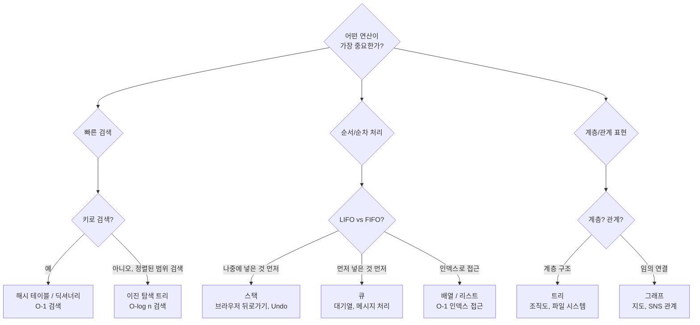
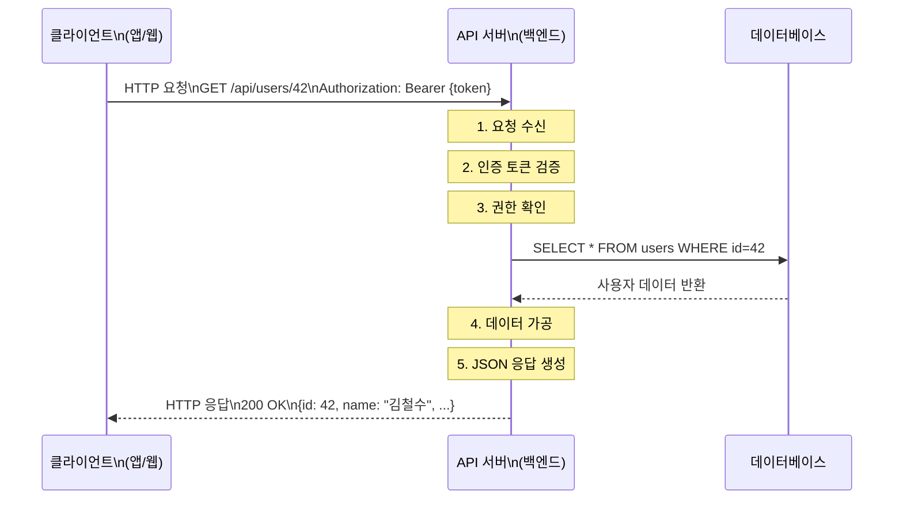
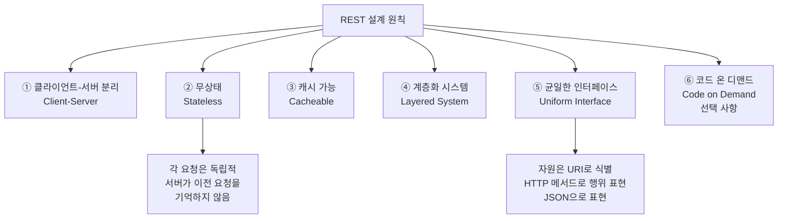
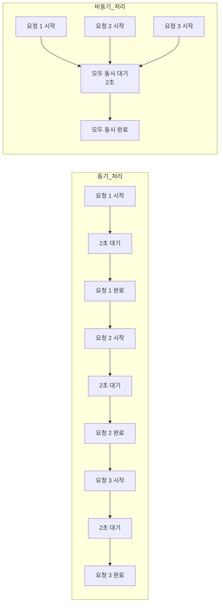

```toc
minLevel: 1
maxLevel: 1
```

# 제4장. 개발자의 필수 지식

> **이 장을 읽기 전에**
>
> 제3장에서 프로그래밍 언어와 프레임워크를 살펴봤습니다.
> 이 장에서는 언어·플랫폼에 관계없이 **모든 개발자가 반드시 알아야 하는 핵심 개념들**을 다룹니다.
> 자료구조, API, REST, 동기/비동기, JSON/XML — 이 개념들은 어느 분야에서 일하든
> 매일 마주치는 기본기입니다.
>
> **전제 지식:** 제1~3장 내용 이해. Python 기초 문법(변수, 함수, 리스트, 딕셔너리).

---

## 4.1 자료구조 — 데이터를 담는 그릇의 종류

### 0) 연결 고리 (Bridge)

제3장에서 언어마다 데이터를 표현하는 문법이 다르다는 것을 배웠습니다.
그런데 언어가 달라도 데이터를 **어떤 구조로 담을 것인가**라는 질문은 동일합니다.
자료구조(Data Structure)는 이 질문에 대한 수십 년간 검증된 답입니다.
올바른 자료구조를 선택하는 것만으로도 프로그램의 성능이 수백 배 달라질 수 있습니다.

---

### 1) 개념 정의 및 필요성

**자료구조(Data Structure)**란 데이터를 효율적으로 저장하고 접근·수정·삭제할 수 있도록
**구조화된 방식으로 조직하는 방법**입니다.

#### ✅ 왜 자료구조가 중요한가?

```
[상황 비유: 도서관의 책 관리]

방법 1: 책을 무작위로 바닥에 쌓아두기
  → 책 찾기: 처음부터 끝까지 전부 뒤짐 (최악의 경우 모든 책 확인)
  → 책 추가: 아무 데나 놓으면 됨 (빠름)
  → 책 삭제: 찾는 것 자체가 느림

방법 2: 제목 가나다순으로 정렬하여 서가에 배치
  → 책 찾기: 알파벳/가나다 순으로 반씩 좁혀가며 검색 (훨씬 빠름)
  → 책 추가: 올바른 위치를 찾아 삽입 (약간 느림)
  → 책 삭제: 위치를 알면 빠름

방법 3: 제목-위치 인덱스 카드 관리
  → 책 찾기: 인덱스 카드에서 위치 조회 후 직접 이동 (가장 빠름)
```

이처럼 **어떤 작업(검색/추가/삭제)이 자주 일어나는가**에 따라 최적의 자료구조가 달라집니다.

---

### 2) 핵심 원리 및 구조

#### ✅ 자료구조 1: 배열 (Array) / 리스트 (List)

**배열**은 동일한 타입의 데이터를 **연속된 메모리 공간**에 순서대로 저장합니다.
인덱스(위치 번호)로 즉시 접근할 수 있습니다.

```
[배열의 메모리 구조]

  인덱스:  [0]    [1]    [2]    [3]    [4]
  값:      "철수" "영희" "민준" "서연" "준호"
  메모리:  100    104    108    112    116  (주소, 4바이트씩 연속)

  → student[2] = "민준" : 100 + (2 × 4) = 108번 주소로 즉시 이동
```

```python
# Python 3.x 기준 — 배열(리스트) 핵심 연산과 시간 복잡도

students = ["철수", "영희", "민준", "서연", "준호"]

# ── O(1): 즉시 접근 — 인덱스로 바로 찾기 ──────────────────
print(students[2])        # "민준" — 인덱스로 즉시 접근
print(students[-1])       # "준호" — 음수 인덱스: 뒤에서부터

# ── O(1): 즉시 추가 — 맨 뒤에 추가 ────────────────────────
students.append("지원")   # 맨 끝에 추가 → ["철수", ..., "준호", "지원"]

# ── O(n): 느린 삽입 — 중간 삽입 시 이후 요소 전부 이동 ────
students.insert(2, "혜진") # 인덱스 2에 삽입 → 기존 2~끝 요소를 오른쪽으로 이동
# ["철수", "영희", "혜진", "민준", "서연", "준호", "지원"]

# ── O(n): 느린 검색 — 값으로 찾기 ──────────────────────────
position = students.index("서연")  # 처음부터 하나씩 비교하며 검색
print(f"서연의 위치: {position}번")

# ── O(n): 느린 삭제 — 중간 삭제 후 뒤 요소 전부 이동 ──────
students.remove("영희")  # 영희 삭제 후 이후 요소들을 왼쪽으로 이동

# ── 슬라이싱: 부분 추출 ──────────────────────────────────
first_three = students[:3]    # 처음 3개
last_two = students[-2:]      # 마지막 2개
every_other = students[::2]   # 2개 간격으로

print(f"전체 학생 수: {len(students)}명")
print(f"처음 3명: {first_three}")
```

| 연산 | 시간 복잡도 | 설명 |
|------|-----------|------|
| 인덱스로 접근 | **O(1)** | 즉시 — 위치를 알면 바로 이동 |
| 맨 끝에 추가 | **O(1)** | 즉시 — 다음 주소에 쓰기 |
| 중간 삽입/삭제 | **O(n)** | 느림 — 이후 요소 전부 이동 |
| 값으로 검색 | **O(n)** | 느림 — 처음부터 순서대로 비교 |

> 📌 **NOTE:** **시간 복잡도(Time Complexity)**는 입력 크기(n)에 따라 연산 시간이 얼마나 증가하는지를 표기합니다. O(1)은 "데이터가 아무리 많아도 시간이 일정", O(n)은 "데이터가 n배 늘면 시간도 n배 증가"를 의미합니다.

---

#### ✅ 자료구조 2: 스택 (Stack)

**스택**은 **후입선출(LIFO: Last In, First Out)** 구조입니다.
마지막에 넣은 것이 가장 먼저 나옵니다.

```
[스택 구조 시각화]

  push("A") → push("B") → push("C") → pop()

  상태 변화:
  │   │    │   │    │ C │    │ B │
  │   │    │ B │    │ B │    │ A │
  │   │ →  │ A │ →  │ A │ →  └───┘
  └───┘    └───┘    └───┘

  초기      A 추가    C 추가    C 꺼냄(pop)
```

```python
# Python 3.x 기준 — 스택 구현 및 활용

class Stack:
    """리스트를 활용한 스택 구현"""

    def __init__(self):
        self._items: list = []   # 내부 저장소 (외부에서 직접 접근 금지)

    def push(self, item) -> None:
        """스택 맨 위에 요소 추가 — O(1)"""
        self._items.append(item)

    def pop(self):
        """스택 맨 위 요소를 꺼내어 반환 — O(1)"""
        if self.is_empty():
            raise IndexError("스택이 비어 있습니다.")
        return self._items.pop()

    def peek(self):
        """스택 맨 위 요소를 꺼내지 않고 확인 — O(1)"""
        if self.is_empty():
            raise IndexError("스택이 비어 있습니다.")
        return self._items[-1]

    def is_empty(self) -> bool:
        """스택이 비어 있는지 확인"""
        return len(self._items) == 0

    def size(self) -> int:
        """스택에 쌓인 요소 수 반환"""
        return len(self._items)

    def __repr__(self) -> str:
        return f"Stack({self._items}) ← 맨 위"


# ── 실전 활용 1: 괄호 유효성 검사 ────────────────────────
def is_valid_brackets(expression: str) -> bool:
    """
    수식의 괄호 쌍이 올바른지 검사합니다.
    예: "(())" → True, "(()" → False, "([)]" → False

    알고리즘:
    - 여는 괄호 만나면 스택에 push
    - 닫는 괄호 만나면 스택에서 pop하여 쌍 확인
    - 최종적으로 스택이 비어 있으면 올바른 괄호
    """
    bracket_stack = Stack()
    # 열기-닫기 괄호 매핑
    matching = {")": "(", "]": "[", "}": "{"}
    opening_brackets = set("([{")

    for char in expression:
        if char in opening_brackets:
            bracket_stack.push(char)          # 여는 괄호: 스택에 쌓기
        elif char in matching:
            if bracket_stack.is_empty():
                return False                  # 닫는 괄호인데 스택이 비어 있음
            top = bracket_stack.pop()
            if top != matching[char]:
                return False                  # 쌍이 맞지 않음
    return bracket_stack.is_empty()           # 스택이 비어 있어야 올바름


# 테스트
test_cases = [
    ("(())",    True),
    ("([{}])",  True),
    ("(()",     False),  # 여는 괄호 남음
    ("([)]",    False),  # 순서 불일치
    ("",        True),   # 빈 문자열
]

for expr, expected in test_cases:
    result = is_valid_brackets(expr)
    status = "✅ PASS" if result == expected else "❌ FAIL"
    print(f"{status} | '{expr}' → {result}")
```

**실행 결과:**
```
✅ PASS | '(())' → True
✅ PASS | '([{}])' → True
✅ PASS | '(()' → False
✅ PASS | '([)]' → False
✅ PASS | '' → True
```

**스택이 실제로 사용되는 곳:**

| 활용 분야 | 설명 |
|----------|------|
| **브라우저 뒤로 가기** | 방문한 페이지를 스택에 쌓고, 뒤로 가기 시 pop |
| **코드 에디터 Undo** | 변경 이력을 스택에 쌓고, Ctrl+Z 시 pop |
| **함수 호출 스택** | 함수가 함수를 호출할 때 복귀 주소를 스택에 저장 |
| **괄호 유효성 검사** | 위 예제처럼 컴파일러가 코드 문법 검사에 사용 |

---

#### ✅ 자료구조 3: 큐 (Queue)

**큐**는 **선입선출(FIFO: First In, First Out)** 구조입니다.
먼저 넣은 것이 먼저 나옵니다. 줄 서기와 동일한 원리입니다.

```
[큐 구조 시각화]

  enqueue("A") → enqueue("B") → enqueue("C") → dequeue()

  앞(front)         뒤(rear)
    ↓                 ↓
  [A]  →  [A][B]  →  [A][B][C]  →  [B][C]
                                     ↑
                                    A가 먼저 나감
```

```python
# Python 3.x 기준 — collections.deque를 이용한 효율적인 큐

from collections import deque  # 양방향 큐: 앞/뒤 모두 O(1) 연산

class Queue:
    """deque 기반 큐 구현"""

    def __init__(self):
        self._items: deque = deque()

    def enqueue(self, item) -> None:
        """큐의 맨 뒤에 요소 추가 — O(1)"""
        self._items.append(item)

    def dequeue(self):
        """큐의 맨 앞 요소를 꺼내어 반환 — O(1)"""
        if self.is_empty():
            raise IndexError("큐가 비어 있습니다.")
        return self._items.popleft()   # 왼쪽(앞)에서 꺼냄

    def front(self):
        """맨 앞 요소 확인 (꺼내지 않음)"""
        if self.is_empty():
            raise IndexError("큐가 비어 있습니다.")
        return self._items[0]

    def is_empty(self) -> bool:
        return len(self._items) == 0

    def size(self) -> int:
        return len(self._items)


# ── 실전 활용: 프린터 출력 대기열 시뮬레이션 ─────────────
def simulate_printer_queue(print_jobs: list[str]) -> None:
    """
    프린터 출력 대기열을 시뮬레이션합니다.
    먼저 요청된 작업이 먼저 인쇄됩니다.
    """
    job_queue = Queue()

    # 작업 등록
    print("=== 인쇄 작업 등록 ===")
    for job in print_jobs:
        job_queue.enqueue(job)
        print(f"  대기열 추가: '{job}' (대기 중: {job_queue.size()}건)")

    # 작업 처리
    print("\n=== 인쇄 시작 ===")
    job_number = 1
    while not job_queue.is_empty():
        current_job = job_queue.dequeue()
        print(f"  [{job_number}번] 인쇄 중: '{current_job}' — 완료")
        job_number += 1

    print("모든 인쇄 작업이 완료되었습니다.")


simulate_printer_queue([
    "1분기 판매 보고서.pdf",
    "회의 자료.pptx",
    "계약서.docx",
    "영수증.pdf"
])
```

**실행 결과:**
```
=== 인쇄 작업 등록 ===
  대기열 추가: '1분기 판매 보고서.pdf' (대기 중: 1건)
  대기열 추가: '회의 자료.pptx' (대기 중: 2건)
  대기열 추가: '계약서.docx' (대기 중: 3건)
  대기열 추가: '영수증.pdf' (대기 중: 4건)

=== 인쇄 시작 ===
  [1번] 인쇄 중: '1분기 판매 보고서.pdf' — 완료
  [2번] 인쇄 중: '회의 자료.pptx' — 완료
  [3번] 인쇄 중: '계약서.docx' — 완료
  [4번] 인쇄 중: '영수증.pdf' — 완료
모든 인쇄 작업이 완료되었습니다.
```

**큐가 실제로 사용되는 곳:**

| 활용 분야 | 설명 |
|----------|------|
| **메시지 큐** | 카프카(Kafka), RabbitMQ — 서비스 간 비동기 메시지 전달 |
| **작업 대기열** | 이메일 발송, 알림 전송 등 백그라운드 작업 처리 |
| **CPU 스케줄링** | 운영체제가 프로세스 실행 순서를 관리 |
| **네트워크 패킷** | 라우터가 패킷을 받아 처리하는 순서 관리 |

---

#### ✅ 자료구조 4: 해시 테이블 (Hash Table) / 딕셔너리

**해시 테이블**은 **키(Key)-값(Value) 쌍**으로 데이터를 저장하며,
키를 통해 **O(1) 평균 시간**으로 데이터를 검색합니다.

```
[해시 테이블 동작 원리]

  키: "철수"  →  해시 함수  →  인덱스: 3  →  버킷[3]: "010-1234-5678"
  키: "영희"  →  해시 함수  →  인덱스: 7  →  버킷[7]: "010-9876-5432"
  키: "민준"  →  해시 함수  →  인덱스: 1  →  버킷[1]: "010-5555-1111"

  검색: "철수의 번호는?" → 해시 함수(철수) = 3 → 버킷[3] 즉시 반환
  배열처럼 처음부터 순서대로 찾을 필요가 없음!
```

```python
# Python 3.x 기준 — 딕셔너리(해시 테이블) 심화 활용

# ── 기본 연산 ──────────────────────────────────────────
phone_book: dict[str, str] = {
    "철수": "010-1234-5678",
    "영희": "010-9876-5432",
    "민준": "010-5555-1111",
}

# 조회 — O(1) 평균
print(phone_book["철수"])             # "010-1234-5678"
print(phone_book.get("없는사람", "번호 없음"))  # KeyError 대신 기본값 반환

# 추가/수정 — O(1) 평균
phone_book["서연"] = "010-7777-2222"  # 추가
phone_book["철수"] = "010-1234-9999"  # 수정 (키가 같으면 덮어씀)

# 삭제
del phone_book["민준"]                # 삭제
popped = phone_book.pop("영희", None) # 삭제 + 반환 (없으면 None)

# 키 존재 여부 확인 — O(1)
if "서연" in phone_book:
    print("서연의 번호가 있습니다.")

# 순회
for name, number in phone_book.items():
    print(f"  {name}: {number}")


# ── 실전 활용 1: 단어 빈도 계산 ──────────────────────────
def count_word_frequency(text: str) -> dict[str, int]:
    """
    주어진 텍스트에서 각 단어의 등장 횟수를 계산합니다.
    해시 테이블 덕분에 O(n)의 시간으로 처리 가능합니다.
    """
    words = text.lower().split()   # 소문자 변환 후 공백으로 분리
    frequency: dict[str, int] = {}

    for word in words:
        # 단어가 이미 있으면 +1, 없으면 1로 초기화
        frequency[word] = frequency.get(word, 0) + 1

    # 등장 횟수 내림차순으로 정렬
    return dict(sorted(frequency.items(), key=lambda x: x[1], reverse=True))


sample_text = "python is great python is easy to learn python"
word_counts = count_word_frequency(sample_text)
for word, count in word_counts.items():
    bar = "█" * count
    print(f"  {word:10s}: {bar} ({count}회)")
```

**실행 결과:**
```
  python    : ███ (3회)
  is        : ██ (2회)
  great     : █ (1회)
  easy      : █ (1회)
  to        : █ (1회)
  learn     : █ (1회)
```

---

#### ✅ 자료구조 5: 트리 (Tree)

**트리**는 계층적 관계를 표현하는 자료구조입니다.
하나의 루트(Root) 노드에서 시작해 자식 노드들이 뻗어 나가는 구조입니다.

```
[트리 구조 시각화 - 회사 조직도]

                 CEO (루트 노드)
                /              \
           CTO                 CFO  (내부 노드)
          /    \              /    \
       개발팀   인프라팀   회계팀  재무팀  (리프 노드)
      /    \
   프론트  백엔드

  용어:
  - 루트(Root): 최상위 노드 (CEO)
  - 부모(Parent): 자식을 가진 노드 (CTO는 개발팀의 부모)
  - 자식(Child): 부모로부터 뻗어나온 노드 (개발팀은 CTO의 자식)
  - 리프(Leaf): 자식이 없는 노드 (프론트, 백엔드, 회계팀, 재무팀)
  - 깊이(Depth): 루트에서 해당 노드까지의 거리
```

```python
# Python 3.x 기준 — 이진 탐색 트리(BST: Binary Search Tree) 구현
# BST 규칙: 왼쪽 자식 < 부모 < 오른쪽 자식

class TreeNode:
    """트리의 각 노드"""
    def __init__(self, value: int):
        self.value = value
        self.left: "TreeNode | None" = None   # 왼쪽 자식
        self.right: "TreeNode | None" = None  # 오른쪽 자식


class BinarySearchTree:
    """이진 탐색 트리"""

    def __init__(self):
        self.root: TreeNode | None = None

    def insert(self, value: int) -> None:
        """값을 올바른 위치에 삽입 — 평균 O(log n)"""
        if self.root is None:
            self.root = TreeNode(value)
        else:
            self._insert_recursive(self.root, value)

    def _insert_recursive(self, node: TreeNode, value: int) -> None:
        if value < node.value:           # 현재 노드보다 작으면 왼쪽
            if node.left is None:
                node.left = TreeNode(value)
            else:
                self._insert_recursive(node.left, value)
        else:                            # 현재 노드보다 크면 오른쪽
            if node.right is None:
                node.right = TreeNode(value)
            else:
                self._insert_recursive(node.right, value)

    def search(self, value: int) -> bool:
        """값이 트리에 존재하는지 검색 — 평균 O(log n)"""
        return self._search_recursive(self.root, value)

    def _search_recursive(self, node: TreeNode | None, value: int) -> bool:
        if node is None:
            return False                 # 끝까지 찾지 못함
        if node.value == value:
            return True                  # 발견!
        elif value < node.value:
            return self._search_recursive(node.left, value)   # 왼쪽 탐색
        else:
            return self._search_recursive(node.right, value)  # 오른쪽 탐색

    def inorder_traversal(self) -> list[int]:
        """중위 순회: 왼쪽 → 현재 → 오른쪽 → 오름차순으로 출력됨"""
        result = []
        self._inorder(self.root, result)
        return result

    def _inorder(self, node: TreeNode | None, result: list) -> None:
        if node is None:
            return
        self._inorder(node.left, result)    # 왼쪽 먼저
        result.append(node.value)           # 현재 노드
        self._inorder(node.right, result)   # 오른쪽 마지막


# 테스트
bst = BinarySearchTree()
values = [50, 30, 70, 20, 40, 60, 80]

for v in values:
    bst.insert(v)

#      50
#     /  \
#   30    70
#  / \   / \
# 20 40 60  80

print("중위 순회(오름차순):", bst.inorder_traversal())
# [20, 30, 40, 50, 60, 70, 80]

print("30 검색:", bst.search(30))   # True
print("45 검색:", bst.search(45))   # False
```

**실행 결과:**
```
중위 순회(오름차순): [20, 30, 40, 50, 60, 70, 80]
30 검색: True
45 검색: False
```

> 📌 **NOTE:** 이진 탐색 트리에서 10,000개의 데이터를 검색할 때, 배열이라면 최대 10,000번 비교해야 하지만(O(n)), BST라면 평균 약 14번만 비교하면 됩니다(O(log₂ 10000 ≈ 13.3)). 이것이 자료구조 선택이 성능에 미치는 차이입니다.

---

#### ✅ 자료구조 6: 그래프 (Graph)

**그래프**는 **노드(Node)**와 **엣지(Edge, 간선)**로 구성된 자료구조입니다.
트리와 달리 계층이 없고, 노드 간의 임의 연결이 가능합니다.

```
[그래프 활용 예 - 지하철 노선도]

  강남 ─── 역삼 ─── 선릉
   │                  │
  교대 ─── 방배 ─── 사당

  강남에서 사당까지 최단 경로는?
  → 그래프 탐색 알고리즘(BFS/DFS)으로 계산
```

```python
# Python 3.x 기준 — 그래프 구현 및 BFS 탐색

from collections import deque

class Graph:
    """인접 리스트(Adjacency List) 방식의 그래프"""

    def __init__(self):
        # 딕셔너리로 각 노드의 연결 목록 관리
        self.adjacency_list: dict[str, list[str]] = {}

    def add_vertex(self, vertex: str) -> None:
        """노드 추가"""
        if vertex not in self.adjacency_list:
            self.adjacency_list[vertex] = []

    def add_edge(self, vertex1: str, vertex2: str) -> None:
        """양방향 엣지(간선) 추가"""
        self.add_vertex(vertex1)
        self.add_vertex(vertex2)
        self.adjacency_list[vertex1].append(vertex2)
        self.adjacency_list[vertex2].append(vertex1)

    def bfs(self, start: str) -> list[str]:
        """
        BFS(너비 우선 탐색, Breadth-First Search):
        시작 노드에서 가까운 노드부터 단계적으로 탐색.
        최단 경로 탐색에 사용.
        """
        if start not in self.adjacency_list:
            return []

        visited: set[str] = set()     # 방문한 노드 추적 (중복 방지)
        queue: deque[str] = deque()   # 탐색 대기 큐
        result: list[str] = []

        visited.add(start)
        queue.append(start)

        while queue:
            current = queue.popleft()   # 큐의 앞에서 꺼냄
            result.append(current)

            # 현재 노드의 이웃 노드들을 큐에 추가
            for neighbor in self.adjacency_list[current]:
                if neighbor not in visited:
                    visited.add(neighbor)
                    queue.append(neighbor)

        return result

    def find_shortest_path(self, start: str, end: str) -> list[str] | None:
        """BFS를 이용해 두 노드 사이의 최단 경로 탐색"""
        if start == end:
            return [start]

        visited: set[str] = {start}
        # 큐의 각 요소: (현재 노드, 여기까지 온 경로)
        queue: deque[tuple[str, list[str]]] = deque([(start, [start])])

        while queue:
            current, path = queue.popleft()

            for neighbor in self.adjacency_list[current]:
                if neighbor == end:
                    return path + [neighbor]   # 목적지 발견!
                if neighbor not in visited:
                    visited.add(neighbor)
                    queue.append((neighbor, path + [neighbor]))

        return None  # 경로 없음


# 지하철 노선 그래프 생성
subway = Graph()
connections = [
    ("강남", "역삼"), ("역삼", "선릉"), ("선릉", "삼성"),
    ("강남", "교대"), ("교대", "방배"), ("방배", "사당"),
    ("선릉", "사당"),   # 환승 연결
]

for station1, station2 in connections:
    subway.add_edge(station1, station2)

# 강남에서 사당까지 최단 경로
path = subway.find_shortest_path("강남", "사당")
print(f"강남 → 사당 최단 경로: {' → '.join(path)}")

# BFS로 강남에서 갈 수 있는 모든 역 탐색 순서
all_stations = subway.bfs("강남")
print(f"강남 기준 탐색 순서: {' → '.join(all_stations)}")
```

**실행 결과:**
```
강남 → 사당 최단 경로: 강남 → 교대 → 방배 → 사당
강남 기준 탐색 순서: 강남 → 역삼 → 교대 → 선릉 → 방배 → 삼성 → 사당
```

---

#### ✅ 자료구조 선택 가이드



---

### 3) 실무 시나리오 (Best Practice)

#### ✅ 실무에서 자료구조 선택이 성능을 바꾼 사례

**사례: 사용자 로그인 검증**

```python
# Python 3.x 기준

# ── 나쁜 방법: 리스트로 banned 목록 관리 ─────────────────
# 차단된 사용자가 100만 명이라면 매 로그인마다 100만 번 비교!
banned_users_list = ["spammer1", "hacker99", "bot_user", ...]  # 100만 개

def check_banned_slow(username: str) -> bool:
    return username in banned_users_list   # O(n) — 리스트 처음부터 검색


# ── 좋은 방법: 집합(Set)으로 banned 목록 관리 ──────────────
# Set은 내부적으로 해시 테이블 사용 → O(1) 검색
banned_users_set = set(banned_users_list)   # 리스트 → 집합 변환

def check_banned_fast(username: str) -> bool:
    return username in banned_users_set    # O(1) — 해시로 즉시 검색


# 성능 비교 (100만 개 데이터 기준)
import time, random, string

# 100만 개 랜덤 사용자명 생성
sample_users = ["user_" + str(i) for i in range(1_000_000)]
banned_list = sample_users[:500_000]   # 절반을 차단 목록으로
banned_set_data = set(banned_list)

test_user = "user_999999"  # 목록 끝부분의 사용자

start = time.time()
for _ in range(1000):
    _ = test_user in banned_list       # 리스트 검색 1000번
list_time = time.time() - start

start = time.time()
for _ in range(1000):
    _ = test_user in banned_set_data   # 집합 검색 1000번
set_time = time.time() - start

print(f"리스트 검색 1000회: {list_time:.4f}초")
print(f"집합  검색 1000회: {set_time:.6f}초")
print(f"속도 차이: 약 {list_time / set_time:.0f}배")
```

**실행 결과 (예시):**
```
리스트 검색 1000회: 12.4532초
집합  검색 1000회: 0.000124초
속도 차이: 약 100,000배
```

#### ⚠️ 안티 패턴

- **모든 상황에 리스트만 사용:** 검색이 빈번하다면 집합(set) 또는 딕셔너리(dict)가 훨씬 효율적입니다.
- **데이터 구조를 바꾸지 않고 최적화만 추구:** 잘못된 자료구조 위에서 아무리 코드를 최적화해도 한계가 있습니다. 자료구조 선택이 최우선입니다.

---

### 4) 트러블슈팅 & 주의사항

#### ❓ "알고리즘과 자료구조는 어떻게 다른가요?"

**정의:**
- **자료구조:** 데이터를 어떻게 **저장**하고 **조직**하는가 (그릇의 종류)
- **알고리즘:** 문제를 어떻게 **풀어나가는가** (요리 레시피)

**관계:** 자료구조와 알고리즘은 불가분의 관계입니다. BFS 알고리즘은 큐 자료구조 없이 구현할 수 없고, 이진 탐색 알고리즘은 정렬된 배열 없이 의미가 없습니다.

> **WARNING:** Python의 리스트는 배열처럼 보이지만 내부적으로 **동적 배열(Dynamic Array)**입니다. 요소를 맨 앞에서 제거할 때(`list.pop(0)`)는 O(n)이 걸립니다. 큐가 필요하다면 반드시 `collections.deque`를 사용하세요.

---

### 5) 한 줄 요약

> 💡 **Key Takeaway:**
> 자료구조는 "어떤 작업이 얼마나 자주 일어나는가"에 따라 선택하며,
> **배열(인덱스 접근), 해시 테이블(키 검색), 스택(LIFO), 큐(FIFO), 트리(계층), 그래프(관계)**
> 여섯 가지 기본 구조를 이해하면 대부분의 실무 문제를 해결할 수 있다.

---

## 4.2 함수 / 객체 / 컴포넌트 / 프레임워크 — 코드 재사용의 진화

### 0) 연결 고리 (Bridge)

4.1절에서 데이터를 담는 구조를 배웠습니다.
이번에는 **코드 자체를 어떻게 구조화하는가**를 살펴봅니다.
소프트웨어 개발 역사는 "어떻게 하면 코드를 더 재사용할 수 있을까"에 대한 끊임없는 탐색이었습니다.
함수 → 객체 → 컴포넌트 → 프레임워크로 이어지는 진화의 흐름을 이해하면
모든 현대 개발 방식의 뿌리를 파악할 수 있습니다.

---

### 1) 개념 정의 및 필요성

```
[코드 재사용 진화의 역사]

  1세대: 복사-붙여넣기
    → 같은 코드를 여러 곳에 복사
    → 수정 시 모든 복사본을 찾아서 수정해야 함 → 버그의 온상

  2세대: 함수(Function)
    → 반복되는 코드를 하나의 이름 있는 블록으로 묶음
    → 한 곳에서 수정하면 모든 호출 지점에 자동 반영

  3세대: 객체(Object)
    → 관련 있는 데이터(속성)와 함수(메서드)를 하나로 묶음
    → 현실 세계의 개념을 코드로 모델링

  4세대: 컴포넌트(Component)
    → UI를 독립적이고 재사용 가능한 조각으로 분리
    → React, Vue 등 현대 프론트엔드의 기반

  5세대: 프레임워크(Framework)
    → 검증된 설계 패턴과 구조를 미리 제공
    → 개발자는 비즈니스 로직만 채워 넣으면 됨
```

---

### 2) 핵심 원리 및 구조

#### ✅ 1세대 → 2세대: 복사-붙여넣기에서 함수로

```python
# Python 3.x 기준

# ── ❌ 1세대: 복사-붙여넣기 ──────────────────────────────
# 직원 A의 세후 급여 계산
salary_a = 4_000_000
tax_a = salary_a * 0.033
net_a = salary_a - tax_a
print(f"A의 실수령액: {net_a:,.0f}원")

# 직원 B의 세후 급여 계산 — 완전히 동일한 코드가 반복됨
salary_b = 5_500_000
tax_b = salary_b * 0.033
net_b = salary_b - tax_b
print(f"B의 실수령액: {net_b:,.0f}원")
# 세율이 0.033에서 0.035로 바뀌면? → 모든 복사본을 찾아 수정해야 함


# ── ✅ 2세대: 함수로 추상화 ─────────────────────────────
TAX_RATE = 0.033  # 세율을 상수로 한 곳에서 관리

def calculate_net_salary(base_salary: int, name: str) -> int:
    """
    세후 실수령액을 계산합니다.
    세율이 변경되면 이 함수의 TAX_RATE만 수정하면 됩니다.
    """
    tax = base_salary * TAX_RATE
    net_salary = int(base_salary - tax)
    print(f"{name}의 실수령액: {net_salary:,}원")
    return net_salary

# 세율 변경 시 TAX_RATE 상수 하나만 수정하면 모든 계산에 반영
calculate_net_salary(4_000_000, "직원 A")
calculate_net_salary(5_500_000, "직원 B")
calculate_net_salary(3_200_000, "직원 C")
calculate_net_salary(8_000_000, "직원 D")
```

---

#### ✅ 2세대 → 3세대: 함수에서 객체로

```python
# Python 3.x 기준

# ── 문제: 함수만으로는 관련 데이터를 한데 묶기 어려움 ──────
# 직원 데이터가 여기저기 흩어져 있음
employee_name = "김철수"
employee_salary = 4_000_000
employee_department = "개발팀"
employee_years = 3

def give_raise(salary, raise_amount):
    return salary + raise_amount

# 직원이 100명이라면? 변수가 400개... 관리 불가

# ── ✅ 3세대: 객체로 데이터와 행동을 통합 ─────────────────
class Employee:
    """직원 한 명을 표현하는 클래스"""

    # 클래스 변수: 모든 인스턴스가 공유
    TAX_RATE: float = 0.033
    BASE_RAISE_RATE: float = 0.05   # 기본 연봉 인상률 5%

    def __init__(self, name: str, base_salary: int, department: str, years: int):
        # 인스턴스 변수: 각 직원마다 고유한 값
        self.name = name
        self.base_salary = base_salary
        self.department = department
        self.years = years
        self._salary_history: list[int] = [base_salary]   # 연봉 이력

    @property
    def net_salary(self) -> int:
        """세후 실수령액 (계산 프로퍼티)"""
        return int(self.base_salary * (1 - self.TAX_RATE))

    @property
    def raise_rate(self) -> float:
        """경력에 따른 인상률 (3년 이상이면 추가 2%)"""
        return self.BASE_RAISE_RATE + (0.02 if self.years >= 3 else 0)

    def apply_annual_raise(self) -> None:
        """연봉 인상 처리"""
        increase = int(self.base_salary * self.raise_rate)
        self.base_salary += increase
        self._salary_history.append(self.base_salary)
        print(f"[{self.name}] 연봉 인상: +{increase:,}원 → 신규 연봉: {self.base_salary:,}원")

    def print_profile(self) -> None:
        """직원 정보 출력"""
        print(f"\n{'─' * 40}")
        print(f"  이름:     {self.name}")
        print(f"  부서:     {self.department}")
        print(f"  경력:     {self.years}년")
        print(f"  기본급:   {self.base_salary:,}원")
        print(f"  실수령액: {self.net_salary:,}원")
        print(f"  인상률:   {self.raise_rate * 100:.0f}%")
        print(f"  연봉이력: {' → '.join(f'{s:,}' for s in self._salary_history)}")

    def __repr__(self) -> str:
        return f"Employee(name='{self.name}', salary={self.base_salary:,})"


# ── 상속: 시니어 직원에 추가 혜택 부여 ─────────────────────
class SeniorEmployee(Employee):
    """5년 이상 경력의 시니어 직원"""

    STOCK_OPTION_RATE: float = 0.10   # 주식 옵션 10%

    def __init__(self, name: str, base_salary: int, department: str, years: int):
        super().__init__(name, base_salary, department, years)
        self.stock_options = int(base_salary * self.STOCK_OPTION_RATE)

    def print_profile(self) -> None:
        super().print_profile()    # 부모 메서드 호출
        print(f"  주식옵션: {self.stock_options:,}원  ⭐ 시니어 혜택")


# 실행
employees = [
    Employee("김주니어", 3_500_000, "개발팀", 1),
    Employee("이미들", 5_000_000, "기획팀", 4),
    SeniorEmployee("박시니어", 8_000_000, "개발팀", 7),
]

for emp in employees:
    emp.print_profile()
    emp.apply_annual_raise()
```

**실행 결과 (일부):**
```
────────────────────────────────────────
  이름:     김주니어
  부서:     개발팀
  경력:     1년
  기본급:   3,500,000원
  실수령액: 3,384,500원
  인상률:   5%
  연봉이력: 3,500,000
[김주니어] 연봉 인상: +175,000원 → 신규 연봉: 3,675,000원
...
────────────────────────────────────────
  이름:     박시니어
  ...
  주식옵션: 800,000원  ⭐ 시니어 혜택
[박시니어] 연봉 인상: +560,000원 → 신규 연봉: 8,560,000원
```

---

#### ✅ 3세대 → 4세대: 객체에서 컴포넌트로 (UI 영역)

```jsx
// React 18 기준 — UI 컴포넌트 분리와 재사용

// ── ❌ 컴포넌트 없이: 중복 코드의 지옥 ──────────────────
// 각 직원 카드를 HTML로 직접 작성해야 함
// <div class="card">김주니어 / 개발팀 / 3,500,000원</div>
// <div class="card">이미들 / 기획팀 / 5,000,000원</div>
// 직원이 100명이면 100개의 div를 작성... 스타일 변경 시 100곳 수정


// ── ✅ 컴포넌트: 한 번 만들고 무한 재사용 ────────────────

// 직원 카드 컴포넌트 (한 번 정의)
function EmployeeCard({ name, department, salary, isSenior = false }) {
    // Props(속성)로 외부에서 데이터를 받아 렌더링
    const netSalary = Math.floor(salary * (1 - 0.033));

    return (
        <div style={{
            border: isSenior ? "2px solid gold" : "1px solid #ddd",
            padding: "16px",
            borderRadius: "8px",
            margin: "8px",
            backgroundColor: isSenior ? "#fffdf0" : "white"
        }}>
            <h3>
                {name}
                {isSenior && <span style={{ color: "gold", marginLeft: "8px" }}>⭐ 시니어</span>}
            </h3>
            <p>📂 {department}</p>
            <p>💰 기본급: {salary.toLocaleString()}원</p>
            <p>✉️ 실수령: {netSalary.toLocaleString()}원</p>
        </div>
    );
}

// 직원 목록 컴포넌트
function EmployeeList() {
    const employees = [
        { id: 1, name: "김주니어", department: "개발팀", salary: 3500000, isSenior: false },
        { id: 2, name: "이미들",   department: "기획팀", salary: 5000000, isSenior: false },
        { id: 3, name: "박시니어", department: "개발팀", salary: 8000000, isSenior: true  },
    ];

    return (
        <div>
            <h2>직원 목록</h2>
            {/* 데이터 배열을 컴포넌트 배열로 변환 */}
            {employees.map(emp => (
                <EmployeeCard
                    key={emp.id}              // React 식별자
                    name={emp.name}
                    department={emp.department}
                    salary={emp.salary}
                    isSenior={emp.isSenior}
                />
            ))}
        </div>
    );
}
```

---

### 3) 한 줄 요약

> 💡 **Key Takeaway:**
> 함수 → 객체 → 컴포넌트 → 프레임워크의 진화는 모두 **"중복을 줄이고 재사용성을 높이는"** 방향이며,
> 이 흐름을 이해하면 어떤 언어와 플랫폼에서도 좋은 코드를 설계하는 원칙이 된다.

---

## 4.3 API와 OpenAPI — 시스템 간 대화의 약속

### 0) 연결 고리 (Bridge)

4.2절에서 코드 내부에서 함수와 객체로 재사용성을 높이는 방법을 배웠습니다.
이번에는 **서로 다른 시스템 사이**에서 데이터를 주고받는 약속인 **API**를 깊이 이해합니다.
현대 소프트웨어 개발에서 API를 모르면 서비스 간 연동이 불가능합니다.

---

### 1) 개념 정의 및 필요성

**API(Application Programming Interface)**는
두 소프트웨어가 서로 통신하기 위해 정의한 **약속(계약, Contract)**입니다.

```
[비유: 레스토랑 주문 시스템]

  손님(클라이언트) ───주문서(API 요청)───→ 주방(서버)
                  ←──완성된 요리(응답)───

  손님은 주방 내부를 몰라도 됩니다.
  "메뉴판(API 명세)"에 있는 것을 "주문서(요청 형식)"대로 작성하면
  주방은 "약속된 형식의 음식(응답)"을 돌려줍니다.

  핵심: 내부 구현을 모르더라도 약속된 방식으로 기능을 사용할 수 있음
```

**실생활 API 사례:**

| API | 제공자 | 사용 예 |
|-----|--------|--------|
| 카카오 로그인 API | Kakao | "카카오로 로그인" 버튼 구현 |
| 네이버 지도 API | Naver | 앱/웹에 지도 삽입 |
| 기상청 날씨 API | 기상청 | 현재 날씨 데이터 조회 |
| 토스페이먼츠 API | 토스 | 결제 기능 구현 |
| OpenAI API | OpenAI | ChatGPT 기능 앱에 통합 |

---

### 2) 핵심 원리 및 구조

#### ✅ API 요청-응답의 전체 흐름



#### ✅ HTTP 상태 코드 — API 응답의 언어

API는 결과를 숫자 코드로 전달합니다. 가장 중요한 코드들입니다.

| 코드 | 의미 | 실무 상황 |
|------|------|----------|
| **200** OK | 성공 | 데이터 조회 성공 |
| **201** Created | 생성 성공 | 회원가입, 게시글 작성 성공 |
| **204** No Content | 성공, 내용 없음 | 삭제 성공 |
| **400** Bad Request | 잘못된 요청 | 필수 파라미터 누락, 형식 오류 |
| **401** Unauthorized | 인증 실패 | 로그인 필요, 토큰 만료 |
| **403** Forbidden | 권한 없음 | 로그인은 했지만 접근 권한 없음 |
| **404** Not Found | 리소스 없음 | 없는 사용자 ID 조회 |
| **409** Conflict | 충돌 | 이미 존재하는 이메일로 가입 시도 |
| **422** Unprocessable | 처리 불가 | 입력값 검증 실패 |
| **500** Internal Server Error | 서버 오류 | 서버 코드의 버그, DB 연결 실패 |
| **503** Service Unavailable | 서비스 불가 | 서버 점검 중, 과부하 |

```python
# Python 3.x + requests 기준 — API 호출 및 상태 코드 처리
# pip install requests

import requests

def get_user_profile(user_id: int) -> dict | None:
    """
    사용자 프로필을 API에서 가져옵니다.
    상태 코드에 따라 다르게 처리합니다.
    """
    url = f"https://jsonplaceholder.typicode.com/users/{user_id}"

    try:
        response = requests.get(url, timeout=10)   # 10초 내 응답 없으면 오류

        if response.status_code == 200:
            return response.json()               # 성공: JSON 데이터 반환

        elif response.status_code == 404:
            print(f"사용자 {user_id}를 찾을 수 없습니다.")
            return None

        elif response.status_code == 401:
            print("인증이 필요합니다. 로그인을 먼저 해주세요.")
            return None

        elif response.status_code >= 500:
            print(f"서버 오류 ({response.status_code}). 잠시 후 다시 시도해 주세요.")
            return None

        else:
            print(f"예상치 못한 응답: {response.status_code}")
            return None

    except requests.exceptions.Timeout:
        print("요청 시간이 초과되었습니다.")
        return None
    except requests.exceptions.ConnectionError:
        print("서버에 연결할 수 없습니다. 인터넷 연결을 확인해 주세요.")
        return None


# 실제 공개 API 호출 테스트 (JSONPlaceholder: 테스트용 가짜 API)
user = get_user_profile(1)
if user:
    print(f"이름: {user['name']}")
    print(f"이메일: {user['email']}")
    print(f"회사: {user['company']['name']}")

# 없는 사용자 조회
get_user_profile(9999)
```

**실행 결과:**
```
이름: Leanne Graham
이메일: Sincere@april.biz
회사: Romaguera-Crona
사용자 9999를 찾을 수 없습니다.
```

---

#### ✅ OpenAPI — API 명세의 표준화

**OpenAPI(Swagger)**는 API를 **기계가 읽을 수 있는 형식**으로 문서화하는 표준 명세입니다.
API 개발자와 API 사용자 사이의 "계약서" 역할을 합니다.

```yaml
# OpenAPI 3.0 명세 예시 (YAML 형식)
# 사용자 조회 API를 명세화한 예

openapi: "3.0.0"
info:
  title: "사용자 관리 API"
  version: "1.0.0"
  description: "사용자 정보를 관리하는 REST API"

paths:
  /api/users/{userId}:
    get:
      summary: "특정 사용자 조회"
      description: "사용자 ID로 사용자 정보를 조회합니다."
      parameters:
        - name: userId
          in: path           # URL 경로에 포함된 파라미터
          required: true
          schema:
            type: integer
            example: 42
      responses:
        "200":
          description: "조회 성공"
          content:
            application/json:
              schema:
                type: object
                properties:
                  id:         { type: integer, example: 42 }
                  name:       { type: string,  example: "김철수" }
                  email:      { type: string,  example: "chulsoo@example.com" }
                  created_at: { type: string,  format: date-time }
        "404":
          description: "사용자를 찾을 수 없음"
          content:
            application/json:
              schema:
                type: object
                properties:
                  error: { type: string, example: "User not found" }
```

> 📌 **TIP:** FastAPI(Python)와 Spring Boot(Java)는 코드에서 OpenAPI 문서를 **자동으로 생성**합니다. FastAPI 서버를 실행하면 `/docs`에서 Swagger UI 형태의 인터랙티브 문서를 즉시 확인할 수 있습니다. API 개발 시 별도의 문서 작업 없이 명세가 항상 최신 상태로 유지됩니다.

---

### 3) 한 줄 요약

> 💡 **Key Takeaway:**
> API는 시스템 간 통신의 **계약서**이며, HTTP 상태 코드는 그 계약의 결과를 표현하는 언어다.
> OpenAPI는 이 계약을 표준화된 형식으로 문서화하여 개발자 간 소통 비용을 대폭 줄인다.

---

## 4.4 REST와 RESTful — 웹 API 설계의 철학

### 0) 연결 고리 (Bridge)

4.3절에서 API가 시스템 간 약속이라는 것을 배웠습니다.
그렇다면 "좋은 API"는 어떻게 설계해야 할까요?
2000년 로이 필딩(Roy Fielding)의 박사 논문에서 제안된 **REST**가 그 답을 제시했고,
오늘날 대부분의 웹 API가 이 원칙을 따릅니다.

---

### 1) 개념 정의 및 필요성

**REST(Representational State Transfer)**는
웹의 기존 기술(HTTP)을 최대한 활용해 API를 설계하는 **아키텍처 스타일**입니다.

**RESTful API**란 REST 원칙을 올바르게 따르는 API를 뜻합니다.

---

### 2) 핵심 원리 및 구조

#### ✅ REST의 6가지 설계 원칙



실무에서 가장 중요한 원칙은 **무상태(Stateless)**와 **균일한 인터페이스(Uniform Interface)**입니다.

---

#### ✅ 핵심 원칙 1: 리소스(Resource)와 URI

REST에서 모든 것은 **리소스**입니다.
리소스는 **URI(Uniform Resource Identifier)**로 식별됩니다.

```
[올바른 URI 설계 — 명사 사용, 복수형]

  ✅ 좋은 URI 설계:
  GET    /api/users            → 전체 사용자 목록 조회
  GET    /api/users/42         → ID가 42인 사용자 조회
  GET    /api/users/42/orders  → ID가 42인 사용자의 주문 목록 조회
  POST   /api/users            → 새 사용자 생성
  PUT    /api/users/42         → ID 42 사용자 정보 전체 수정
  PATCH  /api/users/42         → ID 42 사용자 정보 일부 수정
  DELETE /api/users/42         → ID 42 사용자 삭제

  ❌ 나쁜 URI 설계 — 동사 사용:
  GET  /api/getUser?id=42      → 행위가 URI에 포함됨
  POST /api/createUser         → HTTP 메서드와 중복
  GET  /api/deleteUser/42      → GET으로 삭제?! 의미 불일치
  POST /api/user/42/doDelete   → 동사+URI 조합의 혼란
```

---

#### ✅ 핵심 원칙 2: HTTP 메서드로 행위 표현

| HTTP 메서드 | 행위 | SQL 대응 | 멱등성 |
|------------|------|---------|-------|
| **GET** | 조회 | SELECT | ✅ 여러 번 호출해도 결과 동일 |
| **POST** | 생성 | INSERT | ❌ 호출할 때마다 새 데이터 생성 |
| **PUT** | 전체 수정 | UPDATE (전체) | ✅ 같은 요청을 여러 번 해도 결과 동일 |
| **PATCH** | 일부 수정 | UPDATE (일부) | 경우에 따라 다름 |
| **DELETE** | 삭제 | DELETE | ✅ 이미 삭제된 것을 또 삭제해도 결과 동일 |

> 📌 **NOTE:** **멱등성(Idempotency)**은 "같은 연산을 여러 번 실행해도 결과가 동일하다"는 성질입니다. GET으로 데이터를 10번 조회해도 데이터가 변하지 않습니다. 반면 POST로 주문을 10번 보내면 주문이 10개 생성됩니다. 클라이언트가 네트워크 오류로 재요청할 때 멱등성이 있는 메서드는 안전하게 재시도할 수 있습니다.

---

#### ✅ 핵심 원칙 3: 무상태(Stateless)

서버는 이전 요청 정보를 저장하지 않습니다.
각 요청은 처리에 필요한 모든 정보를 스스로 포함해야 합니다.

```
[상태 있음 (Stateful) — REST가 아닌 방식]

  요청 1: "나 김철수야"         → 서버: "알겠어, 기억했어"
  요청 2: "내 주문 목록 줘"     → 서버: "김철수 거 줄게" (이전 요청 기억)

  문제: 서버가 늘어나면 다른 서버에는 "김철수" 정보가 없어서 실패
       서버 장애 시 모든 상태 정보 소실

[무상태 (Stateless) — REST 방식]

  요청 1: "나는 김철수야. 내 주문 목록 줘."  → 각 요청에 정보 포함
  요청 2: "나는 김철수야. 내 프로필 정보 줘." → 역시 스스로 정보 포함

  장점: 어느 서버가 요청을 받아도 처리 가능 → 수평 확장(Scale-out) 용이
```

```python
# Python 3.x + Flask 기준 — RESTful API 완전 구현 예제
# pip install flask

from flask import Flask, jsonify, request
from datetime import datetime

app = Flask(__name__)

# ── 데이터 저장소 (실제 서비스에서는 DB 사용) ──────────────
users_db: dict[int, dict] = {
    1: {"id": 1, "name": "김철수", "email": "chulsoo@example.com",
        "role": "admin", "created_at": "2024-01-15T09:00:00"},
    2: {"id": 2, "name": "이영희", "email": "younghee@example.com",
        "role": "user",  "created_at": "2024-02-20T14:30:00"},
}
next_user_id = 3


# ── GET /api/users — 전체 목록 조회 ────────────────────────
@app.route("/api/users", methods=["GET"])
def get_users():
    """
    전체 사용자 목록을 반환합니다.
    쿼리 파라미터:
      - role: 역할로 필터링 (예: ?role=admin)
      - limit: 최대 반환 수 (예: ?limit=10)
    """
    role_filter = request.args.get("role")        # ?role=admin
    limit = request.args.get("limit", type=int)   # ?limit=10

    result = list(users_db.values())

    # 역할 필터 적용
    if role_filter:
        result = [u for u in result if u["role"] == role_filter]

    # 개수 제한 적용
    if limit:
        result = result[:limit]

    return jsonify({
        "status": "success",
        "count": len(result),
        "data": result
    }), 200


# ── GET /api/users/<id> — 특정 사용자 조회 ─────────────────
@app.route("/api/users/<int:user_id>", methods=["GET"])
def get_user(user_id: int):
    """특정 ID의 사용자를 조회합니다."""
    user = users_db.get(user_id)

    if not user:
        return jsonify({
            "status": "error",
            "message": f"ID {user_id}인 사용자를 찾을 수 없습니다."
        }), 404

    return jsonify({"status": "success", "data": user}), 200


# ── POST /api/users — 새 사용자 생성 ───────────────────────
@app.route("/api/users", methods=["POST"])
def create_user():
    """새 사용자를 생성합니다."""
    global next_user_id
    body = request.json

    # 필수 필드 검증
    required_fields = ["name", "email"]
    missing = [f for f in required_fields if not body.get(f)]
    if missing:
        return jsonify({
            "status": "error",
            "message": f"필수 필드가 누락되었습니다: {', '.join(missing)}"
        }), 400

    # 이메일 중복 검사
    existing_emails = [u["email"] for u in users_db.values()]
    if body["email"] in existing_emails:
        return jsonify({
            "status": "error",
            "message": "이미 사용 중인 이메일입니다."
        }), 409  # 409 Conflict

    # 새 사용자 생성
    new_user = {
        "id": next_user_id,
        "name": body["name"],
        "email": body["email"],
        "role": body.get("role", "user"),   # 기본 역할: user
        "created_at": datetime.now().isoformat()
    }
    users_db[next_user_id] = new_user
    next_user_id += 1

    return jsonify({"status": "success", "data": new_user}), 201  # 201 Created


# ── PATCH /api/users/<id> — 일부 수정 ──────────────────────
@app.route("/api/users/<int:user_id>", methods=["PATCH"])
def update_user(user_id: int):
    """사용자 정보를 일부 수정합니다. 전송된 필드만 변경됩니다."""
    user = users_db.get(user_id)
    if not user:
        return jsonify({"status": "error", "message": "사용자를 찾을 수 없습니다."}), 404

    body = request.json
    allowed_fields = {"name", "email", "role"}   # 수정 가능한 필드

    for field, value in body.items():
        if field in allowed_fields:
            user[field] = value   # 전송된 필드만 업데이트
        # 허용되지 않은 필드(id, created_at 등)는 무시

    return jsonify({"status": "success", "data": user}), 200


# ── DELETE /api/users/<id> — 삭제 ──────────────────────────
@app.route("/api/users/<int:user_id>", methods=["DELETE"])
def delete_user(user_id: int):
    """사용자를 삭제합니다."""
    if user_id not in users_db:
        return jsonify({"status": "error", "message": "사용자를 찾을 수 없습니다."}), 404

    deleted_user = users_db.pop(user_id)
    return jsonify({
        "status": "success",
        "message": f"'{deleted_user['name']}' 사용자가 삭제되었습니다."
    }), 200


if __name__ == "__main__":
    app.run(debug=True, port=5000)
```

> 📌 **TIP:** 위 API를 `curl`로 테스트할 수 있습니다.
> ```bash
> # 전체 조회
> curl http://localhost:5000/api/users
>
> # 새 사용자 생성
> curl -X POST http://localhost:5000/api/users \
>      -H "Content-Type: application/json" \
>      -d '{"name": "박민준", "email": "minjun@example.com"}'
>
> # 일부 수정
> curl -X PATCH http://localhost:5000/api/users/1 \
>      -H "Content-Type: application/json" \
>      -d '{"name": "김철수(수정)"}'
> ```

---

### 3) 한 줄 요약

> 💡 **Key Takeaway:**
> REST는 HTTP를 최대한 활용해 API를 설계하는 원칙으로,
> **"URI로 자원을 식별하고, HTTP 메서드로 행위를 표현하고, 각 요청은 독립적이어야 한다"**는
> 세 가지 핵심만 지키면 직관적이고 유지보수 가능한 API가 완성된다.

---

## 4.5 동기 vs 비동기 — 기다리는 방식의 차이

### 0) 연결 고리 (Bridge)

4.4절에서 API 설계 방식을 배웠습니다.
API 호출은 네트워크를 통해 이루어지기 때문에 항상 "기다림"이 발생합니다.
이 기다림을 어떻게 처리하느냐가 **동기와 비동기**의 차이이며,
현대 소프트웨어 성능의 핵심 요소입니다.

---

### 1) 개념 정의 및 필요성

```
[비유: 패스트푸드점 vs 레스토랑 주문 방식]

  동기(Synchronous) — 레스토랑 방식:
    1. 손님이 주문
    2. 웨이터가 주방에서 음식이 완성될 때까지 그 자리에서 기다림
    3. 음식이 완성되면 가져다 줌
    4. 그동안 다른 테이블 주문은 못 받음 → 한 번에 하나씩

  비동기(Asynchronous) — 패스트푸드 방식:
    1. 손님이 주문 → 번호표 발급
    2. 웨이터는 즉시 다음 손님 주문 받음
    3. 주방에서 음식 완성 → 번호 호출
    4. 동시에 여러 손님 처리 가능 → 높은 처리량
```

---

### 2) 핵심 원리 및 구조

#### ✅ 동기(Synchronous) 처리

```python
# Python 3.x 기준 — 동기 처리 예제

import time

def fetch_user_data(user_id: int) -> dict:
    """서버에서 사용자 데이터를 가져옵니다 (2초 소요 시뮬레이션)."""
    print(f"  [사용자 {user_id}] 데이터 요청 시작...")
    time.sleep(2)   # 네트워크 요청 시뮬레이션 (2초 대기)
    print(f"  [사용자 {user_id}] 데이터 수신 완료!")
    return {"id": user_id, "name": f"사용자_{user_id}"}


# ── 동기 방식: 순서대로 하나씩 처리 ──────────────────────
print("=== 동기 방식 시작 ===")
start_time = time.time()

user_ids = [1, 2, 3]
results = []
for uid in user_ids:
    user = fetch_user_data(uid)   # 각 요청이 완료될 때까지 다음 요청 불가
    results.append(user)

elapsed = time.time() - start_time
print(f"동기 방식 총 소요 시간: {elapsed:.1f}초")
print(f"결과: {[r['name'] for r in results]}")
# 예상 결과: 2초 + 2초 + 2초 = 총 6초 소요
```

**실행 결과:**
```
=== 동기 방식 시작 ===
  [사용자 1] 데이터 요청 시작...
  [사용자 1] 데이터 수신 완료!
  [사용자 2] 데이터 요청 시작...
  [사용자 2] 데이터 수신 완료!
  [사용자 3] 데이터 요청 시작...
  [사용자 3] 데이터 수신 완료!
동기 방식 총 소요 시간: 6.0초
```

---

#### ✅ 비동기(Asynchronous) 처리

```python
# Python 3.x 기준 — asyncio를 이용한 비동기 처리
import asyncio
import time

async def fetch_user_data_async(user_id: int) -> dict:
    """
    비동기 방식으로 사용자 데이터를 가져옵니다.
    await: '이 작업이 끝날 때까지 기다리되, 다른 작업을 할 수 있게 양보'
    """
    print(f"  [사용자 {user_id}] 데이터 요청 시작...")
    await asyncio.sleep(2)   # 비동기 대기: CPU를 다른 작업에 양보
    print(f"  [사용자 {user_id}] 데이터 수신 완료!")
    return {"id": user_id, "name": f"사용자_{user_id}"}


async def fetch_all_users():
    """여러 사용자 데이터를 동시에 요청합니다."""
    start_time = time.time()
    print("=== 비동기 방식 시작 ===")

    user_ids = [1, 2, 3]

    # asyncio.gather: 여러 비동기 작업을 동시에 실행
    # 세 요청을 "동시에" 보내고, 모두 완료될 때까지 기다림
    results = await asyncio.gather(
        fetch_user_data_async(1),
        fetch_user_data_async(2),
        fetch_user_data_async(3),
    )

    elapsed = time.time() - start_time
    print(f"비동기 방식 총 소요 시간: {elapsed:.1f}초")
    print(f"결과: {[r['name'] for r in results]}")
    # 예상 결과: 세 요청이 동시에 시작 → 약 2초 소요 (6초가 아님!)
    return results


# 비동기 이벤트 루프 실행
asyncio.run(fetch_all_users())
```

**실행 결과:**
```
=== 비동기 방식 시작 ===
  [사용자 1] 데이터 요청 시작...
  [사용자 2] 데이터 요청 시작...
  [사용자 3] 데이터 요청 시작...
  [사용자 1] 데이터 수신 완료!
  [사용자 2] 데이터 수신 완료!
  [사용자 3] 데이터 수신 완료!
비동기 방식 총 소요 시간: 2.0초
결과: ['사용자_1', '사용자_2', '사용자_3']
```

> 📌 **NOTE:** 동기는 6초, 비동기는 2초 — 3배의 차이입니다. 요청이 100개라면 동기는 200초, 비동기는 여전히 약 2초입니다. I/O 작업(네트워크, 파일)이 많은 서버에서 비동기 처리는 성능을 수십~수백 배 향상시킵니다.

---

#### ✅ 동기 vs 비동기 비교 정리



| 구분 | 동기 (Synchronous) | 비동기 (Asynchronous) |
|------|------------------|---------------------|
| 처리 방식 | 하나씩 순서대로 | 동시에 여러 작업 |
| 대기 중 CPU | 놀고 있음 (낭비) | 다른 작업 처리 |
| 코드 가독성 | 위에서 아래로 읽기 쉬움 | 복잡할 수 있음 (콜백 지옥) |
| 오류 처리 | 단순함 | try/catch 또는 .catch() 필요 |
| 적합한 상황 | 순서가 중요한 처리, 단순 스크립트 | I/O 작업 많은 서버, API 다수 호출 |
| Python 구현 | 기본 방식 | asyncio, async/await |
| JavaScript | 기본 방식 | async/await, Promise |

---

#### ✅ JavaScript에서의 비동기 — 실전 패턴

```javascript
// JavaScript ES2022 기준 — 비동기 패턴 완전 정리

// ── 1. async/await + 오류 처리 ────────────────────────────
async function loadDashboard(userId) {
    try {
        // 순서가 중요한 경우: 사용자 정보 먼저, 그 다음 주문 조회
        const user = await fetchUser(userId);              // 먼저 실행

        // 순서가 상관없는 경우: 동시에 실행
        const [orders, notifications] = await Promise.all([
            fetchOrders(user.id),        // 동시에 시작
            fetchNotifications(user.id)  // 동시에 시작
        ]);

        return {
            user,
            orders,
            notifications,
            orderCount: orders.length,
            unreadCount: notifications.filter(n => !n.read).length
        };

    } catch (error) {
        if (error.status === 404) {
            throw new Error(`사용자 ${userId}를 찾을 수 없습니다.`);
        }
        throw new Error(`대시보드 로드 실패: ${error.message}`);
    }
}


// ── 2. Promise.allSettled: 일부 실패해도 계속 진행 ─────────
async function loadOptionalData(userId) {
    // allSettled: 모든 Promise가 완료될 때까지 기다림
    // 일부가 실패해도 나머지 결과는 사용 가능
    const results = await Promise.allSettled([
        fetchUserProfile(userId),    // 필수
        fetchRecommendations(userId), // 선택적 — 실패해도 괜찮음
        fetchAds(userId)             // 선택적 — 실패해도 괜찮음
    ]);

    // 각 결과의 성공/실패를 개별적으로 처리
    const [profileResult, recResult, adsResult] = results;

    return {
        profile: profileResult.status === "fulfilled"
            ? profileResult.value
            : null,  // 실패 시 null
        recommendations: recResult.status === "fulfilled"
            ? recResult.value
            : [],    // 실패 시 빈 배열
        ads: adsResult.status === "fulfilled"
            ? adsResult.value
            : []
    };
}


// ── 3. 재시도(Retry) 패턴 ──────────────────────────────────
async function fetchWithRetry(url, maxRetries = 3, delayMs = 1000) {
    """네트워크 오류 시 지정된 횟수만큼 재시도합니다."""
    for (let attempt = 1; attempt <= maxRetries; attempt++) {
        try {
            const response = await fetch(url);
            if (!response.ok) throw new Error(`HTTP ${response.status}`);
            return await response.json();

        } catch (error) {
            console.warn(`시도 ${attempt}/${maxRetries} 실패: ${error.message}`);

            if (attempt === maxRetries) {
                throw new Error(`${maxRetries}번 시도 후 실패: ${url}`);
            }

            // 재시도 전 대기 (지수 백오프: 1초 → 2초 → 4초)
            await new Promise(resolve =>
                setTimeout(resolve, delayMs * Math.pow(2, attempt - 1))
            );
        }
    }
}
```

---

### 3) 한 줄 요약

> 💡 **Key Takeaway:**
> 동기는 "한 번에 하나씩 끝내고 다음으로", 비동기는 "기다리는 동안 다른 일 처리";
> **I/O 작업이 많은 현대 웹 서버는 비동기 처리가 필수이며**,
> async/await는 비동기 코드를 동기처럼 읽기 쉽게 작성하는 현대적 패턴이다.

---

## 4.6 Ajax / XML / JSON — 데이터를 주고받는 형식

### 0) 연결 고리 (Bridge)

4.5절에서 동기/비동기로 "언제 기다리는가"를 배웠습니다.
이제 "무엇을 주고받는가"를 살펴봅니다.
API 통신에서 데이터를 전달하는 표준 형식인 **JSON**과 **XML**,
그리고 페이지 새로고침 없이 데이터를 교환하는 기술인 **Ajax**를 이해합니다.

---

### 1) 개념 정의 및 필요성

#### ✅ Ajax란?

**Ajax(Asynchronous JavaScript and XML)**는 페이지를 **새로고침하지 않고**
서버와 데이터를 비동기로 교환하는 기술입니다.

```
[Ajax 이전의 웹 — 전체 페이지 새로고침]

  사용자: 좋아요 버튼 클릭
  브라우저: 서버에 전체 페이지 재요청
  서버: HTML 전체 재생성하여 전송 (수백 KB)
  브라우저: 페이지 전체 재렌더링 (화면 깜빡임)
  사용자: 좋아요 숫자만 바뀌었는데 화면 전체가 깜빡임...

[Ajax 이후의 웹 — 필요한 데이터만 교환]

  사용자: 좋아요 버튼 클릭
  JavaScript: 서버에 좋아요 요청 (비동기)
  서버: {"likes": 1024} 만 응답 (수십 바이트)
  JavaScript: 좋아요 숫자 텍스트만 업데이트
  사용자: 화면 깜빡임 없이 숫자만 바뀜 ✅
```

---

### 2) 핵심 원리 및 구조

#### ✅ XML vs JSON — 두 가지 데이터 형식 비교

같은 데이터를 XML과 JSON으로 표현해 비교합니다.

```xml
<!-- XML (eXtensible Markup Language) 형식 -->
<!-- HTML처럼 태그(꺽쇠) 기반 구조 -->

<?xml version="1.0" encoding="UTF-8"?>
<user>
    <id>42</id>
    <name>김철수</name>
    <email>chulsoo@example.com</email>
    <age>28</age>
    <isActive>true</isActive>
    <skills>
        <skill>Python</skill>
        <skill>SQL</skill>
        <skill>Docker</skill>
    </skills>
    <address>
        <city>서울</city>
        <district>강남구</district>
        <zipcode>06234</zipcode>
    </address>
</user>
<!-- 데이터 크기: 약 380바이트 -->
```

```json
// JSON (JavaScript Object Notation) 형식
// JavaScript 객체 문법 기반. 훨씬 간결함

{
  "id": 42,
  "name": "김철수",
  "email": "chulsoo@example.com",
  "age": 28,
  "isActive": true,
  "skills": ["Python", "SQL", "Docker"],
  "address": {
    "city": "서울",
    "district": "강남구",
    "zipcode": "06234"
  }
}
// 데이터 크기: 약 210바이트 (XML 대비 약 45% 감소)
```

| 구분 | XML | JSON |
|------|-----|------|
| 문법 | 태그 기반 (`<tag>`) | 키-값 쌍 (`{}`) |
| 가독성 | 보통 | 높음 |
| 데이터 크기 | 큼 (태그 중복) | 작음 |
| 파싱 속도 | 느림 | 빠름 |
| 언어 지원 | 모든 언어 | 모든 언어 |
| 현재 사용 | 레거시 시스템, XML 전용 표준 | 현대 웹 API의 사실상 표준 |
| 주석 | 지원 | **미지원** |
| 타입 지원 | 문자열만 (속성으로 타입 명시) | 문자열, 숫자, 불리언, 배열, 객체, null |

> 📌 **NOTE:** 2010년대 이후 신규 웹 API의 거의 모든 경우 **JSON**을 사용합니다. XML은 은행, 공공기관 등 레거시 시스템이나 SOAP 기반 서비스에서 여전히 사용됩니다. 공공데이터포털의 일부 API는 여전히 XML 형식을 제공하므로 읽을 수 있어야 합니다.

---

#### ✅ JSON 심화 — Python과 JavaScript에서의 처리

```python
# Python 3.x 기준 — JSON 처리 완전 가이드

import json
from datetime import datetime

# ── 1. Python 딕셔너리 → JSON 문자열 변환 (직렬화, Serialization) ──
user_data = {
    "id": 42,
    "name": "김철수",
    "email": "chulsoo@example.com",
    "skills": ["Python", "SQL", "Docker"],
    "address": {"city": "서울", "district": "강남구"},
    "is_active": True,
    "score": 98.5,
    "memo": None    # None → null 로 변환됨
}

# json.dumps: Python 객체 → JSON 문자열
json_string = json.dumps(
    user_data,
    ensure_ascii=False,   # 한글 유니코드 이스케이프 방지
    indent=2              # 들여쓰기 2칸 (가독성)
)
print("JSON 문자열:")
print(json_string)
print(f"\n타입: {type(json_string)}")  # <class 'str'>


# ── 2. JSON 문자열 → Python 딕셔너리 변환 (역직렬화, Deserialization) ──
received_json = '{"id": 1, "name": "이영희", "scores": [95, 87, 92], "active": true}'

python_dict = json.loads(received_json)   # json.loads: JSON 문자열 → Python 객체
print(f"\n파싱된 딕셔너리: {python_dict}")
print(f"이름: {python_dict['name']}")
print(f"평균 점수: {sum(python_dict['scores']) / len(python_dict['scores']):.1f}점")


# ── 3. 파일로 저장/불러오기 ───────────────────────────────
# 파일에 JSON 저장
with open("user_data.json", "w", encoding="utf-8") as file:
    json.dump(user_data, file, ensure_ascii=False, indent=2)
print("\n'user_data.json' 파일에 저장 완료")

# 파일에서 JSON 불러오기
with open("user_data.json", "r", encoding="utf-8") as file:
    loaded_data = json.load(file)
print(f"파일에서 불러온 이름: {loaded_data['name']}")


# ── 4. JSON 직렬화 불가 타입 처리 ────────────────────────────
# datetime은 기본적으로 JSON으로 직렬화 불가 → 커스텀 처리 필요
class DateTimeEncoder(json.JSONEncoder):
    def default(self, obj):
        if isinstance(obj, datetime):
            return obj.isoformat()   # datetime → ISO 형식 문자열
        return super().default(obj)

data_with_date = {
    "event": "회원가입",
    "timestamp": datetime.now(),   # datetime 객체
    "user_id": 42
}

json_with_date = json.dumps(data_with_date, cls=DateTimeEncoder, ensure_ascii=False)
print(f"\n날짜 포함 JSON: {json_with_date}")
```

**실행 결과:**
```
JSON 문자열:
{
  "id": 42,
  "name": "김철수",
  "email": "chulsoo@example.com",
  "skills": ["Python", "SQL", "Docker"],
  "address": {"city": "서울", "district": "강남구"},
  "is_active": true,
  "score": 98.5,
  "memo": null
}
타입: <class 'str'>

파싱된 딕셔너리: {'id': 1, 'name': '이영희', 'scores': [95, 87, 92], 'active': True}
이름: 이영희
평균 점수: 91.3점

'user_data.json' 파일에 저장 완료
파일에서 불러온 이름: 김철수

날짜 포함 JSON: {"event": "회원가입", "timestamp": "2024-03-15T14:30:00.123456", "user_id": 42}
```

---

#### ✅ Ajax — 현대적인 fetch API 완전 활용

```javascript
// JavaScript ES2022 기준 — fetch API 완전 가이드

// ── 1. 기본 GET 요청 ──────────────────────────────────────
async function getUser(userId) {
    const response = await fetch(`https://api.example.com/users/${userId}`, {
        method: "GET",
        headers: {
            "Authorization": "Bearer eyJhbGci...",   // 인증 토큰
            "Accept": "application/json"             // JSON 응답 요청
        }
    });

    if (!response.ok) {
        throw new Error(`HTTP 오류: ${response.status} ${response.statusText}`);
    }

    return await response.json();   // 응답을 JSON으로 파싱
}


// ── 2. POST 요청 — 데이터 전송 ────────────────────────────
async function createUser(userData) {
    const response = await fetch("https://api.example.com/users", {
        method: "POST",
        headers: {
            "Content-Type": "application/json",   // 요청 본문이 JSON임을 명시
            "Authorization": "Bearer eyJhbGci..."
        },
        body: JSON.stringify(userData)   // 객체를 JSON 문자열로 변환하여 전송
    });

    const result = await response.json();

    if (!response.ok) {
        // API에서 반환한 오류 메시지 활용
        throw new Error(result.message || `생성 실패: ${response.status}`);
    }

    return result;
}


// ── 3. 파일 업로드 (FormData 사용) ────────────────────────
async function uploadProfileImage(userId, imageFile) {
    const formData = new FormData();
    formData.append("user_id", userId);
    formData.append("image", imageFile);   // 파일 객체 추가

    // FormData 사용 시 Content-Type 헤더 자동 설정 (직접 명시하면 안 됨)
    const response = await fetch(`/api/users/${userId}/avatar`, {
        method: "POST",
        body: formData
    });

    return await response.json();
}


// ── 4. 실전: API 클라이언트 클래스 ───────────────────────
class ApiClient {
    constructor(baseURL, authToken) {
        this.baseURL = baseURL;
        this.authToken = authToken;
    }

    // 공통 헤더를 한 곳에서 관리
    get defaultHeaders() {
        return {
            "Content-Type": "application/json",
            "Authorization": `Bearer ${this.authToken}`
        };
    }

    async request(method, path, body = null) {
        const options = {
            method,
            headers: this.defaultHeaders,
        };

        if (body) {
            options.body = JSON.stringify(body);
        }

        const response = await fetch(`${this.baseURL}${path}`, options);
        const data = await response.json();

        if (!response.ok) {
            const error = new Error(data.message || "API 요청 실패");
            error.status = response.status;
            error.data = data;
            throw error;
        }

        return data;
    }

    // 편의 메서드
    get(path)               { return this.request("GET",    path); }
    post(path, body)        { return this.request("POST",   path, body); }
    put(path, body)         { return this.request("PUT",    path, body); }
    patch(path, body)       { return this.request("PATCH",  path, body); }
    delete(path)            { return this.request("DELETE", path); }
}

// 사용 예시
const api = new ApiClient("https://api.example.com", "your-jwt-token");

async function main() {
    try {
        // GET
        const user = await api.get("/users/42");
        console.log("사용자:", user.data.name);

        // PATCH
        const updated = await api.patch("/users/42", { name: "김철수(수정)" });
        console.log("수정 완료:", updated.data.name);

        // DELETE
        await api.delete("/users/42");
        console.log("삭제 완료");

    } catch (error) {
        console.error(`오류 (${error.status}):`, error.message);
    }
}
```

---

### 3) 트러블슈팅 & 주의사항

> **WARNING:** JSON에서 자주 발생하는 실수들입니다.
>
> ```json
> // ❌ 잘못된 JSON
> {
>   name: "김철수",           // 키에 따옴표 없음 (JS 객체는 가능하지만 JSON은 불가)
>   "age": 28,
>   "memo": undefined,        // undefined는 JSON 값이 아님 (null 사용)
>   // 주석입니다             // JSON은 주석 미지원
>   "phone": '010-1234-5678'  // 홑따옴표 불가, 반드시 큰따옴표
> }
>
> // ✅ 올바른 JSON
> {
>   "name": "김철수",
>   "age": 28,
>   "memo": null,
>   "phone": "010-1234-5678"
> }
> ```

#### ❓ "XML을 아직도 배워야 하나요?"

**현실적 답변:** 신규 개발에서는 거의 쓰지 않지만, 다음 상황에서는 필요합니다.
- 공공데이터포털 일부 API (XML 응답 제공)
- 은행·공공기관 레거시 연동 (SOAP 기반)
- Android 레이아웃 파일 (`.xml` 포맷)
- Microsoft Office 파일 내부 구조 (`.docx`, `.xlsx`는 내부적으로 XML)

---

### 4) 한 줄 요약

> 💡 **Key Takeaway:**
> **JSON은 현대 웹 API의 표준 데이터 형식**으로, 간결하고 빠르며 모든 언어에서 지원된다.
> Ajax는 페이지 새로고침 없이 서버와 데이터를 교환하는 기술로,
> 현대 웹 앱의 부드러운 사용자 경험을 가능하게 하는 핵심 기술이다.

---

## 📌 제4장 용어 사전

| 용어 | 정의 |
|------|------|
| 자료구조 (Data Structure) | 데이터를 효율적으로 저장·접근·수정하기 위한 조직 방식 |
| 시간 복잡도 (Time Complexity) | 입력 크기에 따라 연산 시간이 증가하는 정도 (O(1), O(n), O(log n) 등) |
| 스택 (Stack) | 후입선출(LIFO) 자료구조. 마지막에 넣은 것이 먼저 나옴 |
| 큐 (Queue) | 선입선출(FIFO) 자료구조. 먼저 넣은 것이 먼저 나옴 |
| 해시 테이블 (Hash Table) | 키-값 쌍으로 O(1) 검색을 지원하는 자료구조. Python 딕셔너리의 내부 구현 |
| 트리 (Tree) | 계층적 관계를 표현하는 비선형 자료구조 |
| 그래프 (Graph) | 노드와 엣지(간선)로 구성. 임의의 관계를 표현 |
| BFS (너비 우선 탐색) | 그래프에서 가까운 노드부터 단계적으로 탐색. 최단 경로 탐색에 활용 |
| API (Application Programming Interface) | 두 소프트웨어가 통신하기 위한 약속된 인터페이스 |
| HTTP 상태 코드 | API 응답의 성공/실패 결과를 나타내는 숫자 코드 |
| REST | HTTP를 활용한 API 설계 아키텍처 스타일 |
| RESTful | REST 원칙을 올바르게 따르는 API |
| 멱등성 (Idempotency) | 같은 연산을 여러 번 실행해도 결과가 동일한 성질 |
| 동기 (Synchronous) | 작업이 완료될 때까지 기다린 후 다음 작업 실행 |
| 비동기 (Asynchronous) | 작업 완료를 기다리지 않고 다음 작업을 즉시 실행 |
| async/await | 비동기 코드를 동기 코드처럼 읽기 쉽게 작성하는 문법 |
| Promise | JavaScript에서 비동기 작업의 결과를 나타내는 객체 |
| Ajax | 페이지 새로고침 없이 서버와 데이터를 비동기로 교환하는 기술 |
| JSON | 키-값 쌍 기반의 경량 데이터 교환 형식. 현대 웹 API 표준 |
| XML | 태그 기반의 데이터 마크업 언어. 레거시 시스템에서 주로 사용 |
| 직렬화 (Serialization) | Python 객체 → JSON 문자열 변환 |
| 역직렬화 (Deserialization) | JSON 문자열 → Python 객체 변환 |
| OpenAPI (Swagger) | API 명세를 기계 가독 형식으로 문서화하는 표준 |

---

## 🔖 제4장 핵심 정리

```
✅ 자료구조 선택 기준
   - 인덱스 접근 빈번:   배열/리스트 (O(1))
   - 키로 검색 빈번:     해시 테이블/딕셔너리 (O(1) 평균)
   - LIFO 처리:          스택
   - FIFO 처리:          큐 (collections.deque)
   - 계층 표현:          트리
   - 관계·경로 탐색:     그래프

✅ 코드 구조화 진화
   복사-붙여넣기 → 함수 → 객체(OOP) → 컴포넌트 → 프레임워크
   공통점: 중복 제거 + 재사용성 향상

✅ API 설계 원칙 (REST)
   - URI = 명사(리소스 식별)
   - HTTP 메서드 = 동사(행위)
   - 각 요청 = 독립적(무상태)
   - 응답 = 상태 코드 + JSON

✅ 동기 vs 비동기
   - I/O 작업 많음 → 비동기 필수
   - async/await = 비동기를 동기처럼 작성
   - Promise.all = 여러 비동기 작업 동시 실행

✅ 데이터 형식
   - JSON = 현대 웹 표준 (간결, 빠름, 모든 언어 지원)
   - XML = 레거시, 공공기관 연동 시 필요
   - Ajax = 페이지 새로고침 없는 서버 통신
```

---

> ➡️ **다음 장 예고:** 제5장에서는 팀이 함께 좋은 소프트웨어를 만들기 위한 **소프트웨어 공학** — 애자일, DevOps, CI/CD — 을 구체적인 실무 예제와 함께 살펴봅니다.