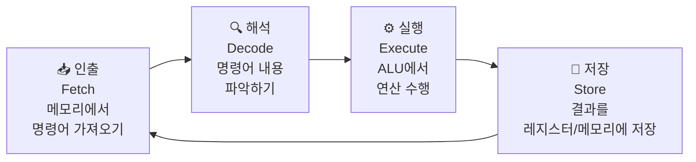
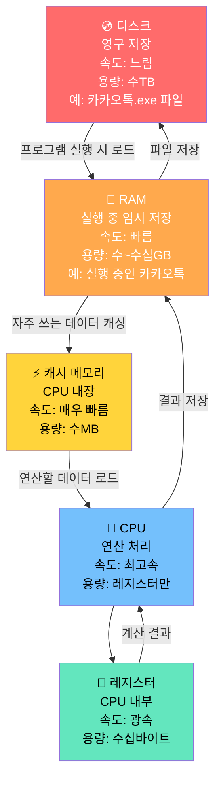
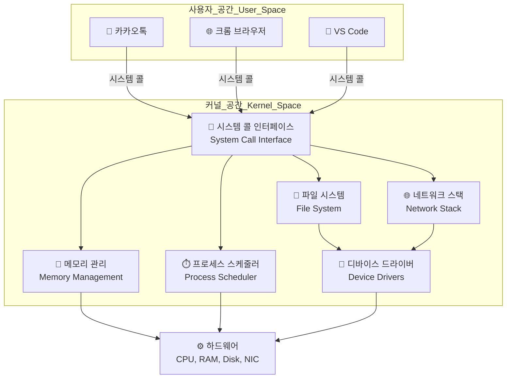
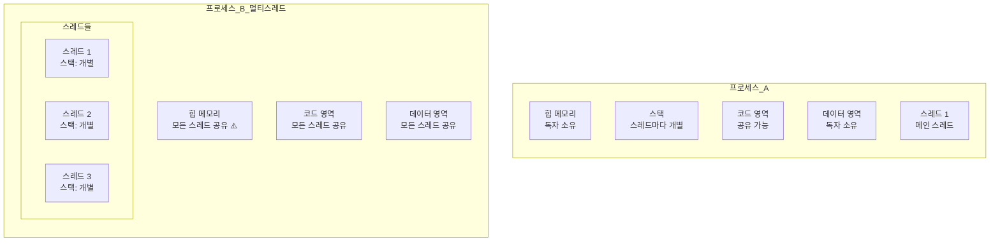

```toc
minLevel: 1
maxLevel: 1
```
# 제6장. 컴퓨터 구조 및 운영체제

> **이 장을 읽기 전에**
>
> 제5장에서 팀이 소프트웨어를 만드는 방법론을 배웠습니다.
> 이 장에서는 한 단계 더 깊이 내려가, 우리가 작성한 코드가
> **실제로 어떤 하드웨어 위에서 어떻게 동작하는지**를 이해합니다.
> 운영체제, CPU, 메모리, 프로세스, 스레드 — 이 개념들은
> 성능 문제를 진단하고, 시스템을 설계하고, 면접에서 깊이 있는 질문에 답할 때
> 반드시 필요한 기초입니다.
>
> **전제 지식:** 제1~5장 내용 이해. 특별한 하드웨어 지식 불필요.

---

## 6.1 컴퓨터 내부 구조 — 소프트웨어가 동작하는 무대

### 0) 연결 고리 (Bridge)

제3장에서 Python 코드 한 줄을 작성했습니다.
`print("Hello, World!")`
이 코드가 실행될 때 컴퓨터 내부에서는 정확히 무슨 일이 일어날까요?
이 질문에 답하려면 컴퓨터를 구성하는 핵심 부품들의 역할을 먼저 이해해야 합니다.

---

### 1) 개념 정의 및 필요성

컴퓨터는 크게 네 가지 핵심 부품으로 구성됩니다.

```
[컴퓨터의 4대 핵심 구성 요소]

  입력 장치      처리 장치        기억 장치           출력 장치
  ──────────    ──────────      ──────────         ──────────
  키보드         CPU             RAM (주기억)         모니터
  마우스         (중앙처리장치)   디스크 (보조기억)     프린터
  카메라                                            스피커
```

소프트웨어 개발자가 가장 깊이 이해해야 할 부품은
**CPU, RAM(주기억장치), 디스크(보조기억장치)** 세 가지입니다.

---

### 2) 핵심 원리 및 구조

#### ✅ CPU — 모든 계산의 주체

**CPU(Central Processing Unit, 중앙처리장치)**는
컴퓨터의 두뇌로, 모든 연산·제어·판단을 수행하는 부품입니다.

```
[CPU의 내부 구성 — 개념도]

  ┌─────────────────────────────────────────────────────┐
  │                        CPU                          │
  │                                                     │
  │  ┌─────────────┐   ┌─────────────┐   ┌──────────┐  │
  │  │   제어 장치  │   │  산술논리장치 │   │ 레지스터  │  │
  │  │    (CU)     │   │    (ALU)    │   │(Register)│  │
  │  │             │   │             │   │          │  │
  │  │ 명령어 해석  │   │ 사칙연산    │   │ 초고속    │  │
  │  │ 실행 순서   │   │ 논리 연산   │   │ 임시 저장 │  │
  │  │ 제어        │   │ 비교 연산   │   │ (약 1ns) │  │
  │  └─────────────┘   └─────────────┘   └──────────┘  │
  │                                                     │
  │  ┌─────────────────────────────────────────────┐    │
  │  │              캐시 메모리 (Cache)             │    │
  │  │    L1 캐시 (32~64KB) / L2 캐시 (256KB~1MB) │    │
  │  │    L3 캐시 (4~32MB, 코어 공유)              │    │
  │  └─────────────────────────────────────────────┘    │
  └─────────────────────────────────────────────────────┘
```

**CPU의 세 가지 핵심 구성요소:**

| 구성요소 | 역할 | 비유 |
|---------|------|------|
| **제어 장치 (CU)** | 명령어를 해석하고 다른 장치들에게 신호를 보냄 | 주방의 셰프(지시자) |
| **산술논리장치 (ALU)** | 덧셈·뺄셈 등 수학 연산과 AND·OR 등 논리 연산 수행 | 실제 요리를 만드는 손 |
| **레지스터 (Register)** | CPU 내부의 초고속 임시 저장 공간. 현재 처리 중인 데이터 보관 | 조리대 위의 재료 |

---

#### ✅ CPU가 명령어를 처리하는 과정 — 명령어 사이클

CPU는 모든 작업을 다음 네 단계를 반복하며 수행합니다.



```
[Python print("Hello") 실행 시 CPU가 하는 일 — 단순화된 예]

1. 인출 (Fetch):
   메모리 주소 0x1000에서 명령어 가져옴
   → "문자열 'Hello'의 주소를 레지스터 R1에 로드하라"

2. 해석 (Decode):
   제어 장치가 명령어 분석
   → "LOAD 명령어, 목적지: R1, 소스: 메모리[0x2000]"

3. 실행 (Execute):
   메모리 0x2000에서 'Hello' 문자열 데이터 읽어 R1에 저장
   → R1 = 0x48656C6C6F ("Hello"의 ASCII 코드)

4. 저장 (Store):
   결과를 레지스터 또는 메모리에 기록
   → 다음 명령어로 이동: 출력 시스템 호출(syscall) 실행
```

---

#### ✅ RAM — 실행 중인 모든 것이 머무는 곳

**RAM(Random Access Memory, 주기억장치)**은
현재 실행 중인 프로그램과 데이터를 저장하는 **휘발성 메모리**입니다.

```
[RAM의 핵심 특성]

  ✅ 빠름: 디스크보다 수천~수만 배 빠른 접근 속도
  ❌ 휘발성: 전원이 꺼지면 모든 내용이 사라짐
  💰 비쌈: 디스크보다 단위 용량당 가격이 높음

[RAM에 올라오는 것들]

  실행 중인 프로그램의 코드
  프로그램이 사용 중인 변수와 데이터
  운영체제 커널
  캐시된 파일 데이터
```

---

#### ✅ 디스크(Storage) — 영구적으로 저장하는 창고

**디스크(보조기억장치)**는 전원이 꺼져도 데이터가 유지되는 **비휘발성 저장 장치**입니다.

| 종류 | 속도 | 특징 | 용도 |
|------|------|------|------|
| **HDD** (하드디스크) | 느림 | 회전하는 자기 디스크, 용량 大, 저렴 | 대용량 파일 저장 |
| **SSD** (솔리드스테이트) | 빠름 | 반도체 기반, 진동·충격에 강함 | 운영체제, 프로그램 설치 |
| **NVMe SSD** | 매우 빠름 | PCIe 연결, SSD보다 3~7배 빠름 | 고성능 서버, 게임용 |

---

#### ✅ CPU, RAM, 디스크의 관계 — 데이터 흐름



---

#### ✅ 속도와 용량의 트레이드오프

```
[메모리 계층 구조 — 속도 vs 용량 vs 비용]

    속도  용량  비용      계층
    ────  ────  ────      ────────────────────────────
    극초고속  극소  극고가  레지스터     (수십 바이트)
    초고속   소   고가     L1 캐시      (32~64KB)
    고속     소   고가     L2 캐시      (256KB~1MB)
    빠름     중   중가     L3 캐시      (4~32MB)
    보통     대   저가     RAM (DRAM)   (4~64GB)
    느림     매우대 매우저가 SSD/HDD   (수백GB~수TB)

    ▲ 위로 갈수록 빠르지만 비싸고 용량이 작다
    ▼ 아래로 갈수록 느리지만 저렴하고 용량이 크다
```

```python
# Python 3.x 기준 — 메모리 접근 속도 차이 체감 코드
# 실제 캐시 효과를 간접적으로 체험하는 실험

import time
import sys

def demonstrate_memory_access_pattern():
    """
    메모리 접근 패턴에 따른 성능 차이를 보여줍니다.
    순차 접근(캐시 친화적) vs 무작위 접근(캐시 비친화적)
    """
    SIZE = 10_000_000   # 1천만 개 요소

    # 방법 1: 순차 접근 — 캐시 친화적
    # CPU가 다음에 필요한 데이터를 미리 캐시에 로드(프리페치)
    data = list(range(SIZE))

    start = time.perf_counter()
    total = 0
    for i in range(SIZE):
        total += data[i]              # 순서대로 접근 → 캐시 히트 높음
    sequential_time = time.perf_counter() - start

    # 방법 2: 무작위 접근 — 캐시 비친화적
    import random
    indices = list(range(SIZE))
    random.shuffle(indices)           # 무작위 순서 생성

    start = time.perf_counter()
    total = 0
    for i in indices:
        total += data[i]              # 무작위 접근 → 캐시 미스 높음
    random_time = time.perf_counter() - start

    print(f"순차 접근 시간: {sequential_time:.3f}초")
    print(f"무작위 접근 시간: {random_time:.3f}초")
    print(f"성능 차이: {random_time / sequential_time:.1f}배 느림")
    print(f"\n이유: 순차 접근은 CPU 캐시를 효율적으로 활용하지만,")
    print(f"      무작위 접근은 매번 캐시 미스(Cache Miss)가 발생해 RAM까지 가져와야 함")

demonstrate_memory_access_pattern()
```

**실행 결과 (예시):**
```
순차 접근 시간: 0.412초
무작위 접근 시간: 1.847초
성능 차이: 4.5배 느림

이유: 순차 접근은 CPU 캐시를 효율적으로 활용하지만,
      무작위 접근은 매번 캐시 미스(Cache Miss)가 발생해 RAM까지 가져와야 함
```

> 📌 **NOTE:** 캐시 친화적인 코드 작성은 고성능 서버 개발에서 중요한 최적화 기법입니다. 배열·리스트처럼 연속된 메모리 구조가 캐시 히트율이 높고, 링크드 리스트처럼 메모리 곳곳에 흩어진 구조는 캐시 미스가 잦습니다.

---

### 3) 코드 예제 및 실행 환경

```python
# Python 3.x 기준 — 시스템 정보 조회 (psutil 라이브러리)
# pip install psutil

import psutil
import platform

def print_system_info():
    """현재 컴퓨터의 하드웨어 정보를 출력합니다."""

    print("=" * 55)
    print("  💻 시스템 하드웨어 정보")
    print("=" * 55)

    # CPU 정보
    cpu_count_logical = psutil.cpu_count(logical=True)    # 논리 코어 (하이퍼스레딩 포함)
    cpu_count_physical = psutil.cpu_count(logical=False)  # 물리 코어
    cpu_freq = psutil.cpu_freq()
    cpu_usage = psutil.cpu_percent(interval=1)            # 1초 측정

    print(f"\n  🔲 CPU")
    print(f"     물리 코어:  {cpu_count_physical}개")
    print(f"     논리 코어:  {cpu_count_logical}개 (하이퍼스레딩 적용)")
    if cpu_freq:
        print(f"     현재 클록:  {cpu_freq.current:.0f} MHz")
        print(f"     최대 클록:  {cpu_freq.max:.0f} MHz")
    print(f"     현재 사용률: {cpu_usage}%")

    # 코어별 사용률
    per_core = psutil.cpu_percent(percpu=True)
    print(f"     코어별 사용률: {[f'{u}%' for u in per_core]}")

    # RAM 정보
    ram = psutil.virtual_memory()
    print(f"\n  🧠 RAM (주기억장치)")
    print(f"     전체 용량:  {ram.total / (1024**3):.1f} GB")
    print(f"     사용 중:    {ram.used / (1024**3):.1f} GB ({ram.percent}%)")
    print(f"     사용 가능:  {ram.available / (1024**3):.1f} GB")

    # 디스크 정보
    print(f"\n  💿 디스크 (보조기억장치)")
    for partition in psutil.disk_partitions():
        try:
            usage = psutil.disk_usage(partition.mountpoint)
            print(f"     [{partition.device}] {partition.fstype}")
            print(f"       전체: {usage.total / (1024**3):.1f} GB | "
                  f"사용: {usage.used / (1024**3):.1f} GB | "
                  f"사용률: {usage.percent}%")
        except PermissionError:
            pass    # 시스템 파티션은 접근 불가할 수 있음

    # 운영체제 정보
    print(f"\n  🖥️  운영체제")
    print(f"     OS:      {platform.system()} {platform.release()}")
    print(f"     버전:    {platform.version()[:50]}...")
    print(f"     아키텍처: {platform.machine()}")

print_system_info()
```

**실행 결과 (예시 — 실제 값은 PC마다 다름):**
```
=======================================================
  💻 시스템 하드웨어 정보
=======================================================

  🔲 CPU
     물리 코어:  8개
     논리 코어:  16개 (하이퍼스레딩 적용)
     현재 클록:  2400 MHz
     최대 클록:  3200 MHz
     현재 사용률: 12.3%
     코어별 사용률: ['8%', '5%', '15%', '6%', ...]

  🧠 RAM (주기억장치)
     전체 용량:  16.0 GB
     사용 중:    8.3 GB (51.9%)
     사용 가능:  7.7 GB

  💿 디스크 (보조기억장치)
     [/dev/sda1] ext4
       전체: 512.0 GB | 사용: 128.4 GB | 사용률: 25.1%

  🖥️  운영체제
     OS:      Linux 5.15.0
     아키텍처: x86_64
```

---

### 4) 실무 시나리오 (Best Practice)

#### ✅ 서버 사양을 결정할 때 CPU vs RAM의 선택 기준

현업에서 서버를 선택할 때 CPU와 RAM 중 어디에 투자할지는
**서비스의 특성**에 따라 결정됩니다.

| 서비스 유형 | 병목 지점 | 해결책 |
|------------|---------|--------|
| **계산 집약적** (이미지 처리, 암호화, AI 추론) | CPU | 코어 수·클록 높은 CPU |
| **데이터 집약적** (대용량 캐싱, 인메모리 DB) | RAM | 대용량 RAM |
| **I/O 집약적** (웹 API 서버, 파일 서버) | 디스크/네트워크 | SSD, 높은 IOPS |
| **동시 접속 많음** (채팅 서버, 게임 서버) | CPU + 메모리 | 균형 잡힌 스펙 |

```python
# Python 3.x + psutil 기준 — 실시간 리소스 모니터링

import psutil
import time

def monitor_resources(duration_seconds: int = 10, interval: float = 1.0):
    """
    지정된 시간 동안 CPU, RAM, 디스크 I/O를 모니터링합니다.
    서버 성능 이슈를 진단할 때 활용합니다.
    """
    print(f"{'시간':>6} {'CPU':>8} {'RAM':>10} {'디스크 읽기':>12} {'디스크 쓰기':>12}")
    print("-" * 55)

    start_time = time.time()
    prev_disk = psutil.disk_io_counters()

    for i in range(duration_seconds):
        time.sleep(interval)

        # 현재 메트릭 수집
        cpu_pct = psutil.cpu_percent()
        ram = psutil.virtual_memory()
        curr_disk = psutil.disk_io_counters()

        # 디스크 I/O는 이전 측정값과의 차이로 계산
        disk_read_mb = (curr_disk.read_bytes - prev_disk.read_bytes) / (1024 * 1024)
        disk_write_mb = (curr_disk.write_bytes - prev_disk.write_bytes) / (1024 * 1024)
        prev_disk = curr_disk

        elapsed = time.time() - start_time
        print(f"{elapsed:>5.1f}s {cpu_pct:>7.1f}% "
              f"{ram.percent:>9.1f}% "
              f"{disk_read_mb:>10.2f}MB "
              f"{disk_write_mb:>10.2f}MB")

        # 임계값 초과 경고
        if cpu_pct > 80:
            print(f"  ⚠️  CPU 사용률 경고: {cpu_pct}% (80% 초과)")
        if ram.percent > 85:
            print(f"  ⚠️  RAM 사용률 경고: {ram.percent}% (85% 초과)")

# monitor_resources(duration_seconds=10)  # 10초 모니터링
```

---

### 5) 트러블슈팅 & 주의사항

#### ❓ "32비트와 64비트의 차이가 무엇인가요?"

```
[비트(Bit)와 메모리 주소 한계]

  32비트 CPU/OS:
    → 메모리 주소를 32비트로 표현
    → 2³² = 약 42억 개의 주소
    → 최대 RAM 인식: 4GB (2³² bytes)
    → 4GB 이상 RAM 설치해도 인식 불가

  64비트 CPU/OS:
    → 메모리 주소를 64비트로 표현
    → 2⁶⁴ = 약 1844경 개의 주소
    → 이론적 최대 RAM: 16 EB (엑사바이트, 사실상 무제한)
    → 현재 서버에서 수백 GB RAM 사용 가능

  결론: 현재 모든 서버·PC는 64비트. 32비트는 일부 임베디드 장치에만 남아 있음.
```

---

### 6) 한 줄 요약

> 💡 **Key Takeaway:**
> 컴퓨터는 CPU(연산)·RAM(실행 중 임시 저장)·디스크(영구 저장)의 삼각 구조로 동작하며,
> **메모리 계층 구조(레지스터→캐시→RAM→디스크)**에서 위로 갈수록 빠르고 비싸며 용량이 작다.
> 성능 문제를 진단하려면 반드시 이 계층 구조를 이해해야 한다.

---

## 6.2 메모리 계층 구조 — L1 캐시부터 가상 메모리까지

### 0) 연결 고리 (Bridge)

6.1절에서 CPU, RAM, 디스크가 각자 다른 속도와 용량을 가진다는 것을 배웠습니다.
이번에는 그 중간에 위치한 **캐시 메모리**와
RAM이 부족할 때 디스크를 활용하는 **가상 메모리**의 작동 원리를 깊이 살펴봅니다.
이 두 개념을 이해하면 "왜 내 프로그램이 갑자기 느려졌는가"를 설명할 수 있습니다.

---

### 1) 개념 정의 및 필요성

#### ✅ 왜 캐시가 필요한가? — 속도 불균형 문제

```
[CPU와 RAM 사이의 속도 불균형]

  CPU 연산 속도:     1 사이클 = 약 0.3 나노초 (3GHz CPU 기준)
  RAM 접근 시간:     약 60~100 나노초
  속도 차이:         CPU가 RAM보다 약 200~300배 빠름

  결과:
  CPU: "1+2 계산해!" (0.3ns)
  RAM: "잠깐만요, 데이터 찾는 중..." (80ns)
  CPU: (약 260 사이클을 그냥 대기...)

  해결책: CPU와 RAM 사이에 초고속 완충 메모리(캐시)를 삽입
```

---

### 2) 핵심 원리 및 구조

#### ✅ 캐시 메모리 계층 (L1, L2, L3)

```
[캐시 계층 구조 — 4코어 CPU 기준]

  ┌────────────────────────────────────────────────────────────┐
  │                         CPU 칩                             │
  │                                                            │
  │  ┌──────────┐ ┌──────────┐ ┌──────────┐ ┌──────────┐      │
  │  │  코어 0  │ │  코어 1  │ │  코어 2  │ │  코어 3  │      │
  │  │          │ │          │ │          │ │          │      │
  │  │ L1 캐시  │ │ L1 캐시  │ │ L1 캐시  │ │ L1 캐시  │      │
  │  │ 32~64KB  │ │ 32~64KB  │ │ 32~64KB  │ │ 32~64KB  │      │
  │  │ (전용)   │ │ (전용)   │ │ (전용)   │ │ (전용)   │      │
  │  ├──────────┤ ├──────────┤ ├──────────┤ ├──────────┤      │
  │  │  L2 캐시 │ │  L2 캐시 │ │  L2 캐시 │ │  L2 캐시 │      │
  │  │ 256KB~1MB│ │ 256KB~1MB│ │ 256KB~1MB│ │ 256KB~1MB│      │
  │  │ (전용)   │ │ (전용)   │ │ (전용)   │ │ (전용)   │      │
  │  └──────────┘ └──────────┘ └──────────┘ └──────────┘      │
  │  ┌──────────────────────────────────────────────────┐      │
  │  │              L3 캐시 (공유)                       │      │
  │  │              4~32MB (모든 코어가 공유)             │      │
  │  └──────────────────────────────────────────────────┘      │
  └────────────────────────────────────────────────────────────┘
                         ↕ 데이터 버스
  ┌────────────────────────────────────────────────────────────┐
  │                   RAM (주기억장치)                          │
  │                   8~64GB                                   │
  └────────────────────────────────────────────────────────────┘
```

| 캐시 레벨 | 용량 | 접근 시간 | 특징 |
|----------|------|---------|------|
| **L1 캐시** | 32~64KB | ~1ns | 가장 빠름. 각 코어 전용 |
| **L2 캐시** | 256KB~1MB | ~5ns | L1보다 크고 느림. 각 코어 전용 |
| **L3 캐시** | 4~32MB | ~20ns | 모든 코어 공유. L2 미스 시 조회 |
| **RAM** | 4~64GB | ~60~100ns | L3 미스 시 조회 |

---

#### ✅ 캐시 동작 원리 — 히트와 미스

```
[캐시 동작 시나리오]

  CPU가 메모리 주소 0x1234의 데이터를 요청:

  1단계 — L1 캐시 확인:
    "L1에 0x1234 데이터가 있나?" → 없음 (L1 캐시 미스)

  2단계 — L2 캐시 확인:
    "L2에 0x1234 데이터가 있나?" → 없음 (L2 캐시 미스)

  3단계 — L3 캐시 확인:
    "L3에 0x1234 데이터가 있나?" → 있음! (L3 캐시 히트)
    → 데이터를 L2, L1으로 복사 후 CPU에 전달

  ※ 만약 L3에도 없다면:
    RAM에서 데이터 조회 → L3→L2→L1으로 복사 → CPU에 전달

  [공간 지역성(Spatial Locality)]:
    0x1234를 가져올 때 인근 0x1235~0x1264 데이터도 함께 가져옴(캐시 라인)
    → "근처 데이터도 곧 필요할 것이다"는 예측

  [시간 지역성(Temporal Locality)]:
    최근에 사용한 데이터는 곧 다시 사용될 가능성이 높음
    → 최근 사용 데이터를 캐시에 유지
```

---

#### ✅ 가상 메모리 (Virtual Memory)

**가상 메모리**는 RAM이 부족할 때 디스크의 일부를 RAM처럼 사용하는 기술입니다.
운영체제가 관리하며, 각 프로세스에게 **독립된 메모리 공간**이 있는 것처럼 보여줍니다.

```
[가상 메모리 동작 원리]

  물리 RAM: 8GB    실행 중 프로세스: 총 12GB 메모리 요구

  운영체제의 해결:
  ┌─────────────────────────────────────────────────────┐
  │                   가상 주소 공간                     │
  │  프로세스 A: 0x0000 ~ 0xFFFF (가상 주소)             │
  │  프로세스 B: 0x0000 ~ 0xFFFF (가상 주소, 동일하게 보임)│
  └─────────────────────────────────────────────────────┘
              ↕ 페이지 테이블 (OS가 관리)
  ┌─────────────────────────────────────────────────────┐
  │  물리 RAM 8GB    + 스왑 공간 (디스크) 4GB            │
  │                                                     │
  │  자주 쓰는 페이지 → RAM에 유지                        │
  │  덜 쓰는 페이지  → 디스크로 스왑 아웃                 │
  │  다시 필요하면   → 디스크에서 RAM으로 스왑 인          │
  └─────────────────────────────────────────────────────┘
```

```python
# Python 3.x + psutil 기준 — 메모리 상태 및 스왑 모니터링

import psutil

def analyze_memory_health():
    """
    메모리 사용 현황을 분석하고 스왑 사용량으로 건강 상태를 진단합니다.
    """
    ram = psutil.virtual_memory()
    swap = psutil.swap_memory()

    print("┌─────────────────────────────────────────────────┐")
    print("│              메모리 건강 진단 리포트               │")
    print("└─────────────────────────────────────────────────┘")

    # RAM 분석
    print(f"\n📊 RAM (물리 메모리)")
    print(f"   전체:     {ram.total / (1024**3):.1f} GB")
    print(f"   사용 중:  {ram.used  / (1024**3):.1f} GB  ({ram.percent:.1f}%)")
    print(f"   캐시:     {ram.cached / (1024**3):.1f} GB  (파일 캐시, 필요 시 해제됨)"
          if hasattr(ram, 'cached') else "")
    print(f"   사용가능: {ram.available / (1024**3):.1f} GB")

    # RAM 상태 평가
    if ram.percent < 60:
        ram_status = "✅ 양호"
    elif ram.percent < 80:
        ram_status = "⚠️  주의"
    else:
        ram_status = "🚨 위험 — 메모리 부족 가능성"
    print(f"   상태:     {ram_status}")

    # 스왑 분석
    print(f"\n💾 스왑 (가상 메모리 — 디스크 사용)")
    print(f"   전체:     {swap.total / (1024**3):.1f} GB")
    print(f"   사용 중:  {swap.used  / (1024**3):.1f} GB  ({swap.percent:.1f}%)")

    # 스왑 상태 평가 (스왑 사용은 성능 저하의 신호)
    if swap.percent == 0:
        swap_status = "✅ 스왑 미사용 — 최상 상태"
        advice = "현재 메모리가 충분합니다."
    elif swap.percent < 30:
        swap_status = "⚠️  스왑 사용 중 — 성능 저하 시작"
        advice = "RAM 증설 또는 실행 프로세스 정리를 권장합니다."
    else:
        swap_status = "🚨 스왑 과다 사용 — 심각한 성능 저하"
        advice = "즉시 RAM 증설 필요. 서버가 매우 느리게 동작 중입니다."
    print(f"   상태:     {swap_status}")
    print(f"   조언:     {advice}")

    # 프로세스별 메모리 사용량 TOP 5
    print(f"\n🏆 메모리 사용량 TOP 5 프로세스")
    processes = []
    for proc in psutil.process_iter(['pid', 'name', 'memory_info', 'memory_percent']):
        try:
            processes.append(proc.info)
        except (psutil.NoSuchProcess, psutil.AccessDenied):
            pass

    top5 = sorted(processes, key=lambda x: x['memory_percent'] or 0, reverse=True)[:5]
    for rank, proc in enumerate(top5, 1):
        mem_mb = (proc['memory_info'].rss / (1024**2)) if proc['memory_info'] else 0
        print(f"   {rank}위: {proc['name'][:20]:20s} "
              f"{mem_mb:8.1f} MB ({proc['memory_percent']:.1f}%)")

analyze_memory_health()
```

**실행 결과 (예시):**
```
┌─────────────────────────────────────────────────┐
│              메모리 건강 진단 리포트               │
└─────────────────────────────────────────────────┘

📊 RAM (물리 메모리)
   전체:     16.0 GB
   사용 중:  8.3 GB  (51.9%)
   사용가능: 7.7 GB
   상태:     ✅ 양호

💾 스왑 (가상 메모리 — 디스크 사용)
   전체:     4.0 GB
   사용 중:  0.0 GB  (0.0%)
   상태:     ✅ 스왑 미사용 — 최상 상태
   조언:     현재 메모리가 충분합니다.

🏆 메모리 사용량 TOP 5 프로세스
   1위: chrome              512.4 MB (3.2%)
   2위: python3             128.7 MB (0.8%)
   3위: node                 98.3 MB (0.6%)
   4위: code                 87.1 MB (0.5%)
   5위: slack                76.2 MB (0.5%)
```

---

### 3) 실무 시나리오 (Best Practice)

#### ✅ 스왑(Swap) 현상이 서버에서 발생했을 때

```
[실무 서버 메모리 부족 대응 프로세스]

  증상: API 응답 시간이 갑자기 수 초로 느려짐

  Step 1 — 진단:
    $ free -h                    # RAM, 스왑 현황 확인
    $ vmstat 1 5                 # 5초간 가상 메모리 통계
    $ ps aux --sort=-%mem | head # 메모리 많이 쓰는 프로세스 확인

  Step 2 — 임시 조치:
    메모리 누수 프로세스 재시작
    불필요한 프로세스 종료
    $ sudo sync; echo 3 > /proc/sys/vm/drop_caches  # 파일 캐시 강제 해제

  Step 3 — 근본 해결:
    a) 코드 레벨: 메모리 누수 수정, 불필요한 데이터 메모리 해제
    b) 설정 레벨: 프로세스당 메모리 한도 설정
    c) 인프라 레벨: 서버 RAM 증설 또는 수평 확장
```

#### ⚠️ 안티 패턴

- **스왑을 늘려 RAM 부족 문제를 해결하려는 시도:** 스왑은 응급처치일 뿐, 디스크는 RAM보다 1,000배 이상 느립니다. 스왑 사용이 잦아지면 서비스 성능이 심각하게 저하됩니다. 근본적으로 RAM을 늘리거나 코드를 최적화해야 합니다.

---

### 4) 한 줄 요약

> 💡 **Key Takeaway:**
> 캐시 메모리(L1→L2→L3)는 CPU와 RAM 사이의 속도 불균형을 해소하는 완충 장치이며,
> 가상 메모리는 RAM 부족 시 디스크를 임시로 사용하지만
> **스왑 사용이 많아지면 성능이 급격히 저하되는 경고 신호**다.

---

## 6.3 커널(Kernel) — 하드웨어와 소프트웨어의 중재자

### 0) 연결 고리 (Bridge)

6.2절에서 메모리가 어떻게 계층적으로 관리되는지 배웠습니다.
그렇다면 누가 이 메모리를 관리하고, CPU 사용 시간을 분배하고, 디스크 접근을 제어할까요?
바로 **커널(Kernel)**입니다. 커널은 운영체제의 핵심이자,
하드웨어와 소프트웨어 사이의 모든 중재를 담당합니다.

---

### 1) 개념 정의 및 필요성

**커널(Kernel)**은 운영체제의 핵심 구성 요소로,
하드웨어 자원(CPU, 메모리, 디스크, 네트워크)을 관리하고
응용 프로그램이 안전하게 자원을 사용할 수 있도록 중재하는 소프트웨어입니다.

```
[커널이 없으면 어떻게 될까?]

  커널 없는 세계:
    프로그램 A: (마음대로 메모리 0x0000에 접근해 운영체제 코드 덮어씀)
    프로그램 B: (직접 디스크에 접근해 다른 프로그램 파일 삭제)
    프로그램 C: (CPU를 100% 독점해 다른 프로그램 실행 불가)
    → 혼돈, 보안 없음, 시스템 불안정

  커널 있는 세계:
    프로그램 A: "메모리 1GB 주세요" → 커널: "승인. 이 범위만 사용 가능"
    프로그램 B: "파일 열어주세요" → 커널: "권한 확인 후 승인"
    프로그램 C: "CPU 계속 쓸게요" → 커널: "아니요, 10ms 후 다른 프로세스로 전환"
    → 안정적, 보안, 공정한 자원 배분
```

---

### 2) 핵심 원리 및 구조

#### ✅ 커널 모드 vs 사용자 모드

CPU는 두 가지 실행 모드를 가집니다. 이것이 보안의 핵심입니다.



```
[사용자 모드와 커널 모드의 차이]

  사용자 모드 (User Mode):
    - 일반 응용 프로그램이 실행되는 환경
    - 하드웨어에 직접 접근 불가
    - 잘못된 메모리 접근 시 프로세스만 종료 (시스템은 안전)
    - CPU 특권 명령어 실행 불가

  커널 모드 (Kernel Mode):
    - 운영체제 커널이 실행되는 환경
    - 하드웨어에 직접 접근 가능
    - 모든 메모리 영역 접근 가능
    - CPU의 모든 명령어 실행 가능

  전환 과정 (시스템 콜):
    앱이 파일을 열고 싶다
    → open() 시스템 콜 호출
    → CPU가 사용자 모드 → 커널 모드 전환
    → 커널이 파일 권한 확인 후 파일 핸들 반환
    → CPU가 커널 모드 → 사용자 모드 복귀
    → 앱이 파일 핸들을 받아 사용
```

---

#### ✅ 시스템 콜 (System Call)

응용 프로그램이 커널에게 서비스를 요청하는 공식 통로입니다.

```python
# Python 3.x 기준 — 시스템 콜이 실제로 일어나는 시점

import os

# 이 코드들은 모두 내부적으로 시스템 콜을 발생시킵니다

# 1. 파일 읽기 → open() + read() 시스템 콜
with open("example.txt", "r") as f:     # sys_openat()
    content = f.read()                   # sys_read()
                                         # sys_close() (with 블록 종료 시)

# 2. 파일 쓰기 → write() 시스템 콜
with open("output.txt", "w") as f:
    f.write("데이터")                    # sys_write()

# 3. 프로세스 생성 → fork() + exec() 시스템 콜
pid = os.fork()                          # sys_fork()
if pid == 0:
    os.execv("/bin/ls", ["ls", "-la"])   # sys_execve()

# 4. 메모리 할당 → brk() 또는 mmap() 시스템 콜
large_list = [0] * 1_000_000           # Python이 내부적으로 sys_mmap() 호출

# 5. 네트워크 → socket() + connect() + send() + recv()
import socket
sock = socket.socket()                   # sys_socket()
sock.connect(("google.com", 80))         # sys_connect()
sock.send(b"GET / HTTP/1.1\r\n")        # sys_sendto()
response = sock.recv(1024)               # sys_recvfrom()
sock.close()                             # sys_close()
```

> 📌 **NOTE:** Python에서 `open()`, `read()`, `write()` 같은 파일 작업을 할 때마다 내부적으로 시스템 콜이 발생합니다. 시스템 콜은 사용자 모드↔커널 모드 전환을 수반하므로 비용이 있습니다. 이것이 파일 I/O를 한 줄씩 읽는 것보다 버퍼(buffer)로 묶어서 읽는 것이 빠른 이유입니다.

---

#### ✅ 커널의 핵심 기능 5가지

**1. 프로세스 스케줄링 (Process Scheduling)**

```
[라운드 로빈 스케줄링 시각화]

  시간 →   0ms    10ms   20ms   30ms   40ms   50ms
  프로세스:  A       B       C       A       B       C
           ██████  ██████  ██████  ██████  ██████  ██████
  → 각 프로세스가 10ms(타임 슬라이스)씩 돌아가며 CPU를 사용
  → 사용자 눈에는 모두 동시에 실행되는 것처럼 보임 (동시성 환상)
```

**2. 메모리 관리 (Memory Management)**

- 각 프로세스에 독립된 가상 주소 공간 제공
- 물리 메모리와 가상 메모리 간 매핑 (페이지 테이블)
- 사용하지 않는 메모리 회수

**3. 파일 시스템 관리 (File System)**

- 파일과 디렉토리의 계층 구조 관리
- 파일 접근 권한 제어
- 다양한 파일 시스템 지원 (ext4, NTFS, APFS 등)

**4. 네트워크 스택 (Network Stack)**

- TCP/IP 프로토콜 구현
- 소켓(Socket) 인터페이스 제공
- 패킷 라우팅 및 필터링

**5. 디바이스 드라이버 (Device Driver)**

- 하드웨어 장치를 추상화하여 일관된 인터페이스 제공
- 새 하드웨어 추가 시 드라이버만 설치하면 됨

---

#### ✅ 모놀리식 커널 vs 마이크로커널

```
[두 가지 커널 설계 철학]

  모놀리식 커널 (Monolithic Kernel):
    → 모든 기능(스케줄러, 메모리, 파일시스템, 드라이버)이 하나의 큰 프로그램
    → 빠름 (모든 기능이 커널 모드에서 직접 통신)
    → 하나의 버그가 전체 시스템 크래시 유발 가능
    → 대표: Linux, Windows

  마이크로커널 (Microkernel):
    → 최소한의 기능(프로세스 간 통신, 기본 스케줄링)만 커널에
    → 나머지는 사용자 공간에서 실행
    → 안정적 (한 서비스 크래시가 전체에 영향 없음)
    → 느림 (서비스 간 통신에 시스템 콜 필요)
    → 대표: QNX (자동차 OS), MINIX
```

---

### 3) 코드 예제 및 실행 환경

```python
# Python 3.x 기준 — 운영체제 커널 정보 조회 및 시스템 콜 관찰

import os
import platform
import resource    # 리소스 사용량 (Unix 계열)

def explore_kernel_interface():
    """
    Python을 통해 커널이 제공하는 정보를 조회합니다.
    Python 함수 뒤에는 항상 시스템 콜이 숨어 있습니다.
    """
    print("┌─────────────────────────────────────────────────┐")
    print("│         커널 인터페이스 탐색                      │")
    print("└─────────────────────────────────────────────────┘")

    # 현재 프로세스 정보 (커널이 관리)
    print(f"\n📌 현재 프로세스 정보")
    print(f"   프로세스 ID (PID):    {os.getpid()}")
    print(f"   부모 프로세스 ID:     {os.getppid()}")
    print(f"   현재 사용자 ID (UID): {os.getuid()}")
    print(f"   현재 그룹 ID (GID):   {os.getgid()}")
    print(f"   작업 디렉토리:        {os.getcwd()}")

    # 환경 변수 (커널이 프로세스에 전달)
    print(f"\n🌍 주요 환경 변수")
    for key in ['HOME', 'PATH', 'SHELL', 'USER']:
        value = os.environ.get(key, '없음')
        print(f"   {key}: {value[:60]}")

    # 리소스 사용량 (커널이 추적)
    try:
        usage = resource.getrusage(resource.RUSAGE_SELF)
        print(f"\n📊 현재 프로세스 리소스 사용량")
        print(f"   사용자 모드 CPU 시간: {usage.ru_utime:.4f}초")
        print(f"   커널 모드 CPU 시간:   {usage.ru_stime:.4f}초")
        print(f"   최대 RSS 메모리:      {usage.ru_maxrss / 1024:.1f} MB")
        print(f"   페이지 폴트 횟수:     {usage.ru_majflt}회")
        print(f"   시스템 콜 횟수:       {usage.ru_nvcsw + usage.ru_nivcsw}회")
    except AttributeError:
        print("   (Windows에서는 resource 모듈 미지원)")

    # 파일 디스크립터 (커널이 할당)
    print(f"\n📁 열린 파일 디스크립터")
    try:
        import psutil
        proc = psutil.Process()
        open_files = proc.open_files()
        print(f"   현재 열린 파일 수: {len(open_files)}개")
        for f in open_files[:5]:
            print(f"   FD {f.fd}: {f.path}")
    except Exception as e:
        print(f"   파일 디스크립터 조회: (psutil 필요)")

    # 신호(Signal) — 커널이 프로세스에 보내는 메시지
    print(f"\n📡 신호(Signal) 핸들러 등록 예시")
    import signal

    def graceful_shutdown(signum, frame):
        """Ctrl+C 또는 SIGTERM 수신 시 깔끔하게 종료"""
        print(f"\n신호 {signum} 수신. 정리 작업 후 종료합니다...")
        # 데이터베이스 연결 종료, 임시 파일 삭제 등
        raise SystemExit(0)

    signal.signal(signal.SIGTERM, graceful_shutdown)  # kill 명령어
    signal.signal(signal.SIGINT,  graceful_shutdown)  # Ctrl+C
    print("   SIGTERM, SIGINT 핸들러 등록 완료")
    print("   (Ctrl+C 또는 kill 신호 시 graceful_shutdown 실행)")

explore_kernel_interface()
```

---

### 4) 한 줄 요약

> 💡 **Key Takeaway:**
> 커널은 하드웨어와 응용 프로그램 사이에서 **자원을 공정하게 배분하고 보호하는 중재자**이며,
> 모든 파일 I/O, 네트워크, 메모리 할당은 **시스템 콜**을 통해 커널에게 요청하는 방식으로 동작한다.

---

## 6.4 프로그램 vs 프로세스 vs 프로세서 — 실행의 세 단계

### 0) 연결 고리 (Bridge)

6.3절에서 커널이 프로세스를 관리한다는 것을 배웠습니다.
그런데 정확히 "프로그램"과 "프로세스"는 무엇이 다를까요?
그리고 "프로세서"는 또 무엇일까요?
이 세 용어를 정확하게 구분하지 못하면 이후 스레드와 멀티스레딩을 이해하기 어렵습니다.

---

### 1) 개념 정의 및 필요성

```
[세 가지 핵심 개념의 비유 — 요리 비유]

  프로그램 (Program):
    → 요리 레시피 책 (디스크에 저장된 실행 파일)
    → 정적 상태. 실행되지 않은 코드 덩어리.
    → 예: /usr/bin/python3, C:\Program Files\Chrome\chrome.exe

  프로세스 (Process):
    → 레시피를 보며 실제로 요리하는 행위 (RAM에서 실행 중인 프로그램)
    → 동적 상태. 메모리를 차지하고, CPU를 사용하며, 상태가 변함.
    → 같은 프로그램을 두 번 실행하면 프로세스가 2개 생성됨.
    → 예: 크롬을 실행하면 크롬 프로세스 1개 (또는 여러 개)

  프로세서 (Processor):
    → 요리를 실제로 수행하는 셰프 (CPU 또는 CPU 코어)
    → 프로세스의 명령어를 실제로 실행하는 하드웨어.
    → 8코어 CPU = 셰프 8명 = 동시에 8개 작업 처리 가능
```

---

### 2) 핵심 원리 및 구조

#### ✅ 프로세스의 구성 요소

```
[프로세스의 메모리 구조 — 가상 주소 공간]

  높은 주소
  ┌─────────────────────────────┐
  │           스택 (Stack)       │ ← 함수 호출, 지역 변수
  │      ↓ (아래로 성장)         │   (자동 관리, LIFO)
  ├─────────────────────────────┤
  │                             │
  │     (미사용 공간)            │
  │                             │
  ├─────────────────────────────┤
  │      ↑ (위로 성장)           │
  │            힙 (Heap)         │ ← 동적 메모리 할당 (malloc, new)
  ├─────────────────────────────┤
  │           BSS 세그먼트       │ ← 초기화되지 않은 전역 변수
  ├─────────────────────────────┤
  │           데이터 세그먼트    │ ← 초기화된 전역 변수, 상수
  ├─────────────────────────────┤
  │           텍스트 세그먼트    │ ← 프로그램 코드 (명령어)
  └─────────────────────────────┘
  낮은 주소
```

```python
# Python 3.x 기준 — 메모리 세그먼트 이해를 위한 예제

# ── 텍스트 세그먼트 (코드 영역) ────────────────────────────
# 이 파일의 모든 def, class, 상수가 여기에 위치

# ── 데이터 세그먼트 (초기화된 전역 변수) ────────────────────
APPLICATION_NAME = "쇼핑몰 서버"    # 전역 상수 → 데이터 세그먼트
MAX_CONNECTIONS = 1000              # 전역 상수 → 데이터 세그먼트

# ── 힙 (동적 할당) ────────────────────────────────────────
# 실행 중에 크기가 결정되는 데이터
user_database = {}        # 딕셔너리 → 힙에 할당. 크기가 동적으로 변함
product_list = []         # 리스트 → 힙에 할당

def load_users():
    """DB에서 사용자 로드 — 힙 메모리 동적 할당"""
    for i in range(10000):
        user_database[f"user_{i}"] = {"id": i, "name": f"사용자_{i}"}
    print(f"사용자 {len(user_database)}명 로드 완료")
    # 이 딕셔너리는 힙에 할당되며, 참조가 없어지면 GC가 해제

# ── 스택 (함수 호출) ─────────────────────────────────────
def calculate_total(prices: list[int]) -> int:
    """
    함수 호출 시 스택에 다음이 쌓임:
    - prices 파라미터 (지역 변수)
    - total 지역 변수
    - 반환 주소 (이 함수 호출 후 돌아갈 위치)
    """
    total = 0               # 지역 변수 → 스택
    for price in prices:    # price → 스택
        total += price
    return total            # 함수 반환 시 스택에서 제거됨

def process_order(order_items: list[dict]) -> dict:
    """
    스택 프레임 중첩 예시:
    process_order 호출 → 스택에 프레임 추가
      calculate_total 호출 → 스택에 또 프레임 추가
        → 반환 시 calculate_total 프레임 제거
    → process_order 반환 시 프레임 제거
    """
    prices = [item["price"] for item in order_items]   # 지역 변수 → 스택
    total = calculate_total(prices)                     # 중첩 호출 → 스택 더 쌓임
    return {"total": total, "count": len(order_items)}


# ── 프로세스 관련 정보 조회 ────────────────────────────────
import os, sys, psutil

def print_process_info():
    """현재 Python 프로세스의 상세 정보를 출력합니다."""
    pid = os.getpid()
    proc = psutil.Process(pid)

    print(f"\n{'─' * 50}")
    print(f"  📋 현재 프로세스 상세 정보")
    print(f"{'─' * 50}")
    print(f"  PID:          {pid}")
    print(f"  프로세스명:   {proc.name()}")
    print(f"  상태:         {proc.status()}")
    print(f"  실행 파일:    {proc.exe()}")
    print(f"  시작 시간:    {proc.create_time()}")
    print(f"  CPU 사용률:   {proc.cpu_percent(interval=0.1)}%")

    mem = proc.memory_info()
    print(f"\n  💾 메모리 사용량")
    print(f"  RSS (실제 사용):  {mem.rss  / (1024**2):.1f} MB  (물리 RAM에 있는 것)")
    print(f"  VMS (가상 공간):  {mem.vms  / (1024**2):.1f} MB  (가상 주소 공간 전체)")

    print(f"\n  🧵 스레드 수: {proc.num_threads()}개")

    # 자식 프로세스 목록
    children = proc.children()
    if children:
        print(f"\n  👶 자식 프로세스: {len(children)}개")
        for child in children:
            print(f"    PID {child.pid}: {child.name()}")

print_process_info()
```

---

#### ✅ 프로세스 상태 전이

```mermaid
graph LR
    NEW[🆕 새로 생성\nNew] --> |준비 완료| READY[⏳ 준비\nReady\n실행 대기 중]
    READY --> |스케줄러 선택| RUNNING[⚡ 실행 중\nRunning\nCPU 사용]
    RUNNING --> |타임 슬라이스 종료| READY
    RUNNING --> |I/O 요청, sleep()| WAITING[😴 대기\nWaiting\nI/O 완료 대기]
    WAITING --> |I/O 완료| READY
    RUNNING --> |exit() 호출| TERMINATED[🛑 종료\nTerminated]
```

```python
# Python 3.x 기준 — 프로세스 생성과 상태 관리

import os
import time
import multiprocessing
import psutil

def worker_process(task_name: str, duration: int) -> None:
    """자식 프로세스에서 실행될 작업"""
    pid = os.getpid()
    print(f"  [{task_name}] 시작 (PID: {pid})")

    # CPU 집약적 작업 시뮬레이션
    start = time.time()
    result = 0
    while time.time() - start < duration:
        result += sum(range(10000))   # CPU를 실제로 사용

    print(f"  [{task_name}] 완료 (PID: {pid}, 결과: {result % 1000})")


def demonstrate_multiprocessing():
    """
    멀티프로세싱: 여러 프로세스를 동시에 실행하는 예제
    각 프로세스는 독립된 메모리 공간을 가짐
    """
    print("=== 멀티프로세싱 데모 ===")
    print(f"메인 프로세스 PID: {os.getpid()}")
    print(f"사용 가능한 CPU 코어: {multiprocessing.cpu_count()}개\n")

    # 작업 목록 정의
    tasks = [
        ("데이터 분석", 2),
        ("이미지 처리", 2),
        ("리포트 생성", 2),
    ]

    # 프로세스 생성 및 시작
    processes = []
    start_time = time.time()

    for task_name, duration in tasks:
        proc = multiprocessing.Process(
            target=worker_process,
            args=(task_name, duration)
        )
        processes.append(proc)
        proc.start()
        print(f"프로세스 시작: {task_name} (PID: {proc.pid})")

    # 모든 프로세스 완료 대기
    for proc in processes:
        proc.join()   # 해당 프로세스가 종료될 때까지 대기

    elapsed = time.time() - start_time
    print(f"\n총 소요 시간: {elapsed:.1f}초 (순차 실행이면 {sum(d for _, d in tasks)}초)")

demonstrate_multiprocessing()
```

**실행 결과:**
```
=== 멀티프로세싱 데모 ===
메인 프로세스 PID: 12345
사용 가능한 CPU 코어: 8개

프로세스 시작: 데이터 분석 (PID: 12346)
프로세스 시작: 이미지 처리 (PID: 12347)
프로세스 시작: 리포트 생성 (PID: 12348)
  [데이터 분석] 시작 (PID: 12346)
  [이미지 처리] 시작 (PID: 12347)
  [리포트 생성] 시작 (PID: 12348)
  [데이터 분석] 완료 (PID: 12346, 결과: 742)
  [이미지 처리] 완료 (PID: 12347, 결과: 742)
  [리포트 생성] 완료 (PID: 12348, 결과: 742)

총 소요 시간: 2.1초 (순차 실행이면 6초)
```

---

### 3) 한 줄 요약

> 💡 **Key Takeaway:**
> 프로그램은 디스크에 저장된 **정적 코드**, 프로세스는 RAM에서 **실행 중인 프로그램**,
> 프로세서(CPU)는 그 프로세스를 **실제로 실행하는 하드웨어**이며,
> 각 프로세스는 **독립된 메모리 공간(스택·힙·코드·데이터)**을 가진다.

---

## 6.5 프로세스 vs 스레드 — 동시성의 두 가지 방법

### 0) 연결 고리 (Bridge)

6.4절에서 프로세스가 독립된 메모리 공간을 가진다는 것을 배웠습니다.
그런데 하나의 프로세스 안에서도 여러 작업을 동시에 처리해야 할 때가 있습니다.
웹 서버는 동시에 수천 명의 요청을 처리해야 하고,
다운로드 앱은 다운로드 중에도 UI가 멈추면 안 됩니다.
이를 위한 두 가지 접근 방식이 **프로세스**와 **스레드**입니다.

---

### 1) 개념 정의 및 필요성

**스레드(Thread)**는 프로세스 내에서 실행되는 **독립적인 실행 흐름**입니다.
하나의 프로세스는 여러 개의 스레드를 가질 수 있으며,
같은 프로세스의 스레드들은 **메모리 공간을 공유**합니다.

```
[프로세스 vs 스레드 — 식당 비유]

  프로세스 (완전히 독립된 식당):
    레스토랑 A: 주방, 홀, 식재료, 메뉴판이 모두 별도
    레스토랑 B: 레스토랑 A와 완전히 분리된 공간
    → 서로 간섭 없음 (A의 화재가 B에 영향 없음)
    → 소통하려면 전화(IPC)를 써야 함 — 비쌈

  스레드 (같은 식당 안의 여러 직원):
    웨이터 1: 1번 테이블 서빙
    웨이터 2: 2번 테이블 서빙
    셰프 1:   파스타 요리
    셰프 2:   스테이크 요리
    → 같은 주방(메모리)을 공유 — 소통이 쉽고 빠름
    → 한 직원의 실수가 전체에 영향 가능 (공유 자원 문제)
```

---

### 2) 핵심 원리 및 구조

#### ✅ 프로세스 vs 스레드 상세 비교



| 구분 | 프로세스 | 스레드 |
|------|---------|--------|
| **메모리 공간** | 독립 (공유 없음) | 힙·코드·데이터 공유, 스택만 개별 |
| **생성 비용** | 높음 (메모리 복사) | 낮음 (스택만 생성) |
| **컨텍스트 스위칭** | 느림 (메모리 맵 교체) | 빠름 (스택만 교체) |
| **통신** | IPC 필요 (파이프, 소켓) | 공유 메모리 직접 접근 |
| **안정성** | 높음 (하나가 죽어도 다른 것은 안전) | 낮음 (하나의 버그가 전체 프로세스 위협) |
| **데이터 공유** | 어려움 (별도 메커니즘 필요) | 쉬움 (같은 변수 직접 접근) |

---

#### ✅ Python에서의 스레드 vs 프로세스 — GIL의 현실

```python
# Python 3.x 기준 — threading vs multiprocessing 비교

import threading
import multiprocessing
import time

# ── 작업 유형 1: I/O 집약적 (네트워크, 파일 읽기) ──────────
def io_bound_task(task_id: int) -> None:
    """
    I/O 대기가 많은 작업 시뮬레이션.
    예: 파일 읽기, API 호출, DB 쿼리
    """
    time.sleep(1)   # I/O 대기 시뮬레이션 (1초)
    # GIL은 I/O 대기 중 다른 스레드에게 양보 → 스레드 효과적

# ── 작업 유형 2: CPU 집약적 (계산) ────────────────────────
def cpu_bound_task(task_id: int) -> None:
    """
    CPU를 많이 사용하는 작업 시뮬레이션.
    예: 이미지 처리, 암호화, 데이터 압축
    """
    total = 0
    for i in range(5_000_000):   # 순수 계산
        total += i
    # GIL 때문에 멀티스레딩 시 효과 없음 → 멀티프로세싱 필요


# ── 벤치마크 1: I/O 집약적 — 스레드가 유리 ─────────────────
print("=== I/O 집약적 작업 비교 ===")
NUM_TASKS = 4

# 순차 실행
start = time.time()
for i in range(NUM_TASKS):
    io_bound_task(i)
print(f"순차 실행:            {time.time() - start:.2f}초")

# 멀티스레딩
start = time.time()
threads = [threading.Thread(target=io_bound_task, args=(i,)) for i in range(NUM_TASKS)]
for t in threads:
    t.start()
for t in threads:
    t.join()
print(f"멀티스레딩:           {time.time() - start:.2f}초")

# ── 벤치마크 2: CPU 집약적 — 프로세스가 유리 ───────────────
print("\n=== CPU 집약적 작업 비교 ===")

# 멀티스레딩 (GIL로 인해 사실상 순차)
start = time.time()
threads = [threading.Thread(target=cpu_bound_task, args=(i,)) for i in range(NUM_TASKS)]
for t in threads:
    t.start()
for t in threads:
    t.join()
print(f"멀티스레딩:           {time.time() - start:.2f}초 (GIL로 인해 순차와 유사)")

# 멀티프로세싱 (각 프로세스에 별도 GIL, 병렬 실행)
start = time.time()
processes = [multiprocessing.Process(target=cpu_bound_task, args=(i,)) for i in range(NUM_TASKS)]
for p in processes:
    p.start()
for p in processes:
    p.join()
print(f"멀티프로세싱:         {time.time() - start:.2f}초 (진짜 병렬 실행)")
```

**실행 결과 (4코어 CPU 기준 예시):**
```
=== I/O 집약적 작업 비교 ===
순차 실행:            4.00초
멀티스레딩:           1.00초   ← I/O 대기 중 다른 스레드 실행

=== CPU 집약적 작업 비교 ===
멀티스레딩:           3.82초   ← GIL 때문에 효과 거의 없음
멀티프로세싱:         1.12초   ← 4코어 병렬 실행
```

> 📌 **NOTE:** **GIL(Global Interpreter Lock)**은 Python 인터프리터의 특성으로, 한 번에 하나의 스레드만 Python 코드를 실행할 수 있게 제한합니다. 따라서 Python에서 CPU 집약적 작업의 병렬화는 `multiprocessing`을, I/O 집약적 작업의 동시성은 `threading` 또는 `asyncio`를 사용합니다.

---

#### ✅ 스레드 안전 (Thread Safety)

여러 스레드가 공유 데이터에 동시에 접근할 때 발생하는 문제입니다.

```python
# Python 3.x 기준 — 레이스 컨디션과 해결책

import threading
import time

# ── ❌ 스레드 안전하지 않은 카운터 ───────────────────────────
class UnsafeCounter:
    """여러 스레드가 동시에 접근하면 잘못된 결과 발생"""

    def __init__(self):
        self.count = 0

    def increment(self):
        # 이 연산은 내부적으로 세 단계:
        # 1. count 값 읽기
        # 2. 1 더하기
        # 3. count에 저장
        # → 두 스레드가 동시에 읽으면 동일한 값을 읽어 1만 증가!
        current = self.count
        time.sleep(0.00001)   # 문제를 재현하기 위한 인위적 지연
        self.count = current + 1


# ── ✅ 스레드 안전한 카운터 — Lock 사용 ─────────────────────
class SafeCounter:
    """Lock으로 임계 구역(Critical Section)을 보호"""

    def __init__(self):
        self.count = 0
        self._lock = threading.Lock()   # 잠금 객체

    def increment(self):
        with self._lock:               # 이 블록은 한 번에 하나의 스레드만 실행 가능
            current = self.count
            time.sleep(0.00001)
            self.count = current + 1


def run_counter_test(counter, num_threads: int, increments_per_thread: int) -> int:
    """여러 스레드에서 카운터를 동시에 증가시키는 테스트"""
    def worker():
        for _ in range(increments_per_thread):
            counter.increment()

    threads = [threading.Thread(target=worker) for _ in range(num_threads)]
    for t in threads:
        t.start()
    for t in threads:
        t.join()

    return counter.count


NUM_THREADS = 10
INCREMENTS = 100
EXPECTED = NUM_THREADS * INCREMENTS

# 안전하지 않은 카운터 테스트
unsafe = UnsafeCounter()
result = run_counter_test(unsafe, NUM_THREADS, INCREMENTS)
print(f"UnsafeCounter: 기대값={EXPECTED}, 실제값={result} "
      f"{'✅ 운 좋게 맞음' if result == EXPECTED else '❌ 레이스 컨디션 발생!'}")

# 안전한 카운터 테스트
safe = SafeCounter()
result = run_counter_test(safe, NUM_THREADS, INCREMENTS)
print(f"SafeCounter:   기대값={EXPECTED}, 실제값={result} "
      f"{'✅ 항상 정확' if result == EXPECTED else '❌ 문제 발생'}")
```

**실행 결과:**
```
UnsafeCounter: 기대값=1000, 실제값=743 ❌ 레이스 컨디션 발생!
SafeCounter:   기대값=1000, 실제값=1000 ✅ 항상 정확
```

---

### 3) 한 줄 요약

> 💡 **Key Takeaway:**
> 프로세스는 **독립된 메모리**로 안전하지만 생성 비용이 높고,
> 스레드는 **메모리를 공유**하여 빠르지만 레이스 컨디션이라는 위험이 따른다.
> Python에서는 I/O 작업에 스레드, CPU 작업에 멀티프로세싱을 선택하는 것이 핵심이다.

---

## 6.6 멀티스레딩 (Multithreading) — 동시에 여러 일을 처리하는 원리

### 0) 연결 고리 (Bridge)

6.5절에서 스레드가 메모리를 공유하며 동시에 실행된다는 것을 배웠습니다.
이번에는 실무에서 멀티스레딩이 어떻게 활용되는지,
그리고 동시성 프로그래밍의 핵심 문제인 **데드락(Deadlock)**은 어떻게 발생하고
어떻게 방지하는지를 살펴봅니다.

---

### 1) 개념 정의 및 필요성

**멀티스레딩(Multithreading)**은
하나의 프로세스 안에서 여러 스레드를 동시에 실행하여
**작업 처리량을 높이고 응답성을 개선**하는 프로그래밍 기법입니다.

---

### 2) 핵심 원리 및 구조

#### ✅ 동시성(Concurrency) vs 병렬성(Parallelism)

```
[두 개념의 핵심 차이]

  동시성 (Concurrency) — 혼자서 여러 일을 번갈아 처리:
    ─────────────────────────────────────────────
    시간 →   0    1    2    3    4    5    6    7
    작업A:   ███       ███       ███
    작업B:        ███       ███       ███
    CPU:     하나의 코어가 빠르게 번갈아 처리
    ─────────────────────────────────────────────
    "두 일을 동시에 다루지만 한 번에 하나만 실행"
    예: 단일 코어 CPU, asyncio, Python GIL 환경

  병렬성 (Parallelism) — 여럿이 진짜로 동시에 처리:
    ─────────────────────────────────────────────
    시간 →   0    1    2    3    4
    코어1:   ███████████████████
    코어2:   ███████████████████
    ─────────────────────────────────────────────
    "두 일을 물리적으로 동시에 실행"
    예: 멀티코어 CPU, 멀티프로세싱
```

---

#### ✅ 실무 멀티스레딩 패턴 — 스레드 풀 (Thread Pool)

매번 스레드를 새로 생성하는 것은 비용이 크므로,
미리 스레드를 만들어두고 재사용하는 **스레드 풀**을 사용합니다.

```python
# Python 3.x 기준 — ThreadPoolExecutor 완전 활용 가이드

from concurrent.futures import ThreadPoolExecutor, ProcessPoolExecutor, as_completed
import time
import requests   # pip install requests

# ── 패턴 1: 기본 스레드 풀 사용 ────────────────────────────
def fetch_url(url: str) -> dict:
    """URL에서 데이터를 가져옵니다."""
    start = time.time()
    try:
        response = requests.get(url, timeout=5)
        return {
            "url": url,
            "status": response.status_code,
            "elapsed": time.time() - start,
            "size": len(response.content)
        }
    except Exception as e:
        return {"url": url, "error": str(e), "elapsed": time.time() - start}


def parallel_fetch(urls: list[str], max_workers: int = 5) -> list[dict]:
    """
    여러 URL을 병렬로 가져옵니다.
    max_workers: 동시에 실행할 최대 스레드 수
    """
    results = []

    with ThreadPoolExecutor(max_workers=max_workers) as executor:
        # submit: 각 작업을 스레드 풀에 제출, Future 객체 반환
        future_to_url = {
            executor.submit(fetch_url, url): url
            for url in urls
        }

        # as_completed: 완료된 순서대로 결과 처리
        for future in as_completed(future_to_url):
            url = future_to_url[future]
            try:
                result = future.result()
                results.append(result)
                print(f"  ✅ 완료: {url[:50]} ({result['elapsed']:.2f}s)")
            except Exception as e:
                print(f"  ❌ 실패: {url} — {e}")

    return results


# ── 패턴 2: 생산자-소비자 패턴 (Producer-Consumer) ──────────
import queue
import threading

class DataPipeline:
    """
    생산자-소비자 패턴으로 구현한 데이터 파이프라인.
    생산자: 데이터를 생성하여 큐에 넣음
    소비자: 큐에서 데이터를 꺼내 처리
    """

    def __init__(self, buffer_size: int = 10):
        self.queue = queue.Queue(maxsize=buffer_size)
        self._stop_event = threading.Event()

    def producer(self, data_source: list, producer_id: int) -> None:
        """데이터를 생성하여 큐에 넣는 스레드"""
        for item in data_source:
            if self._stop_event.is_set():
                break
            self.queue.put(item)           # 큐가 가득 차면 자동으로 대기
            print(f"  [생산자 {producer_id}] 생산: {item}")
            time.sleep(0.1)
        print(f"  [생산자 {producer_id}] 완료")

    def consumer(self, consumer_id: int, results: list) -> None:
        """큐에서 데이터를 꺼내 처리하는 스레드"""
        while not (self._stop_event.is_set() and self.queue.empty()):
            try:
                item = self.queue.get(timeout=1)  # 1초 대기 후 TimeoutError
                processed = item * item            # 처리 (제곱)
                results.append(processed)
                print(f"  [소비자 {consumer_id}] 처리: {item} → {processed}")
                self.queue.task_done()
            except queue.Empty:
                break
        print(f"  [소비자 {consumer_id}] 완료")

    def run(self, data: list) -> list:
        """파이프라인 실행"""
        results = []
        threads = []

        # 생산자 스레드 2개
        for i in range(2):
            chunk = data[i::2]    # 데이터를 2개로 나눔
            t = threading.Thread(target=self.producer, args=(chunk, i + 1))
            threads.append(t)
            t.start()

        # 소비자 스레드 3개
        for i in range(3):
            t = threading.Thread(target=self.consumer, args=(i + 1, results))
            threads.append(t)
            t.start()

        # 생산자 완료 대기
        self.queue.join()          # 큐의 모든 아이템이 처리될 때까지 대기
        self._stop_event.set()     # 소비자에게 종료 신호

        for t in threads:
            t.join()

        return sorted(results)


print("=== 생산자-소비자 파이프라인 ===")
pipeline = DataPipeline(buffer_size=5)
results = pipeline.run(list(range(1, 9)))
print(f"\n처리 결과: {results}")
```

---

#### ✅ 데드락 (Deadlock) — 교착 상태

두 스레드가 서로 상대방이 가진 Lock을 기다리며 영원히 멈추는 상황입니다.

```python
# Python 3.x 기준 — 데드락 발생과 방지

import threading
import time

# ── 데드락 발생 시나리오 ─────────────────────────────────────
lock_A = threading.Lock()
lock_B = threading.Lock()

def thread_1_deadlock():
    """
    스레드 1: A를 잠그고 B를 기다림
    """
    with lock_A:
        print("  스레드 1: lock_A 획득")
        time.sleep(0.1)          # 스레드 2가 lock_B를 잡을 시간을 줌
        print("  스레드 1: lock_B 대기 중... (데드락 가능성!)")
        with lock_B:             # 스레드 2가 lock_B를 잡고 있으면 영원히 대기
            print("  스레드 1: 두 잠금 모두 획득")


def thread_2_deadlock():
    """
    스레드 2: B를 잠그고 A를 기다림 → 데드락!
    """
    with lock_B:
        print("  스레드 2: lock_B 획득")
        time.sleep(0.1)
        print("  스레드 2: lock_A 대기 중... (데드락 가능성!)")
        with lock_A:             # 스레드 1이 lock_A를 잡고 있으면 영원히 대기
            print("  스레드 2: 두 잠금 모두 획득")


# ── 데드락 방지 — 항상 같은 순서로 Lock 획득 ─────────────────
def thread_1_safe():
    """스레드 1: 항상 A → B 순서로 잠금"""
    with lock_A:
        print("  스레드 1: lock_A 획득")
        time.sleep(0.1)
        with lock_B:             # A를 먼저 잠그고 B 시도 → 스레드 2도 A 먼저이므로 충돌 없음
            print("  스레드 1: lock_B 획득 — 작업 완료")

def thread_2_safe():
    """스레드 2: 역시 A → B 순서로 잠금"""
    with lock_A:                 # 스레드 1이 A를 잡고 있으면 여기서 대기
        print("  스레드 2: lock_A 획득")
        time.sleep(0.1)
        with lock_B:
            print("  스레드 2: lock_B 획득 — 작업 완료")


# 데드락 방지 버전 테스트
print("\n=== 데드락 방지 버전 ===")
t1 = threading.Thread(target=thread_1_safe)
t2 = threading.Thread(target=thread_2_safe)
t1.start()
t2.start()
t1.join(timeout=5)
t2.join(timeout=5)

if t1.is_alive() or t2.is_alive():
    print("⚠️ 데드락 또는 타임아웃 발생!")
else:
    print("✅ 데드락 없이 정상 완료!")


# ── 데드락 방지 고급 기법 — trylock ─────────────────────────
def acquire_locks_with_timeout(*locks, timeout: float = 2.0) -> bool:
    """
    여러 Lock을 지정된 시간 내에 획득을 시도합니다.
    실패 시 이미 획득한 Lock을 모두 해제하고 False 반환.
    """
    acquired = []
    for lock in locks:
        success = lock.acquire(timeout=timeout)
        if success:
            acquired.append(lock)
        else:
            # 이미 획득한 Lock을 모두 해제 (부분 획득 상태 방지)
            for held_lock in acquired:
                held_lock.release()
            return False
    return True


def thread_with_timeout_lock():
    """타임아웃을 사용한 안전한 Lock 획득"""
    if acquire_locks_with_timeout(lock_A, lock_B, timeout=1.0):
        try:
            print("  타임아웃 Lock: 두 자원 모두 획득, 작업 수행")
            time.sleep(0.1)
        finally:
            lock_B.release()
            lock_A.release()
    else:
        print("  타임아웃 Lock: 자원 획득 실패, 나중에 재시도")
```

**실행 결과:**
```
=== 데드락 방지 버전 ===
  스레드 1: lock_A 획득
  스레드 1: lock_B 획득 — 작업 완료
  스레드 2: lock_A 획득
  스레드 2: lock_B 획득 — 작업 완료
✅ 데드락 없이 정상 완료!
```

---

### 3) 실무 시나리오 (Best Practice)

#### ✅ 웹 서버에서의 멀티스레딩 실제 활용

```python
# Python 3.x 기준 — 간단한 멀티스레드 HTTP 서버 개념 구현

from http.server import HTTPServer, BaseHTTPRequestHandler
import threading
import json
import time

class ThreadedRequestHandler(BaseHTTPRequestHandler):
    """각 HTTP 요청을 별도 스레드에서 처리"""

    def do_GET(self):
        """GET 요청 처리"""
        thread_name = threading.current_thread().name

        if self.path == "/health":
            # 헬스체크 엔드포인트 — 즉시 응답
            self._send_json(200, {"status": "ok", "thread": thread_name})

        elif self.path == "/slow":
            # 느린 작업 시뮬레이션 — 다른 스레드는 계속 요청 처리 가능
            time.sleep(2)
            self._send_json(200, {"message": "느린 작업 완료", "thread": thread_name})

        else:
            self._send_json(404, {"error": "Not Found"})

    def _send_json(self, status_code: int, data: dict) -> None:
        body = json.dumps(data).encode()
        self.send_response(status_code)
        self.send_header("Content-Type", "application/json")
        self.send_header("Content-Length", len(body))
        self.end_headers()
        self.wfile.write(body)

    def log_message(self, format, *args):
        pass   # 기본 로그 출력 억제


class ThreadedHTTPServer(HTTPServer):
    """각 요청을 새 스레드에서 처리하는 HTTP 서버"""

    def process_request(self, request, client_address):
        """요청마다 새 스레드 생성"""
        thread = threading.Thread(
            target=self._new_thread_handler,
            args=(request, client_address)
        )
        thread.daemon = True   # 메인 스레드 종료 시 자동 종료
        thread.start()

    def _new_thread_handler(self, request, client_address):
        try:
            self.finish_request(request, client_address)
        except Exception:
            self.handle_error(request, client_address)
        finally:
            self.shutdown_request(request)


# 실제로 서버를 실행하는 코드
# server = ThreadedHTTPServer(("localhost", 8080), ThreadedRequestHandler)
# print("서버 시작: http://localhost:8080")
# server.serve_forever()
```

#### ⚠️ 안티 패턴

- **모든 문제에 멀티스레딩 적용:** CPU 집약적 작업을 Python 멀티스레딩으로 해결하려는 것은 GIL 때문에 효과가 없습니다. `multiprocessing` 또는 `asyncio`를 상황에 맞게 선택해야 합니다.
- **Lock 없이 공유 변수 수정:** 레이스 컨디션은 매번 재현되지 않아서 발견하기 어렵습니다. 공유 변수는 항상 Lock이나 스레드 안전 자료구조(`queue.Queue`, `threading.local()`)로 보호해야 합니다.
- **Lock 획득 순서를 일관되게 유지하지 않기:** 데드락의 가장 흔한 원인입니다. 여러 Lock이 필요하다면 항상 같은 순서로 획득하는 규칙을 팀 전체가 따라야 합니다.

---

### 4) 트러블슈팅 & 주의사항

#### ❓ "asyncio vs threading vs multiprocessing — 언제 무엇을 써야 하나요?"

```
[Python 동시성 도구 선택 가이드]

  작업 유형:   I/O 집약적          CPU 집약적
  예시:        API 호출, DB 쿼리   이미지 처리, 암호화

               ↓                  ↓
  요청 수/복잡성에 따라:
               단순한 경우         → multiprocessing
               많은 동시 요청      → multiprocessing + 각 프로세스에 asyncio

  I/O 집약적:
    요청 수 < 100   → threading.Thread 또는 ThreadPoolExecutor
    요청 수 > 100   → asyncio (더 효율적, 스레드 오버헤드 없음)

결론:
  I/O + 많은 동시성   → asyncio (async/await)
  I/O + 소수 작업    → threading
  CPU 집약           → multiprocessing
```

> **WARNING:** `threading.Thread`를 무제한 생성하면 안 됩니다. 스레드도 메모리와 OS 자원을 소비합니다. 수천 개의 요청을 처리해야 한다면 `ThreadPoolExecutor`로 스레드 수를 제한하거나 `asyncio`를 사용하세요.

---

### 5) 한 줄 요약

> 💡 **Key Takeaway:**
> 멀티스레딩은 하나의 프로세스에서 여러 작업을 동시에 처리하는 기법으로,
> I/O 작업에 효과적이지만 **레이스 컨디션과 데드락**이라는 위험이 따른다.
> Python에서는 I/O → asyncio/threading, CPU → multiprocessing 원칙을 지켜야 한다.

---

## 📌 제6장 용어 사전

| 용어 | 정의 |
|------|------|
| CPU (Central Processing Unit) | 컴퓨터의 두뇌. 모든 연산·제어를 수행하는 처리 장치 |
| ALU (Arithmetic Logic Unit) | CPU 내부의 산술/논리 연산을 수행하는 장치 |
| 레지스터 (Register) | CPU 내부의 초고속 임시 저장 공간 |
| 캐시 메모리 (Cache) | CPU와 RAM 사이의 고속 완충 메모리. L1/L2/L3로 계층화 |
| 캐시 히트 (Cache Hit) | 요청한 데이터가 캐시에 있는 경우 |
| 캐시 미스 (Cache Miss) | 요청한 데이터가 캐시에 없어 하위 계층에서 가져와야 하는 경우 |
| RAM (Random Access Memory) | 실행 중인 프로그램과 데이터를 저장하는 휘발성 주기억장치 |
| 가상 메모리 (Virtual Memory) | RAM이 부족할 때 디스크를 RAM처럼 사용하는 기술 |
| 스왑 (Swap) | 가상 메모리에서 RAM과 디스크 사이에 데이터를 교환하는 것 |
| 커널 (Kernel) | 운영체제의 핵심. 하드웨어와 소프트웨어 사이의 중재자 |
| 시스템 콜 (System Call) | 응용 프로그램이 커널 서비스를 요청하는 공식 통로 |
| 사용자 모드 (User Mode) | 일반 응용 프로그램이 실행되는 제한된 CPU 실행 모드 |
| 커널 모드 (Kernel Mode) | 운영체제가 실행되며 하드웨어에 직접 접근 가능한 CPU 모드 |
| 프로그램 (Program) | 디스크에 저장된 실행 파일. 정적 상태. |
| 프로세스 (Process) | RAM에서 실행 중인 프로그램. 독립된 메모리 공간 보유. |
| 프로세서 (Processor) | CPU 또는 CPU 코어. 프로세스의 명령어를 실행하는 하드웨어. |
| 스레드 (Thread) | 프로세스 내의 독립적 실행 흐름. 힙·코드 메모리 공유. |
| GIL (Global Interpreter Lock) | Python 인터프리터가 한 번에 하나의 스레드만 실행하도록 제한하는 잠금 |
| 레이스 컨디션 (Race Condition) | 여러 스레드가 공유 자원에 동시 접근할 때 발생하는 예측 불가 오류 |
| 데드락 (Deadlock) | 두 스레드가 서로 상대방의 Lock을 기다리며 영원히 멈추는 상태 |
| Lock (뮤텍스) | 임계 구역을 한 번에 하나의 스레드만 접근하도록 제한하는 동기화 도구 |
| 스레드 풀 (Thread Pool) | 미리 생성된 스레드를 재사용하여 생성 비용을 줄이는 패턴 |
| 동시성 (Concurrency) | 여러 작업을 번갈아 처리하여 동시에 진행되는 것처럼 보이게 하는 것 |
| 병렬성 (Parallelism) | 여러 작업을 실제로 동시에 물리적으로 실행하는 것 |
| 페이지 폴트 (Page Fault) | 접근하려는 데이터가 RAM에 없어 디스크에서 로드해야 하는 상황 |
| 컨텍스트 스위칭 (Context Switching) | CPU가 한 프로세스/스레드에서 다른 것으로 전환하는 작업 |

---

## 🔖 제6장 핵심 정리

```
✅ 컴퓨터 3대 핵심 부품
   CPU (연산) ↔ RAM (실행 중 저장) ↔ 디스크 (영구 저장)
   속도: CPU(나노초) >> RAM(100ns) >> SSD(마이크로초) >> HDD(밀리초)

✅ 메모리 계층 구조
   레지스터 → L1 캐시 → L2 캐시 → L3 캐시 → RAM → 스왑(디스크)
   위로 갈수록 빠르고 비싸며 용량이 작음

✅ 캐시 미스와 스왑은 성능 저하의 신호
   - 캐시 미스 → 순차 접근 패턴으로 캐시 친화적 코드 작성
   - 스왑 사용 → RAM 부족, 메모리 누수 점검 필요

✅ 커널의 역할
   - 사용자 모드 vs 커널 모드로 안전성 보장
   - 시스템 콜을 통해서만 하드웨어 접근 가능
   - 프로세스 스케줄링, 메모리 관리, 파일 시스템, 네트워크 담당

✅ 프로그램 vs 프로세스 vs 프로세서
   프로그램 = 디스크의 정적 코드
   프로세스 = RAM에서 실행 중, 독립된 메모리 (스택·힙·코드·데이터)
   프로세서 = 실행하는 CPU 코어

✅ 프로세스 vs 스레드 선택
   독립성·안정성 중요 → 프로세스 (멀티프로세싱)
   빠른 통신·공유 메모리 필요 → 스레드 (멀티스레딩)

✅ Python 동시성 선택
   I/O 많음 + 대규모 동시성 → asyncio
   I/O 많음 + 소규모         → threading
   CPU 집약적                → multiprocessing (GIL 우회)

✅ 동시성 버그 방지
   레이스 컨디션 → Lock으로 임계 구역 보호
   데드락       → Lock 획득 순서를 항상 일정하게 유지
```

---

> ➡️ **다음 장 예고:** 제7장에서는 소프트웨어가 데이터를 영구적으로 저장하고 꺼내는 방법,
> **데이터베이스(DBMS, SQL, NoSQL)**의 내부 원리와
> 실무에서의 올바른 선택 기준을 깊이 살펴봅니다.