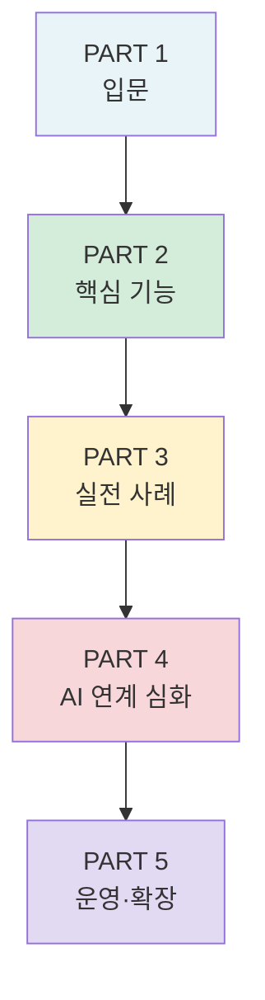
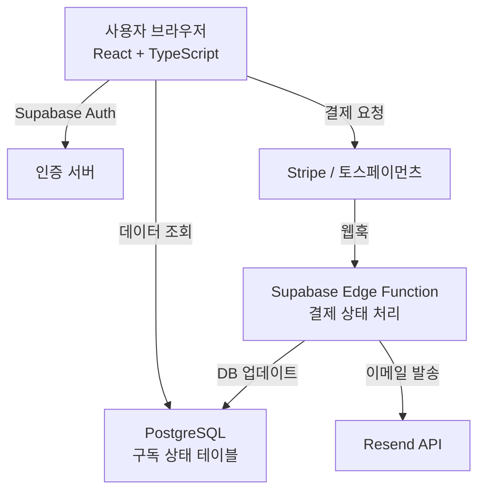
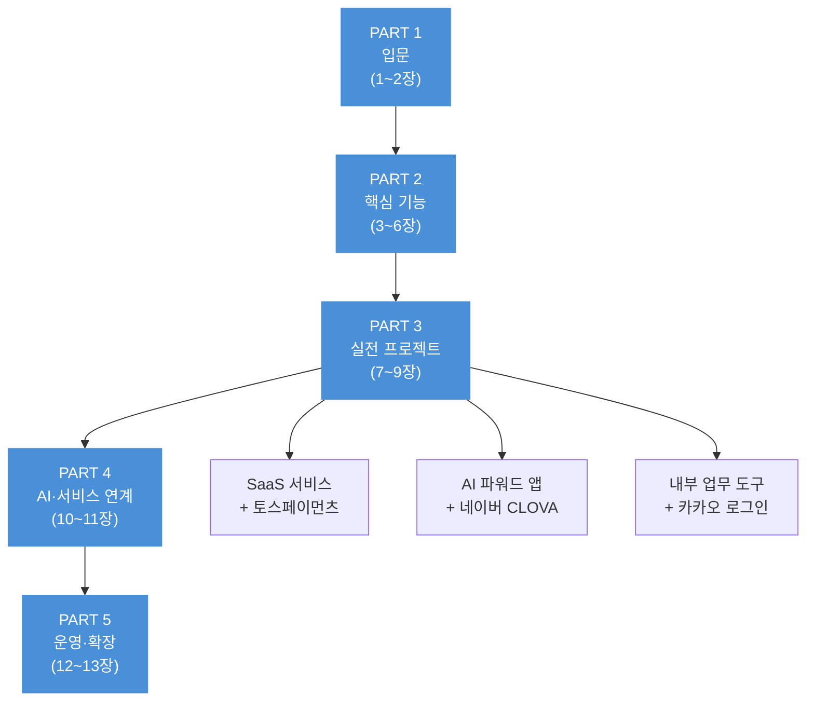

```toc
minLevel: 2
maxLevel: 3
```

---
# 📚 『러버블(Lovable) — 기초부터 활용까지』

## 최종 목차 (Final Draft v2.0)

> **집필 스킬 v1.1 적용** | 독자: 비개발자·창업자(초급) ~ 주니어 개발자(중급) | 코드: TypeScript/React 포함 | 한국어 독자 특화 콘텐츠 포함

---

### 📌 도서 개요

| 항목           | 내용                                                  |
| ------------ | --------------------------------------------------- |
| **도서명**      | 러버블(Lovable) — 기초부터 활용까지                            |
| **부제**       | 바이브 코딩으로 풀스택 앱을 완성하는 실전 가이드                         |
| **독자 수준**    | 비개발자·창업자 ~ 주니어 개발자 (균형 구성, 코드 포함)                   |
| **핵심 기술 스택** | React + TypeScript + Supabase + Vite + Tailwind CSS |
| **실전 프로젝트**  | SaaS 서비스 / AI 파워드 앱 / 내부 업무 도구 (3종)                 |
| **한국어 특화**   | 카카오 로그인 / 토스페이먼츠 / 네이버 클라우드 연동                      |
| **예상 분량**    | 약 400페이지, 13장 + 부록                                  |

---

## 전체 목차 구성성



---

## PART 1. 러버블 입문

---

### 제1장. AI 앱 빌더 시대의 도래

> _"마지막 소프트웨어"를 향한 여정 — 아이디어에서 프로덕션까지_

- 1.1 바이브 코딩(Vibe Coding)이란 무엇인가
- 1.2 러버블의 역사 — GPT Engineer에서 Lovable로, $6.6B 기업으로
- 1.3 러버블이 해결하는 문제 — 기존 개발 방식의 한계와 페인 포인트
- 1.4 경쟁 도구 완전 비교

| 구분    | Lovable    | Bolt.new | Cursor   | v0      | Replit |
| ----- | ---------- | -------- | -------- | ------- | ------ |
| 주요 대상 | 창업자·개발자    | 창업자      | 개발자      | 디자이너    | 개발자    |
| 출력 코드 | React + TS | React    | 기존 코드 기반 | Next.js | 다양     |
| 백엔드   | Supabase   | 제한적      | 직접 구성    | Vercel  | 자체     |
| 추천 상황 | MVP·SaaS   | 빠른 프로토   | 코드 보조    | UI 컴포넌트 | 학습·실험  |

- 1.5 러버블의 기술 스택 해부 — React, TypeScript, Supabase, Vite, Tailwind CSS
- 1.6 2025년 러버블 주요 업데이트 — Agent Mode, Visual Edit, RAG 디버깅

> 💡 **Key Takeaway:** 러버블은 "노코드 도구"가 아니라 "소유 가능한 프로덕션 코드를 생성하는 AI 풀스택 엔지니어"다.

---

### 제2장. 러버블 환경 설정과 첫 앱 만들기

- 2.1 계정 생성 및 플랜 선택 가이드 — Free / Starter / Launch / Scale 비교
- 2.2 크레딧(Credit) 시스템 완전 이해 — Agent Mode vs Visual Edit 소비 차이
- 2.3 인터페이스 완전 투어
    - 에디터 패널 · 채팅 패널 · 미리보기 · 코드뷰 · 설정
    - Agent Mode vs Chat Mode vs Visual Edit Mode 비교
- 2.4 첫 번째 앱 실습 — 할 일 목록(Todo App) 10분 완성
    - 프롬프트 작성 → 생성 → 미리보기 → 배포까지 전 과정
- 2.5 생성된 코드 구조 이해하기
    - `/src/components`, `/src/pages`, `/src/hooks` 폴더 구조
    - `package.json`, `vite.config.ts`, `tailwind.config.ts` 해설
- 2.6 러버블 앱 배포 — lovable.app 서브도메인과 커스텀 도메인 연결

> ⚠️ **WARNING:** 무료 플랜의 하루 5메시지 제한으로 복잡한 디버깅 시 크레딧이 빠르게 소진됩니다. 프롬프트 설계에 공을 들이는 것이 크레딧 절약의 핵심입니다.

---

## PART 2. 핵심 기능 마스터

---

### 제3장. 프롬프트 엔지니어링 — 러버블과 대화하는 법

- 3.1 좋은 프롬프트의 3요소 — 목적(What) · 맥락(Context) · 제약(Constraint)
- 3.2 초기 프롬프트 설계 전략 — PRD(제품 요구사항 문서) 방식 활용
    - ChatGPT / Claude로 PRD 초안 작성 후 러버블에 붙여넣기 워크플로우
- 3.3 반복 수정 프롬프트 패턴 16선
    - 기능 추가 / 스타일 수정 / 버그 수정 / 리팩토링 요청 패턴
- 3.4 Knowledge 설정 활용 — AI에게 프로젝트 컨텍스트 고정시키기
- 3.5 흔한 실수와 크레딧 낭비 방지법 — "AI 루프" 탈출 전략

```typescript
// ✅ 좋은 프롬프트 예시 (v1.0+ 기준)
// 나쁜 예: "로그인 버튼 추가해줘"
// 좋은 예:
`사용자 인증 기능을 추가해 주세요.
- 이메일/비밀번호 로그인과 Google OAuth 로그인 지원
- 로그인 성공 시 /dashboard로 리다이렉트
- 비밀번호 재설정 이메일 발송 기능 포함
- Supabase Auth 사용, 기존 profiles 테이블과 연동`
```

---

### 제4장. 프론트엔드 개발 — UI 구성의 모든 것

- 4.1 컴포넌트(Component) 기반 사고방식 — React 핵심 개념 속성 코스
- 4.2 레이아웃 시스템 — Flexbox, Grid, 반응형 디자인 구현
- 4.3 Tailwind CSS 완전 활용 — 유틸리티 클래스로 스타일 커스터마이징
- 4.4 shadcn/ui 컴포넌트 라이브러리 활용
- 4.5 Visual Edit 모드 심화 — 클릭으로 UI를 직접 수정하기
- 4.6 애니메이션과 인터랙션 구현
- 4.7 실전 사례 3종
    - 랜딩 페이지 (SaaS 마케팅 사이트)
    - 관리자 대시보드
    - 개인 포트폴리오 사이트

---

### 제5장. 백엔드 연동 — Supabase 완전 정복

- 5.1 Supabase란 무엇인가 — Firebase 대안, PostgreSQL 기반 오픈소스 백엔드
- 5.2 러버블 × Supabase 연결 설정 (단계별 스크린샷 가이드)
- 5.3 데이터베이스 설계와 CRUD 구현
    - 테이블 설계 원칙 · SQL 마이그레이션 이해하기
    - 러버블로 자연어 → 스키마 자동 생성
- 5.4 사용자 인증(Authentication) 완전 구현
    - 이메일/비밀번호 · Google · GitHub · **카카오 OAuth** 연동
- 5.5 파일 스토리지(Storage) 활용 — 이미지·문서 업로드 구현
- 5.6 실시간(Realtime) 데이터 — 라이브 채팅, 알림 피드 구현
- 5.7 Row Level Security(RLS) 완전 가이드 — 보안의 핵심

```typescript
// Supabase 실시간 구독 예시 (v2.x 기준)
import { useEffect, useState } from 'react'
import { supabase } from '@/integrations/supabase/client'

export function useRealtimeMessages(roomId: string) {
  const [messages, setMessages] = useState<Message[]>([])

  useEffect(() => {
    // 초기 데이터 로드
    const fetchMessages = async () => {
      const { data } = await supabase
        .from('messages')
        .select('*')
        .eq('room_id', roomId)
        .order('created_at')
      if (data) setMessages(data)
    }
    fetchMessages()

    // 실시간 구독 설정
    const channel = supabase
      .channel(`room:${roomId}`)
      .on('postgres_changes',
        { event: 'INSERT', schema: 'public', table: 'messages' },
        (payload) => setMessages(prev => [...prev, payload.new as Message])
      )
      .subscribe()

    return () => { supabase.removeChannel(channel) }
  }, [roomId])

  return messages
}
```

- 5.8 Edge Functions(서버리스 함수) 활용 — API 키 보호와 백엔드 로직

---

### 제6장. 코드 소유권과 개발자 워크플로우

- 6.1 생성된 TypeScript/React 코드 구조 완전 이해
- 6.2 GitHub 저장소 연결 — 양방향(Bi-directional) 동기화
- 6.3 Code Mode 심화 — 러버블 에디터에서 직접 수정하기
- 6.4 로컬 개발 환경 구축 — VS Code / Cursor 병행 워크플로우
    - `git clone` → `npm install` → `npm run dev` 세팅
- 6.5 Vercel / Netlify 직접 배포 — 러버블 외부 배포 완전 가이드
- 6.6 팀 협업 워크플로우 — 공유 워크스페이스와 브랜치 전략

---

## PART 3. 실전 프로젝트

---

### 제7장. 실전 프로젝트 1 — SaaS 구독 서비스 제작

> _프로젝트: "WriteFlow" — AI 글쓰기 보조 구독 서비스_

- 7.1 기획 — 서비스 구조 설계와 PRD 작성
- 7.2 랜딩 페이지와 가격 플랜 UI 제작
- 7.3 **Stripe 결제 완전 연동**
    - 구독(Subscription) 플랜 설정
    - 체크아웃(Checkout) 세션 생성
    - 웹훅(Webhook)으로 결제 상태 동기화
    - 고객 포털(Customer Portal) 연결
- 7.4 **[한국어 특화] 토스페이먼츠(TossPayments) 연동**
    - 결제창 연동 · 웹훅 처리 · 취소·환불 API
- 7.5 구독 등급별 기능 제어 — 무료/기본/프로 플랜 분기 구현
- 7.6 이메일 발송 — **Resend API** 트랜잭션 메일 연동
- 7.7 배포 및 커스텀 도메인 설정

```
[아키텍처 다이어그램]
```



---

### 제8장. 실전 프로젝트 2 — AI 파워드 앱 제작

> _프로젝트: "DocSense" — 문서 업로드 AI 분석 서비스_

- 8.1 기획 — 서비스 구조와 AI 파이프라인 설계
- 8.2 파일 업로드 UI + Supabase Storage 연동
- 8.3 **OpenAI GPT-4 API 연동**
    - 문서 요약 · Q&A · 키워드 추출 기능
    - 스트리밍(Streaming) 응답으로 실시간 타이핑 효과 구현
- 8.4 **Anthropic Claude API 연동**
    - 긴 문서 분석에 최적화된 Claude 활용 전략
    - GPT-4 vs Claude 비용·성능 비교 및 선택 기준
- 8.5 **OpenRouter로 멀티 LLM 구조 설계** — 모델 전환 로직
- 8.6 Supabase Edge Function으로 API 키 보안 처리
- 8.7 사용량 제한(Rate Limiting) 및 비용 관리 전략
- 8.8 **[한국어 특화] 네이버 클라우드 CLOVA OCR 연동** — 한국어 문서 인식

```typescript
// Supabase Edge Function: OpenAI 스트리밍 처리 예시
// functions/chat-stream/index.ts (Deno 런타임 기준)
import { serve } from 'https://deno.land/std@0.168.0/http/server.ts'
import OpenAI from 'https://deno.land/x/openai@v4.20.1/mod.ts'

serve(async (req) => {
  const { messages } = await req.json()
  const openai = new OpenAI({
    apiKey: Deno.env.get('OPENAI_API_KEY') // 환경변수로 API 키 보호
  })

  const stream = await openai.chat.completions.create({
    model: 'gpt-4o',
    messages,
    stream: true
  })

  // Server-Sent Events로 클라이언트에 스트리밍 전달
  return new Response(stream.toReadableStream(), {
    headers: { 'Content-Type': 'text/event-stream' }
  })
})
```

---

### 제9장. 실전 프로젝트 3 — 내부 업무 도구(Internal Tool) 제작

> _프로젝트: "TeamBoard" — 팀 프로젝트 관리 대시보드_

- 9.1 기획 — 내부 도구 특유의 설계 원칙 (외부 서비스와의 차이)
- 9.2 역할 기반 접근 제어(RBAC) 구현 — 관리자/팀장/팀원 권한 분리
- 9.3 CSV 데이터 업로드 및 테이블 시각화
- 9.4 차트 및 데이터 시각화 — Recharts 활용 KPI 대시보드
- 9.5 **슬랙(Slack) 웹훅 알림 연동** — 태스크 업데이트 자동 알림
- 9.6 PDF 보고서 자동 생성 — React-PDF 활용
- 9.7 **[한국어 특화] 카카오 로그인(Kakao OAuth) 완전 연동**
    - 카카오 앱 등록 → REST API 키 발급 → Supabase Auth Custom Provider 설정

---

## PART 4. AI·외부 서비스 연계 심화

---

### 제10장. AI 서비스 연계 완전 가이드

- 10.1 **OpenAI** — GPT-4o·Whisper(음성 인식)·DALL-E(이미지 생성) 연동 패턴
- 10.2 **Anthropic Claude** — 문서 분석·장문 처리·시스템 프롬프트 설계
- 10.3 **OpenRouter** — 멀티 LLM 전환 구조로 비용·성능 최적화
- 10.4 **ElevenLabs** — 텍스트 → 음성(TTS) 변환 기능 추가
- 10.5 **Replicate** — Stable Diffusion·이미지·영상 생성 기능 추가
- 10.6 AI 서비스 비교 및 선택 가이드

| 서비스               | 강점     | 비용 수준 | 추천 용도    |
| ----------------- | ------ | ----- | -------- |
| OpenAI GPT-4o     | 범용성·속도 | 중     | 챗봇·요약·코드 |
| Claude 3.5 Sonnet | 장문·정확성 | 중     | 문서 분석·법률 |
| OpenRouter        | 멀티 모델  | 낮음    | 비용 최적화   |
| ElevenLabs        | 음성 품질  | 중-고   | TTS·팟캐스트 |
| Replicate         | 이미지 생성 | 낮음    | 이미지·영상   |

---

### 제11장. 서드파티 서비스 통합 완전 가이드

- 11.1 **자동화 연동** — Zapier / Make(Integromat)로 노코드 워크플로우 구성
- 11.2 **이메일 마케팅** — Resend + React Email 템플릿
- 11.3 **지도·위치 서비스** — Google Maps API 연동
- 11.4 **SMS·알림** — Twilio 문자 발송 연동
- 11.5 **소셜 인증 확장** — Clerk 인증 서비스 활용
- 11.6 **[한국어 특화] 네이버 클라우드 플랫폼 연동**
    - SENS(SMS/LMS) 문자 발송 API
    - Object Storage (파일 저장소 대안)
    - CLOVA Studio LLM API
- 11.7 커스텀 REST API 연동 — 어떤 외부 서비스도 연결하는 범용 패턴

```mermaid
graph LR
    subgraph 러버블 앱
        A[React Frontend] --> B[Supabase Edge Function]
    end
    subgraph 외부 AI 서비스
        B --> C[OpenAI API]
        B --> D[Claude API]
        B --> E[네이버 CLOVA]
    end
    subgraph 알림·자동화
        B --> F[Slack Webhook]
        B --> G[Twilio SMS]
        B --> H[Resend Email]
    end
    subgraph 결제
        A --> I[Stripe]
        A --> J[토스페이먼츠]
    end
```

---

## PART 5. 운영과 성장

---

### 제12장. 프로덕션 운영과 보안

- 12.1 배포 전 보안 체크리스트 15항목
    - API 키 노출 방지 · RLS 활성화 확인 · CORS 설정
- 12.2 성능 최적화 — 코드 스플리팅, 이미지 최적화, 캐싱 전략
- 12.3 모니터링 및 에러 추적 — Sentry 연동
- 12.4 로깅과 분석 — PostHog / Mixpanel 연동
- 12.5 러버블의 한계와 현실적인 대응 전략
    - 복잡도 60~70% 이후 AI 오류 패턴과 수동 수정법
    - "AI 루프" 탈출 가이드

---

### 제13장. 확장과 마이그레이션

- 13.1 팀 협업 심화 — 공유 워크스페이스, 코멘트, 역할 관리
- 13.2 대규모 프로젝트에서의 러버블 활용 전략
- 13.3 러버블에서 전통적인 개발 환경으로 마이그레이션
    - GitHub Export → Next.js 마이그레이션 로드맵
    - 언제 러버블을 졸업해야 하는가
- 13.4 러버블 생태계의 미래 — Agent Mode 진화 방향과 MCP 연동 가능성

---

## 부록

- **부록 A.** 러버블 프롬프트 템플릿 50선 (기능별 분류)
- **부록 B.** 주요 API 키 발급 가이드
    - OpenAI · Anthropic · Stripe · 토스페이먼츠 · 카카오 · 네이버 클라우드
- **부록 C.** 용어 사전(Glossary) — 한영 병기 70선
- **부록 D.** 트러블슈팅 TOP 30 — 흔한 오류 및 해결법 모음
- **부록 E.** 추천 학습 자료 및 커뮤니티

---

## 📊 목차 구조 로드맵



---


**제1장 집필 완료**

**이번 장에서 다룬 내용:**

- 바이브 코딩의 정의, 3단계 진화, 한계
- 러버블 창업 역사 및 성장 타임라인 (2023~2025)
- 기존 개발 방식의 한계와 러버블의 해결책
- Bolt.new·Cursor·v0·Replit 경쟁 도구 비교표
- React·TypeScript·Supabase·Vite 기술 스택 해설
- 2025년 주요 업데이트 (Agent Mode·Visual Edit·GitHub 연동)

**집필 규칙 적용 현황:**

- 💡 TIP 3곳 / 📝 NOTE 3곳 / ⚠️ WARNING 2곳 적용
- 각 절마다 🔗 연결 고리(Bridge) 배치
- 장 말미에 🔑 Key Takeaway 및 📚 참고 자료 18건 수록


**제2장 집필 완료**

**이번 장에서 다룬 내용:**

- 계정 생성 단계별 가이드 (Google·이메일 가입)
- Free / Pro / Business / Enterprise 플랜 완전 비교표 (2025년 최신 기준)
- 크레딧 시스템 심층 해설 — 월 구독 크레딧 vs 일일 크레딧 구조, 복잡도 기반 과금 테이블
- 인터페이스 전체 레이아웃 및 Chat / Visual Edit / Dev Mode 3가지 모드 비교
- **할 일 앱 10분 완성 실습** — 실제 TypeScript/React 코드 포함 (STEP 1~6)
- 생성 코드 구조(폴더 트리) + 핵심 파일 코드 해설
- lovable.app 서브도메인 배포 + 커스텀 도메인 연결 방법

**집필 규칙 적용 현황:**

- 💡 TIP 5곳 / 📝 NOTE 6곳 / ⚠️ WARNING 3곳
- 모든 절에 🔗 연결 고리 및 🔑 Key Takeaway 수록
- 참고 자료 16건 (공식 문서 + 블로그 + 커뮤니티)

---

**제3장 집필 완료**

**이번 장에서 다룬 내용:**

- 좋은 프롬프트의 3요소(목적·맥락·제약) + 자가 진단 체크리스트
- PRD 기반 초기 프롬프트 템플릿 + DocSense 완성 예시
- **반복 수정 프롬프트 패턴 16선** — 기능 추가(4) / 스타일 수정(4) / 버그 수정(4) / 고급 활용(4)
- Knowledge 설정 완전 가이드 — 권장 템플릿 + 업데이트 시점표
- ChatGPT·Claude를 활용한 프롬프트 사전 설계 워크플로우
- AI 루프 방지·탈출 전략 + **크레딧 절약 10계명**

**집필 규칙 적용 현황:**

- 💡 TIP 4곳 / 📝 NOTE 4곳 / ⚠️ WARNING 3곳
- 🔗 연결 고리 / 🔑 Key Takeaway 수록
- 참고 자료 15건 (공식 문서 + 외부 가이드 + 커뮤니티)

---
**제4장 집필 완료**

**이번 장에서 다룬 내용:**

- React 3대 핵심 개념(Props / State / useEffect) — 코드 예제 포함 속성 코스
- Tailwind CSS 레이아웃 시스템 — Flexbox·Grid 핵심 클래스표 + 반응형 브레이크포인트 완전 정리
- 브랜드 색상 커스터마이징 (`tailwind.config.ts` 실전 코드)
- **shadcn/ui 6대 컴포넌트** (Button·Input·Dialog·Toast·Select·Table) 실전 코드 포함
- Visual Edit 모드 심화 — 수정 패널 기능별 설명 + 활용 체크리스트
- 애니메이션 구현 패턴 (Tailwind 기본 + 커스텀 슬라이드 인)
- **실전 사례 3종** — SaaS 랜딩 페이지 구조도 + 대시보드 + 포트폴리오 프롬프트 완성 예시
- 프론트엔드 오류 6종 트러블슈팅 표

**집필 규칙 적용 현황:**

- 💡 TIP 4곳 / 📝 NOTE 4곳 / ⚠️ WARNING 2곳
- 🔗 연결 고리 / 🔑 Key Takeaway 수록
- 참고 자료 20건 (공식 문서 + 디자인 레퍼런스 + 학습 자료)

---
**제5장 집필 완료**

**이번 장에서 다룬 내용:**

- Supabase 4대 기능 구조도 + Firebase vs Supabase 완전 비교표
- 러버블 × Supabase 연결 — 자동 프로비저닝(Integration 2.0) + 수동 설정 방법
- CRUD 완전 구현 — Create/Read/Update/Delete TypeScript 코드 예제 포함
- 사용자 인증 완전 구현 — `useAuth` 훅 + Google OAuth + **카카오 로그인(한국 특화)** 단계별 가이드
- 보호 라우트(Protected Route) 구현 코드
- 파일 업로드 — `useFileUpload` 훅 + 드래그 앤 드롭 UI 컴포넌트
- 실시간 채팅 — `useRealtimeChat` 훅 (CDC 동작 원리 포함)
- **RLS 완전 가이드** — SQL 정책 코드 + 검증 방법 + 보안 경고
- Edge Functions — OpenAI 연동 AI 요약 함수 완전 예제

**집필 규칙 적용 현황:**

- 💡 TIP 5곳 / 📝 NOTE 3곳 / ⚠️ WARNING 4곳
- 🔗 연결 고리 / 🔑 Key Takeaway 수록
- 참고 자료 19건 (공식 문서 + 보안 가이드 + 한국어 OAuth)

---
**제6장 집필 완료**

**이번 장에서 다룬 내용:**

- 코드 소유권 개념 — 노코드 도구와의 완전 비교표
- **완전한 프로젝트 폴더 구조** 트리 + 핵심 파일(`vite.config.ts`, `App.tsx`) 해설
- GitHub 양방향 동기화 원칙 + 단계별 연결 가이드 + 기존 저장소 임포트 우회법
- Dev Mode 심화 — 환경변수·패키지 추가 코드 예제
- **로컬 환경 구축 완전 가이드** — VS Code 익스텐션 + npm 명령어 모음
- **러버블 + Cursor 병행 워크플로우** 플로우차트 (실제 검증된 패턴)
- Vercel / Netlify 자동 배포 설정 + SPA 라우팅 `_redirects` 처리
- 팀 브랜칭 전략 + 충돌 방지 5대 규칙

**집필 규칙 적용 현황:**

- 💡 TIP 4곳 / 📝 NOTE 3곳 / ⚠️ WARNING 3곳
- 🔗 연결 고리 / 🔑 Key Takeaway 수록
- 참고 자료 18건 (공식 문서 + 워크플로우 가이드 + Git 학습 자료)

---
**제7장: SaaS 구독 서비스 제작** 

**이번 장에서 다룬 내용:**

- 플랜 구조 설계 (Free / Pro ₩19,000 / Team ₩49,000)
- Supabase DB 스키마 4종
- 가격 플랜 카드 컴포넌트
- **Stripe 결제 완전 연동** — 체크아웃 세션 Edge Function, 웹훅 처리
- **[한국어 특화] 토스페이먼츠** — 결제 승인 API, 웹훅 처리
- 구독 등급별 기능 제어 (`usePlanAccess` 훅)
- Resend 이메일 발송 연동
- 프로덕션 배포 체크리스트

---
**8장 집필 완료**

**이번 장에서 다룬 내용:**

- DocSense 전체 AI 파이프라인 흐름도 (OCR → 요약 → Q&A)
- Supabase DB 스키마 3종 (documents / analyses / chat_messages)
- **Lovable AI 네이티브 연동** — API 키 없이 즉시 AI 기능 추가
- OpenAI 모델 선택 가이드 (gpt-4o / gpt-4o-mini / o3-mini 비용 비교표)
- **GPT-4o 문서 요약 Edge Function** — JSON 모드 + 토큰 제한 실전 코드
- **스트리밍 Q&A 채팅** 완전 구현 — SSE Edge Function + `useStreamingChat` 훅 + 타이핑 커서 UI
- **[한국어 특화] 네이버 CLOVA OCR** — 3가지 서비스 유형 비교 + API 설정 단계별 가이드 + Edge Function 완전 코드
- Document OCR 영수증·사업자등록증 특화 처리 패턴
- `useDocumentPipeline` 훅 + `ProcessingProgress` 진행 상태 UI
- AI 비용 최적화 5대 전략 + 프롬프트 품질 개선 패턴

**집필 규칙 적용 현황:**

- 💡 TIP 4곳 / 📝 NOTE 2곳 / ⚠️ WARNING 3곳
- 🔗 연결 고리 / 🔑 Key Takeaway 수록
- 참고 자료 20건

---
**제9장 집필 완료**

**이번 장에서 다룬 내용:**

- 내부 도구 vs SaaS 개발 방식 비교표
- TeamBoard 4단계 역할(Owner/Admin/Member/Viewer) 설계
- Supabase DB 스키마 6종 (teams/team_members/projects/board_columns/tasks/댓글·활동로그)
- **[한국어 특화] 카카오 로그인 + 이메일 도메인 제한** (프론트·서버 이중 검증)
- 팀 자동 배정 온보딩 훅
- **dnd-kit 칸반 보드 완전 구현** — DndContext·KanbanColumn·SortableTaskCard·TaskCard 전체 코드
- **Optimistic Update(낙관적 업데이트)** 로 드래그 시 즉각 반응, 실패 시 자동 복원
- **Supabase Realtime + Presence** — "지금 접속 중인 팀원" 아바타 실시간 표시
- 역할별 RLS 4종 SQL 정책 완전 작성
- 초대 코드 생성 Edge Function + Resend 이메일 발송
- **PostgreSQL 트리거** 로 태스크 이동 활동 로그 자동 기록
- Vercel 사내 배포 보안 설정

**집필 규칙 적용 현황:**

- 💡 TIP 3곳 / 📝 NOTE 2곳 / ⚠️ WARNING 2곳
- 🔗 연결 고리 / 🔑 Key Takeaway 수록
- 참고 자료 18건

---
**PART 4*** 
***제10장: AI 서비스 연계 완전 가이드** 

**이번 장에서 다룬 내용:**

- 러버블 공식 AI 커넥터 생태계 전체 지도 + 서비스 선택 가이드표
- **OpenRouter** — 500개 모델 통합 게이트웨이 완전 해설, 복잡도 기반 자동 모델 라우팅 Edge Function, `:nitro` / `:floor` 라우팅 단축키, 2025 기준 주요 모델 비용 비교표
- **Anthropic Claude API** — Claude 강점 영역 분석, 스트리밍 구현, **RAG(검색 증강 생성) pgvector 설계** SQL 포함
- **ElevenLabs 완전 연동** — 공식 러버블 통합(2025.12 발표) 배경, TTS Edge Function + `useTextToSpeech` 훅, STT MediaRecorder 구현, 실시간 음성 에이전트 원샷 프롬프트, 한국어 최적화 설정표
- **Replicate FLUX.1** — 이미지 생성 Edge Function + 스타일 프리셋(수묵화 포함) + 한→영 번역 파이프라인
- **Perplexity + Firecrawl** — 실시간 웹 검색, 경쟁사 가격 모니터링 사례
- AI 비용 추산 계산기 코드 + **비용 절감 6대 체크리스트**

**집필 규칙 적용 현황:**

- 💡 TIP 3곳 / 📝 NOTE 2곳 / ⚠️ WARNING 2곳
- 🔗 연결 고리 / 🔑 Key Takeaway 수록
- 참고 자료 21건

---

**제11장 — 서드파티 서비스 통합 (Zapier·Google Maps·Twilio·네이버 클라우드)** 

**이번 장에서 다룬 내용:**

**Zapier 완전 연동**

- 아웃바운드(러버블→외부) + 인바운드(외부→러버블) 양방향 웹훅 구조
- 이벤트별 Zapier 웹훅 분기 Edge Function 완전 코드
- 실전 자동화 레시피 10선 표 (Slack 알림 / Google Sheets / HubSpot / Gmail 등)

**Google Maps 완전 구현**

- `@vis.gl/react-google-maps` v1 지도 컴포넌트 + 마커 + InfoWindow
- Places API 주소 자동완성 (한국 도메인 제한, 한국어 우선)
- Geocoding Edge Function (주소 → 위도/경도 서버 측 처리)
- Distance Matrix 기반 가장 가까운 매장 찾기 훅

**Twilio SMS·OTP 완전 구현**

- SMS 발송 Edge Function + 발송 로그 DB 자동 기록
- Supabase Phone Auth 직접 연동 (설정 3단계)
- 한국 전화번호 E.164 자동 변환 로직
- OTP 입력 UI 컴포넌트 완전 구현 (2단계 인증 흐름)

**[한국어 특화] 네이버 클라우드 SENS**

- HMAC-SHA256 서명 생성 로직 포함
- SMS + 카카오 알림톡 단일 Edge Function
- 카카오 알림톡 주문확인 템플릿 활용 예시 (버튼 포함)
- 네이버 Maps API 훅 구현 + 주소 검색(Geocoder)
- Google Maps vs 네이버 Maps vs Twilio vs SENS 비교표

**멀티채널 통합 알림 시스템**

- 이벤트별 채널 우선순위 라우터 (`sendNotification` 함수)
- 사용자 알림 설정 토글 UI 컴포넌트

**집필 규칙 적용:** 💡 TIP 2곳 / 📝 NOTE 3곳 / ⚠️ WARNING 2곳 / 🔗 연결 고리 / 🔑 Key Takeaway / 참고 자료 18건

---
**제12장 집필 완료**

**이번 장에서 다룬 내용:**

**보안 체크리스트** — 배포 전 10개 항목 전체 표, 러버블 Security Advisor 활용법

**RLS 완전 정복** — 느린·빠른 패턴 SQL 비교, Security Definer 함수 캐싱, Storage 버킷 3종 RLS, Vitest 기반 RLS 자동화 테스트 코드

**환경 분리** — Dev/Staging/Production 3단계 구성 전략, Vercel 환경별 변수 설정, Supabase CLI 마이그레이션 워크플로우

**Sentry 완전 연동** — `main.tsx` 초기화 (PII 마스킹·샘플링·ignoreErrors 포함), Sentry ErrorBoundary 폴백 UI, 사용자 컨텍스트 로그인 연동, 수동 에러 캡처 패턴, Slack 알림 설정

**성능 최적화** — Core Web Vitals 목표치 표, 러버블 최적화 프롬프트 3종, React.lazy 코드 스플리팅 + Suspense 스켈레톤 UI, TanStack Query 전역 최적화 설정, React Profiler 느린 컴포넌트 감지

**DB 운영** — 5가지 인덱스 패턴 SQL, `pg_stat_statements` 느린 쿼리 분석, EXPLAIN ANALYZE 가이드

**장애 대응** — 유형별 플레이북 표, Vercel 즉시 롤백 CLI, 마이그레이션 롤백 주의사항

**개인정보보호** — 국내 개인정보보호법 5대 의무 표, 사용자 데이터 완전 삭제 Edge Function

---

**제13장 집필 완료**
🎉 이로써 **본문 13개 장이 모두 완성**

**이번 장에서 다룬 내용:**

**확장 시점 판단** — 러버블 단독 vs 확장 필요 비교표, 3단계 성장 로드맵 (MVP → 성장 → 스케일)

**Supabase 스케일링** — PgBouncer 연결 풀링 설정, 읽기/쓰기 분리 패턴, 모니터링 지표 3종

**Next.js 마이그레이션** — 필요 시점 판단 가이드, 자동화 도구 3종 비교, React Router→App Router 변환, 환경변수 접두사 변경, `'use client'` 지시어 패턴 완전 코드

**Capacitor iOS·Android** — Capacitor vs React Native 비교표, 설치 단계별 가이드, `capacitor.config.ts` 완전 설정, 푸시 알림 훅 구현, iOS Safe Area CSS, 앱스토어 제출 체크리스트, Capgo OTA 업데이트 팁

**GitHub Actions CI/CD** — 자동 배포 파이프라인 + PR 미리보기 배포 YAML 완전 구현

**팀 협업 전략** — 역할 분담 모델, 개발자 온보딩 README 템플릿, 기술 부채 해소 패턴 3종

**바이브 코딩의 본질적 가치** — 패러다임 전환 마무리 메시지

---

**부록 구성 요약:**

**부록 A. 프롬프트 템플릿 50선**

- A.1 초기 프로젝트 생성 10개 (SaaS 랜딩·대시보드·이커머스·예약·포럼 등)
- A.2 기능 추가 15개 (이메일 인증·소셜 로그인·실시간 알림·파일 업로드·무한 스크롤·2FA 등)
- A.3 디자인·스타일 10개 (다크 모드·애니메이션·반응형·스켈레톤·접근성 등)
- A.4 AI 기능 8개 (자동완성·이미지 분석·챗봇·음성 메모 등)
- A.5 디버깅·유지보수 7개 (AI 루프 탈출·리팩토링·성능 진단 등)

**부록 B. API 키 발급 가이드** — Supabase·OpenAI·Stripe·토스페이먼츠·카카오·네이버 클라우드·Google Maps·Resend·Sentry 전체

**부록 C. 용어 사전 70선** — 한영 병기, 가나다순 + A~Z 섹션

**부록 D. 트러블슈팅 TOP 30** — 에디터(8)·Supabase(8)·결제(5)·배포·성능(9) 영역별 원인+해결 완전 정리

**부록 E. 추천 학습 자료** — 러버블 공식·기술 스택 문서·한국어 자료·커뮤니티·필독 도서 전체

---

**전체 집필 현황:**

| PART   | 장       | 상태     |
| ------ | ------- | ------ |
| PART 1 | 제1~2장   | ✅      |
| PART 2 | 제3~6장   | ✅      |
| PART 3 | 제7~9장   | ✅      |
| PART 4 | 제10~11장 | ✅      |
| PART 5 | 제12~13장 | ✅      |
| **부록** | A~E     | ⏳ 대기 중 |