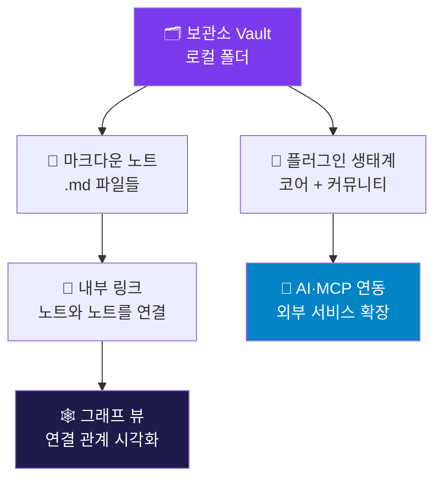

---
created:
  '{ date }': null
publish: true
status: 진행중
title: Ch01 What Is Obsidian
type: techbook
---

# Chapter 01. 옵시디언이란?
> 개념·요금제·경쟁 앱 비교

---

## 0) 연결 고리 (Bridge)

이 책은 "지식을 단순히 저장하는 것"이 아니라 **"연결하고 확장하는 것"**에 관한 이야기입니다.  
Chapter 01은 여러분이 앞으로 사용할 도구인 옵시디언이 무엇인지, 왜 수많은 지식 관리 도구 중 옵시디언이 주목받고 있는지를 이해하는 출발점입니다.  
개념을 충분히 이해한 뒤 Chapter 02에서 실제 설치로 넘어갑니다.

---

## 1) 개념 정의 및 필요성

### 옵시디언(Obsidian)이란?

> **옵시디언은 로컬 마크다운(Markdown) 파일 기반의 개인 지식 관리(PKM, Personal Knowledge Management) 도구입니다.**

2020년 Shida Li와 Erica Xu가 개발했으며, 현재 전 세계 수백만 명이 사용하는 오픈 생태계 노트 앱입니다. 핵심 특징은 모든 노트가 **사용자의 로컬 컴퓨터**에 `.md` 파일로 저장된다는 점입니다. 서버에 데이터를 맡기지 않기 때문에 인터넷 없이도 작동하며, 서비스가 종료되어도 파일은 영구적으로 남습니다.

### 왜 옵시디언인가 — 기존 방식의 한계와 옵시디언의 해법

대부분의 노트 앱은 **정보를 폴더 안에 쌓아두는 방식**으로 작동합니다. 폴더가 늘어날수록 정보는 고립되고, 연관된 아이디어끼리 연결이 끊어지는 문제가 생깁니다.

| 기존 방식의 문제 | 옵시디언의 해법 |
|---|---|
| 노트가 폴더 안에 갇혀 고립됨 | 내부 링크(`[[]]`)로 모든 노트를 연결 |
| 다른 서비스로 이전 시 데이터 손실 우려 | 모든 데이터가 로컬 `.md` 파일 — 이식성 100% |
| 클라우드 의존으로 오프라인 사용 불가 | 기본 동작이 로컬 — 오프라인 완전 지원 |
| 생각의 연결 관계를 시각화할 수 없음 | 그래프 뷰(Graph View)로 노트 연결 시각화 |
| 플러그인·확장이 제한적임 | 1,000개 이상의 커뮤니티 플러그인 생태계 |

> 📌 **NOTE:** "두 번째 뇌(Second Brain)"라는 표현은 개인 지식 관리 분야에서 외부 저장 시스템을 통해 기억과 사고를 확장하는 개념을 말합니다. 옵시디언은 이 개념을 실현하는 대표 도구 중 하나입니다.

---

## 2) 핵심 원리 및 구조

### 옵시디언의 동작 구조

옵시디언의 핵심은 세 가지 층위로 이루어집니다.

**보관소(Vault)** 는 옵시디언이 관리하는 최상위 로컬 폴더입니다. 이 폴더 안의 모든 `.md` 파일이 노트가 됩니다.  
**내부 링크**는 `[[노트 이름]]` 형식으로 노트끼리 연결하는 핵심 기능입니다.  
**그래프 뷰**는 연결된 노트들의 관계망을 시각적으로 보여줍니다.

### 파일 저장 방식 비유

> 옵시디언의 보관소는 **물리적인 서랍장**과 같습니다. 서랍장(보관소) 안에 종이(`.md` 파일)를 넣는데, 각 종이에는 다른 종이를 참조하는 메모(`[[링크]]`)가 붙어 있습니다. 어떤 회사가 서랍장 제조를 중단해도 종이는 사라지지 않습니다.

---

## 3) 실습 예제 — 옵시디언 요금제와 경쟁 앱 비교

### 요금제 비교 (v1.7 기준)

옵시디언은 **개인 비상업적 사용은 완전 무료**입니다.

| 플랜 | 가격 | 대상 | 주요 포함 기능 |
|---|---|---|---|
| **무료(Personal)** | $0 | 개인 비상업적 사용 | 모든 핵심 기능 + 커뮤니티 플러그인 전체 |
| **상업(Commercial)** | $50/년 | 업무·영리 목적 사용 | 무료 플랜 동일 기능 + 상업적 사용 라이선스 |
| **Sync(동기화)** | $10/월 | 기기 간 동기화 필요 시 | E2E 암호화 동기화, 버전 히스토리 1년 |
| **Publish(퍼블리시)** | $20/월 | 웹사이트 공개 필요 시 | 디지털 가든 호스팅, 커스텀 도메인 |
| **Catalyst(후원)** | $25~$100 일시불 | 개발 후원 | 인사이더 빌드 얼리 액세스 |

> ⚠️ **WARNING:** "상업적 사용"의 기준은 회사 업무에 옵시디언을 사용하는 모든 경우를 포함합니다. 개인 학습·취미 용도라면 무료 플랜으로 이 책의 모든 내용을 실습할 수 있습니다.

> 💡 **TIP:** 동기화는 옵시디언 Sync 유료 플랜 외에도 iCloud, Google Drive, Git 등 무료 대안이 있습니다. Chapter 17에서 3가지 방법을 모두 다룹니다.

### 경쟁 앱 비교

옵시디언을 선택하기 전, 유사 도구와의 차이를 명확히 이해하는 것이 중요합니다.

| 구분 | 옵시디언 | 노션(Notion) | 로그시크(Logseq) | 옵시디언 선택 권장 시점 |
|---|---|---|---|---|
| **저장 방식** | 로컬 `.md` | 클라우드 서버 | 로컬 `.md` | 데이터 주권이 중요할 때 |
| **기본 구조** | 파일/폴더 + 링크 | 페이지/블록 DB | 아웃라이너(일지 중심) | 장문 노트·연구·글쓰기 |
| **오프라인** | 완전 지원 | 제한적 | 완전 지원 | 인터넷 없이 작업 필요 시 |
| **가격** | 핵심 기능 무료 | 무료(기능 제한) | 완전 무료 | 장기 비용 최소화 시 |
| **학습 곡선** | 중간 | 낮음 | 중간 | — |
| **플러그인** | 1,000개 이상 | 제한적 | 300개 이상 | 기능 확장성이 중요할 때 |
| **데이터 이식성** | 매우 높음(순수 MD) | 낮음(내보내기 제한) | 높음(MD) | 나중에 다른 앱 이전 고려 시 |
| **AI·MCP 연동** | 매우 유연 | API 제한적 | 제한적 | AI 자동화·연동 원할 때 |

> 📌 **NOTE:** 노션과 옵시디언은 **경쟁 관계가 아니라 보완 관계**로 사용하는 경우도 많습니다. 팀 협업·공유 문서는 노션, 개인 지식 관리·연구·글쓰기는 옵시디언을 사용하는 조합이 실무에서 자주 쓰입니다.

---

## 4) 실무 시나리오 (Best Practice)

### 옵시디언이 빛나는 상황

**지식 노동자·연구자:** 논문, 레퍼런스, 아이디어가 쌓일수록 연결의 가치가 커집니다. 제텔카스텐(Zettelkasten) 방법론과 결합하면 수백 개의 노트가 스스로 새로운 인사이트를 생성합니다. (Chapter 20~21 참고)

**개발자·기술 작가:** 마크다운 네이티브 환경에서 코드 스니펫, API 문서, 학습 노트를 하나의 보관소에 통합합니다. Git 연동도 자연스럽습니다.

**창작자·소설가:** 캐릭터, 세계관, 사건 타임라인을 노트로 연결하고 Excalidraw로 시각화합니다. (Chapter 16·29 참고)

**회사원·프로젝트 매니저:** PARA 프레임워크로 업무, 프로젝트, 자료를 목적 기반으로 분류하고 Dataview로 대시보드를 만듭니다. (Chapter 18~19·22 참고)

### 안티 패턴 — 옵시디언이 적합하지 않은 경우

- **팀 실시간 협업 문서:** 동시 편집, 댓글, 워크플로우 관리가 필요하다면 노션이나 컨플루언스가 더 적합합니다. 옵시디언 퍼블리시는 읽기 전용 공유에 가깝습니다.
- **간단한 체크리스트만 필요한 경우:** 할일 관리만 필요하다면 Todoist, Things 같은 전용 앱이 더 가볍습니다.
- **완전 비기술 사용자:** 마크다운 문법을 전혀 배우고 싶지 않다면 노션의 시각적 블록 편집이 더 편합니다. 단, 이 책의 Chapter 05에서 마크다운 기초를 15분 안에 익힐 수 있습니다.

---

## 5) 트러블슈팅 & 주의사항

### Q1. "마크다운이 뭔지 모르는데 옵시디언을 써도 될까요?"

전혀 문제없습니다. 옵시디언은 마크다운을 몰라도 일반 텍스트를 입력하면서 시작할 수 있으며, 문법은 실습을 통해 자연스럽게 익힙니다. 이 책의 Chapter 05~06이 마크다운을 처음부터 안내합니다.

### Q2. "회사 컴퓨터에서 써도 될까요?"

업무·영리 목적 사용은 Commercial 플랜($50/년)이 필요합니다. 단, 이 책의 모든 실습은 개인 학습 목적이므로 무료 플랜으로 진행 가능합니다.

### Q3. "핸드폰에서도 쓸 수 있나요?"

iOS와 Android 앱이 공식 제공됩니다. 단, 모바일과 PC 간 동기화는 별도 설정이 필요합니다. (Chapter 17 참고)

### Q4. "데이터가 사라질 위험은 없나요?"

로컬 파일 기반이므로 서비스 서버 장애로 데이터가 사라지는 위험은 없습니다. 다만 컴퓨터 고장에 대비해 백업(클라우드 드라이브 또는 Git)을 설정하는 것을 강권합니다. (Chapter 17 참고)

### 버전 호환성 주의

> 이 책은 **옵시디언 v1.7 이상**을 기준으로 작성되었습니다. UI 일부가 책의 스크린샷과 다를 수 있습니다. 최신 변경 사항은 각 챕터 서두의 QR코드 또는 `https://obsidian.md/changelog`에서 확인하십시오.

---

## 6) 한 줄 요약

> 💡 **Key Takeaway:**  
> 옵시디언은 "로컬 마크다운 파일 + 노트 간 연결 링크 + 플러그인 생태계"의 조합으로, 데이터 주권을 지키면서 지식을 연결·확장하는 개인 지식 관리 도구이다.  
> **핵심 기능은 완전 무료이며, 이 책의 모든 실습은 무료 플랜으로 진행할 수 있다.**

---

## 🔖 이 챕터의 체크리스트

- [ ] 옵시디언의 로컬 파일 기반 특징을 설명할 수 있다
- [ ] 무료 플랜과 유료 플랜의 차이를 이해했다
- [ ] 노션·로그시크와 옵시디언의 차이를 비교할 수 있다
- [ ] 내가 옵시디언을 사용하려는 주된 목적을 한 줄로 쓸 수 있다

---

*다음 챕터: [Chapter 02 — 설치와 첫 실행](ch02-installation.md)*