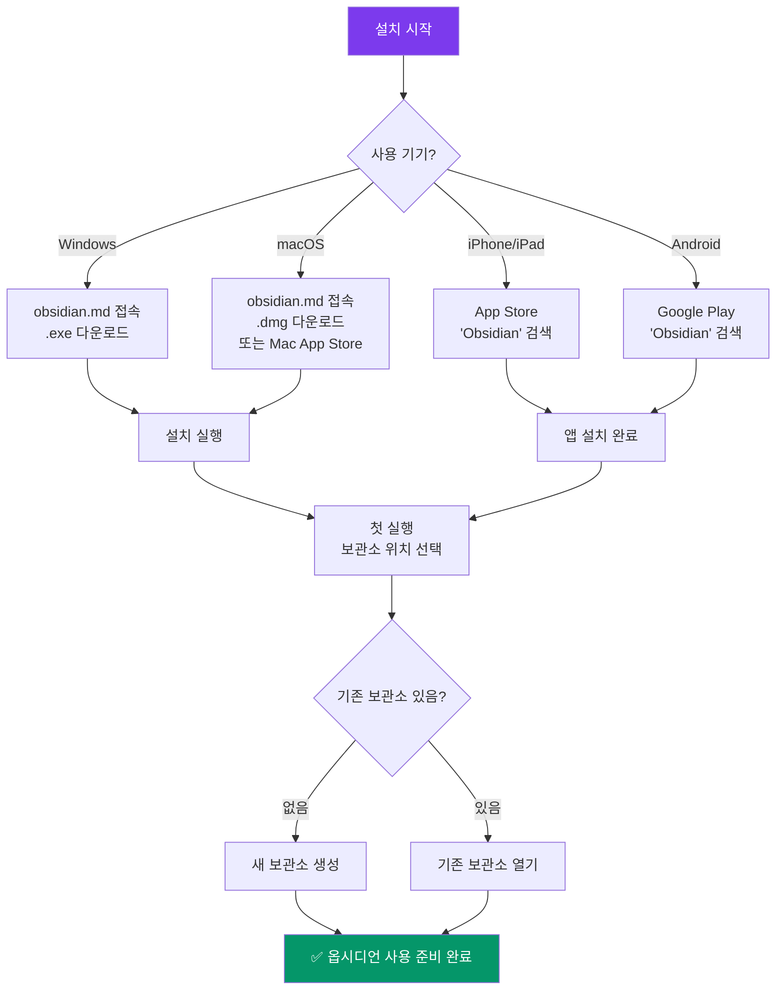

---
created:
  '{ date }': null
publish: true
status: 진행중
title: Ch02 Installation
type: techbook
---

# Chapter 02. 설치와 첫 실행
> PC(Windows·Mac) · iOS · Android 완전 가이드

---

## 0) 연결 고리 (Bridge)

Chapter 01에서 옵시디언이 **로컬 파일 기반의 지식 관리 도구**임을 이해했습니다.  
이제 실제로 컴퓨터와 스마트폰에 설치하고, 첫 화면을 마주할 차례입니다.  
이 챕터를 마치면 옵시디언이 실행되는 상태가 되며, Chapter 03에서 인터페이스를 본격적으로 탐색합니다.

---

## 1) 개념 정의 및 필요성

### 설치 전 알아야 할 것

옵시디언 설치 자체는 5분 이내로 완료됩니다. 그러나 **"어디에 보관소를 만들 것인가"** 를 먼저 결정하는 것이 중요합니다. 보관소 위치는 나중에 바꿀 수 있지만, 처음부터 좋은 위치를 선택하면 동기화와 백업 설정이 훨씬 수월해집니다.

**보관소 위치 선택 원칙:**
- 클라우드 드라이브(iCloud Drive, Google Drive, Dropbox) 폴더 안에 생성하면 자동 백업이 됩니다
- OneDrive 내부는 간헐적 충돌 문제가 보고되어 권장하지 않습니다
- 향후 Git 동기화를 사용할 계획이라면 일반 로컬 폴더에 생성하는 것이 더 적합합니다

> ⚠️ **WARNING:** iCloud Drive를 사용하는 Mac 사용자는 `~/Desktop`이나 `~/Documents` 폴더가 iCloud에 자동 동기화되도록 설정된 경우가 많습니다. 이 위치에 보관소를 만들면 용량과 동기화 충돌을 유발할 수 있으니 `~/obsidian-vault` 같은 별도 위치를 권장합니다.

---

## 2) 핵심 원리 및 구조

### 플랫폼별 설치 흐름



---

## 3) 실습 예제 및 실행 환경

### 실습 3-1. Windows에 설치하기

**환경:** Windows 10 / 11 (64비트)  
**기준 버전:** 옵시디언 v1.7 이상

**단계별 설치:**

```
1. 웹 브라우저에서 https://obsidian.md 접속
2. 상단 [Download] 버튼 클릭
3. "Windows" 항목에서 [Download] 클릭 → Obsidian-x.x.x.exe 파일 다운로드
4. 다운로드된 .exe 파일 실행
5. 설치 마법사에서 [Install] 클릭 (기본 설치 경로 권장)
6. 설치 완료 후 [Run Obsidian] 체크 상태에서 [Finish] 클릭
```

> 💡 **TIP:** Windows에서 "Windows Defender SmartScreen" 경고가 뜨면 [추가 정보] → [실행] 을 클릭하세요. 옵시디언은 공식 서명된 소프트웨어입니다.

**설치 확인:**
- 작업 표시줄에 옵시디언 아이콘(💎) 이 나타나면 설치 성공
- 첫 실행 시 "보관소를 열거나 만드세요" 화면이 표시됩니다

---

### 실습 3-2. macOS에 설치하기

**환경:** macOS 12 Monterey 이상 (Intel·Apple Silicon 모두 지원)

**방법 A — 공식 사이트 (권장):**

```
1. https://obsidian.md 접속
2. [Download] → "macOS" → [Download] 클릭
3. Obsidian-x.x.x-universal.dmg 다운로드
4. .dmg 파일 실행 → Obsidian 아이콘을 Applications 폴더로 드래그
5. Launchpad 또는 Spotlight(Cmd+Space)에서 "Obsidian" 검색 후 실행
```

**방법 B — Mac App Store:**

```
1. App Store 실행 → 검색창에 "Obsidian" 입력
2. [받기] 클릭 → Apple ID 인증
3. 설치 완료 후 Launchpad에서 실행
```

> 📌 **NOTE:** 방법 A(공식 사이트)가 최신 버전을 더 빠르게 받을 수 있습니다. Mac App Store 버전은 Apple 심사로 인해 배포가 며칠 늦어질 수 있습니다.

> ⚠️ **WARNING:** 처음 실행 시 "개발자를 확인할 수 없음" 메시지가 표시될 수 있습니다. 이 경우 `시스템 환경설정 → 보안 및 개인 정보 보호 → 일반` 탭에서 [그래도 열기]를 클릭하세요.

---

### 실습 3-3. iPhone / iPad에 설치하기

**환경:** iOS 16 이상

```
1. App Store 실행
2. 검색창에 "Obsidian" 입력
3. Obsidian - Connected Notes 앱 확인 (개발사: Obsidian)
4. [받기] 탭 → Face ID / Touch ID 인증
5. 설치 완료
```

**첫 실행 시 보관소 설정 (iPhone):**

```
옵션 A: 기기에 보관소 생성 (로컬)
  → [새 보관소 만들기] → 이름 입력 → [만들기]
  → iPhone 로컬에 저장됨 (iCloud 동기화 별도 설정 필요)

옵션 B: iCloud Drive에 보관소 연결
  → [iCloud Drive에서 열기] → 기존 보관소 폴더 선택
  → PC의 보관소와 자동 동기화 (iCloud 유료 플랜 필요할 수 있음)
```

> 💡 **TIP:** iPhone에서 처음 시작하는 경우 옵션 A로 간단히 시작하고, 동기화는 Chapter 17에서 본격적으로 설정합니다.

---

### 실습 3-4. Android에 설치하기

**환경:** Android 8.0 이상

```
1. Google Play 스토어 실행
2. 검색창에 "Obsidian" 입력
3. Obsidian - Connected Notes 앱 선택 (개발사: Obsidian)
4. [설치] 탭
5. 설치 완료 후 [열기]
```

**첫 실행 시 보관소 설정 (Android):**

```
옵션 A: 기기에 보관소 생성
  → [새 보관소 만들기] → 이름 입력 → 저장 위치 선택 → [만들기]

옵션 B: 기존 폴더 열기 (Google Drive 동기화 파일 등)
  → [폴더에서 보관소 열기] → 폴더 탐색 후 선택
```

> ⚠️ **WARNING:** Android에서는 내부 저장소(`/storage/emulated/0/`)에 보관소를 생성하는 것을 권장합니다. SD 카드 경로는 일부 기기에서 파일 접근 권한 문제가 발생할 수 있습니다.

---

### 실습 3-5. 첫 보관소 만들기 (공통)

PC와 모바일 모두 설치 후 동일한 과정을 거칩니다.

```
첫 실행 화면에서:

[새 보관소 만들기] 선택
  → 보관소 이름 입력 (예: my-vault, 한글도 가능)
  → 보관소 위치 선택
      Windows: C:\Users\사용자명\Documents\my-vault (권장)
      macOS:   ~/Documents/my-vault (권장)
      iPhone:  On My iPhone/Obsidian/
      Android: /storage/emulated/0/my-vault/
  → [만들기] 클릭
```

**성공 화면 확인:**
- 좌측에 파일 탐색기 패널이 나타남
- 중앙에 빈 편집 영역이 표시됨
- 상단에 보관소 이름이 보임

이 화면이 보이면 설치와 첫 실행에 성공한 것입니다. 상세한 인터페이스 설명은 Chapter 03에서 다룹니다.

---

## 4) 실무 시나리오 (Best Practice)

### 보관소 위치 설계 — 상황별 권장 전략

**시나리오 A: PC 한 대만 사용 (동기화 불필요)**
```
위치: ~/Documents/obsidian-vault/
이유: 단순하고 안정적. 백업은 Time Machine 또는 외장 드라이브.
```

**시나리오 B: Mac + iPhone 동기화 (iCloud 사용)**
```
위치: ~/Library/Mobile Documents/iCloud~md~obsidian/Documents/my-vault/
또는 간단히: iCloud Drive > Obsidian 폴더 (옵시디언이 자동 생성)
이유: iCloud 자동 동기화로 별도 설정 없이 Mac↔iPhone 동기화.
주의: iCloud 요금제에 따라 저장 공간 제한 있음.
```

**시나리오 C: Windows + Android 동기화 (Google Drive 사용)**
```
위치: Google Drive 동기화 폴더 내 (예: G:\My Drive\obsidian-vault\)
이유: Google Drive 데스크탑 앱 설치 시 자동 동기화.
Android에서는 별도 Dropsync 등 앱 필요 (Chapter 17 참고).
```

**시나리오 D: 개발자·Git 사용자**
```
위치: ~/projects/obsidian-vault/ (일반 로컬 폴더)
이유: Git 리포지토리로 관리. iCloud·Google Drive와 충돌 없음.
동기화: GitHub Private 리포지토리 활용 (Chapter 17 참고).
```

### 안티 패턴

- **OneDrive 기본 문서 폴더에 보관소 생성:** OneDrive의 실시간 동기화가 옵시디언의 잦은 파일 저장과 충돌을 일으킬 수 있습니다
- **보관소를 바탕화면(Desktop)에 생성:** 기기 초기화 시 데이터 손실 위험이 높습니다
- **여러 동기화 서비스 중복 사용:** iCloud + Dropbox가 같은 폴더를 동기화하면 파일 충돌이 발생합니다

---

## 5) 트러블슈팅 & 주의사항

### Q1. Windows 설치 후 실행이 안 됩니다

가장 흔한 원인은 관리자 권한 문제입니다. `.exe` 파일 우클릭 → [관리자 권한으로 실행]을 시도해보세요. 또는 `C:\Program Files` 대신 사용자 폴더(`C:\Users\사용자명\AppData\Local\Programs`)에 설치하면 권한 문제가 해결되는 경우가 많습니다.

### Q2. macOS에서 "손상된 앱" 메시지가 나옵니다

터미널에서 아래 명령어를 실행한 뒤 다시 실행하세요.

```bash
# macOS Gatekeeper 격리 해제 (공식 앱에 한해 안전)
xattr -cr /Applications/Obsidian.app
```

### Q3. iPhone에서 iCloud 보관소가 안 보입니다

`설정 → [내 이름] → iCloud → iCloud Drive` 가 켜져 있는지 확인하세요. 또한 옵시디언 앱의 iCloud 접근 권한이 허용되어 있어야 합니다(`설정 → Obsidian → iCloud Drive: 켬`).

### Q4. Android에서 파일 접근 권한 오류가 납니다

Android 11 이상에서는 외부 저장소 접근에 별도 권한이 필요합니다. `설정 → 앱 → Obsidian → 권한 → 파일 및 미디어 → 모든 파일 접근 허용`으로 설정하세요.

### Q5. 보관소 위치를 나중에 바꿀 수 있나요?

가능합니다. 폴더 자체를 원하는 위치로 이동한 뒤, 옵시디언에서 [보관소 열기] → 새 위치를 선택하면 됩니다. 단, 플러그인 설정과 테마는 `.obsidian` 숨김 폴더에 저장되므로 폴더 전체를 이동해야 설정이 유지됩니다.

> ⚠️ **WARNING:** `.obsidian` 폴더는 보관소 루트 폴더 안에 자동 생성되는 숨김 폴더로, 플러그인·테마·단축키 설정이 저장됩니다. 이 폴더를 삭제하면 모든 설정이 초기화됩니다.

### 버전 호환성

> **옵시디언 v1.7 이상** 기준입니다. 구형 버전(v0.x)은 UI 구조가 다를 수 있습니다. `설정(⚙️) → 정보 → 버전 확인`에서 현재 버전을 확인하세요.

---

## 6) 한 줄 요약

> 💡 **Key Takeaway:**  
> 옵시디언 설치는 5분이면 충분하다. 설치보다 중요한 것은 **보관소 위치를 동기화·백업 전략에 맞게 처음부터 올바르게 선택하는 것**이다.

---

## 🔖 이 챕터의 체크리스트

- [ ] 내 운영체제에 옵시디언을 성공적으로 설치했다
- [ ] 첫 보관소를 생성하고 옵시디언 초기 화면을 확인했다
- [ ] 보관소 위치를 의도적으로 선택했다 (이유를 말할 수 있다)
- [ ] 스마트폰에도 설치했다 (선택)

---

*이전 챕터: [Chapter 01 — 옵시디언이란?](ch01-what-is-obsidian.md)*  
*다음 챕터: [Chapter 03 — 인터페이스 완전 해부](ch03-interface.md)*