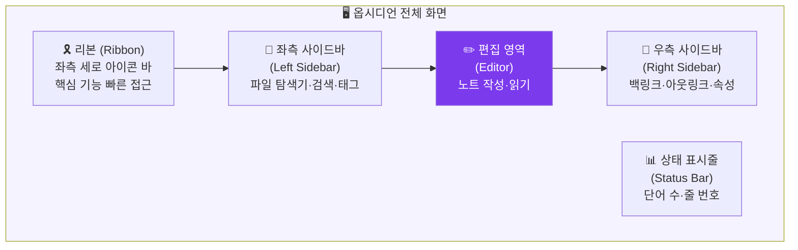

---
created:
  '{ date }': null
publish: true
status: 진행중
title: Ch03 Interface
type: techbook
---

# Chapter 03. 인터페이스 완전 해부
> 사이드바 · 리본 · 편집 영역 · 명령 팔레트

---

## 0) 연결 고리 (Bridge)

Chapter 02에서 옵시디언을 설치하고 첫 보관소를 만들었습니다.  
이제 화면에 보이는 것들이 무엇인지 이름을 붙이고 역할을 이해할 차례입니다.  
인터페이스의 각 영역을 알아야 이후 모든 챕터의 실습을 원활하게 따라갈 수 있습니다.

---

## 1) 개념 정의 및 필요성

### 왜 인터페이스를 먼저 배워야 하는가

옵시디언의 화면은 처음에 낯설어 보일 수 있습니다. 버튼과 패널이 많고, "이걸 눌러보면 어떻게 될까"를 탐색하다 보면 원하지 않는 설정이 바뀌거나 패널이 사라지는 당황스러운 상황이 생기기도 합니다.

이 챕터에서 **각 영역의 이름과 역할**을 먼저 학습하면, 이후 챕터에서 "좌측 리본의 📊 버튼을 클릭하세요"처럼 설명할 때 즉시 따라올 수 있습니다.

---

## 2) 핵심 원리 및 구조

### 옵시디언 전체 화면 구성도



### 각 영역 상세 설명

**① 리본 (Ribbon) — 좌측 세로 아이콘 바**

화면 가장 왼쪽의 얇은 세로 바로, 자주 사용하는 기능의 아이콘이 배치됩니다.

| 아이콘 | 기능 | 단축키 |
|---|---|---|
| 📄 (새 노트) | 현재 폴더에 새 노트 생성 | `Ctrl/Cmd + N` |
| 📂 (파일 탐색기) | 좌측 사이드바 파일 트리 토글 | — |
| 🔍 (검색) | 전체 텍스트 검색 패널 | `Ctrl/Cmd + Shift + F` |
| 🕸️ (그래프 뷰) | 전체 노트 연결 그래프 | `Ctrl/Cmd + G` |
| ⚙️ (설정) | 옵시디언 설정 창 열기 | `Ctrl/Cmd + ,` |

> 💡 **TIP:** 리본 아이콘은 우클릭하면 "리본에서 숨기기"가 가능합니다. 플러그인을 많이 설치하면 리본이 복잡해지는데, 이 방법으로 정리하세요.

**② 좌측 사이드바 (Left Sidebar) — 파일 탐색기**

기본적으로 세 가지 패널이 탭으로 표시됩니다.

- **파일 (Files):** 보관소의 폴더와 노트 파일 트리. 파일 우클릭으로 이름 변경·이동·삭제 가능
- **검색 (Search):** 전체 텍스트 검색. `Ctrl+Shift+F`로 빠르게 열기 가능
- **북마크 (Bookmarks):** 자주 쓰는 노트·검색·그래프를 즐겨찾기로 저장

**③ 편집 영역 (Editor) — 화면 중앙**

노트를 작성하고 읽는 핵심 공간입니다. 상단에 탭 바가 있어 여러 노트를 탭으로 열 수 있습니다.

- **편집 모드(Editing View):** 마크다운 문법을 직접 입력하는 모드
- **읽기 모드(Reading View):** 마크다운이 렌더링된 최종 결과물을 보는 모드
- **라이브 미리보기(Live Preview):** 편집하면서 동시에 렌더링 결과를 확인 (기본값, 권장)

모드 전환: 우측 상단 📖 아이콘 클릭 또는 `Ctrl/Cmd + E`

**④ 우측 사이드바 (Right Sidebar)**

기본적으로 숨겨져 있으며, 다음 패널을 포함합니다.

- **백링크 (Backlinks):** 현재 노트를 참조하는 다른 노트 목록
- **아웃링크 (Outgoing Links):** 현재 노트에서 연결하는 다른 노트 목록
- **속성 (Properties):** 현재 노트의 YAML 메타데이터 편집 패널
- **아웃라인 (Outline):** 현재 노트의 제목(#) 구조 목차

> 📌 **NOTE:** 좌측·우측 사이드바는 각각의 경계선을 드래그하여 너비를 조절할 수 있습니다. 패널이 사라진 것처럼 보이면 대부분 너비가 0으로 줄어든 경우이므로 경계선을 드래그해 늘려보세요.

**⑤ 상태 표시줄 (Status Bar) — 하단**

현재 노트의 단어 수, 글자 수, 커서 위치(줄 번호·열 번호)가 표시됩니다. 우클릭으로 표시 항목을 커스터마이즈할 수 있습니다.

---

### 명령 팔레트 (Command Palette) — 옵시디언의 핵심

> **명령 팔레트는 옵시디언의 모든 기능에 텍스트 검색으로 접근하는 통합 실행창입니다.**

단축키: `Ctrl + P` (Windows) / `Cmd + P` (Mac)

명령 팔레트를 열면 검색창이 나타납니다. 원하는 기능의 이름 일부를 타이핑하면 관련 명령어 목록이 나타납니다.

```
예시:
  "graph" 입력 → [그래프 뷰 열기], [로컬 그래프 열기] 등 표시
  "theme" 입력 → [테마 변경] 표시
  "plugin" 입력 → [커뮤니티 플러그인 브라우즈] 표시
```

> 💡 **TIP:** 옵시디언에서 어떤 기능을 찾을 때 가장 먼저 시도해야 할 것이 명령 팔레트(`Ctrl/Cmd+P`)입니다. 메뉴를 뒤지는 것보다 훨씬 빠릅니다.

---

## 3) 실습 예제

### 실습 3-1. 인터페이스 각 영역 탐색

아래 순서대로 직접 클릭하며 각 영역을 확인하세요.

```
① 리본에서 📄 (새 노트) 아이콘 클릭
   → 새 노트 "제목 없음"이 편집 영역에 열림
   → 제목 입력: "인터페이스 탐색 메모"

② 리본에서 📂 (파일 탐색기) 클릭
   → 좌측 사이드바 토글 (숨기기/보이기)
   → 다시 클릭해서 원래대로

③ 단축키 Ctrl/Cmd + P 입력
   → 명령 팔레트 열림
   → "graph" 타이핑 → [그래프 뷰 열기] 선택
   → 그래프 뷰가 새 탭으로 열림

④ 단축키 Ctrl/Cmd + E
   → 편집 모드 ↔ 읽기 모드 전환 확인

⑤ 우측 상단 영역을 살펴보기
   → 탭 옆 [...] 버튼 클릭 → 메뉴 확인
```

### 실습 3-2. 사이드바 패널 조작

```
① 좌측 사이드바 상단 탭에서 [파일], [검색], [북마크] 탭 클릭해보기

② 좌측 사이드바 경계선(파일탐색기와 편집영역 사이) 드래그
   → 너비 조절 확인

③ Ctrl/Cmd + P → "backlink" 검색 → [백링크 패널 열기] 실행
   → 우측 사이드바에 백링크 패널이 나타남 확인
```

### 실습 3-3. 탭 조작

```
① Ctrl/Cmd + N 으로 새 노트 3개 생성
   → 상단 탭 바에 탭이 3개 나타남 확인

② 탭 클릭으로 전환
   → Ctrl/Cmd + W 로 현재 탭 닫기
   → Ctrl + Tab / Ctrl + Shift + Tab 으로 탭 간 이동

③ 탭을 드래그하여 좌우 분할 화면 만들기
   → 탭을 편집 영역 오른쪽 끝으로 드래그
   → 화면이 좌/우로 분할됨 확인
```

---

## 4) 실무 시나리오 (Best Practice)

### 작업 목적에 따른 화면 레이아웃 설계

**글쓰기 모드 (집중 집필):**
- 좌측·우측 사이드바 모두 닫기 (`Ctrl/Cmd + \` 로 사이드바 토글)
- 편집 영역만 최대화
- `Ctrl/Cmd + Shift + F11` — 전체 화면(포커스 모드)

**연구·분석 모드:**
- 좌측: 파일 탐색기 열기
- 우측: 백링크 + 아웃링크 패널 열기
- 편집 영역 분할: 참고 노트(왼쪽) + 작성 노트(오른쪽)

**복습·탐색 모드:**
- 우측: 아웃라인 패널 열기 (긴 노트 목차 탐색)
- 그래프 뷰를 별도 탭으로 열어두기

### 안티 패턴

- **패널이 사라졌을 때 옵시디언 재설치 시도:** 99%는 패널 너비가 0으로 줄어든 것입니다. 경계선 드래그로 해결됩니다
- **리본 아이콘을 전부 표시:** 플러그인이 많아지면 리본이 복잡해집니다. 자주 쓰는 것만 남기고 나머지는 숨기세요
- **편집·읽기 모드를 번갈아 가며 확인:** 라이브 미리보기(기본값) 모드에서는 별도 전환 없이도 렌더링된 결과를 볼 수 있습니다

---

## 5) 트러블슈팅 & 주의사항

### Q1. 파일 탐색기 패널이 사라졌어요

`Ctrl/Cmd + P` → "파일 탐색기" 검색 → [파일: 파일 탐색기 표시] 실행. 또는 리본의 📂 아이콘 클릭.

### Q2. 탭을 너무 많이 열어서 화면이 복잡해요

`Ctrl/Cmd + P` → "close all" 검색 → [탭: 모든 탭 닫기] 실행. 또는 탭을 하나씩 `Ctrl+W`로 닫으세요.

### Q3. 분할 화면을 원래대로 되돌리고 싶어요

분할된 편집 영역의 패널 경계선을 드래그해 닫거나, `Ctrl/Cmd + P` → "maximize pane" → [현재 패널 최대화] 실행.

### Q4. 라이브 미리보기와 소스 모드(Source Mode)의 차이는?

- **라이브 미리보기:** 마크다운 문법 입력 시 즉시 렌더링. 글 쓰면서 결과를 동시에 확인 (권장)
- **소스 모드:** 마크다운 원본 텍스트 그대로 표시. 정확한 문법 확인 시 유용
- **읽기 모드:** 편집 불가, 최종 렌더링 결과만 표시

설정: `설정 → 편집기 → 기본 편집 모드`에서 변경 가능

### 모바일 인터페이스 차이

모바일(iOS/Android)에서는 하단 탭 바가 리본 역할을 합니다. 좌측 사이드바는 왼쪽에서 오른쪽으로 스와이프, 우측 사이드바는 오른쪽에서 왼쪽으로 스와이프하여 열 수 있습니다.

---

## 6) 한 줄 요약

> 💡 **Key Takeaway:**  
> 옵시디언 인터페이스는 리본·좌측 사이드바·편집 영역·우측 사이드바·상태 표시줄로 구성된다.  
> **모르는 기능은 항상 먼저 명령 팔레트(`Ctrl/Cmd+P`)에서 검색하는 습관을 만들어라.**

---

## 🔖 이 챕터의 체크리스트

- [ ] 리본·좌측 사이드바·편집 영역·우측 사이드바의 이름과 역할을 설명할 수 있다
- [ ] 명령 팔레트(`Ctrl/Cmd+P`)를 열고 기능을 검색해봤다
- [ ] 편집 모드와 읽기 모드를 전환해봤다
- [ ] 탭을 2개 이상 열고 전환해봤다
- [ ] 화면 분할을 시도해봤다

---

*이전 챕터: [Chapter 02 — 설치와 첫 실행](ch02-installation.md)*  
*다음 챕터: [Chapter 04 — 첫 보관소 만들기](ch04-vault.md)*