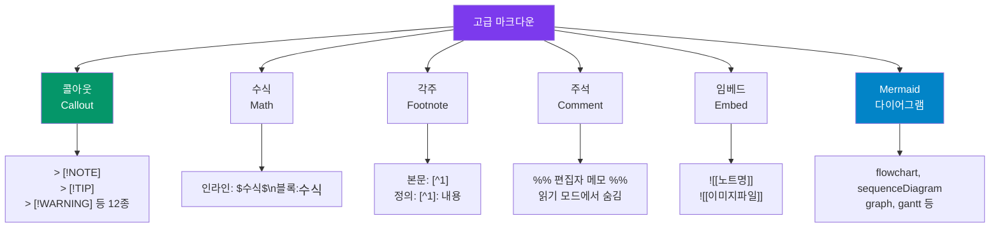
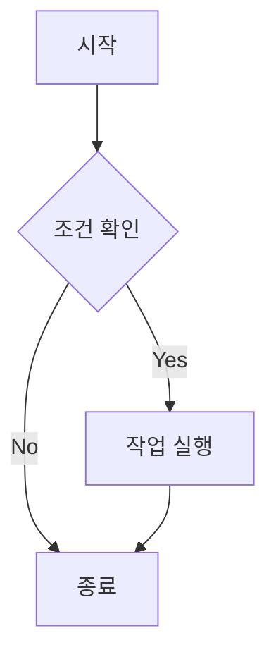
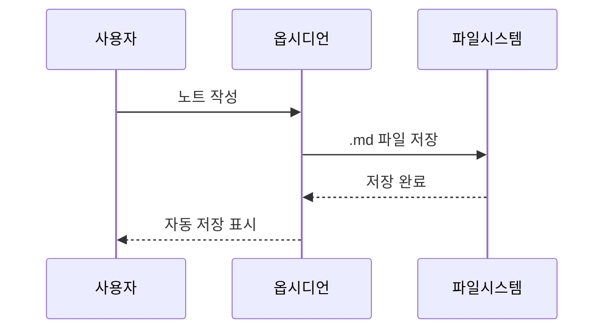
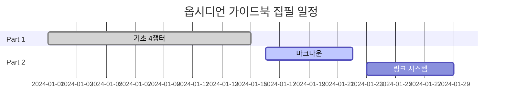

---
created:
  '{ date }': null
modified: 2026-01-01
publish: true
status: 진행중
tags: []
title: ch06-markdown-advanced
type: techbook
---

# Chapter 06. 고급 마크다운
> 콜아웃 · 수식 · 각주 · 주석 · 임베드 · 다이어그램

---

## 0) 연결 고리 (Bridge)

Chapter 05에서 제목·강조·리스트·표 같은 기본 마크다운을 익혔습니다.  
이 챕터에서는 **옵시디언이 확장하거나 독자적으로 지원하는 고급 문법**을 다룹니다.  
특히 **콜아웃(Callout)** 은 노트의 가독성을 극적으로 높여주는 핵심 문법으로, 이 책 전체에서도 광범위하게 활용됩니다.

---

## 1) 개념 정의 및 필요성

### 기본 마크다운의 한계

기본 마크다운만으로는 독자의 주의를 끌거나 부가 정보를 시각적으로 구분하기 어렵습니다. 예를 들어 "이 부분은 주의사항입니다"를 텍스트로만 전달하는 것과, 빨간 경고 박스 안에 표시하는 것은 독자 경험에서 큰 차이가 납니다.

고급 마크다운 문법은 이런 한계를 해결합니다.

| 필요 상황 | 기본 마크다운 | 고급 문법 |
|---|---|---|
| 주의사항 강조 | `> 주의:` (일반 인용문) | `> [!WARNING]` 콜아웃 |
| 수학 공식 표현 | 불가능 | `$...$` LaTeX 수식 |
| 본문 외 보충 설명 | 괄호로 처리 | `[^1]` 각주 |
| 편집 중 메모 | 표시 방법 없음 | `%% ... %%` 주석 |
| 다른 노트 미리보기 | 링크만 가능 | `![[노트명]]` 임베드 |

---

## 2) 핵심 원리 및 구조

### 고급 문법 체계



---

## 3) 실습 예제 및 실행 환경

> **환경:** 옵시디언 v1.7 이상  
> **실습 파일:** `10-notes/고급마크다운 연습.md` 생성 후 진행

---

### 3.1 콜아웃 (Callout) — 핵심 기능

콜아웃은 인용문 문법(`>`)을 확장한 **시각적 강조 박스**입니다.

**기본 형태:**
```markdown
> [!NOTE]
> 이것은 일반 참고 정보 박스입니다.

> [!TIP]
> 이것은 팁 박스입니다.

> [!WARNING]
> 이것은 경고 박스입니다.
```

**제목 커스터마이즈:**
```markdown
> [!NOTE] 내가 원하는 제목
> 제목을 자유롭게 바꿀 수 있습니다.

> [!TIP] 30초 설정 팁
> 설정 → 편집기 → 라이브 미리보기 활성화
```

**접기/펼치기 기능:**
```markdown
> [!NOTE]- 클릭하면 닫힌 상태로 시작 (- 붙임)
> 이 내용은 클릭해야 보입니다.

> [!NOTE]+ 클릭하면 열린 상태로 시작 (+ 붙임)  
> 이 내용은 기본으로 펼쳐져 있습니다.
```

**12가지 콜아웃 유형:**

| 유형 | 코드 | 색상 | 용도 |
|---|---|---|---|
| 노트 | `[!NOTE]` | 파란색 | 보충 설명 |
| 정보 | `[!INFO]` | 파란색 | 배경 지식 |
| 팁 | `[!TIP]` | 초록색 | 실용적 조언 |
| 성공 | `[!SUCCESS]` | 초록색 | 완료·성공 |
| 질문 | `[!QUESTION]` | 노란색 | 생각해볼 거리 |
| 경고 | `[!WARNING]` | 주황색 | 주의사항 |
| 주의 | `[!CAUTION]` | 주황색 | 더 강한 경고 |
| 실패 | `[!FAILURE]` | 빨간색 | 오류·문제 |
| 위험 | `[!DANGER]` | 빨간색 | 치명적 오류 |
| 버그 | `[!BUG]` | 빨간색 | 코드 버그 |
| 예시 | `[!EXAMPLE]` | 보라색 | 예시 제시 |
| 인용 | `[!QUOTE]` | 회색 | 외부 인용 |

> 💡 **TIP:** 콜아웃 안에 다른 마크다운 문법(리스트, 코드 블록 등)을 그대로 사용할 수 있습니다. `>` 를 각 줄 앞에 유지하기만 하면 됩니다.

```markdown
> [!TIP] 중첩 예시
> 콜아웃 안에도 리스트를 쓸 수 있습니다:
> - 항목 1
> - 항목 2
> 
> 그리고 `코드`도 가능합니다.
```

---

### 3.2 수식 (LaTeX Math)

> **환경:** `설정 → 편집기 → 수식 렌더링` 이 활성화되어 있어야 합니다 (기본값: 켜짐)

**인라인 수식 — 텍스트 중간에 수식 삽입:**
```markdown
원의 넓이는 $A = \pi r^2$ 으로 계산합니다.
피타고라스 정리: $a^2 + b^2 = c^2$
```

**블록 수식 — 독립된 줄에 큰 수식:**
```markdown
$$
E = mc^2
$$

$$
\sum_{i=1}^{n} x_i = x_1 + x_2 + \cdots + x_n
$$

$$
\frac{d}{dx}\left(\int_{0}^{x} f(t)\,dt\right) = f(x)
$$
```

**자주 쓰는 LaTeX 기호:**

| 수식 | LaTeX | 결과 예시 |
|---|---|---|
| 분수 | `\frac{a}{b}` | a/b |
| 제곱근 | `\sqrt{x}` | √x |
| 합계 | `\sum_{i=1}^{n}` | Σ |
| 적분 | `\int_{a}^{b}` | ∫ |
| 그리스 문자 | `\alpha, \beta, \pi` | α, β, π |
| 화살표 | `\rightarrow, \Leftrightarrow` | →, ⟺ |

> 📌 **NOTE:** LaTeX 수식은 연구자, 수학·과학 공부를 하는 독자에게 특히 유용합니다. 일반 노트에서는 사용 빈도가 낮으므로, 필요할 때 참고자료로 돌아오세요.

---

### 3.3 각주 (Footnote)

각주는 본문 흐름을 끊지 않고 보충 설명을 추가할 때 사용합니다.

```markdown
옵시디언은 마크다운 기반 노트 앱입니다.[^1]
제텔카스텐은 독일어로 "메모 상자"를 의미합니다.[^2]

[^1]: 2020년 Shida Li와 Erica Xu가 개발했습니다.
[^2]: 사회학자 니클라스 루만이 개발한 지식 관리 방법론입니다.
```

**인라인 각주 (정의를 바로 씀):**
```markdown
마크다운[^마크다운은 2004년 John Gruber가 만든 경량 마크업 언어입니다.]은 배우기 쉽습니다.
```

> 💡 **TIP:** 각주 번호(`[^1]`)는 읽기 모드에서 클릭 가능한 링크로 표시됩니다. 문서 하단의 각주 정의와 본문 간에 자동으로 이동됩니다.

---

### 3.4 주석 (Comment)

주석은 **읽기 모드와 퍼블리시에서 보이지 않는** 편집자 메모입니다.

```markdown
%%
이 부분은 편집 메모입니다.
독자에게는 보이지 않습니다.
나중에 수정해야 할 부분 메모, 작업 메모 등에 활용.
%%

일반 본문입니다. %% 인라인 주석도 가능합니다. %% 계속 이어집니다.
```

> 💡 **TIP:** 주석은 초안 작성 시 "여기에 사례 추가 필요", "이 부분 출처 확인" 같은 편집 메모를 남길 때 매우 유용합니다. 최종 퍼블리시 시에는 자동으로 숨겨집니다.

---

### 3.5 임베드 (Embed) — 노트 안에 노트 포함

```markdown
<!-- 다른 노트 전체를 현재 노트에 포함 -->
![[나의 첫 번째 노트]]

<!-- 특정 제목 섹션만 포함 -->
![[나의 첫 번째 노트#오늘 배운 것]]

<!-- 이미지 임베드 (크기 지정 포함) -->
![[스크린샷.png|500]]

<!-- PDF 첫 페이지 임베드 -->
![[문서.pdf]]
```

> ⚠️ **WARNING:** 임베드는 **순환 참조**(A 노트가 B를 임베드하고, B 노트가 다시 A를 임베드)를 피해야 합니다. 무한 렌더링 오류가 발생합니다.

---

### 3.6 Mermaid 다이어그램

옵시디언은 코드 블록에 `mermaid` 언어를 지정하면 다이어그램을 렌더링합니다.

**플로우차트 (flowchart):**
````markdown

````

**시퀀스 다이어그램 (sequenceDiagram):**
````markdown

````

**간트 차트 (gantt):**
````markdown

````

> 💡 **TIP:** Mermaid 문법은 [mermaid.live](https://mermaid.live) 에서 실시간으로 미리보기를 확인하며 작성할 수 있습니다.

---

## 4) 실무 시나리오 (Best Practice)

### 콜아웃 활용 패턴 — 노트 유형별

**기술 문서·가이드:**
```markdown
> [!TIP] 빠른 방법
> `Ctrl+P` → 기능 이름 검색이 메뉴 탐색보다 3배 빠릅니다.

> [!WARNING] 데이터 주의
> 이 설정을 변경하면 기존 노트의 링크가 깨질 수 있습니다.
  백업 후 진행하세요.
```

**학습 노트·교재 요약:**
```markdown
> [!QUESTION] 생각해볼 것
> 지식 관리 시스템이 없을 때 어떤 문제가 발생했는가?

> [!EXAMPLE] 실제 예시
> 루만의 제텔카스텐: 30년간 90,000개의 메모 카드로 
> 58권의 책과 수백 편의 논문을 작성했다.
```

**프로젝트 관리:**
```markdown
> [!SUCCESS] 완료된 마일스톤
> - 요구사항 분석 완료 (2024-01-10)
> - 프로토타입 제작 완료 (2024-01-20)

> [!FAILURE] 해결해야 할 문제
> API 응답 시간이 3초를 초과하는 경우가 있음.
> 원인 분석 필요.
```

### 안티 패턴

- **모든 정보를 콜아웃으로 감싸기:** 콜아웃이 너무 많으면 오히려 주의력이 분산됩니다. 정말 강조가 필요한 내용에만 사용하세요
- **수식 없이 LaTeX 설치:** 수식을 쓰지 않는다면 굳이 수식 렌더링을 켤 필요가 없습니다
- **임베드 과남용:** 너무 많은 임베드는 노트를 느리게 만들고 가독성을 해칩니다. 핵심 참조에만 사용하세요

---

## 5) 트러블슈팅 & 주의사항

### Q1. 콜아웃이 렌더링이 안 되고 일반 인용문으로 표시됩니다

`> [!NOTE]` 에서 `[!NOTE]` 뒤에 내용이 같은 줄에 오거나 줄바꿈 없이 이어지면 작동하지 않을 수 있습니다. 반드시 `> [!NOTE]` 다음 줄에 `> 내용` 형태로 작성하세요.

### Q2. 수식이 렌더링이 안 됩니다

`설정 → 편집기` 에서 `수식 렌더링` 이 켜져 있는지 확인하세요. 또한 `$` 와 수식 사이에 공백이 없어야 합니다: `$a+b$` (O), `$ a+b $` (X).

### Q3. Mermaid 다이어그램이 빈 박스로 표시됩니다

문법 오류가 있을 때 빈 박스로 표시됩니다. [mermaid.live](https://mermaid.live) 에서 동일한 코드를 붙여넣어 오류 위치를 확인하세요. 가장 흔한 원인은 들여쓰기 오류와 예약어 대소문자 불일치입니다.

### Q4. 각주가 노트 하단에 표시되지 않습니다

`[^1]: 내용` 형태의 각주 정의가 노트 어딘가에 있어야 합니다. 본문의 `[^1]` 참조와 정의의 `[^1]:` 번호가 일치하는지 확인하세요. 읽기 모드에서만 각주가 클릭 가능한 링크로 렌더링됩니다.

---

## 6) 한 줄 요약

> 💡 **Key Takeaway:**  
> 콜아웃(`> [!TYPE]`)은 옵시디언에서 가장 강력한 시각적 강조 도구다.  
> **NOTE·TIP·WARNING 세 가지만 먼저 익히고, 나머지는 필요할 때 참고 목록에서 골라 쓰면 충분하다.**

---

## 🔖 이 챕터의 체크리스트

- [ ] 콜아웃 3가지 유형(NOTE·TIP·WARNING)을 직접 만들었다
- [ ] 콜아웃 접기/펼치기(`-`/`+`)를 사용해봤다
- [ ] 각주를 본문에 추가하고 하단 정의를 작성했다
- [ ] 주석(`%% ... %%`)이 읽기 모드에서 숨겨지는 것을 확인했다
- [ ] Mermaid flowchart를 하나 작성했다

---

*이전 챕터: [Chapter 05 — 기본 마크다운 완전 정복](./ch05-markdown-basic.md)*  
*다음 챕터: [Chapter 07 — 옵시디언 전용 링크 시스템](./ch07-links.md)*