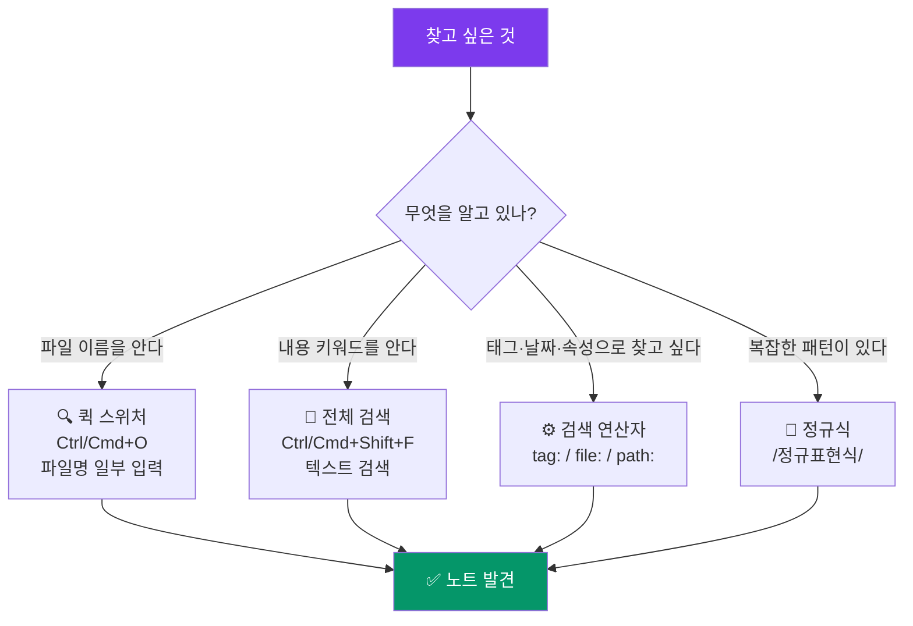

---
created:
  '{ date }': null
publish: true
status: 진행중
title: Ch09 Search
type: techbook
---

# Chapter 09. 검색 완전 정복
> 기본 검색 · 검색 연산자 · 정규식 · 검색 노하우

---

## 0) 연결 고리 (Bridge)

Part 2에서 노트를 작성하고 링크로 연결하는 방법을 익혔습니다.  
보관소가 커질수록 필요한 노트를 빠르게 찾는 능력이 중요해집니다.  
이 챕터에서는 옵시디언의 검색 기능을 완전히 마스터해, **수백 개의 노트 중에서도 원하는 정보를 5초 안에 찾는 방법**을 익힙니다.

---

## 1) 개념 정의 및 필요성

### 왜 검색을 제대로 배워야 하는가

노트가 50개일 때는 파일 탐색기를 눈으로 스캔해도 됩니다. 그러나 500개가 넘어가면 폴더 구조를 아무리 잘 만들어도 원하는 노트를 찾는 데 시간이 걸립니다. 검색 능력은 보관소 규모와 무관하게 **항상 원하는 정보를 즉시 꺼낼 수 있는 능력**입니다.

옵시디언의 검색은 크게 세 가지 층위로 나뉩니다.

| 검색 방식 | 열기 방법 | 용도 |
|---|---|---|
| 퀵 스위처(Quick Switcher) | `Ctrl/Cmd + O` | 파일 이름으로 빠르게 이동 |
| 전체 검색(Global Search) | `Ctrl/Cmd + Shift + F` | 노트 내용 전체 텍스트 검색 |
| 명령 팔레트(Command Palette) | `Ctrl/Cmd + P` | 기능·명령어 검색 |

---

## 2) 핵심 원리 및 구조

### 검색 레이어 구조



---

## 3) 실습 예제 및 실행 환경

> **환경:** 옵시디언 v1.7 이상  
> **준비:** Part 1~2 실습으로 만든 보관소에 노트가 5개 이상 있어야 합니다

---

### 3.1 퀵 스위처 — 파일 이름으로 즉시 이동

퀵 스위처는 파일 이름을 알 때 가장 빠른 이동 방법입니다.

```
단축키: Ctrl/Cmd + O

동작:
① 단축키 입력 → 검색창 팝업
② 파일명 일부 입력 (오타도 어느 정도 허용)
③ 화살표 키로 선택 → Enter로 열기
④ Ctrl+Enter → 현재 탭 유지하고 새 탭에서 열기
```

**퀵 스위처 팁:**
- `#태그명` 입력 → 해당 태그를 가진 노트 필터링
- `@별칭` 입력 → 별칭으로 노트 검색
- 파일이 없으면 새로 생성할 수 있는 옵션 제공

> 💡 **TIP:** 퀵 스위처는 **최근에 열었던 노트**가 우선 표시됩니다. 매일 열어보는 데일리 노트나 허브 노트는 이름의 첫 글자만 입력해도 즉시 찾을 수 있습니다.

---

### 3.2 전체 텍스트 검색 — 내용으로 찾기

```
단축키: Ctrl/Cmd + Shift + F
또는 좌측 사이드바 🔍 아이콘
```

**기본 검색:**
```
마크다운          → "마크다운" 이 포함된 모든 노트
옵시디언 설치    → "옵시디언"과 "설치" 두 단어가 모두 있는 노트
"옵시디언 완전"  → 정확히 이 문구가 있는 노트 (따옴표)
```

**검색 결과 조작:**
```
검색창 오른쪽 아이콘들:
[Aa] — 대소문자 구분 토글
[.*] — 정규식 검색 토글
[설명] — 검색 결과에 주변 문맥 표시 토글
[↕] — 검색 결과 정렬 순서 변경
```

---

### 3.3 검색 연산자 — 조건으로 정밀 검색

옵시디언의 검색 연산자는 구글 검색의 `site:`, `filetype:` 같은 역할을 합니다.

**파일·경로 연산자:**
```
file:회의록           → 파일명에 "회의록"이 포함된 노트
path:10-notes         → 10-notes 폴더 안의 노트
path:10-notes/회의록  → 특정 경로의 노트
```

**태그·속성 연산자:**
```
tag:#실습             → #실습 태그가 붙은 노트
tag:#status/진행중    → 계층 태그 검색
```

**날짜 연산자:**
```
ctime:2024-01         → 2024년 1월에 생성된 노트 (Created time)
mtime:2024-01-15      → 2024-01-15에 수정된 노트 (Modified time)
```

**내용 연산자:**
```
line:(마크다운 실습)  → 한 줄 안에 두 단어가 모두 있는 노트
block:(중요 개념)     → 같은 단락 안에 두 단어가 있는 노트
section:(## 핵심)     → 특정 섹션 안에 있는 내용
```

**논리 연산자:**
```
마크다운 AND 실습      → 두 단어 모두 포함
마크다운 OR 링크       → 둘 중 하나 포함
마크다운 -설치         → "마크다운"은 있고 "설치"는 없는 노트
```

**복합 연산자 예시:**
```
tag:#실습 path:part2 mtime:2024-01
→ part2 폴더에 있고, #실습 태그가 있고, 2024년 1월에 수정된 노트

file:회의록 -tag:#완료
→ 파일명에 "회의록"이 있고, #완료 태그가 없는 노트 (미완료 회의록)

tag:#status/진행중 section:(## 다음 할 것)
→ 진행 중 태그가 있고, "다음 할 것" 섹션이 있는 노트
```

> 💡 **TIP:** 자주 쓰는 복합 검색 조건은 **북마크로 저장**하세요.  
> 검색 후 좌측 사이드바 북마크 탭 → 검색 결과 우클릭 → [북마크에 추가]

---

### 3.4 정규식 검색 — 패턴으로 고급 검색

> **환경:** 검색창 오른쪽 `[.*]` 버튼 클릭으로 정규식 모드 활성화

정규식(Regular Expression)은 패턴으로 텍스트를 검색하는 방법입니다.

**기본 패턴 10가지:**

| 패턴 | 의미 | 예시 | 매칭 예 |
|---|---|---|---|
| `.` | 임의의 문자 1개 | `옵.디언` | 옵시디언, 옵스디언 |
| `*` | 앞 문자 0개 이상 | `마크다운*` | 마크다운, 마크다운문법 |
| `+` | 앞 문자 1개 이상 | `#.+` | #태그명, #실습 |
| `?` | 앞 문자 0~1개 | `링크?` | 링크, 링크들 |
| `^` | 줄의 시작 | `^# ` | # 로 시작하는 줄 (H1) |
| `$` | 줄의 끝 | `완료$` | 줄 끝이 "완료"인 경우 |
| `[]` | 문자 집합 | `[0-9]` | 숫자 하나 |
| `\d` | 숫자 | `\d{4}-\d{2}-\d{2}` | 2024-01-15 형태 날짜 |
| `\w` | 단어 문자 | `\w+` | 연속된 단어 |
| `()` | 그룹 | `(마크다운\|링크)` | 마크다운 또는 링크 |

**실전 정규식 예시:**

```
/\d{4}-\d{2}-\d{2}/
→ 날짜 형식(YYYY-MM-DD) 찾기. 날짜가 기록된 모든 노트 검색

/^#{1,3} .+/
→ H1~H3 제목으로 시작하는 줄 찾기. 제목 구조 점검에 유용

/\[\[.+\]\]/
→ 내부 링크([[...]]) 가 있는 모든 항목 찾기

/- \[.\] .+/
→ 체크박스([ ], [x]) 항목이 있는 노트 찾기

/https?:\/\/.+/
→ 외부 URL이 포함된 노트 찾기

/\*\*.+\*\*/
→ 굵게(**...**) 처리된 텍스트가 있는 노트

/^> \[!.+\]/
→ 콜아웃(> [!TYPE])이 있는 노트 찾기

/tags:.+진행중/
→ YAML에 "진행중" 태그가 있는 노트

/\^\w+/
→ 블록 ID(^block-id)가 있는 노트 찾기

/\d{1,2}\/\d{1,2}/
→ MM/DD 형식 날짜 찾기 (다른 날짜 형식 병행 사용 시)
```

> 📌 **NOTE:** 정규식은 처음에 낯설 수 있습니다. 위 10가지 예시를 복사해서 사용하다 보면 자연스럽게 패턴이 눈에 익습니다. 정규식을 연습하려면 [regex101.com](https://regex101.com) 에서 테스트할 수 있습니다.

---

### 3.5 검색 결과 활용

검색 결과는 단순히 보는 것 외에도 여러 방법으로 활용할 수 있습니다.

**검색 결과 북마크 저장:**
```
① 자주 쓰는 검색어 입력 (예: tag:#status/진행중)
② 검색 결과 패널 우측 상단 [북마크 아이콘] 클릭
③ 좌측 사이드바 북마크 탭에서 언제든 다시 실행
```

**검색 결과를 노트로 내보내기:**
```
① Ctrl/Cmd+P → "copy search results"
→ [검색: 검색 결과를 클립보드에 복사]
② 새 노트에 붙여넣기
③ 검색 결과를 문서화하거나 분석할 때 유용
```

---

## 4) 실무 시나리오 (Best Practice)

### 상황별 검색 전략

**"저번에 봤던 그 내용..." 을 찾을 때:**
```
① 퀵 스위처(Ctrl+O)로 기억나는 파일명 입력
② 안 찾아지면 전체 검색에서 기억나는 키워드 입력
③ mtime:최근날짜 연산자로 최근 수정 파일 필터
```

**특정 프로젝트 관련 노트 모두 찾기:**
```
tag:#project/프로젝트A
또는
path:20-projects file:프로젝트A
```

**미완료 할일 전체 보기:**
```
/- \[ \] /    ← 정규식으로 미완료 체크박스 검색
또는
tag:#status/진행중
```

**특정 날짜 이후 작성된 노트:**
```
ctime:2024-01  ← 2024년 1월 이후 생성된 노트
```

**링크 없는 고립된 노트 찾기:**
```
Ctrl/Cmd+P → "orphan" → [파일: 링크가 없는 파일 찾기]
→ 연결되지 않은 노트 목록 표시
→ 링크를 추가하거나 아카이브로 이동
```

### 안티 패턴

- **검색 대신 폴더 구조에만 의존:** 폴더가 깊어질수록 탐색 시간이 늘어납니다. 검색을 주 탐색 수단으로 삼고 폴더는 큰 범주만 유지하세요
- **정규식 없이 복잡한 패턴 검색:** "날짜 형식이 들어간 노트" 같은 패턴 검색은 정규식 없이는 불가능합니다. `/\d{4}-\d{2}-\d{2}/` 하나면 해결됩니다
- **검색 결과를 저장하지 않음:** 자주 쓰는 검색은 반드시 북마크로 저장하세요. 매번 같은 조건을 입력하는 것은 시간 낭비입니다

---

## 5) 트러블슈팅 & 주의사항

### Q1. 분명히 있는 내용인데 검색이 안 됩니다

옵시디언은 **인덱스를 주기적으로 갱신**합니다. 방금 작성한 노트는 검색 인덱스에 반영되기까지 수 초가 걸릴 수 있습니다. 잠시 기다렸다가 다시 검색해보세요. 또는 `Ctrl/Cmd+P` → "reload" → [파일: 보관소 다시 불러오기]를 실행하세요.

### Q2. 한글 검색이 제대로 안 됩니다

옵시디언의 한글 검색은 완성형 음절 단위로 작동합니다. `마크다운`을 검색할 때 `마크` 까지만 입력하면 찾아지지만, 조합 중인 자모(`ㅁㅏㅋ`)는 인식되지 않습니다. 검색어는 완성된 음절로 입력하세요.

### Q3. 정규식 검색이 작동하지 않습니다

검색창 오른쪽의 `[.*]` 버튼이 활성화(파란색) 상태인지 확인하세요. 비활성 상태에서는 정규식이 일반 텍스트로 처리됩니다.

### Q4. 태그 검색에서 결과가 너무 많게 나옵니다

`tag:#태그명` 은 해당 태그를 포함한 모든 노트를 반환합니다. 계층 태그를 사용하면 더 세밀하게 필터링할 수 있습니다: `tag:#status/진행중` vs `tag:#status`.

---

## 6) 한 줄 요약

> 💡 **Key Takeaway:**  
> 검색은 보관소의 크기와 무관하게 원하는 정보를 즉시 꺼낼 수 있는 핵심 능력이다.  
> **퀵 스위처(`Ctrl+O`)로 파일을, 전체 검색(`Ctrl+Shift+F`)으로 내용을 찾고, 자주 쓰는 검색 조건은 북마크로 저장하라.**

---

## 🔖 이 챕터의 체크리스트

- [ ] 퀵 스위처로 파일을 이름으로 찾아봤다
- [ ] 전체 검색에서 키워드로 내용을 검색했다
- [ ] `tag:`, `file:`, `path:` 연산자를 사용했다
- [ ] 복합 연산자(`AND`, `-`)로 정밀 검색을 해봤다
- [ ] 정규식 모드를 켜고 날짜 패턴(`\d{4}-\d{2}-\d{2}`)을 검색했다
- [ ] 자주 쓰는 검색을 북마크로 저장했다

---

*이전 챕터: [Chapter 08 — 이미지·파일 첨부 관리](./ch08-attachments.md)*  
*다음 챕터: [Chapter 10 — 그래프 뷰 & 로컬 그래프](./ch10-graph.md)*