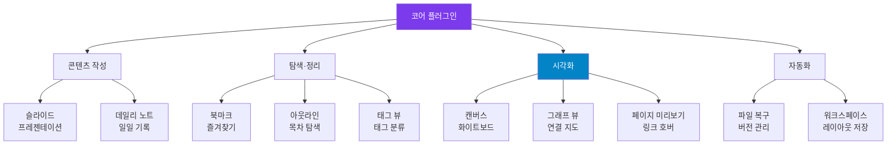

---
created:
  '{ date }': null
publish: true
status: 진행중
title: Ch11 Core Plugins
type: techbook
---

# Chapter 11. 코어 플러그인 심층 해부
> 슬라이드 · 북마크 · 아웃라인 · 캔버스 · 데일리 노트 · 워크스페이스

---

## 0) 연결 고리 (Bridge)

Chapter 10에서 그래프 뷰로 보관소 전체를 시각화했습니다.  
이 챕터에서는 옵시디언에 기본으로 내장된 **코어 플러그인(Core Plugins)** 을 해부합니다.  
코어 플러그인은 별도 설치 없이 설정에서 켜기만 하면 즉시 사용할 수 있는 강력한 도구들입니다.

---

## 1) 개념 정의 및 필요성

### 코어 플러그인(Core Plugin)이란?

> **코어 플러그인은 옵시디언 개발팀이 공식으로 제작·유지보수하는 내장 플러그인입니다.**

커뮤니티 플러그인(Chapter 12)과 달리 별도 설치가 필요 없고, 옵시디언 업데이트와 함께 자동으로 유지됩니다. 보안 검토가 완료되어 있고 안정성이 보장됩니다.

**코어 플러그인 활성화 방법:**
```
설정(⚙️) → 코어 플러그인
→ 목록에서 원하는 플러그인 토글 켜기
```

**전체 코어 플러그인 목록 (v1.7 기준 주요 20종):**

| 플러그인 | 기본 상태 | 핵심 기능 |
|---|---|---|
| 백링크 | 켜짐 | 현재 노트를 참조하는 노트 패널 |
| 북마크 | 켜짐 | 노트·폴더·검색 즐겨찾기 |
| 캔버스 | 켜짐 | 화이트보드 스타일 시각적 노트 |
| 커뮤니티 플러그인 | 켜짐 | 서드파티 플러그인 설치 허용 |
| 데일리 노트 | 꺼짐 | 오늘 날짜 노트 자동 생성 |
| 파일 복구 | 켜짐 | 노트 버전 히스토리 |
| 파일 탐색기 | 켜짐 | 좌측 사이드바 파일 트리 |
| 포맷 변환기 | 꺼짐 | 다른 앱 형식 마크다운 변환 |
| 그래프 뷰 | 켜짐 | 노트 연결 시각화 |
| 내보내기 | 켜짐 | PDF로 내보내기 |
| 노트 작성기 | 꺼짐 | 새 노트 자동 생성 위치 설정 |
| 아웃라인 | 켜짐 | 현재 노트 제목 목차 |
| 페이지 미리보기 | 켜짐 | 링크 호버 시 미리보기 |
| 속성 뷰 | 켜짐 | YAML 속성 편집 패널 |
| 퀵 스위처 | 켜짐 | Ctrl+O 빠른 파일 전환 |
| 랜덤 노트 | 꺼짐 | 무작위 노트 열기 |
| 슬라이드 | 꺼짐 | 프레젠테이션 모드 |
| 태그 뷰 | 켜짐 | 태그 목록 패널 |
| 단어 수 | 켜짐 | 하단 상태 표시줄 단어 수 |
| 워크스페이스 | 꺼짐 | 레이아웃 저장·복원 |

---

## 2) 핵심 원리 및 구조

### 코어 플러그인 활용 지도



---

## 3) 실습 예제 및 실행 환경

### 실습 11-1. 슬라이드 — 옵시디언으로 프레젠테이션 만들기

슬라이드 플러그인은 마크다운 노트를 프레젠테이션으로 변환합니다.  
`---` 수평선을 슬라이드 구분자로 사용합니다.

**활성화:**
```
설정 → 코어 플러그인 → 슬라이드 → 켜기
```

**슬라이드 노트 작성 예시:**
```markdown
# 옵시디언 소개

옵시디언은 로컬 마크다운 기반 지식 관리 도구입니다.

---

## 핵심 기능

- 📎 내부 링크로 노트 연결
- 🕸️ 그래프 뷰로 시각화
- 🔌 1,000개 이상의 플러그인

---

## 왜 옵시디언인가?

> 데이터는 내 컴퓨터에, 지식은 내 머릿속에.

| 비교 | 옵시디언 | 노션 |
|---|---|---|
| 저장 방식 | 로컬 파일 | 클라우드 |
| 오프라인 | ✅ | ❌ |

---

## 감사합니다

질문이 있으신가요?
```

**슬라이드 실행:**
```
① 프레젠테이션 노트 열기
② 명령 팔레트(Ctrl/Cmd+P) → "slide" → [슬라이드 시작]
③ 화살표 키로 슬라이드 전환
④ Esc 로 종료
```

> 💡 **TIP:** 슬라이드 발표 시 `F` 키로 전체화면 전환이 됩니다. 마우스를 움직이면 하단에 슬라이드 컨트롤이 나타납니다.

> 📌 **NOTE:** 옵시디언 슬라이드는 [reveal.js](https://revealjs.com) 기반으로 동작합니다. 기본 테마는 심플하지만 CSS 스니펫으로 스타일을 커스터마이즈할 수 있습니다. (Chapter 25 참고)

---

### 실습 11-2. 데일리 노트 — 하루 기록 자동화

데일리 노트는 오늘 날짜의 노트를 **단축키 하나로** 자동 생성합니다.

**활성화 및 설정:**
```
설정 → 코어 플러그인 → 데일리 노트 → 켜기
→ 설정 아이콘 클릭:
  - 날짜 형식: YYYY-MM-DD (권장)
  - 새 파일 위치: 00-inbox/ 또는 별도 daily/ 폴더
  - 템플릿 파일 위치: (선택) 미리 만든 템플릿 파일 경로
```

**데일리 노트 열기:**
```
단축키: 설정에서 직접 지정 (기본 없음)
또는 명령 팔레트 → "daily note" → [오늘의 노트 열기]
또는 리본의 📅 아이콘 (활성화 시 표시)
```

**데일리 노트 템플릿 예시 (`00-inbox/daily-template.md`):**
```markdown
---
tags:
  - 데일리노트
  - {{date:YYYY}}
date: {{date:YYYY-MM-DD}}
---

# {{date:YYYY년 MM월 DD일}} ({{date:ddd}})

## 오늘의 목표
- [ ] 
- [ ] 
- [ ] 

## 오늘 배운 것

## 내일 할 것
- [ ] 

## 감사한 것

---
*[[{{date:YYYY-MM-DD|yesterday}}|어제]] | [[{{date:YYYY-MM-DD|tomorrow}}|내일]]*
```

> 💡 **TIP:** 데일리 노트는 Templater 플러그인(Chapter 14)과 결합하면 더 강력해집니다. 요일별 다른 템플릿, 자동 날씨 삽입 등의 자동화가 가능합니다.

---

### 실습 11-3. 북마크 — 나만의 즐겨찾기 시스템

북마크는 노트뿐만 아니라 **검색 결과, 그래프 뷰, 특정 제목 섹션**도 저장할 수 있습니다.

**북마크 추가 방법:**
```
노트 북마크:
  → 파일 탐색기에서 노트 우클릭 → [북마크에 추가]
  → 또는 열린 탭 탭 우클릭 → [북마크에 추가]

특정 제목 섹션 북마크:
  → 아웃라인 패널에서 제목 우클릭 → [북마크에 추가]
  → [[노트명#섹션]] 형태로 저장

검색 결과 북마크:
  → 검색 실행 후 검색 패널 우측 상단 ☆ 아이콘 클릭

그래프 뷰 북마크:
  → 그래프 뷰에서 ☆ 아이콘 클릭
```

**북마크 그룹 만들기:**
```
① 좌측 사이드바 → 북마크 탭
② [그룹 만들기] 또는 [폴더 아이콘] 클릭
③ 그룹 이름 입력
④ 북마크를 그룹으로 드래그

권장 북마크 그룹:
  📌 허브 — 허브 노트, 목차 노트
  🔍 자주 쓰는 검색 — 태그 검색, 상태별 검색
  📅 데일리 — 오늘 노트, 주간 리뷰 템플릿
  📂 프로젝트 — 진행 중 프로젝트 노트
```

---

### 실습 11-4. 아웃라인 — 긴 노트의 목차 탐색

아웃라인 패널은 현재 노트의 제목(`#`, `##`, `###`) 구조를 목차로 보여줍니다.

```
열기: 명령 팔레트 → "outline" → [아웃라인 패널 열기]
또는 우측 사이드바 → 아웃라인 탭
```

**활용 방법:**
- 긴 노트에서 원하는 섹션으로 즉시 이동
- 제목 클릭 → 해당 섹션으로 자동 스크롤
- 노트 구조가 올바른지 한눈에 점검

> 💡 **TIP:** 아웃라인을 우측 사이드바에 고정하고 로컬 그래프와 함께 두면, 긴 노트를 작성할 때 목차 탐색과 연결 관계를 동시에 볼 수 있습니다.

---

### 실습 11-5. 워크스페이스 — 레이아웃 저장·복원

워크스페이스는 현재 열린 탭, 사이드바 상태, 패널 레이아웃을 통째로 저장합니다.

**활성화:**
```
설정 → 코어 플러그인 → 워크스페이스 → 켜기
```

**사용법:**
```
저장:
① 원하는 레이아웃을 구성
② 명령 팔레트 → "workspace" → [현재 레이아웃 저장]
③ 이름 입력 (예: "집필 모드", "리서치 모드")

복원:
① 명령 팔레트 → "workspace" → [레이아웃 불러오기]
② 저장된 이름 선택
```

**권장 워크스페이스 3가지:**
```
집필 모드:
  - 편집 영역 최대화
  - 아웃라인 우측 고정
  - 로컬 그래프 우측 고정

리서치 모드:
  - 편집 영역 분할 (2열)
  - 파일 탐색기 좌측
  - 백링크 우측

리뷰 모드:
  - 그래프 뷰 열기
  - 북마크 좌측
  - 태그 뷰 좌측
```

---

### 실습 11-6. 파일 복구 — 실수로 삭제한 내용 되살리기

파일 복구 플러그인은 2분마다 자동으로 모든 노트의 스냅샷을 저장합니다.

```
복구 방법:
① 명령 팔레트 → "file recovery" → [파일 복구 열기]
② 복구할 노트 이름 검색
③ 버전 목록에서 원하는 시점 선택
④ [복구] 클릭
```

**설정:**
```
설정 → 코어 플러그인 → 파일 복구 → 설정:
  - 스냅샷 간격: 2분 (기본)
  - 보관 기간: 7일 (기본, 최대 365일)
```

> ⚠️ **WARNING:** 파일 복구는 로컬 캐시에 저장됩니다. 옵시디언을 재설치하거나 `.obsidian` 폴더를 삭제하면 복구 히스토리도 사라집니다. 중요한 노트는 Git 백업도 병행하세요. (Chapter 17 참고)

---

## 4) 실무 시나리오 (Best Practice)

### 직군별 코어 플러그인 추천 조합

**글쓰기·작가:**
```
필수: 데일리 노트 + 아웃라인 + 슬라이드 + 워크스페이스
설정: 데일리 노트 → 글쓰기 일지 템플릿, 워크스페이스 → 집필 모드 저장
```

**연구자·학생:**
```
필수: 북마크 + 아웃라인 + 파일 복구 + 랜덤 노트
설정: 북마크 → 논문 출처별 그룹, 랜덤 노트 → 복습 루틴에 활용
```

**회사원·프로젝트 매니저:**
```
필수: 데일리 노트 + 북마크 + 워크스페이스
설정: 데일리 노트 → 업무 템플릿, 북마크 → 프로젝트별 그룹
```

---

## 5) 트러블슈팅 & 주의사항

### Q1. 데일리 노트 템플릿에 날짜가 `{{date}}` 그대로 표시됩니다

코어 플러그인 → 데일리 노트 설정에서 "템플릿 파일 위치"가 올바르게 지정됐는지 확인하세요. `{{date:YYYY-MM-DD}}` 문법은 데일리 노트 생성 시점에만 자동으로 치환됩니다. Templater 플러그인과는 다른 문법이므로 혼용하지 마세요.

### Q2. 슬라이드가 `---` 에서 나뉘지 않고 하나로 표시됩니다

`---` 앞뒤에 빈 줄이 있어야 합니다. `---` 가 바로 텍스트 다음 줄에 오면 YAML 구분자나 수평선으로 인식될 수 있습니다.

### Q3. 워크스페이스 이름이 기억나지 않습니다

명령 팔레트 → "workspace" 검색 시 저장된 모든 워크스페이스 이름이 자동 완성으로 표시됩니다.

---

## 6) 한 줄 요약

> 💡 **Key Takeaway:**  
> 코어 플러그인은 설치 없이 설정에서 켜기만 하면 되는 검증된 도구 모음이다.  
> **데일리 노트로 매일을 기록하고, 북마크로 자주 찾는 것을 고정하고, 워크스페이스로 작업 모드를 저장하는 세 가지가 생산성의 기초다.**

---

## 🔖 이 챕터의 체크리스트

- [ ] 슬라이드 플러그인을 켜고 3장짜리 프레젠테이션을 만들었다
- [ ] 데일리 노트를 켜고 템플릿을 지정했다
- [ ] 데일리 노트를 생성하고 오늘 할일을 작성했다
- [ ] 북마크를 3개 이상 추가하고 그룹을 만들었다
- [ ] 워크스페이스 2가지를 저장하고 전환해봤다
- [ ] 파일 복구에서 이전 버전을 확인해봤다

---

*이전 챕터: [Chapter 10 — 그래프 뷰 & 로컬 그래프](./ch10-graph.md)*  
*다음 챕터: [Chapter 12 — 커뮤니티 플러그인 입문](./ch12-community-plugins.md)*