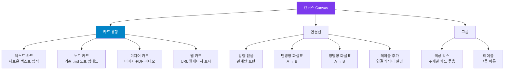

---
created:
  '{ date }': null
modified: 2026-01-01
publish: true
status: 진행중
tags: []
title: ch15-canvas
type: techbook
---

# Chapter 15. 캔버스(Canvas)
> 카드 · 연결선 · 그룹 · 임베드 · 프로젝트 관리 보드 구축

---

## 0) 연결 고리 (Bridge)

Chapter 14에서 템플릿으로 노트 작성을 자동화했습니다.  
이 챕터에서는 텍스트 노트에서 벗어나 **2D 캔버스 위에 카드와 연결선으로 아이디어를 시각적으로 배치**하는 캔버스(Canvas) 기능을 다룹니다.  
캔버스는 개념의 관계를 머릿속에서 공간으로 펼쳐내는 도구로, 프로젝트 관리, 마인드맵, 아이디어 브레인스토밍에 최적화되어 있습니다.

---

## 1) 개념 정의 및 필요성

### 캔버스란?

> **캔버스(Canvas)는 무한 2D 공간 위에 노트·텍스트·이미지·웹페이지를 카드로 배치하고 화살표로 연결하는 시각적 작업 공간입니다.**

텍스트 노트가 선형(Linear)이라면, 캔버스는 2차원(2D) 공간에서 자유롭게 사고를 펼칩니다.

| 기능 비교 | 마크다운 노트 | 캔버스 |
|---|---|---|
| 형태 | 선형 텍스트 | 2D 공간 배치 |
| 관계 표현 | `[[링크]]` (텍스트) | 화살표 (시각적) |
| 그룹화 | 폴더 | 색상 그룹 박스 |
| 노트 참조 | 임베드 `![[]]` | 카드로 노트 임베드 |
| 적합한 용도 | 선형 정보, 글쓰기 | 관계도, 브레인스토밍, 보드 |

---

## 2) 핵심 원리 및 구조

### 캔버스 구성 요소



---

## 3) 실습 예제 및 실행 환경

### 실습 15-1. 캔버스 파일 생성

```
방법 A: 명령 팔레트 → "canvas" → [새 캔버스 만들기]
방법 B: 파일 탐색기 우클릭 → [새 캔버스]
방법 C: 리본 아이콘 → 캔버스 (활성화 시)
```

**캔버스 기본 조작:**

| 조작 | 방법 |
|---|---|
| 이동 | 빈 공간 드래그 또는 스페이스바 + 드래그 |
| 확대·축소 | 마우스 휠 / 트랙패드 핀치 |
| 새 텍스트 카드 | 빈 공간 더블클릭 |
| 노트 카드 추가 | 파일 탐색기에서 캔버스로 드래그 |
| 카드 이동 | 카드 드래그 |
| 카드 크기 조절 | 카드 모서리 드래그 |
| 연결선 그리기 | 카드 테두리 호버 → 점 나타나면 드래그 |

---

### 실습 15-2. 텍스트 카드 & 연결선

```
① 캔버스 빈 공간 더블클릭 → 텍스트 카드 생성
② 내용 입력: "프로젝트 A"
③ Escape → 카드 선택 해제
④ 다른 위치에 더블클릭 → "기획" 카드 생성
⑤ "프로젝트 A" 카드 테두리에 마우스 호버
   → 카드 테두리에 파란 점(•)이 나타남
⑥ 파란 점에서 "기획" 카드로 드래그
   → 화살표 연결선 생성
⑦ 연결선 더블클릭 → 레이블 텍스트 추가
```

**연결선 방향 변경:**
```
① 연결선 클릭 → 선택 상태
② 연결선 옵션 패널 → 방향 선택:
   → (시작→끝 방향 없음 / 단방향 → / 역방향 ← / 양방향 ↔)
```

---

### 실습 15-3. 기존 노트를 카드로 임베드

```
방법 A: 파일 탐색기에서 .md 파일을 캔버스로 드래그
방법 B: 캔버스 빈 공간 우클릭 → [기존 파일 추가]
방법 C: 카드 생성 후 파일 선택
```

**노트 카드 조작:**
```
노트 카드 뷰 모드:
  - 기본: 노트 미리보기 (렌더링 결과)
  - 노트 카드 더블클릭: 풀 편집 모드

노트 카드에서 직접 편집:
  - 내용이 .md 파일에 실시간 반영됨
  - 캔버스와 노트가 양방향 동기화
```

---

### 실습 15-4. 그룹 생성 — 주제별 카드 묶기

```
방법 A: 여러 카드를 드래그로 선택 → 우클릭 → [그룹 만들기]
방법 B: Shift+클릭으로 여러 카드 선택 → 우클릭 → [그룹 만들기]
방법 C: 캔버스 우클릭 → [그룹 추가] → 나중에 카드를 그룹 안으로 드래그
```

**그룹 스타일 설정:**
```
그룹 클릭 → 우측 패널:
  - 색상 선택 (6가지 기본 색상)
  - 레이블 이름 변경
  - 배경 투명도 조절
```

---

### 실습 15-5. [예제] 프로젝트 관리 칸반 보드

캔버스로 **칸반 스타일 프로젝트 관리 보드**를 만들어봅시다.

```
보드 구조:
┌─────────────┬─────────────┬─────────────┬─────────────┐
│  📥 백로그   │  🔄 진행중   │  👀 검토중   │  ✅ 완료    │
├─────────────┼─────────────┼─────────────┼─────────────┤
│ [태스크 1]  │ [태스크 3]  │ [태스크 5]  │ [태스크 6]  │
│ [태스크 2]  │ [태스크 4]  │             │ [태스크 7]  │
└─────────────┴─────────────┴─────────────┴─────────────┘
```

**구축 단계:**
```
① 새 캔버스 "프로젝트 관리 보드.canvas" 생성
② 4개 그룹 박스 만들기:
   - 배경색 회색 → "📥 백로그"
   - 배경색 파란색 → "🔄 진행중"
   - 배경색 노란색 → "👀 검토중"
   - 배경색 초록색 → "✅ 완료"
③ 각 그룹 안에 텍스트 카드로 태스크 추가
④ 태스크 간 의존성 화살표 추가
⑤ 진행 시 카드를 다음 그룹으로 드래그하여 이동
```

> 💡 **TIP:** 기존의 프로젝트 노트(`.md`)를 캔버스에 드래그하면 태스크 카드가 노트와 연결됩니다. 카드를 클릭하면 해당 노트로 이동하거나 카드 안에서 바로 편집할 수 있어 Notion 스타일의 프로젝트 관리가 가능합니다.

---

### 실습 15-6. 미디어 카드 & 웹 카드

```
이미지 카드:
  → 이미지 파일을 캔버스로 드래그
  → 또는 우클릭 → [미디어 추가] → 파일 선택

웹 카드 (URL 임베드):
  → 캔버스 우클릭 → [웹 주소 추가]
  → URL 입력 (예: https://obsidian.md)
  → 웹페이지가 미니 브라우저로 카드에 표시됨
```

> ⚠️ **WARNING:** 웹 카드는 인터넷 연결이 필요하며, 모든 웹사이트가 캔버스 임베드를 허용하지는 않습니다. `X-Frame-Options: DENY` 헤더를 사용하는 사이트(예: Google)는 표시되지 않습니다.

---

## 4) 실무 시나리오 (Best Practice)

### 캔버스 활용 유형 5가지

**① 마인드맵:**
```
중심 주제 카드 → 주요 개념 카드들 → 세부 사항 카드들
계층적 방사형 배치, 화살표로 부모-자식 관계 표현
```

**② 프로젝트 타임라인:**
```
좌에서 우로 시간 흐름
각 마일스톤을 카드로, 의존성을 화살표로
날짜 레이블을 연결선에 추가
```

**③ 독서 메모 연결:**
```
책 노트 카드 → 핵심 개념 카드들 → 내 아이디어 카드들
다른 책과의 교차 연결 화살표
```

**④ 아이디어 브레인스토밍:**
```
중심 문제 카드 → 아이디어 카드들 (그룹별 색상 분류)
화살표로 관련 아이디어 연결, 그룹으로 카테고리 묶기
```

**⑤ 팀/인물 관계도:**
```
인물 카드 → 역할·프로젝트 카드 → 연결 관계 화살표
그룹으로 부서·팀 분류
```

### 안티 패턴

- **캔버스에 텍스트를 너무 많이 입력:** 카드당 핵심 키워드나 짧은 문장만 넣고, 상세 내용은 노트 카드(`.md` 임베드)를 사용하세요
- **연결선 과남용:** 모든 카드를 연결하면 스파게티가 됩니다. 의미 있는 관계에만 화살표를 사용하세요
- **하나의 캔버스에 모든 것 넣기:** 주제별로 캔버스를 분리하고, `![[캔버스.canvas]]` 임베드로 연결하세요

---

## 5) 트러블슈팅 & 주의사항

### Q1. 캔버스가 무겁고 느립니다

카드가 50개를 넘어가면 성능이 저하될 수 있습니다. 이 경우 캔버스를 주제별로 분리하거나, 필요 없는 웹 카드를 제거하세요.

### Q2. 노트 카드를 이동했더니 원본 파일이 삭제됐습니다

캔버스에서 카드를 **Delete** 키로 삭제하면 캔버스에서만 제거됩니다(원본 파일 유지). 단, 노트 카드를 삭제할 때 팝업에서 "파일도 삭제"를 선택하면 원본 파일도 함께 삭제됩니다. 주의하세요.

### Q3. 연결선 화살표 방향이 반대로 그려집니다

연결선을 그릴 때 **시작 카드에서 끝 카드 방향**으로 드래그해야 원하는 방향이 됩니다. 이미 그려진 연결선은 클릭 후 방향을 변경할 수 있습니다.

### Q4. 캔버스가 `.canvas` 파일로 저장됩니다. 다른 앱에서 열 수 있나요?

`.canvas` 파일은 JSON 형식으로 저장되어 사람이 읽을 수 있습니다. 다른 앱에서 직접 열기는 어렵지만, JSON 내용을 파싱해 다른 형식으로 변환하는 것은 가능합니다.

---

## 6) 한 줄 요약

> 💡 **Key Takeaway:**  
> 캔버스는 선형 노트로 표현하기 어려운 **공간적 관계, 흐름, 계층 구조**를 시각화하는 도구다.  
> **카드(노트 임베드) + 그룹(색상 박스) + 화살표(의존성) 세 가지 조합만으로 프로젝트 관리, 마인드맵, 아이디어 보드 모두 구현할 수 있다.**

---

## 🔖 이 챕터의 체크리스트

- [ ] 새 캔버스 파일을 만들고 기본 조작(이동·확대)을 익혔다
- [ ] 텍스트 카드 3개를 만들고 화살표로 연결했다
- [ ] 기존 노트 파일을 드래그해 노트 카드로 추가했다
- [ ] 그룹 박스를 2개 이상 만들고 카드를 배치했다
- [ ] 프로젝트 관리 칸반 보드를 완성했다

---

*이전 챕터: [Chapter 14 — 템플릿 시스템](ch14-templates.md)*  
*다음 챕터: [Chapter 16 — 엑스칼리드로우(Excalidraw)](ch16-excalidraw.md)*