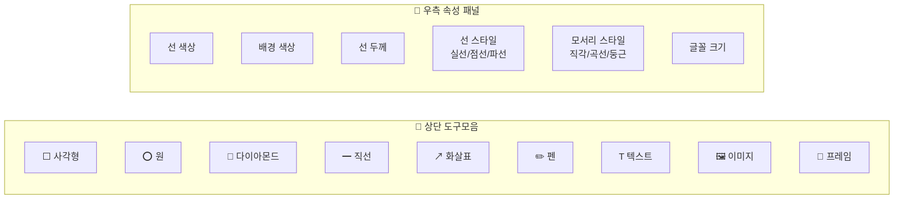

---
created:
  '{ date }': null
modified: 2026-01-01
publish: true
status: 진행중
tags: []
title: ch16-excalidraw
type: techbook
---

# Chapter 16. Excalidraw — 손 그림 다이어그램
> 기본 도형 · 텍스트 · 화살표 · 노트 임베드 · 캐릭터 관계도

---

## 0) 연결 고리 (Bridge)

Chapter 15에서 캔버스로 카드와 연결선을 자유롭게 배치했습니다.  
이 챕터에서는 **손 그림 스타일의 다이어그램 도구 Excalidraw**를 다룹니다.  
캔버스가 노트를 시각적으로 배치하는 도구라면, Excalidraw는 **도형·선·텍스트를 자유롭게 그려 아이디어를 스케치하는 화이트보드**입니다.

---

## 1) 개념 정의 및 필요성

### Excalidraw란?

> **Excalidraw는 손 그림(Handwritten) 스타일로 다이어그램을 그리는 오픈소스 화이트보드 도구입니다.**  
> 옵시디언 플러그인으로 설치하면 `.excalidraw` 파일을 보관소에서 직접 생성·편집할 수 있습니다.

**캔버스 vs Excalidraw 비교:**

| 비교 항목 | 캔버스 | Excalidraw |
|---|---|---|
| 스타일 | 깔끔한 UI 카드 | 손 그림 스타일 |
| 노트 임베드 | ✅ 직접 임베드 | ✅ 텍스트로 노트 링크 |
| 자유 드로잉 | ❌ | ✅ (펜 도구) |
| 수식 입력 | ❌ | ✅ (LaTeX) |
| 이미지 삽입 | ✅ | ✅ |
| 내보내기 | 제한적 | PNG·SVG 내보내기 |
| 적합 용도 | 프로젝트 보드·마인드맵 | 시스템 다이어그램·설계도·스케치 |

---

## 2) 핵심 원리 및 구조

### Excalidraw 인터페이스 구조



---

## 3) 실습 예제 및 실행 환경

> **환경:** Excalidraw 플러그인 설치·활성화 (Ch 12 참고)  
> **실습 파일:** 새 Excalidraw 파일 생성

### 실습 16-1. Excalidraw 파일 생성 및 기본 조작

```
새 파일 생성:
  리본 → ✏️ Excalidraw 아이콘
  또는 명령 팔레트 → "excalidraw" → [새 Excalidraw 그리기]
  또는 파일 탐색기 우클릭 → [새 Excalidraw 그리기]
```

**기본 조작:**

| 조작 | 방법 |
|---|---|
| 이동 | 스페이스바 + 드래그 / 마우스 가운데 버튼 드래그 |
| 확대·축소 | 마우스 휠 / Ctrl+= / Ctrl+- |
| 전체 보기 | Shift+1 또는 Ctrl+Shift+H |
| 실행 취소 | Ctrl/Cmd+Z |
| 도형 선택 | S 키 또는 V 키 (선택 도구) |
| 이동 모드 | H 키 (핸드 도구) |

---

### 실습 16-2. 핵심 단축키 완전 정복

```
도형:
  R = 사각형   O = 원   D = 다이아몬드
  L = 직선     A = 화살표   P = 펜
  T = 텍스트   I = 이미지

편집:
  E = 선택된 요소 편집 모드
  G = 그룹 만들기 (여러 선택)
  Alt+G = 그룹 해제
  Ctrl+D = 복제
  Delete = 삭제

정렬 (여러 요소 선택 후):
  Ctrl+Shift+H = 수평 가운데 정렬
  Ctrl+Shift+V = 수직 가운데 정렬
  
레이어:
  Ctrl+[ = 뒤로 보내기
  Ctrl+] = 앞으로 가져오기
```

---

### 실습 16-3. 아키텍처 다이어그램 그리기

옵시디언 생태계 구조를 Excalidraw로 그려봅니다.

**목표 다이어그램:**
```
┌─────────────────────────────────────┐
│          옵시디언 생태계              │
│                                     │
│  ┌──────────┐      ┌─────────────┐  │
│  │  보관소  │─────→│  코어 플러그인│  │
│  └──────────┘      └─────────────┘  │
│       │                   │         │
│       ↓                   ↓         │
│  ┌──────────┐      ┌─────────────┐  │
│  │  .md 노트 │      │ 커뮤니티    │  │
│  └──────────┘      │  플러그인   │  │
│                    └─────────────┘  │
└─────────────────────────────────────┘
```

**구성 단계:**
```
① R 키 → 사각형 4개 그리기 (4개 컴포넌트)
② T 키 → 각 사각형 안에 텍스트 추가
   (Excalidraw에서 도형 더블클릭으로 텍스트 입력)
③ A 키 → 화살표로 관계 연결
④ R 키 → 외곽 큰 사각형으로 전체 감싸기
⑤ T 키 → "옵시디언 생태계" 제목 추가
⑥ 전체 선택(Ctrl+A) → 그룹 만들기(G)
```

**스타일 적용:**
```
배경 색상:
  보관소: 연보라 (#e9d5ff)
  코어 플러그인: 연파란 (#dbeafe)
  커뮤니티 플러그인: 연주황 (#fed7aa)
  .md 노트: 연초록 (#d1fae5)

선 스타일:
  화살표: 곡선(curved) 스타일
  외곽 박스: 파선(dashed)
```

---

### 실습 16-4. 텍스트 & 수식 카드

**텍스트 스타일 설정:**
```
T 키로 텍스트 추가 후 우측 패널:
  글꼴 크기: S(16) / M(20) / L(28) / XL(36)
  글꼴 스타일: 일반 / 굵게 / 기울임 / 코드
  글꼴 종류: 손 글씨(Virgil) / 일반(Helvetica) / 모노스페이스
```

**LaTeX 수식 삽입:**
```
명령 팔레트(Ctrl/Cmd+P) → "insert LaTeX"
→ LaTeX 수식 입력 → PNG 이미지로 렌더링되어 삽입
예: E = mc^2
```

---

### 실습 16-5. 노트 링크 임베드 (Excalidraw 전용)

Excalidraw에서는 텍스트에 `[[노트명]]` 링크를 직접 삽입할 수 있습니다.

```
① T 키 → 텍스트 추가
② [[나의 첫 번째 노트]] 입력
③ Ctrl/Cmd 키를 누른 상태에서 클릭
   → 해당 노트로 이동
```

**이미지에 링크 연결:**
```
이미지 또는 도형 선택
→ 우클릭 → [링크 설정]
→ 노트 이름 또는 URL 입력
→ Ctrl/Cmd+클릭으로 링크 열기
```

---

### 실습 16-6. [예제] 소설 캐릭터 관계도

창작자·소설가를 위한 캐릭터 관계도를 Excalidraw로 구축합니다.

**목표:**
```
주인공 ←──── 연인 관계 ────→ 히로인
   │                            │
   │ 라이벌                     │ 친구
   ↓                            ↓
악당 ──── 숨겨진 관계 ────→ 조력자
   │
   └───── 과거 스승 ────→ 현자
```

**구축 단계:**
```
① 각 캐릭터를 원(O키) 또는 카드 형태로 배치
② 관계 화살표에 레이블 텍스트 추가
③ 색상으로 진영 구분:
   - 주인공 진영: 파란 계열
   - 적대 진영: 빨간 계열
   - 중립: 회색
④ 각 캐릭터 카드 안에 [[캐릭터-노트]] 링크 추가
⑤ 프레임(I키)으로 관계도 전체를 하나의 프레임으로 묶기
```

**노트에 관계도 임베드:**
```markdown
# 세계관 메인 페이지

## 캐릭터 관계도
![[캐릭터-관계도.excalidraw]]

또는 크기 지정:
![[캐릭터-관계도.excalidraw|600]]
```

---

### 실습 16-7. PNG / SVG 내보내기

```
내보내기 방법:
  Excalidraw 우측 상단 [...] 메뉴 → [PNG 저장]
  또는 [SVG 저장]
  또는 명령 팔레트 → "excalidraw export"

내보내기 옵션:
  - 배경 포함/제외
  - 현재 화면만 / 전체 캔버스
  - 해상도 배율 (1x / 2x / 3x)
```

> 💡 **TIP:** SVG 형식으로 내보내면 벡터 그래픽이라 어떤 크기로 확대해도 선명합니다. 프레젠테이션 슬라이드나 문서에 삽입할 때 SVG를 권장합니다.

---

## 4) 실무 시나리오 (Best Practice)

### 용도별 Excalidraw 활용 패턴

**개발자 — 시스템 아키텍처:**
```
서버 컴포넌트를 사각형으로, API 호출을 화살표로
색상으로 레이어(프론트/백/DB) 구분
```

**연구자 — 개념 관계 지도:**
```
논문의 핵심 개념을 원으로
개념 간 관계를 다양한 화살표 스타일로
[[논문-노트]] 링크를 각 개념 카드에 연결
```

**창작자 — 세계관 설계:**
```
지도, 가계도, 캐릭터 관계도
손 그림 스타일이 창작의 거친 스케치 느낌과 잘 어울림
```

**학생 — 강의 필기 시각화:**
```
강의 후 키워드를 캔버스에 배치
개념 간 화살표로 인과 관계 표현
나중에 플래시카드로 활용
```

### 안티 패턴

- **Excalidraw를 일반 텍스트 노트 대신 사용:** 검색이 안 되고 Dataview 쿼리도 불가합니다. 텍스트 정보는 `.md` 노트에, 시각적 구조는 Excalidraw에 분리하세요
- **너무 정교하게 그리려는 시도:** 픽셀 단위로 정렬하는 데 시간을 쏟지 마세요. 손 그림 스타일의 의도적 불규칙함이 Excalidraw의 매력입니다

---

## 5) 트러블슈팅 & 주의사항

### Q1. Excalidraw 파일이 텍스트로 표시됩니다

Excalidraw 플러그인이 비활성화된 상태입니다. `설정 → 커뮤니티 플러그인` 에서 Excalidraw가 활성화되어 있는지 확인하세요.

### Q2. 노트에 임베드한 Excalidraw가 빈 박스로 표시됩니다

Excalidraw 파일이 보관소 내에 있는지 확인하세요. 또한 `![[파일명.excalidraw]]` 에서 파일명과 확장자가 정확한지 확인하세요.

### Q3. 도형 안에 텍스트를 입력하려면?

도형을 선택 후 **Enter** 키 또는 **더블클릭**하면 텍스트 입력 모드로 전환됩니다.

### Q4. Excalidraw 파일이 열릴 때마다 위치가 초기화됩니다

`설정 → Excalidraw` 에서 `마지막 활성 창 상태 저장`이 켜져 있는지 확인하세요.

---

## 6) 한 줄 요약

> 💡 **Key Takeaway:**  
> Excalidraw는 텍스트로 표현하기 어려운 관계·구조·흐름을 손 그림 스타일로 빠르게 시각화하는 도구다.  
> **완벽하게 그리려 하지 말고, 생각을 빠르게 공간에 펼쳐내는 스케치 도구로 사용하라.**

---

## 🔖 이 챕터의 체크리스트

- [ ] Excalidraw 파일을 만들고 기본 도형(사각형·원·화살표)을 그렸다
- [ ] 핵심 단축키 R·O·A·T를 사용해봤다
- [ ] 스타일(색상·선 두께·모서리) 설정을 변경해봤다
- [ ] 노트 링크를 텍스트에 삽입하고 Ctrl+클릭으로 이동했다
- [ ] 캐릭터 관계도 또는 아키텍처 다이어그램을 완성했다
- [ ] PNG 또는 SVG로 내보냈다

---

*이전 챕터: [Chapter 15 — 캔버스](ch15-canvas.md)*  
*다음 챕터: [Chapter 17 — 동기화와 백업](ch17-sync.md)*