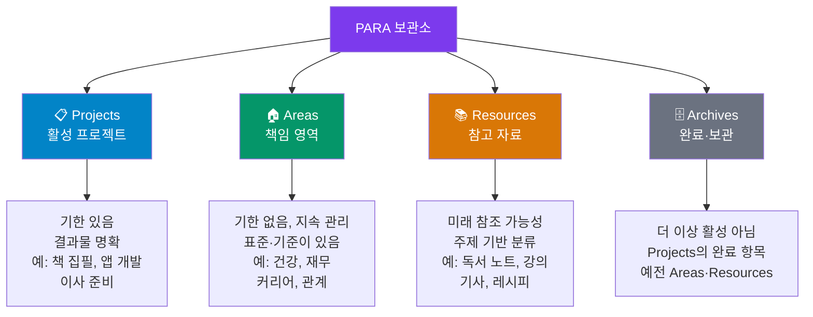

---
created:
  '{ date }': null
publish: true
status: 진행중
title: Ch18 Para
type: techbook
---

# Chapter 18. PARA 방법론 구축
> Projects · Areas · Resources · Archives — 4계층 보관소 설계

---

## 0) 연결 고리 (Bridge)

Part 4에서 속성·템플릿·캔버스·동기화까지 옵시디언의 중급 기능을 완전히 익혔습니다.  
이제 Part 5 — 지식 관리 시스템 구축에 진입합니다.  
아무리 강력한 도구도 **어떻게 정리할지에 대한 철학**이 없으면 노트가 쌓이면서 무너집니다.  
이 챕터에서는 Tiago Forte가 개발한 **PARA 방법론**을 옵시디언에 완전히 구현합니다.

---

## 1) 개념 정의 및 필요성

### PARA란?

> **PARA는 Projects(프로젝트), Areas(영역), Resources(자료), Archives(보관)의 4계층으로 모든 디지털 정보를 분류하는 두 번째 뇌(Second Brain) 운영 체계입니다.**

PARA의 핵심 아이디어는 **"정보를 주제가 아닌 행동 가능성(Actionability)으로 분류"** 하는 것입니다.

| 계층 | 정의 | 기한 | 예시 |
|---|---|---|---|
| **Projects** | 명확한 목표와 기한이 있는 작업 | 있음 | 가이드북 집필, 웹사이트 개편 |
| **Areas** | 지속적으로 관리해야 하는 책임 영역 | 없음(지속) | 건강, 재무, 커리어, 가족 |
| **Resources** | 미래에 유용할 수 있는 참고 자료 | 없음 | 독서 메모, 강의 노트, 링크 |
| **Archives** | 더 이상 활성이 아닌 모든 것 | 완료됨 | 완료 프로젝트, 과거 자료 |

**PARA vs 기존 폴더 방식 비교:**

| 방식 | 문제 | PARA의 해결 |
|---|---|---|
| 주제별 폴더 | "이 노트는 어디에?" 결정 피로 | 행동 가능성 기준으로 명확히 결정 |
| 깊은 계층 구조 | 파묻혀서 찾을 수 없음 | 최대 2단계 계층 |
| 무분별한 저장 | 노트가 쌓여 쓰레기통이 됨 | Archive로 정기적 이동 |

---

## 2) 핵심 원리 및 구조

### PARA 4계층 상세 정의



### Projects vs Areas — 가장 중요한 구분

많은 사람이 Projects와 Areas를 혼동합니다.

```
✅ Project (프로젝트):
  - "새 블로그 포스트 3편 작성" → 완료 시점이 있음
  - "3월까지 운동 습관 만들기" → 목표 달성 후 끝남
  - "집 리모델링" → 완공 후 종료

✅ Area (영역):
  - "건강 관리" → 영원히 지속
  - "블로그 운영" → 끝이 없음
  - "재무 관리" → 지속적 책임

❌ 흔한 혼동:
  "건강" → Area
  "10kg 감량 by 3월" → Project (Area에 속한 Projects 가능)
```

> 💡 **TIP:** 구분이 안 될 때 자문하세요: "이것이 완료되는 날이 있는가?" Yes면 Project, No면 Area.

---

## 3) 실습 예제 — 옵시디언 PARA 보관소 완전 구축

### 실습 18-1. 폴더 구조 설계 및 생성

**권장 PARA 폴더 구조:**

```
my-vault/
├── 10-PROJECTS/           ← 활성 프로젝트 (5~15개 적정)
│   ├── 가이드북 집필/
│   ├── 블로그 리뉴얼/
│   └── 이직 준비/
│
├── 20-AREAS/              ← 책임 영역 (5~10개 적정)
│   ├── 건강/
│   ├── 커리어/
│   ├── 재무/
│   └── 학습/
│
├── 30-RESOURCES/          ← 참고 자료 (무제한)
│   ├── 독서노트/
│   ├── 강의노트/
│   ├── 도구-앱/
│   └── 레퍼런스/
│
├── 90-ARCHIVES/           ← 보관 (무제한)
│   ├── 2023-완료프로젝트/
│   └── 예전-자료/
│
├── 00-INBOX/              ← 분류 전 임시 (매일 비우기 목표)
├── templates/             ← Templater 템플릿
└── assets/                ← 첨부 파일
```

> 📌 **NOTE:** 숫자 접두사(10-, 20-...)는 파일 탐색기에서 PARA 순서대로 표시하기 위한 관례입니다. 대문자는 일반 노트 폴더와 시각적으로 구분하기 위함입니다. 원하면 소문자나 다른 형식을 사용해도 됩니다.

**폴더 생성 단계:**
```
① 파일 탐색기 우클릭 → [새 폴더] → "10-PROJECTS"
② 10-PROJECTS 안에 현재 진행 중인 프로젝트 폴더 2~3개 생성
③ 20-AREAS, 30-RESOURCES, 90-ARCHIVES, 00-INBOX 순서로 생성
④ 각 폴더 안에 서브폴더 1~3개 생성
```

---

### 실습 18-2. PARA 허브 노트 만들기

각 PARA 계층의 진입점이 되는 **허브 노트(Hub Note)** 를 만듭니다.

**`10-PROJECTS/프로젝트 목록.md`:**
```markdown
---
tags:
  - PARA
  - hub
  - projects
updated: {{date}}
---

# 📋 활성 프로젝트 목록

> **원칙:** 동시에 진행 중인 프로젝트는 5~15개 이내로 유지

```dataview
TABLE file.mtime AS "최근 수정", due_date AS "마감", status AS "상태"
FROM "10-PROJECTS"
WHERE type = "project" AND status != "완료"
SORT due_date ASC
```

## 프로젝트 목록

| 프로젝트 | 마감 | 상태 | 노트 |
|---|---|---|---|
| [[가이드북 집필]] | 2024-03-31 | 진행중 | |

## 이번 주 집중 프로젝트
- 

## 다음에 시작할 프로젝트 (백로그)
- 
```

**`20-AREAS/영역 목록.md`:**
```markdown
---
tags:
  - PARA
  - hub
  - areas
---

# 🏠 책임 영역 목록

> **원칙:** 각 영역에 대한 "이상적인 상태"를 정의해두기

## 내 책임 영역

| 영역 | 이상적 상태 | 현재 상태 |
|---|---|---|
| [[건강]] | 주 3회 운동, 체중 65kg 유지 | 주 1회 |
| [[커리어]] | 시니어 개발자, 사이드 프로젝트 운영 | 미드레벨 |
| [[재무]] | 비상금 6개월치, 투자 비율 30% | 비상금 3개월 |
| [[학습]] | 매월 책 2권, 강의 1개 완료 | 책 1권 |
```

---

### 실습 18-3. PARA 프로젝트 노트 표준 구조

모든 프로젝트 노트에 일관된 구조를 사용합니다.

```markdown
---
type: project
title: "옵시디언 가이드북 집필"
area: "[[커리어]]"
status: "진행중"
start_date: 2024-01-01
due_date: 2024-03-31
priority: 1
tags:
  - project
  - status/진행중
---

# 📋 옵시디언 가이드북 집필

## 🎯 목표 (Definition of Done)
30챕터, 총 500페이지의 실용적인 옵시디언 완전 정복 가이드 완성.
GitHub에 공개 배포.

## 📊 진행 상황
- [x] Part 1 초고 (Ch 01-04)
- [x] Part 2 초고 (Ch 05-08)
- [ ] Part 3~7 집필 중
- [ ] 검토·교정
- [ ] GitHub 배포

## 📝 관련 노트
- [[가이드북 목차]]
- [[집필 스타일 가이드]]

## 🗓️ 다음 액션
- [ ] Ch 19 제텔카스텐 초고 작성 (기한: 이번 주)

## 📎 참고 자료
- [[옵시디언 공식 문서 메모]]
```

---

### 실습 18-4. Inbox → PARA 분류 루틴

**Inbox는 매일 비워야 하는 임시 저장소**입니다. 아래 절차로 Inbox를 처리하세요.

```
Inbox 처리 흐름 (매일 5~15분):

각 노트에 대해 아래 질문을 순서대로:

1. "지금 당장 필요한가?"
   → Yes: 현재 진행 중인 프로젝트의 노트로 이동 (10-PROJECTS)
   
2. "내 책임 영역과 관련 있는가?"
   → Yes: 해당 Area 폴더로 이동 (20-AREAS)
   
3. "나중에 참고할 수 있는가?"
   → Yes: 주제별 Resources 폴더로 이동 (30-RESOURCES)
   
4. "그냥 보관만 하고 싶은가?"
   → Yes: Archives로 이동 (90-ARCHIVES)
   
5. "전혀 필요 없는가?"
   → 삭제
```

**Inbox 처리를 돕는 Dataview:**
```dataview
LIST
FROM "00-INBOX"
SORT file.ctime ASC
```

> 💡 **TIP:** Inbox가 매일 쌓여서 처리가 부담스럽다면, "주간 리뷰" 루틴에 Inbox 처리를 포함하세요. 주 1회 30분으로 시작해 점차 일일 루틴으로 발전시키는 것이 현실적입니다.

---

### 실습 18-5. 프로젝트 완료 → Archive 이동 절차

```
프로젝트 완료 시:
① 프로젝트 노트의 status: "완료" 로 변경
② 완료일(finished_date) 속성 추가
③ 프로젝트 폴더 전체를 90-ARCHIVES/[연도]-완료프로젝트/ 로 이동
④ 프로젝트 목록 허브 노트 업데이트
⑤ 완료 회고 노트 작성 (선택)

Archive 이동 후에도 검색과 링크는 유지됩니다.
```

---

## 4) 실무 시나리오 (Best Practice)

### PARA 운영 3원칙

**원칙 1 — 적을수록 좋다:**  
Projects는 5~15개, Areas는 5~10개가 적정입니다. 너무 많으면 모든 것이 우선순위가 되어 아무것도 집중하지 못합니다.

**원칙 2 — Archive를 두려워하지 마라:**  
"언젠가 필요할 것 같아서" 활성 폴더에 보관하는 습관이 보관소를 비대하게 만듭니다. 의심되면 Archive합니다. 검색으로 언제든 찾을 수 있습니다.

**원칙 3 — Inbox는 도착지가 아니다:**  
Inbox의 노트는 24~72시간 이내에 적절한 PARA 위치로 이동하는 것이 목표입니다.

### 안티 패턴

- **PARA를 완벽하게 구현하려다 아무것도 못 함:** 처음엔 Inbox와 PROJECTS 두 폴더만으로 시작해도 됩니다. 나머지는 자연스럽게 추가하세요
- **Areas를 너무 세분화:** "건강 > 운동 > 헬스장 > 가슴 운동" 같은 깊은 계층은 PARA 철학에 반합니다. Areas는 넓은 삶의 영역 단위로만 구분하세요
- **Resources를 쓰레기통으로 사용:** 모든 것을 Resources로 쌓아두면 나중에 찾기 어렵습니다. 진짜 참조할 가능성이 있는 것만 저장하고, 나머지는 Archive 또는 삭제하세요

---

## 5) 트러블슈팅 & 주의사항

### Q1. 어떤 노트가 Project인지 Area인지 헷갈립니다

"완료되는 날이 있는가?" 한 가지만 기억하세요. 기한이 있으면 Project, 영원히 지속되면 Area입니다. 또한 Project는 Area에 속할 수 있습니다. "건강(Area) > 마라톤 완주(Project)"처럼요.

### Q2. 기존에 만들어둔 수백 개의 노트를 PARA로 옮겨야 하나요?

한 번에 옮기지 마세요. 앞으로 새 노트는 PARA에 따라 저장하고, 기존 노트는 자연스럽게 접근할 때마다 이동하는 "점진적 마이그레이션" 방식을 권장합니다.

### Q3. PARA와 태그를 어떻게 함께 사용하나요?

PARA 폴더는 **행동 가능성 기준 분류**, 태그는 **주제·상태 기준 분류**로 역할을 나눕니다. 예를 들어 `10-PROJECTS/가이드북/` 폴더에 있는 노트에 `#writing #obsidian #status/진행중` 태그를 함께 사용하면, 폴더와 태그 두 가지 축으로 노트를 탐색할 수 있습니다.

---

## 6) 한 줄 요약

> 💡 **Key Takeaway:**  
> PARA는 "무엇인가"가 아닌 "얼마나 행동 가능한가"로 정보를 분류하는 시스템이다.  
> **Projects(기한 있음) → Areas(지속 책임) → Resources(참조 가능) → Archives(완료 보관) 순서로 모든 노트의 위치를 결정하면 보관소가 항상 깔끔하게 유지된다.**

---

## 🔖 이 챕터의 체크리스트

- [ ] PARA 4계층 폴더 구조를 생성했다
- [ ] 내 활성 프로젝트 3개 이상의 노트를 만들었다
- [ ] 내 책임 영역 3개 이상의 노트를 만들었다
- [ ] 프로젝트 목록 허브 노트를 완성했다
- [ ] Inbox 처리 루틴을 이해하고 한 번 실행해봤다
- [ ] PARA와 기존 태그 체계를 통합하는 방식을 결정했다

---

*이전 챕터: [Chapter 17 — 동기화와 백업](./ch17-sync.md)*  
*다음 챕터: [Chapter 19 — GTD와 할일 관리](ch19-gtd.md)*