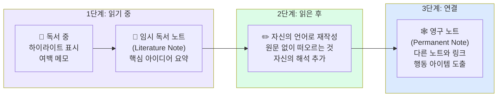

---
created:
  '{ date }': null
modified: 2026-01-01
publish: true
status: 진행중
tags: []
title: ch20-reading
type: techbook
---

# Chapter 20. 독서 노트 시스템
> 3단계 독서 프로세스 · 하이라이트 → 영구 노트 · Readwise 연동

---

## 0) 연결 고리 (Bridge)

Chapter 19에서 GTD로 할일 관리를 자동화했습니다.  
이 챕터에서는 책에서 얻은 지식을 **살아있는 지식**으로 전환하는 독서 노트 시스템을 구축합니다.  
많은 사람이 책을 읽고도 6개월 후엔 거의 기억하지 못합니다. 이 챕터의 시스템은 읽은 내용이 **영구적인 개인 지식**으로 남도록 설계됩니다.

---

## 1) 개념 정의 및 필요성

### 왜 독서 노트가 실패하는가

**일반적인 실패 패턴:**
```
읽는 중: 형광펜으로 밑줄 → 노트에 필사
읽은 후: 노트 파일을 다시는 열어보지 않음
결과: 책 한 권에 형광펜 가득 + 지식은 없음
```

**이유:** 밑줄과 필사는 **정보를 복사**하는 것이지, **지식을 이해**하는 것이 아닙니다.

**효과적인 독서 노트의 핵심:**
```
읽는 중: 하이라이트 → 자신의 말로 메모
읽은 후: 인사이트를 자신의 언어로 재작성
연결: 다른 노트·아이디어와 연결
행동: 적용할 것을 구체적 행동으로 전환
```

---

## 2) 핵심 원리 및 구조

### 3단계 독서 노트 프로세스



**3종류 노트 비교:**

| 유형 | 원어 | 보관 위치 | 내용 | 형식 |
|---|---|---|---|---|
| 임시 독서 노트 | Literature Note | 30-RESOURCES/독서노트/ | 책의 내용 요약 | 책 구조 따라감 |
| 영구 노트 | Permanent Note | 10-PROJECTS 또는 20-AREAS/ | 내 생각·인사이트 | 하나의 아이디어 |
| 참조 노트 | Reference Note | 30-RESOURCES/ | 인용·출처 정보 | 사실 기록 |

---

## 3) 실습 예제

### 실습 20-1. 독서 노트 표준 템플릿

**`templates/독서노트-template.md`:**
```markdown
---
title: "null"
author: "null"
genre: "null"
rating: null
status: "읽는중"
started: 2026-03-03
finished:
pages:
tags:
  - 독서노트
  - null
  - status/읽는중
---

# 📚 null

> **저자:** null | **장르:** null | **평점:** null

## 📌 한 줄 요약
_이 책의 핵심 주장을 한 문장으로:_

## 🎯 읽은 이유 & 기대한 것

## 💡 핵심 아이디어 (자신의 언어로)

### 아이디어 1.

### 아이디어 2.

### 아이디어 3.

## 📝 인상 깊은 구절

> 

출처: p.

## 🔗 다른 노트와의 연결
_이 책의 아이디어가 연결되는 기존 노트:_
- [[]]
- [[]]

## 💼 적용할 것 (Action Items)
- [ ] 
- [ ] 

## 🗣️ 누구에게 추천하고 싶은가 & 이유

## ⭐ 최종 평가
- **평점:** null/5
- **다시 읽을 것인가:** ( 예 / 아니오 )
- **추천 대상:**
```

---

### 실습 20-2. 영구 노트(Permanent Note) 작성법

영구 노트는 독서 노트와 다릅니다. **하나의 아이디어, 내 언어, 독립적**이 핵심입니다.

**좋은 영구 노트의 특성:**
```
✅ 제목이 주장(Claim)이다
   → "총균쇠" (X) → "지리적 이점이 문명 격차를 결정한다" (O)

✅ 원문 없이도 이해된다
   → 책을 읽지 않아도 노트만으로 아이디어가 전달됨

✅ 하나의 아이디어만 다룬다
   → 한 노트 = 한 아이디어 (길이는 짧아도 됨)

✅ 다른 노트와 연결된다
   → [[링크]]로 관련 아이디어들과 연결

✅ 내 언어로 작성됐다
   → 복사·붙여넣기 없음, 완전히 내 표현
```

**예시 — "총균쇠" 독서 후 생성할 영구 노트들:**

```markdown
# 지리적 이점이 문명 격차의 근본 원인이다

유라시아의 동서 축(위도)은 기후대가 일정해 농작물과 가축이 쉽게 전파됐다.
반면 아프리카와 아메리카의 남북 축(경도)은 기후 변화가 커서 전파가 어려웠다.
이 지리적 차이가 식량 생산 → 인구 증가 → 기술 발전 → 정치 조직의
연쇄적 격차를 만들었다.

→ [[환경결정론의 현대적 의의]]
→ [[기후와 혁신의 관계]]
출처: [[총균쇠 — 독서노트]]#제3장
```

```markdown
# 병균은 정복자보다 더 많은 원주민을 죽였다

스페인이 아메리카를 정복할 때 직접적인 전쟁보다 천연두 등 전염병이
원주민의 90%를 사망시켰다. 병균은 수세대에 걸친 가축 사육으로
면역을 갖춘 집단만이 보유했다.
→ 군사력이 아닌 면역력이 정복을 가능하게 했다는 역설.

→ [[집단 면역과 역사의 전환점]]
→ [[팬데믹이 역사를 바꾼 사례들]]
출처: [[총균쇠 — 독서노트]]#제11장
```

---

### 실습 20-3. Readwise 연동 (선택 실습)

Readwise는 킨들·하이라이터·이북 앱의 하이라이트를 자동으로 옵시디언에 가져오는 서비스입니다.

```
연동 설정:
① readwise.io 가입 (월 $7.99 또는 연 $79.99)
② 킨들, Instapaper, Pocket 등 연결
③ Readwise Official 플러그인 설치:
   커뮤니티 플러그인 → "Readwise Official" 설치
④ 설정 → Readwise:
   저장 위치: 30-RESOURCES/독서노트/readwise/
   동기화 주기: 매시간 또는 수동

결과: 킨들에서 하이라이트 → 옵시디언 자동 저장
```

> 📌 **NOTE:** Readwise 없이도 수동으로 하이라이트를 옮기는 것이 완전히 가능합니다. Readwise는 편의성을 위한 선택 도구입니다.

---

### 실습 20-4. 독서 데이터베이스 Dataview

**`30-RESOURCES/독서 대시보드.md`:**
````markdown
---
tags: [독서, dashboard]
---
# 📚 독서 데이터베이스

## 🔄 현재 읽는 중
```dataview
TABLE author AS "저자", started AS "시작일", pages AS "페이지"
FROM #독서노트
WHERE status = "읽는중"
```

## 📊 연간 독서 통계
```dataview
TABLE length(rows) AS "완독 권수"
FROM #독서노트
WHERE status = "완료" AND contains(string(finished), "2024")
GROUP BY true
```

## ⭐ 평점 5점 도서
```dataview
TABLE author AS "저자", finished AS "완독일"
FROM #독서노트
WHERE rating = 5
SORT finished DESC
```

## 🔴 미완독 (읽다 멈춤)
```dataview
TABLE author AS "저자", started AS "시작일"
FROM #독서노트
WHERE status = "중단"
```

## 📈 장르별 독서 현황
```dataview
TABLE length(rows) AS "권수"
FROM #독서노트
WHERE status = "완료"
GROUP BY genre
SORT length(rows) DESC
```
````

---

## 4) 실무 시나리오 (Best Practice)

### 독서 후 노트 작성 시간 권장

| 책 유형 | 독서 시간 | 노트 작성 시간 | 영구 노트 수 |
|---|---|---|---|
| 소설 | 5~10시간 | 30분 | 1~3개 |
| 자기계발 | 3~6시간 | 1시간 | 3~7개 |
| 기술서 | 10~30시간 | 2~4시간 | 5~15개 |
| 학술서 | 20~50시간 | 4~10시간 | 10~30개 |

> 💡 **TIP:** "책 한 권에서 영구 노트 3개만 만들어도 충분합니다." 모든 것을 노트로 만들려는 완벽주의가 독서를 부담으로 만듭니다. 핵심 아이디어 3개를 깊이 이해하는 것이 30개를 얕게 필사하는 것보다 훨씬 가치 있습니다.

### 안티 패턴

- **하이라이트 수집이 목적이 되는 경우:** 킨들에 수백 개의 하이라이트가 있지만 한 번도 돌아보지 않는다면, 하이라이트는 의미 없습니다. 읽은 날 당일 최소 1개의 영구 노트를 작성하는 규칙을 만드세요
- **독서 노트를 책 요약으로 만드는 경우:** 요약은 책의 구조를 따릅니다. 영구 노트는 내 아이디어를 중심으로 재구성됩니다. 두 가지는 역할이 다릅니다
- **링크를 만들지 않는 경우:** 영구 노트를 만들었지만 다른 노트와 연결하지 않으면 고립된 아이디어로 남습니다. 노트를 저장하기 전에 반드시 `[[관련 노트]]` 최소 1개를 추가하는 습관을 들이세요

---

## 5) 트러블슈팅 & 주의사항

### Q1. 독서 중 메모하면 독서 흐름이 끊깁니다

두 가지 방법이 있습니다. **방법 A:** 읽는 중엔 하이라이트만 하고, 독서 후 한 번에 노트 작성. **방법 B:** 챕터 끝날 때마다 5분간 메모. 자신의 독서 스타일에 맞는 방법을 선택하세요.

### Q2. 영구 노트 제목을 어떻게 정해야 할지 모르겠습니다

제목은 **주장 형태의 문장**이어야 합니다. "X는 Y다", "X가 Y를 결정한다", "X 없이는 Y가 불가능하다" 등의 형태를 사용해보세요. 제목을 잘 지을수록 나중에 검색해서 찾기도 쉬워집니다.

### Q3. 이미 읽은 책들을 모두 소급 적용해야 하나요?

하지 마세요. 오늘부터 읽는 책부터 새 시스템을 적용하세요. 과거 책은 특별히 중요한 것만 기억에 남는 인사이트로 영구 노트 1~2개를 만드는 것으로 충분합니다.

---

## 6) 한 줄 요약

> 💡 **Key Takeaway:**  
> 독서 노트의 목표는 "책의 내용을 기록"하는 것이 아니라 "내 생각을 발전시키는 것"이다.  
> **임시 독서 노트(무엇을 읽었나) → 영구 노트(무엇을 생각했나) → 연결(어떻게 적용하나)의 3단계가 지식을 살아있게 만든다.**

---

## 🔖 이 챕터의 체크리스트

- [ ] 독서 노트 Templater 템플릿을 완성했다
- [ ] 현재 읽는 책 또는 최근에 읽은 책으로 독서 노트를 작성했다
- [ ] 그 책에서 영구 노트(주장 형태 제목) 3개 이상을 만들었다
- [ ] 영구 노트에 다른 노트와의 [[링크]]를 추가했다
- [ ] 독서 데이터베이스 Dataview 대시보드를 완성했다

---

*이전 챕터: [Chapter 19 — GTD와 할일 관리](ch19-gtd.md)*  
*다음 챕터: [Chapter 21 — 제텔카스텐](ch21-zettelkasten.md)*