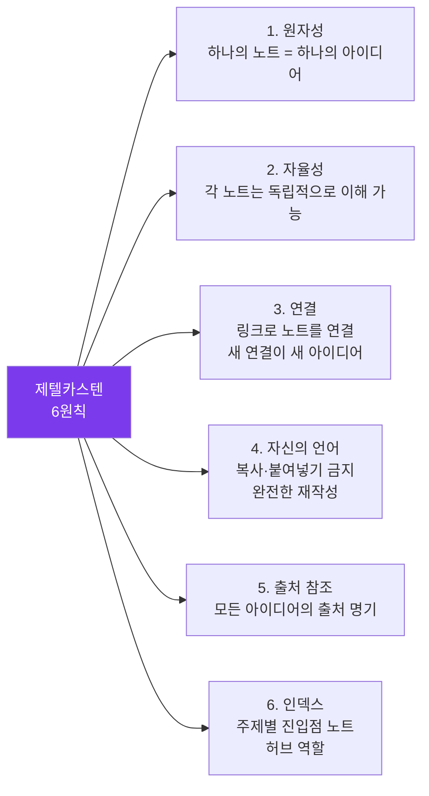

---
created:
  '{ date }': null
publish: true
status: 진행중
tags: []
title: ch21-zettelkasten
type: techbook
---

# Chapter 21. 제텔카스텐 — 지식 그물망 구축
> 플리트 노트 · 문헌 노트 · 영구 노트 · 인덱스 · 비선형 글쓰기

---

## 0) 연결 고리 (Bridge)

Chapter 20에서 독서 노트의 3단계 프로세스(임시→영구→연결)를 익혔습니다.  
이 챕터에서는 그 철학을 완전히 체계화한 **제텔카스텐(Zettelkasten)** 을 옵시디언에 구현합니다.  
제텔카스텐은 독일의 사회학자 니클라스 루만이 30년간 90,000개의 메모로 58권의 책을 쓴 지식 관리 시스템입니다.

---

## 1) 개념 정의 및 필요성

### 제텔카스텐이란?

> **제텔카스텐(Zettelkasten)은 독일어로 "메모 상자"를 의미하며, 아이디어를 카드에 기록하고 서로 연결해 지식 네트워크를 만드는 방법론입니다.**

루만의 핵심 발견: **"생산성은 아이디어의 수가 아닌 아이디어 간의 연결 수에서 나온다."**

**제텔카스텐의 3종 노트:**

| 유형 | 목적 | 형식 | 보관 |
|---|---|---|---|
| **플리트 노트** (Fleeting Note) | 순간적 아이디어 포착 | 거칠고 빠르게 | Inbox, 24~48시간 내 처리 |
| **문헌 노트** (Literature Note) | 읽은 것 요약 | 저자 관점, 자신의 언어 | 독서 노트 폴더 |
| **영구 노트** (Permanent Note) | 나만의 아이디어 | 하나의 원자 아이디어, 내 언어 | 메인 제텔카스텐 |

---

## 2) 핵심 원리 및 구조

### 제텔카스텐의 6가지 원칙



### 제텔카스텐 vs 일반 노트 시스템

| 비교 항목 | 일반 폴더·태그 시스템 | 제텔카스텐 |
|---|---|---|
| 정리 기준 | 주제별 계층 구조 | 아이디어 간 연결 |
| 노트 형태 | 길고 포괄적인 노트 | 짧고 독립적인 원자 노트 |
| 성장 방식 | 폴더 안에 축적 | 연결망으로 확장 |
| 글쓰기 | 처음부터 새로 작성 | 노트 연결에서 자연 발생 |
| 시간이 지날수록 | 찾기 어려워짐 | 연결이 더 강해짐 |

---

## 3) 실습 예제 — 옵시디언 제텔카스텐 구축

### 실습 21-1. 제텔카스텐 폴더 구조

```
my-vault/
├── zettelkasten/          ← 메인 제텔카스텐 폴더
│   ├── fleeting/          ← 플리트 노트 (24~48h 후 처리)
│   ├── literature/        ← 문헌 노트
│   └── permanent/         ← 영구 노트 (핵심!)
├── zettelkasten-index/    ← 인덱스 노트들
└── (기존 PARA 구조 유지)
```

> 📌 **NOTE:** 제텔카스텐과 PARA는 **병행 사용**이 가능합니다. PARA는 행동 기반(프로젝트·영역), 제텔카스텐은 지식 기반(아이디어 연결)으로 역할을 나눕니다. 영구 노트의 인사이트가 프로젝트에 활용되는 구조입니다.

---

### 실습 21-2. 영구 노트 작성 기술

**좋은 영구 노트의 구조:**

```markdown
# [아이디어 제목 — 주장 형태 문장]

[본문: 하나의 아이디어를 자신의 언어로 설명, 3~7문장]

[왜 이것이 중요한가, 또는 어떤 함의가 있는가]

---
## 연결된 노트
- [[관련 아이디어 A]] — [어떻게 연결되는가]
- [[관련 아이디어 B]] — [어떻게 연결되는가]
- [[반대 견해를 가진 노트]] — [어떻게 다른가]

## 출처
- [[문헌 노트 이름]] p.xxx
- [[다른 문헌]] p.xxx
```

**영구 노트 예시 1:**
```markdown
# 슬랙(Slack) 시간은 창의성의 필수 조건이다

조직이 100% 효율을 추구할 때 창의적 혁신은 불가능해진다.
여유 시간이 없으면 새로운 아이디어를 실험할 공간이 없기 때문이다.
3M이 직원에게 15% 자유 시간을 부여한 것이 포스트잇 발명으로 이어진 것처럼,
구조화되지 않은 시간이 돌파구를 만든다.

이는 개인에게도 적용된다 — 일정을 꽉 채우면 성찰과 연결의 시간이 없다.

---
## 연결된 노트
- [[딥 워크가 피상적 작업보다 더 많은 가치를 창출한다]] — 같은 맥락
- [[번아웃은 에너지 부족이 아닌 의미 부족이다]] — 반대 측면
- [[혁신은 계획이 아닌 놀이에서 온다]] — 동일 주제 다른 각도

## 출처
- [[슬랙 — 톰 드마르코 독서노트]] p.47
```

**영구 노트 예시 2:**
```markdown
# 쓰기는 생각의 결과가 아니라 생각의 도구다

대부분의 사람은 먼저 생각하고 나서 기록한다고 믿는다.
하지만 실제로 글을 쓰는 행위 자체가 사고를 명료하게 만든다.
"나는 쓰기 전까지 내가 무슨 생각을 하는지 모른다"는 감각이
이것을 잘 보여준다.

따라서 아이디어가 완전히 정리된 다음에 기록하려는 시도는
기록이 가져오는 사고의 혜택을 스스로 포기하는 것이다.

---
## 연결된 노트
- [[제텔카스텐은 외부 인지를 활용한다]] — 확장
- [[영구 노트는 단순 요약이 아닌 사고 행위다]] — 직접 연결
- [[완벽주의가 창의성을 막는다]] — 관련 장벽

## 출처
- [[글쓰기란 무엇인가 — William Zinsser]] p.12
- [[제텔카스텐으로 공부하라 — 숀케 아렌스]] p.88
```

---

### 실습 21-3. 인덱스 노트 — 제텔카스텐의 지도

인덱스 노트는 주제별 **진입점**이자 연관된 영구 노트들의 허브입니다.

```markdown
# 인덱스: 지식 관리와 학습

> 이 인덱스는 "어떻게 더 잘 배우고 기억할 수 있는가"에 관한 노트들의 허브입니다.

## 핵심 아이디어
1. [[쓰기는 생각의 결과가 아니라 생각의 도구다]]
2. [[간격 반복이 장기 기억의 가장 효율적인 방법이다]]
3. [[능동적 회상이 수동적 재독보다 3배 효과적이다]]
4. [[연결이 없는 정보는 망각된다]]

## 방법론
- [[제텔카스텐의 6가지 원칙]]
- [[PARA 방법론의 핵심]]
- [[GTD의 2분 규칙 적용법]]

## 도구
- [[옵시디언이 제텔카스텐에 최적화된 이유]]
- [[Anki로 간격 반복 구현하기]]

## 질문들 (탐구 중)
- [[왜 배운 것의 대부분은 잊혀지는가?]]
- [[메타인지는 학습 효율을 얼마나 높이는가?]]

## 연관 인덱스
- [[인덱스: 글쓰기와 창의성]]
- [[인덱스: 생산성과 집중]]
```

---

### 실습 21-4. 플리트 노트 → 영구 노트 변환 연습

**플리트 노트 (Inbox에서 발견):**
```
오늘 커피숍에서 문득 — 소셜미디어를 끄고 나니
깊이 생각하는 시간이 늘었다. 스마트폰 알림이
생각의 연속성을 끊는 게 아닐까?
→ 멀티태스킹 관련 뭔가
```

**변환 과정:**
```
① 플리트 노트 핵심 아이디어 파악:
   "알림이 깊은 사고를 방해한다"

② 영구 노트 제목 만들기 (주장 형태):
   "스마트폰 알림은 인지 흐름을 단절시킨다"

③ 자신의 언어로 3~7문장 작성

④ 연결할 기존 노트 찾기:
   → [[딥 워크]] → [[멀티태스킹의 신화]]

⑤ 출처 기록 (없으면 "개인 관찰" 명기)
```

**영구 노트 결과:**
```markdown
# 스마트폰 알림은 인지 흐름(Flow)을 단절시킨다

알림이 올 때마다 현재 작업을 중단하게 된다.
단순히 그 순간만의 문제가 아니다 — 한 번 단절된 집중 흐름을
회복하는 데 평균 23분이 걸린다는 연구가 있다.
알림이 하루 50번이면 순수 집중 시간은 이론적으로 거의 없다.

소셜미디어와 메신저가 설계된 방식 자체가
최대한 자주 앱으로 돌아오게 만드는 것이다.

---
## 연결된 노트
- [[딥 워크가 피상적 작업보다 더 많은 가치를 창출한다]]
- [[멀티태스킹은 뇌의 전환 비용을 무시한다]]
- [[슬랙(Slack) 시간은 창의성의 필수 조건이다]]

## 출처
- 개인 관찰 (2024-01-15)
- Gloria Mark (UC Irvine) 집중 회복 연구 23분
```

---

### 실습 21-5. 글쓰기로의 연결 — 제텔카스텐의 최종 목적

루만은 제텔카스텐을 "생각하는 파트너"라고 불렀습니다. 영구 노트가 쌓이면 글쓰기는 새로운 방식으로 이루어집니다.

**전통적 글쓰기:**
```
① 주제 결정
② 자료 수집
③ 개요 작성
④ 초안 작성 (처음부터 끝까지)
⑤ 수정
```

**제텔카스텐 글쓰기:**
```
① 인덱스 노트에서 관련 영구 노트 탐색
② 연결된 노트들을 나열해보기
③ 노트들 사이의 논리적 흐름 발견
④ 이미 있는 생각을 글로 엮기 (초안의 70%는 이미 존재)
⑤ 빠진 부분만 새로 작성
```

> 💡 **TIP:** "초안을 쓰는 것이 아니라, 이미 쓴 것을 엮는 것" — 이것이 제텔카스텐이 글쓰기를 변화시키는 방식입니다.

---

## 4) 실무 시나리오 (Best Practice)

### 제텔카스텐 성장 단계

**초기 (영구 노트 1~50개):**
```
아직 연결이 많지 않아 가치가 제한적으로 느껴질 수 있음.
이 단계에서 포기하는 것이 가장 큰 실수.
→ 매일 1개씩 꾸준히 추가가 핵심
```

**성장 (50~300개):**
```
연결이 보이기 시작함.
예상치 못한 아이디어 간 연결 발견이 즐거워짐.
인덱스 노트의 가치가 드러남.
```

**성숙 (300개 이상):**
```
글쓰기 시 이미 있는 노트에서 시작 가능.
새 아이디어가 자동으로 기존 연결망에 연결됨.
지식이 스스로 복잡성을 증가시킴.
```

### 안티 패턴

- **처음부터 완벽한 제텔카스텐을 구축하려는 시도:** 루만도 처음엔 그냥 메모를 시작했습니다. 나중에 연결하면 됩니다
- **영구 노트를 길게 쓰기:** 제텔카스텐의 원자성 원칙 위반입니다. 하나의 아이디어, 3~7문장이 이상적입니다
- **연결 없이 노트만 쌓기:** 연결 없는 노트는 일반 파일에 불과합니다. 노트를 저장하기 전 반드시 2개 이상의 연결을 확인하세요

---

## 5) 트러블슈팅 & 주의사항

### Q1. 영구 노트와 문헌 노트의 경계가 모호합니다

핵심 구분: **저자의 관점(문헌 노트)** 인가, **내 관점(영구 노트)** 인가입니다. "저자는 X라고 주장한다"면 문헌 노트. "나는 X라고 생각한다" 또는 "X는 Y를 의미한다"면 영구 노트입니다.

### Q2. 어떤 아이디어가 영구 노트가 될 자격이 있나요?

"6개월 후에도 이 아이디어가 여전히 흥미롭고 유용할 것인가?" 자문해보세요. 또한 다른 노트와 연결이 가능한 아이디어가 더 좋은 영구 노트가 됩니다.

### Q3. 영구 노트를 몇 개 만들어야 효과가 나타나나요?

루만은 수십 개에서 효과를 느끼기 시작했다고 했습니다. 그러나 연결의 질이 양보다 중요합니다. 잘 연결된 50개가 고립된 500개보다 가치 있습니다.

---

## 6) 한 줄 요약

> 💡 **Key Takeaway:**  
> 제텔카스텐은 아이디어를 수집하는 시스템이 아니라 **아이디어가 스스로 연결되어 새 지식을 만드는** 생태계다.  
> **원자적 영구 노트 + 연결 + 인덱스 세 가지가 갖춰지면 보관소 자체가 생각하는 파트너가 된다.**

---

## 🔖 이 챕터의 체크리스트

- [ ] 제텔카스텐 폴더 구조(fleeting/literature/permanent)를 만들었다
- [ ] 영구 노트 10개 이상을 작성했다 (주장 형태 제목, 내 언어)
- [ ] 각 영구 노트에 [[링크]] 2개 이상을 추가했다
- [ ] 인덱스 노트를 1개 이상 만들었다
- [ ] 플리트 노트를 영구 노트로 변환하는 과정을 실습했다
- [ ] 제텔카스텐 노트에서 짧은 글(500자 이상)을 써봤다

---

*이전 챕터: [Chapter 20 — 독서 노트 시스템](ch20-reading.md)*  
*다음 챕터: [Chapter 22 — Dataview 완전 정복](ch22-dataview.md)*