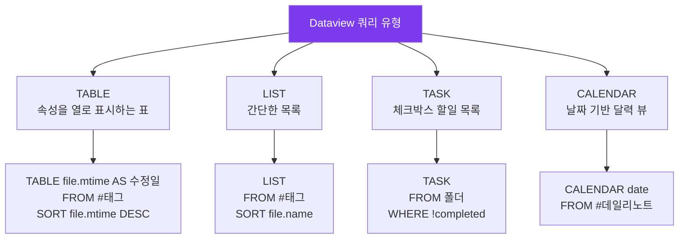

---
created:
  '{ date }': null
modified: 2026-01-01
publish: true
status: 진행중
tags: []
title: ch22-dataview
type: techbook
---

# Chapter 22. Dataview 완전 정복
> TABLE · LIST · TASK · CALENDAR · DQL · 인라인 쿼리 · 실전 대시보드

---

## 0) 연결 고리 (Bridge)

Chapter 21에서 제텔카스텐으로 지식 네트워크를 구축했습니다.  
이 챕터에서는 그 네트워크와 PARA 전체를 **데이터베이스처럼 조회**하는 Dataview를 완전히 정복합니다.  
Dataview는 옵시디언에서 가장 강력한 커뮤니티 플러그인으로, SQL과 유사한 쿼리 언어로 보관소의 모든 노트를 실시간으로 조회·정렬·필터링합니다.

---

## 1) 개념 정의 및 필요성

### Dataview란?

> **Dataview는 옵시디언 보관소의 노트와 YAML 속성을 관계형 데이터베이스처럼 쿼리할 수 있게 하는 플러그인입니다.**

노트가 100개를 넘어가는 순간, 수동으로 목록을 관리하는 것은 불가능해집니다.  
Dataview는 이 문제를 완전히 해결합니다.

**Dataview가 할 수 있는 것:**
```
✅ 특정 태그의 노트 목록 자동 생성
✅ 완료되지 않은 할일 전체 보기
✅ 날짜순·평점순·우선순위순 정렬
✅ 여러 조건으로 필터링
✅ 속성값을 표(Table)로 시각화
✅ 달력 형태로 노트 날짜 표시
✅ 계산·집계 (총합, 카운트, 평균)
```

---

## 2) 핵심 원리 및 구조

### Dataview 쿼리 유형 4가지



### DQL(Dataview Query Language) 기본 문법

```
[쿼리 유형]         ← TABLE / LIST / TASK / CALENDAR
[필드]              ← 표시할 속성 (TABLE에서만)
FROM [소스]         ← 데이터 출처
WHERE [조건]        ← 필터링 조건
SORT [기준] [방향]  ← 정렬
LIMIT [숫자]        ← 결과 개수 제한
GROUP BY [기준]     ← 그룹화
FLATTEN [필드]      ← 배열 값 펼치기
```

---

## 3) 실습 예제 — DQL 완전 정복

### 3.1 FROM — 데이터 소스 지정

```dataview 예시
-- 태그로 지정
FROM #독서노트
FROM #project AND #status/진행중

-- 폴더로 지정
FROM "10-PROJECTS"
FROM "30-RESOURCES/독서노트"

-- 전체 보관소
FROM ""

-- 제외 연산자
FROM -"90-ARCHIVES"

-- 특정 노트에서 링크된 것
FROM [[허브 노트]]
FROM outgoing([[허브 노트]])

-- 특정 노트에 링크된 것 (백링크)
FROM incoming([[허브 노트]])
```

---

### 3.2 WHERE — 조건 필터링

```
-- 기본 비교
WHERE status = "완료"
WHERE rating >= 4
WHERE rating != 5
WHERE pages > 300

-- 날짜 비교
WHERE date >= date(2024-01-01)
WHERE file.mtime >= date(today) - dur(7 days)
WHERE file.ctime = date(today)

-- 문자열 포함
WHERE contains(tags, "독서노트")
WHERE contains(file.name, "회의록")
WHERE icontains(title, "obsidian")   ← 대소문자 무시

-- 존재 여부
WHERE author           ← author 속성이 있는 노트
WHERE !completed       ← completed가 false인 할일
WHERE due              ← due 속성이 있는 것

-- 복합 조건
WHERE status = "진행중" AND priority = 1
WHERE status = "완료" OR status = "중단"
WHERE rating >= 4 AND genre = "tech"
WHERE !(status = "완료")
```

---

### 3.3 SORT — 정렬

```
SORT file.mtime DESC          ← 최근 수정 순
SORT rating DESC              ← 평점 높은 순
SORT due ASC                  ← 마감 가까운 순
SORT priority ASC, due ASC    ← 복합 정렬 (우선순위 → 마감)
SORT file.name ASC            ← 파일명 가나다 순
```

---

### 3.4 실전 쿼리 20종

**기본 목록 쿼리:**
````markdown
-- 최근 수정된 노트 10개
```dataview
LIST
FROM ""
SORT file.mtime DESC
LIMIT 10
```

-- 태그별 노트 수
```dataview
TABLE length(rows) AS "노트 수"
FROM ""
WHERE file.tags
GROUP BY file.tags
SORT length(rows) DESC
```
````

**프로젝트 관리 쿼리:**
````markdown
-- 진행 중인 프로젝트 (우선순위·마감 정렬)
```dataview
TABLE status AS "상태", priority AS "우선순위", due_date AS "마감일", progress AS "진행률%"
FROM "10-PROJECTS"
WHERE type = "project" AND status = "진행중"
SORT priority ASC, due_date ASC
```

-- 이번 주 마감 프로젝트
```dataview
TABLE due_date AS "마감일", status AS "상태"
FROM #project
WHERE due_date >= date(today) AND due_date <= date(today) + dur(7 days)
SORT due_date ASC
```

-- 기한 초과 프로젝트
```dataview
TABLE due_date AS "마감일 (초과)", status AS "상태"
FROM #project
WHERE due_date < date(today) AND status != "완료"
SORT due_date ASC
```
````

**독서 데이터베이스 쿼리:**
````markdown
-- 연도별 독서량
```dataview
TABLE length(rows) AS "완독 권수", sum(rows.pages) AS "총 페이지"
FROM #독서노트
WHERE status = "완료"
GROUP BY dateformat(finished, "yyyy")
SORT key DESC
```

-- 평점 5점 도서 (추천 목록)
```dataview
TABLE author AS "저자", genre AS "장르", finished AS "완독"
FROM #독서노트
WHERE rating = 5
SORT finished DESC
```

-- 장르별 평균 평점
```dataview
TABLE round(average(rows.rating), 1) AS "평균 평점", length(rows) AS "권수"
FROM #독서노트
WHERE status = "완료"
GROUP BY genre
SORT average(rows.rating) DESC
```
````

**할일 관리 쿼리:**
````markdown
-- 미완료 할일 전체
```dataview
TASK
FROM ""
WHERE !completed
SORT due ASC
```

-- 오늘 마감 할일
```dataview
TASK
FROM ""
WHERE !completed AND due = date(today)
```

-- 완료된 할일 (오늘)
```dataview
TASK
FROM ""
WHERE completed AND completion = date(today)
```

-- 태그별 할일
```dataview
TASK
FROM ""
WHERE !completed AND contains(tags, "context/computer")
```
````

**날짜·캘린더 쿼리:**
````markdown
-- 데일리 노트 달력
```dataview
CALENDAR date
FROM #데일리노트
```

-- 이번 달 생성된 노트
```dataview
TABLE file.ctime AS "생성일"
FROM ""
WHERE dateformat(file.ctime, "yyyy-MM") = dateformat(date(today), "yyyy-MM")
SORT file.ctime DESC
```
````

**제텔카스텐 쿼리:**
````markdown
-- 연결이 적은 영구 노트 (고립 위험)
```dataview
TABLE length(file.outlinks) AS "아웃링크", length(file.inlinks) AS "인링크"
FROM "zettelkasten/permanent"
WHERE length(file.outlinks) < 2 OR length(file.inlinks) = 0
SORT length(file.outlinks) ASC
```

-- 가장 많이 참조된 영구 노트 (허브)
```dataview
TABLE length(file.inlinks) AS "참조 수"
FROM "zettelkasten/permanent"
SORT length(file.inlinks) DESC
LIMIT 10
```
````

---

### 3.5 인라인 쿼리 — 문장 안에 Dataview

````markdown
현재 진행 중인 프로젝트는 총 `= length(dv.pages("#project").where(p => p.status == "진행중"))` 개입니다.

오늘 날짜: `= date(today)`

최근 수정 파일: `= link(dv.pages("").sort(p => p.file.mtime, "desc")[0].file.path)`
````

> 📌 **NOTE:** 인라인 쿼리는 `= 표현식` 형태로 본문 안에 직접 삽입됩니다. Dataview 설정에서 `인라인 쿼리 활성화`가 켜져 있어야 합니다.

---

### 3.6 종합 실전 대시보드

**`00-INBOX/메인 대시보드.md`:**
````markdown
---
tags: [dashboard, hub]
---
# 🏠 메인 대시보드

*최종 업데이트: `= date(today)`*

---

## 📥 Inbox (처리 필요)
```dataview
LIST
FROM "00-INBOX"
WHERE file.name != "메인 대시보드" AND file.name != "GTD 대시보드"
SORT file.ctime ASC
LIMIT 5
```

## 🔴 오늘 마감
```dataview
TABLE due_date AS "마감", status AS "상태"
FROM #project
WHERE due_date = date(today) AND status != "완료"
```

## 🟡 이번 주 할 것 (Top 5)
```dataview
TASK
FROM "10-PROJECTS/다음-행동"
WHERE !completed
LIMIT 5
```

## 📋 진행 중인 프로젝트
```dataview
TABLE status AS "상태", due_date AS "마감", priority AS "우선순위"
FROM "10-PROJECTS"
WHERE type = "project" AND status = "진행중"
SORT priority ASC
```

## 📚 현재 읽는 중
```dataview
TABLE author AS "저자", started AS "시작"
FROM #독서노트
WHERE status = "읽는중"
```

## 🕸️ 최근 추가 영구 노트
```dataview
LIST
FROM "zettelkasten/permanent"
SORT file.ctime DESC
LIMIT 5
```

## 📅 이번 주 데일리 노트
```dataview
CALENDAR date
FROM #데일리노트
WHERE date >= date(today) - dur(7 days)
```
````

---

## 4) 실무 시나리오 (Best Practice)

### Dataview 최적화 팁

**성능 개선:**
```
- FROM "" (전체 검색) 대신 FROM "특정 폴더" 사용
- LIMIT로 결과 제한
- 복잡한 쿼리는 단순화하거나 Dataviewjs 사용
```

**재사용 가능한 쿼리 관리:**
```
자주 쓰는 쿼리를 templates/ 폴더에 저장
→ Templater로 대시보드에 자동 삽입
```

### 안티 패턴

- **모든 정보를 Dataview로만 관리:** Dataview는 조회 도구이지 편집 도구가 아닙니다. 실제 데이터는 개별 노트의 YAML 속성에 있어야 합니다
- **너무 복잡한 쿼리:** 쿼리가 길고 복잡해질수록 유지보수가 어렵습니다. 단순한 쿼리 여러 개를 병렬로 사용하는 것이 낫습니다

---

## 5) 트러블슈팅 & 주의사항

### Q1. 쿼리 결과가 빈 테이블로 표시됩니다

가장 흔한 원인 3가지:
1. YAML 속성 이름 오타 (예: `staus` vs `status`)
2. FROM 경로에 오타 (대소문자 구분)
3. WHERE 조건값과 실제 값 불일치 (예: `"진행중"` vs `"진행 중"`)

**디버깅:** `TABLE file.name, file.tags, status FROM ""` 로 실제 값을 먼저 확인하세요.

### Q2. 날짜 비교가 작동하지 않습니다

YAML의 날짜는 `date: 2024-01-15` (따옴표 없음) 형식이어야 합니다. 따옴표로 감싸면 문자열로 인식되어 날짜 비교가 안 됩니다.

### Q3. `sum()`, `average()` 같은 집계 함수가 오류납니다

집계 함수는 `GROUP BY`와 함께 `rows.속성명` 형태로 사용해야 합니다.
```
TABLE sum(rows.rating) AS "합계"
GROUP BY genre
```

---

## 6) 한 줄 요약

> 💡 **Key Takeaway:**  
> Dataview는 보관소를 정적인 파일 더미에서 동적인 데이터베이스로 변환한다.  
> **TABLE로 속성을 시각화하고, TASK로 할일을 추적하고, CALENDAR로 날짜를 확인하는 세 가지 쿼리 유형을 마스터하면 보관소 전체를 하나의 지식 운영 시스템으로 운용할 수 있다.**

---

## 🔖 이 챕터의 체크리스트

- [ ] TABLE·LIST·TASK·CALENDAR 4종 쿼리를 각각 1개 이상 작성했다
- [ ] FROM·WHERE·SORT·LIMIT 4가지 절을 모두 사용해봤다
- [ ] 독서 데이터베이스 쿼리 3종을 완성했다
- [ ] 할일 관련 TASK 쿼리 2종을 완성했다
- [ ] 메인 대시보드를 완성하고 모든 쿼리가 작동함을 확인했다
- [ ] 인라인 쿼리를 노트 본문에 삽입했다

---

*이전 챕터: [Chapter 21 — 제텔카스텐](ch21-zettelkasten.md)*  
*다음 챕터: [Chapter 23 — 테마와 CSS 커스터마이즈](./ch23-themes.md)*