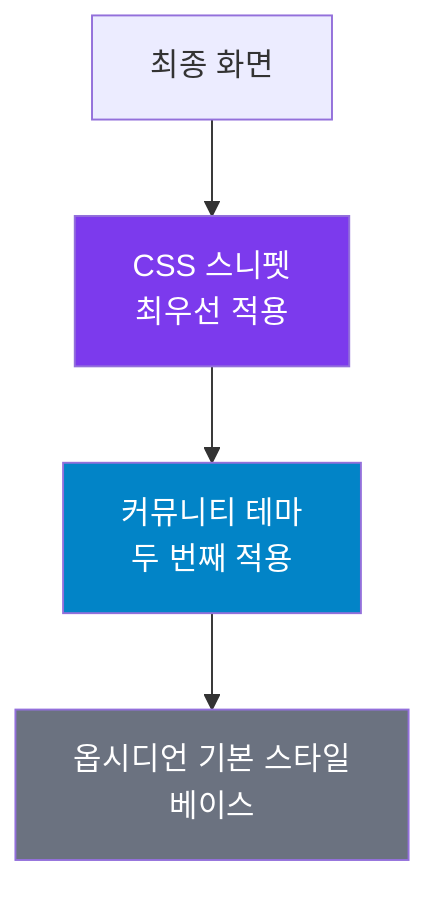

---
created:
  '{ date }': null
publish: true
status: 진행중
tags: []
title: ch23-themes
type: techbook
---

# Chapter 23. 테마와 CSS 커스터마이즈
> 공식 테마 · CSS 스니펫 · 폰트 · 다크·라이트 모드 · 인쇄 최적화

---

## 0) 연결 고리 (Bridge)

Chapter 22에서 Dataview로 보관소를 데이터베이스처럼 조회했습니다.  
이 챕터에서는 시각적 환경을 완전히 내 취향으로 바꾸는 **테마·CSS 커스터마이즈**를 다룹니다.  
기능이 완벽해도 화면이 눈에 편안하지 않으면 오래 사용하기 어렵습니다. 내 눈과 작업 스타일에 맞는 환경을 만드는 것이 이 챕터의 목표입니다.

---

## 1) 개념 정의 및 필요성

### 옵시디언 외관 커스터마이즈 3계층

```
계층 1: 테마 (Theme)
  → 전체적인 색상·폰트·레이아웃 변경
  → 커뮤니티에서 설치, 클릭 한 번으로 적용
  → 약 100개 이상의 커뮤니티 테마 존재

계층 2: CSS 스니펫 (Snippet)
  → 테마 위에 특정 부분만 덮어쓰는 소규모 CSS
  → 직접 작성하거나 커뮤니티에서 복사
  → 여러 스니펫 조합 가능

계층 3: 설정 내 옵션
  → 폰트·크기·줄 간격 등 UI 설정으로 제어 가능한 것
  → CSS 지식 불필요
```

---

## 2) 핵심 원리 및 구조

### CSS 적용 우선순위



---

## 3) 실습 예제

### 실습 23-1. 커뮤니티 테마 설치 및 적용

```
설정 → 외관(Appearance) → 테마 → [탐색]

인기 테마 5종:
  Minimal       — 미니멀, 깔끔, 생산성 특화
  Things        — macOS Things 앱 스타일
  Obsidian Nord — 차갑고 안정적인 Nord 팔레트
  AnuPpuccin    — Catppuccin 컬러 기반, 아기자기
  Prism         — 선명한 컬러, 코딩 최적화

설치 방법:
① 테마 이름 검색 → [설치 후 사용]
② 설정 → 외관 → 테마에서 확인·전환
③ 테마별 추가 설정이 있으면 Style Settings 플러그인 필요
```

> 💡 **TIP:** **Minimal 테마** + **Style Settings 플러그인** 조합은 가장 많은 사용자가 선택하는 최강 조합입니다. Style Settings를 통해 색상·폰트·레이아웃을 UI로 세밀하게 조절할 수 있습니다.

---

### 실습 23-2. 폰트 설정 최적화

```
설정 → 외관(Appearance):

인터페이스 폰트:
  한국어 최적화: "Noto Sans KR", "Pretendard", "KoPubWorld돋움"
  일반: "Inter", "SF Pro" (macOS)

텍스트 폰트 (노트 본문):
  가독성: "Noto Serif KR", "KoPubWorld바탕"
  코딩 스타일: "JetBrains Mono", "Fira Code"

모노스페이스 폰트 (코드 블록):
  "JetBrains Mono", "Cascadia Code", "Fira Code"

폰트 크기: 16px (기본) → 눈의 피로도에 따라 14~20px 조절
줄 간격: 1.5~1.8 (한국어는 1.6 권장)
```

**한국어 폰트 설치:**
```
① 구글 폰트 (fonts.google.com) → "Noto Sans KR" 다운로드
② 또는 Pretendard (github.com/orioncactus/pretendard) 설치
③ 시스템에 폰트 설치 후 옵시디언 재시작
④ 설정 → 외관 → 폰트 이름 입력
```

---

### 실습 23-3. CSS 스니펫 기본 사용법

**스니펫 파일 위치:**
```
보관소/.obsidian/snippets/ 폴더
→ 이 폴더에 .css 파일 생성하면 자동 인식

설정 → 외관 → CSS 스니펫:
→ 생성한 스니펫 파일 목록 표시
→ 토글로 켜기/끄기
→ 새로고침 아이콘으로 변경사항 적용
```

**첫 번째 스니펫 만들기:**
```css
/* .obsidian/snippets/my-custom.css */

/* 헤딩 색상 변경 */
.markdown-preview-view h1 {
    color: #7C3AED;
}

.markdown-preview-view h2 {
    color: #0284C7;
}

/* 인용구 스타일 */
.markdown-preview-view blockquote {
    border-left: 4px solid #7C3AED;
    background-color: rgba(124, 58, 237, 0.05);
    padding: 1em;
    border-radius: 4px;
}
```

---

### 실습 23-4. 실전 CSS 스니펫 모음

**스니펫 1: 체크박스 커스터마이즈**
```css
/* snippets/checkbox-style.css */

/* 완료된 체크박스 취소선 없애기 */
.markdown-preview-view .task-list-item.is-checked {
    text-decoration: none;
    opacity: 0.6;
}

/* 체크박스 색상 변경 */
input[type="checkbox"]:checked {
    background-color: #059669 !important;
    border-color: #059669 !important;
}
```

**스니펫 2: 콜아웃 색상 커스터마이즈**
```css
/* snippets/callout-custom.css */

/* 커스텀 콜아웃 타입 추가 */
.callout[data-callout="think"] {
    --callout-color: 124, 58, 237;
    --callout-icon: lucide-brain;
}

.callout[data-callout="quote"] {
    --callout-color: 217, 119, 6;
    --callout-icon: lucide-quote;
}
```

**스니펫 3: 노트 너비 조절 (읽기 모드)**
```css
/* snippets/readable-width.css */

/* 읽기 모드 최대 너비 조절 */
.markdown-preview-view {
    max-width: 800px;
    margin: 0 auto;
}

/* 편집 모드도 동일하게 */
.cm-contentContainer {
    max-width: 800px;
    margin: 0 auto;
}
```

**스니펫 4: 태그 스타일 배지화**
```css
/* snippets/tag-badge.css */

/* 태그를 배지 형태로 표시 */
.tag {
    background-color: rgba(124, 58, 237, 0.1);
    color: #7C3AED;
    border-radius: 4px;
    padding: 2px 6px;
    font-size: 0.85em;
    text-decoration: none !important;
}

.tag:hover {
    background-color: rgba(124, 58, 237, 0.2);
}
```

**스니펫 5: 다크 모드 한국어 가독성 개선**
```css
/* snippets/dark-korean.css */

/* 다크 모드에서 한국어 텍스트 밝기 조절 */
.theme-dark .markdown-preview-view {
    color: #e2e8f0;
    letter-spacing: 0.02em;
    line-height: 1.8;
}

.theme-dark .markdown-preview-view h1,
.theme-dark .markdown-preview-view h2 {
    color: #f8fafc;
}
```

**스니펫 6: 인쇄 최적화**
```css
/* snippets/print-optimize.css */

@media print {
    /* 사이드바 숨기기 */
    .workspace-split.mod-left-split,
    .workspace-split.mod-right-split {
        display: none !important;
    }

    /* 배경색 제거 */
    body {
        background: white !important;
    }

    /* 인쇄용 폰트 크기 */
    .markdown-preview-view {
        font-size: 12pt;
        line-height: 1.8;
        color: black !important;
    }

    /* 페이지 나누기 */
    h1 {
        page-break-before: always;
    }
}
```

---

### 실습 23-5. CSS 변수(Variable) 활용

옵시디언은 CSS 변수로 테마 색상을 관리합니다. 변수를 재정의하면 테마 전체에 적용됩니다.

```css
/* snippets/custom-vars.css */

/* 라이트 모드 색상 변수 재정의 */
.theme-light {
    --color-accent: #7C3AED;         /* 강조색 */
    --color-accent-1: #6D28D9;       /* 강조색 어두운 버전 */
    --color-accent-2: #8B5CF6;       /* 강조색 밝은 버전 */
    --background-primary: #fafafa;   /* 주 배경색 */
    --text-normal: #1a1a2e;          /* 기본 텍스트 색 */
    --text-muted: #6b7280;           /* 흐린 텍스트 색 */
    --font-text-size: 16px;          /* 텍스트 크기 */
    --line-height-normal: 1.7;       /* 줄 간격 */
}

/* 다크 모드 색상 변수 재정의 */
.theme-dark {
    --color-accent: #8B5CF6;
    --background-primary: #1a1a2e;
    --background-secondary: #16213e;
    --text-normal: #e2e8f0;
}
```

> 💡 **TIP:** 옵시디언의 전체 CSS 변수 목록은 개발자 도구(Ctrl/Cmd+Shift+I)에서 `:root` 또는 `.theme-light`·`.theme-dark` 선택자를 검사하면 확인할 수 있습니다.

---

### 실습 23-6. Style Settings 플러그인 활용

Style Settings는 CSS를 직접 작성하지 않고도 테마의 커스터마이즈 옵션을 UI로 조절할 수 있게 합니다.

```
설치: 커뮤니티 플러그인 → "Style Settings" 설치·활성화

사용:
① 설정 → Style Settings
② 설치된 테마의 커스터마이즈 옵션 표시
③ 색상, 폰트 크기, 레이아웃 등을 슬라이더·드롭다운으로 조절
```

> 📌 **NOTE:** Style Settings는 테마가 지원해야 옵션이 나타납니다. Minimal, AnuPpuccin, Prism 등 주요 테마는 Style Settings를 완벽히 지원합니다.

---

## 4) 실무 시나리오 (Best Practice)

### 목적별 환경 구성

**집필·글쓰기 환경:**
```
테마: Minimal (라이트 모드)
폰트: 본문 — Noto Serif KR 16px, 줄간격 1.8
스니펫: 읽기 너비 700~800px, 인쇄 최적화
```

**코딩·기술 노트 환경:**
```
테마: Prism (다크 모드)
폰트: JetBrains Mono (모노스페이스)
스니펫: 코드 블록 라인 번호 표시
```

**독서·학습 환경:**
```
테마: AnuPpuccin (다크 모드)
폰트: Noto Serif KR, 줄간격 2.0
스니펫: 태그 배지화, 형광펜 하이라이트 강조
```

### 안티 패턴

- **테마를 자주 바꾸는 것:** 테마 전환에 시간 투자하는 것은 생산성 위장 회피입니다. 한 테마를 3~4주 써보고 불편한 점을 CSS 스니펫으로 해결하세요
- **CSS 없이 무조건 플러그인 의존:** 간단한 스타일 변경은 CSS 10줄이면 됩니다. 그것을 위해 플러그인을 설치하면 불필요한 의존성이 늘어납니다

---

## 5) 트러블슈팅 & 주의사항

### Q1. CSS 스니펫을 저장했는데 반영이 안 됩니다

`설정 → 외관 → CSS 스니펫` 에서 해당 스니펫이 **켜져 있는지** 확인하세요. 그리고 새로고침(🔄) 버튼을 눌러 스니펫 목록을 다시 불러오세요.

### Q2. CSS가 반영되지 않는 특정 요소가 있습니다

개발자 도구(Ctrl/Cmd+Shift+I)로 해당 요소의 실제 CSS 선택자를 확인하세요. 읽기 모드와 편집 모드의 CSS 클래스가 다를 수 있습니다.

### Q3. 테마 설치 후 옵시디언이 느려졌습니다

일부 테마는 복잡한 CSS 애니메이션을 포함합니다. 설정 → 외관 → `애니메이션 줄이기` 옵션을 켜거나, 더 가벼운 테마(Minimal 등)로 전환하세요.

### Q4. 옵시디언 업데이트 후 테마가 깨집니다

테마 개발자가 새 버전에 맞게 업데이트를 하지 않았을 수 있습니다. `설정 → 커뮤니티 플러그인 → 업데이트 확인`에서 테마 업데이트도 함께 확인하세요.

---

## 6) 한 줄 요약

> 💡 **Key Takeaway:**  
> 좋은 환경은 장시간 집중을 가능하게 한다. 테마로 전체 분위기를 잡고, CSS 스니펫으로 불편한 세부 사항을 정밀 조정하라.  
> **Minimal 테마 + Style Settings + 나만의 스니펫 3~5개가 가장 효율적인 조합이다.**

---

## 🔖 이 챕터의 체크리스트

- [ ] 커뮤니티 테마 3개를 설치하고 비교했다
- [ ] 최종 테마를 선택하고 적용했다
- [ ] 한국어 최적화 폰트를 설치하고 설정했다
- [ ] CSS 스니펫 파일을 2개 이상 직접 작성했다
- [ ] 스니펫이 실시간으로 반영되는 것을 확인했다
- [ ] 다크 모드와 라이트 모드를 모두 설정했다

---

*이전 챕터: [Chapter 22 — Dataview 완전 정복](./ch22-dataview.md)*  
*다음 챕터: [Chapter 24 — MCP 연동](ch24-mcp.md)*