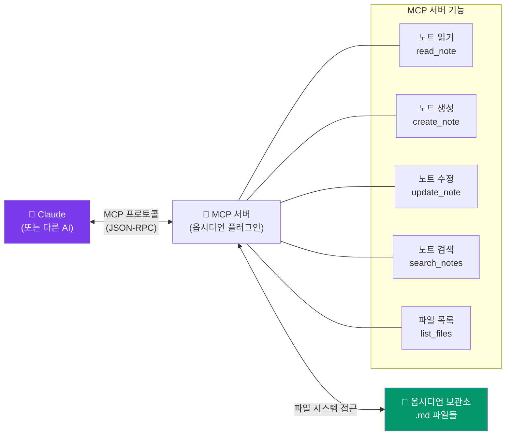

---
created:
  '{ date }': null
modified: 2026-01-01
publish: true
status: 진행중
tags: []
title: ch24-mcp
type: techbook
---

# Chapter 24. MCP 연동 — AI와 보관소 연결
> Model Context Protocol · Claude · 자동화 · 노트 생성 · 지식 검색

---

## 0) 연결 고리 (Bridge)

Chapter 23에서 시각 환경을 최적화했습니다.  
이 챕터에서는 옵시디언에 **AI를 연결**하는 가장 강력한 방법인 **MCP(Model Context Protocol)** 를 다룹니다.  
MCP를 통해 Claude 같은 AI가 보관소를 직접 읽고, 노트를 생성하고, 지식을 검색하는 것이 가능해집니다.

---

## 1) 개념 정의 및 필요성

### MCP(Model Context Protocol)란?

> **MCP는 AI 모델이 외부 도구·데이터 소스와 표준화된 방식으로 상호작용할 수 있게 하는 Anthropic의 개방형 프로토콜입니다.**

쉽게 말해, MCP는 **AI와 앱 사이의 표준 USB 포트**입니다. 옵시디언 MCP 서버를 설치하면 Claude가 보관소와 직접 대화할 수 있습니다.

**MCP로 가능한 것:**
```
✅ Claude에게 "오늘 읽은 책 독서 노트 작성해줘" 요청
   → Claude가 독서 노트 템플릿으로 노트 자동 생성

✅ "내 모든 프로젝트에서 지연된 것 찾아줘"
   → Claude가 보관소를 검색하고 분석 결과 제공

✅ "이 PDF의 내용으로 제텔카스텐 영구 노트 5개 만들어줘"
   → Claude가 노트 구조에 맞게 자동 생성

✅ "내 독서 데이터로 올해 독서 회고 작성해줘"
   → Claude가 Dataview 쿼리로 데이터 수집 후 회고문 생성
```

---

## 2) 핵심 원리 및 구조

### MCP 연동 구조



---

## 3) 실습 예제 — MCP 연동 설정

### 실습 24-1. 옵시디언 MCP 서버 설치

**방법 A: Obsidian-MCP 커뮤니티 플러그인 (권장)**
```
커뮤니티 플러그인 탐색 → "MCP" 검색
→ "Obsidian MCP Server" 또는 "MCP Tools" 설치

주요 MCP 플러그인:
  - obsidian-mcp: 기본 파일 읽기·쓰기
  - obsidian-local-rest-api: REST API로 외부 접근
```

**방법 B: Node.js MCP 서버 (고급)**
```bash
# Node.js 18 이상 필요
npm install -g @anthropic-ai/mcp-server-obsidian

# 서버 실행
mcp-server-obsidian --vault /path/to/your/vault
```

**방법 C: Claude Desktop 직접 연동**
```json
// Claude Desktop 설정 파일에 추가
// macOS: ~/Library/Application Support/Claude/claude_desktop_config.json
// Windows: %APPDATA%\Claude\claude_desktop_config.json

{
  "mcpServers": {
    "obsidian": {
      "command": "npx",
      "args": [
        "-y",
        "@anthropic-ai/mcp-server-obsidian",
        "--vault",
        "/Users/username/Documents/my-vault"
      ]
    }
  }
}
```

---

### 실습 24-2. Claude Desktop에서 보관소 연결 확인

```
① Claude Desktop 앱 시작
② 새 대화 시작
③ 파일 첨부 아이콘 옆에 🔌 아이콘 확인
   → MCP 서버가 연결됨을 의미
④ 테스트 질문: "내 옵시디언 보관소에 있는 최근 노트 5개 알려줘"
⑤ Claude가 실제 파일 목록을 반환하는지 확인
```

---

### 실습 24-3. MCP 활용 — 자동 노트 생성

**활용 예시 1: 독서 노트 자동 생성**
```
사용자 → Claude:
"[책 제목: 원씽, 저자: 게리 켈러]을 읽었어.
내 독서 노트 템플릿 형식으로 노트 만들어줘.
핵심 주제는 '한 가지에 집중하는 것의 힘'이야.
평점은 5점이고 장르는 자기계발이야."

Claude → 옵시디언:
→ 30-RESOURCES/독서노트/원씽.md 자동 생성
→ 독서 노트 템플릿 구조 적용
→ YAML 속성 자동 입력
```

**활용 예시 2: 회의록 자동 정리**
```
사용자 → Claude:
"아래 회의 내용을 회의록 형식으로 정리해서
20-projects/프로젝트A/ 폴더에 저장해줘:
[회의 음성 녹음 또는 텍스트 붙여넣기]"

Claude → 옵시디언:
→ 회의록 템플릿으로 구조화
→ 결정 사항·액션 아이템 추출
→ 노트 자동 저장
```

**활용 예시 3: 영구 노트 생성**
```
사용자 → Claude:
"내가 방금 읽은 이 논문에서 제텔카스텐 영구 노트
5개를 만들어줘. 각 노트는 주장 형태 제목,
3~7문장 본문, 연결 노트 제안으로 구성해줘:
[논문 내용 또는 요약 붙여넣기]"

Claude → 옵시디언:
→ zettelkasten/permanent/ 폴더에 5개 노트 생성
→ 각 노트는 표준 영구 노트 형식 적용
```

---

### 실습 24-4. MCP 활용 — 지식 검색 및 분석

**활용 예시 4: 보관소 분석**
```
사용자 → Claude:
"내 보관소에서 '생산성'과 관련된 모든 노트를 찾아서
공통 주제와 서로 연결되지 않은 아이디어를 찾아줘"

Claude → 보관소 검색:
→ '생산성' 키워드 전체 검색
→ 연결 구조 분석
→ 고립된 아이디어 발견·보고
```

**활용 예시 5: 주간 리뷰 자동화**
```
사용자 → Claude:
"이번 주 데일리 노트들을 읽고
주간 리뷰 노트를 작성해줘.
성과, 어려운 점, 다음 주 액션 아이템 형식으로"

Claude → 보관소:
→ 이번 주 데일리 노트 7개 읽기
→ 내용 분석 및 요약
→ 주간 리뷰 템플릿으로 노트 생성
```

**활용 예시 6: 글쓰기 지원**
```
사용자 → Claude:
"내 제텔카스텐에서 '집중'과 관련된 영구 노트들을
모두 읽고, 이것들을 연결해서 블로그 포스트 초안을
작성해줘. 1500자 분량으로"

Claude → 보관소:
→ 관련 영구 노트 검색
→ 노트 내용 분석·통합
→ 블로그 포스트 초안 생성
```

---

### 실습 24-5. Smart Connections 플러그인 (AI 유사도 검색)

MCP 외에, Smart Connections는 AI 임베딩을 활용해 의미적으로 유사한 노트를 찾아줍니다.

```
설치: 커뮤니티 플러그인 → "Smart Connections" 설치

기능:
  - 현재 노트와 의미적으로 가장 유사한 노트 자동 추천
  - "이 글과 관련된 다른 노트" 실시간 표시
  - 키워드가 아닌 의미 유사도 기반 검색

사용:
  우측 사이드바 → Smart Connections 탭
  → 현재 노트 내용 분석 후 관련 노트 목록 표시
  → 클릭하면 해당 노트로 이동
```

> 💡 **TIP:** Smart Connections는 제텔카스텐에서 놓친 연결을 찾아내는 데 특히 유용합니다. "이 노트와 비슷한 아이디어를 가진 다른 노트"를 발견해 새로운 링크를 추가하는 계기가 됩니다.

---

### 실습 24-6. Obsidian Copilot 플러그인

```
설치: 커뮤니티 플러그인 → "Copilot" 설치

기능:
  - 노트 작성 중 AI 자동완성
  - 선택 텍스트를 AI로 개선·번역·요약
  - 보관소 전체 검색 후 AI 답변

OpenAI 또는 Anthropic API 키 설정:
  설정 → Copilot → API Key 입력
  → Claude 또는 GPT 모델 선택
```

---

## 4) 실무 시나리오 (Best Practice)

### MCP 활용 고급 워크플로우

**일일 노트 AI 요약 워크플로우:**
```
저녁 루틴:
① 오늘 데일리 노트 완성
② Claude에게: "오늘 데일리 노트를 읽고
   내일 할 일 Top 3를 제안해줘"
③ Claude가 오늘 노트 분석 후 제안
④ 제안을 내일 데일리 노트에 자동 삽입
```

**연구 논문 처리 워크플로우:**
```
① PDF 논문 → Claude에게 전달
② "이 논문의 핵심 개념 5개로 제텔카스텐 영구 노트 만들어줘"
③ Claude가 permanent/ 폴더에 5개 노트 생성
④ 생성된 노트를 검토하고 링크 추가
```

### 보안 주의사항

```
⚠️ MCP를 통해 Claude가 보관소에 접근할 때:
  - 민감한 개인정보·비밀번호가 있는 노트 주의
  - API 키, 금융 정보 등 민감 정보는 별도 금고 보관 권장
  - 자동 생성된 노트는 반드시 검토 후 사용
  - MCP 서버의 권한(읽기 전용 vs 읽기+쓰기) 최소화 원칙
```

---

## 5) 트러블슈팅 & 주의사항

### Q1. Claude Desktop에서 MCP 아이콘이 보이지 않습니다

Claude Desktop 설정 파일의 경로와 JSON 문법이 정확한지 확인하세요. Claude Desktop을 완전히 종료 후 재시작해야 MCP 설정이 반영됩니다. 설정 파일에 오류가 있으면 아이콘이 표시되지 않습니다.

### Q2. MCP로 생성된 노트의 형식이 다릅니다

Claude에게 정확한 템플릿 형식을 제공하거나, 기존 노트를 "이 형식을 참고해줘"라고 함께 전달하면 더 일관된 결과를 얻을 수 있습니다.

### Q3. Smart Connections가 너무 느립니다

첫 실행 시 보관소 전체를 임베딩하는 과정이 필요합니다. 노트 수에 따라 수 분이 걸릴 수 있습니다. 이후에는 변경된 노트만 재임베딩하므로 훨씬 빠릅니다.

---

## 6) 한 줄 요약

> 💡 **Key Takeaway:**  
> MCP는 옵시디언을 AI의 두 번째 뇌와 연결하는 표준 포트다.  
> **노트 자동 생성·보관소 검색·글쓰기 지원 세 가지 활용 패턴만 익혀도 지식 관리 효율이 10배 이상 높아진다.**

---

## 🔖 이 챕터의 체크리스트

- [ ] MCP 서버를 설치하고 Claude Desktop과 연결했다
- [ ] Claude에게 보관소 파일 목록 요청이 작동함을 확인했다
- [ ] MCP로 독서 노트 또는 회의록을 자동 생성했다
- [ ] Smart Connections를 설치하고 관련 노트 추천을 확인했다
- [ ] MCP 보안 설정을 검토했다

---

*이전 챕터: [Chapter 23 — 테마와 CSS](ch23-themes.md)*  
*다음 챕터: [Chapter 25 — 자동화와 워크플로우](./ch25-automation.md)*