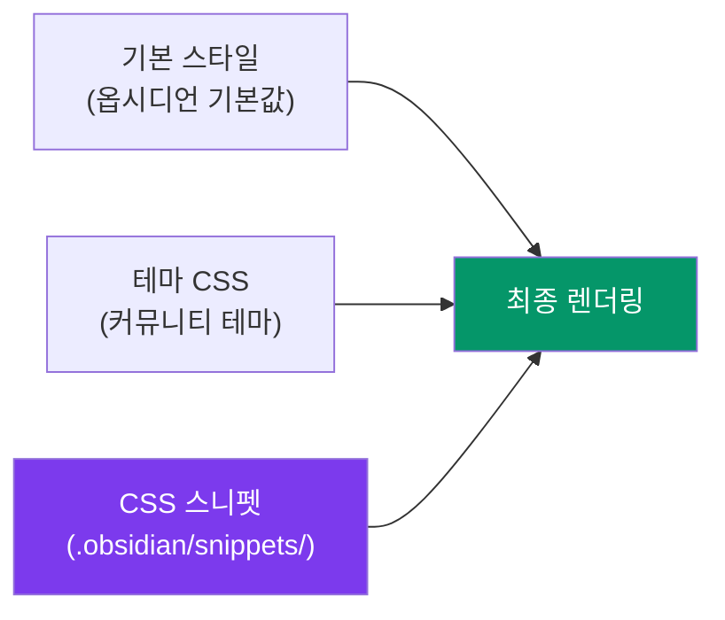

---
created:
  '{ date }': null
modified: 2026-01-01
publish: true
status: 진행중
tags: []
title: ch25-css-snippets
type: techbook
---

# Chapter 25. CSS 스니펫으로 옵시디언 커스터마이즈
> 스니펫 설치 · 타이포그래피 · 컬러팔레트 · 체크박스 스타일 · 나만의 테마

---

## 0) 연결 고리 (Bridge)

Chapter 23에서 커뮤니티 테마로 옵시디언의 전반적인 외형을 바꿨습니다.  
그런데 테마가 마음에 들지만 "이 부분만 다르게 하고 싶다"는 경우가 생깁니다.  
이 챕터에서는 **CSS 스니펫**으로 기존 테마를 건드리지 않고 세부적인 스타일을 덮어쓰는 방법을 배웁니다. 코딩 지식이 없어도 복사·붙여넣기만으로 적용할 수 있습니다.

---

## 1) 개념 정의 및 필요성

### CSS 스니펫이란?

> **CSS 스니펫은 옵시디언 인터페이스의 특정 요소에 적용하는 소형 CSS 파일입니다.**  
> 보관소의 `.obsidian/snippets/` 폴더에 `.css` 파일을 넣으면 즉시 적용됩니다.

**CSS 스니펫 vs 테마:**

| 구분 | 테마 | CSS 스니펫 |
|---|---|---|
| 범위 | 전체 인터페이스 스타일 변경 | 특정 요소만 수정 |
| 적용 개수 | 하나만 활성화 가능 | 여러 개 동시 활성화 |
| 우선순위 | 낮음 | 높음 (테마 위에 덮어쓰기) |
| 용도 | 전반적 외관 | 세부 미세 조정 |

---

## 2) 핵심 원리 및 구조

### CSS 스니펫 작동 원리



CSS는 **캐스케이딩(Cascading)** 방식으로 나중에 선언된 스타일이 이전 스타일을 덮어씁니다. 스니펫은 테마보다 나중에 로드되므로 테마 스타일을 덮어쓸 수 있습니다.

### CSS 스니펫 설치 절차

```
① .css 파일 작성 또는 다운로드
② 파일을 .obsidian/snippets/ 폴더에 복사
   (Windows: C:\Users\사용자명\내문서\my-vault\.obsidian\snippets\)
   (Mac: ~/Documents/my-vault/.obsidian/snippets/)
③ 설정 → 테마 → CSS 스니펫 → [새로고침] 클릭
④ 적용할 스니펫 토글 켜기
```

> 💡 **TIP:** `.obsidian/` 폴더는 기본적으로 숨김 폴더입니다. Mac에서는 `Cmd+Shift+.` 으로, Windows에서는 탐색기 옵션에서 "숨김 파일 표시"를 켜야 보입니다.

---

## 3) 실습 예제 — 즉시 쓸 수 있는 CSS 스니펫 10종

### 스니펫 1. 한국어 폰트 최적화

```css
/* korean-fonts.css */
/* Noto Sans KR: 선명한 한글 렌더링 */
@import url('https://fonts.googleapis.com/css2?family=Noto+Sans+KR:wght@300;400;500;700&display=swap');

body {
  --font-text-theme: "Noto Sans KR", -apple-system, BlinkMacSystemFont, sans-serif;
  --font-interface-theme: "Noto Sans KR", -apple-system, BlinkMacSystemFont, sans-serif;
}

/* 코드 블록은 영문 모노스페이스 유지 */
code, pre {
  font-family: "JetBrains Mono", "Fira Code", "Consolas", monospace !important;
}
```

> 📌 **NOTE:** 인터넷 연결이 없는 오프라인 환경에서는 Google Fonts가 로드되지 않습니다. 오프라인 사용이 많다면 폰트 파일을 로컬에 다운로드해 `@font-face`로 로드하는 방식을 사용하세요.

---

### 스니펫 2. 노트 최대 너비 조절

```css
/* max-width.css */
/* 기본 700px를 800px로 확장 — 넓은 모니터에서 가독성 향상 */
.markdown-preview-view,
.markdown-source-view.mod-cm6 .cm-content {
  max-width: 800px !important;
  margin: 0 auto;
}

/* 전체 너비 사용 (제한 없음) */
/*
.markdown-preview-view {
  max-width: 100% !important;
}
*/
```

---

### 스니펫 3. 체크박스 스타일 커스터마이즈

```css
/* custom-checkboxes.css */
/* 기본 체크박스를 더 시각적으로 */

/* 완료된 체크박스 */
.task-list-item.is-checked {
  text-decoration: line-through;
  color: var(--text-muted);
}

/* 미완료 체크박스 크기 확대 */
input[type="checkbox"] {
  width: 16px;
  height: 16px;
  border-radius: 4px;
}

/* 커스텀 체크박스 심볼 (- [/] 진행중, - [!] 중요 등) */
/* Minimal 테마 또는 ITS 테마와 함께 사용 시 활성화 */
/*
.task-list-item[data-task="/"] { --checkbox-color: orange; }
.task-list-item[data-task="!"] { --checkbox-color: red; }
.task-list-item[data-task="?"] { --checkbox-color: purple; }
*/
```

---

### 스니펫 4. 헤딩 색상 & 스타일

```css
/* heading-style.css */
/* 각 헤딩 레벨에 고유한 색상 지정 */

.markdown-rendered h1 {
  color: #7C3AED;  /* 보라색 */
  border-bottom: 2px solid #7C3AED;
  padding-bottom: 4px;
}

.markdown-rendered h2 {
  color: #0284C7;  /* 파란색 */
  border-left: 4px solid #0284C7;
  padding-left: 12px;
}

.markdown-rendered h3 {
  color: #059669;  /* 초록색 */
}

/* 편집 모드에서도 헤딩 색상 */
.cm-header-1 { color: #7C3AED !important; }
.cm-header-2 { color: #0284C7 !important; }
.cm-header-3 { color: #059669 !important; }
```

---

### 스니펫 5. 폴더 아이콘 커스터마이즈

```css
/* folder-icons.css */
/* 특정 폴더 이름에 이모지 아이콘 추가 */

/* PARA 폴더 스타일 */
.nav-folder-title[data-path="10-PROJECTS"] .nav-folder-title-content::before {
  content: "📋 ";
}
.nav-folder-title[data-path="20-AREAS"] .nav-folder-title-content::before {
  content: "🏠 ";
}
.nav-folder-title[data-path="30-RESOURCES"] .nav-folder-title-content::before {
  content: "📚 ";
}
.nav-folder-title[data-path="90-ARCHIVES"] .nav-folder-title-content::before {
  content: "🗄️ ";
}
.nav-folder-title[data-path="00-INBOX"] .nav-folder-title-content::before {
  content: "📥 ";
}
```

---

### 스니펫 6. 라인 높이 & 글자 간격

```css
/* readability.css */
/* 가독성 향상을 위한 줄 간격·자간 설정 */

.markdown-rendered {
  line-height: 1.8;          /* 기본 1.5 → 1.8로 넓힘 */
  letter-spacing: 0.01em;    /* 자간 약간 넓힘 */
  word-break: keep-all;      /* 한국어 단어 중간 줄바꿈 방지 */
}

/* 제목 줄 간격은 좁게 */
.markdown-rendered h1,
.markdown-rendered h2,
.markdown-rendered h3 {
  line-height: 1.3;
}
```

---

### 스니펫 7. 콜아웃 색상 확장

```css
/* custom-callouts.css */
/* 기본 콜아웃 외에 나만의 색상 콜아웃 추가 */

/* 사용법: > [!purple] 제목 */
.callout[data-callout="purple"] {
  --callout-color: 124, 58, 237;
  --callout-icon: lucide-sparkles;
}

/* 사용법: > [!teal] 제목 */
.callout[data-callout="teal"] {
  --callout-color: 13, 148, 136;
  --callout-icon: lucide-anchor;
}

/* 사용법: > [!pink] 제목 */
.callout[data-callout="pink"] {
  --callout-color: 219, 39, 119;
  --callout-icon: lucide-heart;
}
```

---

### 스니펫 8. 표(Table) 스타일 개선

```css
/* table-style.css */
/* 표를 더 보기 좋게 */

.markdown-rendered table {
  border-collapse: collapse;
  width: 100%;
  font-size: 0.9em;
}

.markdown-rendered th {
  background-color: var(--interactive-accent);
  color: white;
  padding: 8px 12px;
  text-align: left;
}

.markdown-rendered td {
  padding: 6px 12px;
  border-bottom: 1px solid var(--background-modifier-border);
}

/* 홀짝 행 줄무늬 */
.markdown-rendered tr:nth-child(even) td {
  background-color: var(--background-secondary);
}

.markdown-rendered tr:hover td {
  background-color: var(--background-modifier-hover);
}
```

---

### 스니펫 9. 이미지 중앙 정렬 & 캡션

```css
/* image-style.css */
/* 이미지를 자동으로 중앙 정렬 */

.markdown-rendered img {
  display: block;
  margin: 16px auto;
  border-radius: 8px;
  box-shadow: 0 2px 8px rgba(0, 0, 0, 0.15);
}

/* 이미지 바로 아래 기울임 텍스트를 캡션으로 스타일 */
.markdown-rendered img + em {
  display: block;
  text-align: center;
  font-size: 0.85em;
  color: var(--text-muted);
  margin-top: -8px;
  margin-bottom: 16px;
}
```

**사용법:**
```markdown
![[사진.jpg|400]]
*그림 1. 옵시디언 그래프 뷰 예시*
```

---

### 스니펫 10. 다크/라이트 모드 자동 전환 변수

```css
/* color-variables.css */
/* 다크/라이트 모드에서 다른 색상 적용 */

/* 라이트 모드 */
.theme-light {
  --custom-accent: #7C3AED;
  --custom-highlight: #FEF3C7;
  --custom-note-bg: #F9FAFB;
}

/* 다크 모드 */
.theme-dark {
  --custom-accent: #A78BFA;
  --custom-highlight: #451A03;
  --custom-note-bg: #1F2937;
}

/* 변수 사용 예시 */
.markdown-rendered mark {
  background-color: var(--custom-highlight);
}
```

---

### 3.11 옵시디언 CSS 변수 레퍼런스

옵시디언은 `--` 접두사로 시작하는 CSS 변수를 사용합니다. 주요 변수를 수정하면 테마 전반에 영향을 줍니다.

```css
/* 주요 CSS 변수 */
:root {
  /* 색상 */
  --color-base-00: #ffffff;     /* 배경 기본 */
  --color-base-100: #000000;    /* 텍스트 기본 */
  --interactive-accent: #7C3AED; /* 강조색 */
  
  /* 타이포그래피 */
  --font-text-size: 16px;        /* 본문 글자 크기 */
  --line-height-normal: 1.6;     /* 줄 간격 */
  
  /* 간격 */
  --size-4-4: 16px;              /* 기본 간격 단위 */
  --file-line-width: 700px;      /* 노트 최대 너비 */
}
```

> 💡 **TIP:** 옵시디언의 모든 CSS 변수를 확인하려면 브라우저처럼 **개발자 도구**를 사용하세요.  
> `Ctrl/Cmd+Shift+I` → Elements 탭 → `:root` 선택 → Computed 탭에서 `--` 변수 목록 확인

---

## 4) 실무 시나리오 (Best Practice)

### CSS 스니펫 관리 전략

**스니펫 파일 명명 규칙:**
```
기능별로 명확하게:
  typography.css    → 폰트·크기 관련
  layout.css        → 여백·너비 관련
  colors.css        → 색상 관련
  tables.css        → 표 스타일
  checkboxes.css    → 체크박스
  callouts.css      → 콜아웃

이렇게 하면 설정 화면에서 필요한 스니펫만 켜고 끌 수 있음
```

**디버깅 방법:**
```
스니펫 적용 후 원하는 스타일이 안 나올 때:
  ① Ctrl/Cmd+Shift+I → 개발자 도구
  ② 수정하려는 요소 위에서 우클릭 → [검사]
  ③ Elements 패널에서 CSS 셀렉터 확인
  ④ 내 스니펫의 셀렉터가 일치하는지 확인
  ⑤ !important 추가로 우선순위 강제
```

---

## 5) 트러블슈팅 & 주의사항

### Q1. CSS 스니펫을 적용했는데 아무 변화가 없습니다

3가지를 확인하세요. 첫째, 파일이 `.obsidian/snippets/` 폴더에 있는지. 둘째, 설정 → 테마 → CSS 스니펫에서 해당 스니펫이 켜져 있는지. 셋째, [새로고침] 버튼을 클릭했는지.

### Q2. 스니펫 적용 후 특정 부분 레이아웃이 깨집니다

CSS 셀렉터가 너무 광범위하거나 `!important`가 필요한 스타일을 덮어쓴 경우입니다. 개발자 도구로 어떤 스타일이 충돌하는지 확인하고, 셀렉터를 더 구체적으로 만들거나 스니펫을 비활성화해 원인을 찾으세요.

### Q3. 다크 모드에서만 또는 라이트 모드에서만 적용하려면?

`.theme-dark { }` 또는 `.theme-light { }` 블록 안에 스타일을 작성하면 해당 모드에서만 적용됩니다.

---

## 6) 한 줄 요약

> 💡 **Key Takeaway:**  
> CSS 스니펫은 테마를 건드리지 않고 세부 스타일을 자유롭게 조정하는 "비침습적" 커스터마이즈 방법이다.  
> **한국어 폰트·가독성·헤딩 색상·표 스타일 4가지 스니펫만 적용해도 노트 읽기 경험이 크게 향상된다.**

---

## 🔖 이 챕터의 체크리스트

- [ ] `.obsidian/snippets/` 폴더를 확인하고 스니펫 파일을 복사했다
- [ ] 한국어 폰트 스니펫을 적용하고 변화를 확인했다
- [ ] 헤딩 색상 스니펫을 적용했다
- [ ] 개발자 도구로 CSS 셀렉터를 직접 확인해봤다
- [ ] 나만의 커스텀 스니펫을 1개 이상 작성했다

---

*이전 챕터: [Chapter 24 — MCP 연동](./ch24-mcp.md)*  
*다음 챕터: [Chapter 26 — 모바일 최적화](./ch26-mobile.md)*