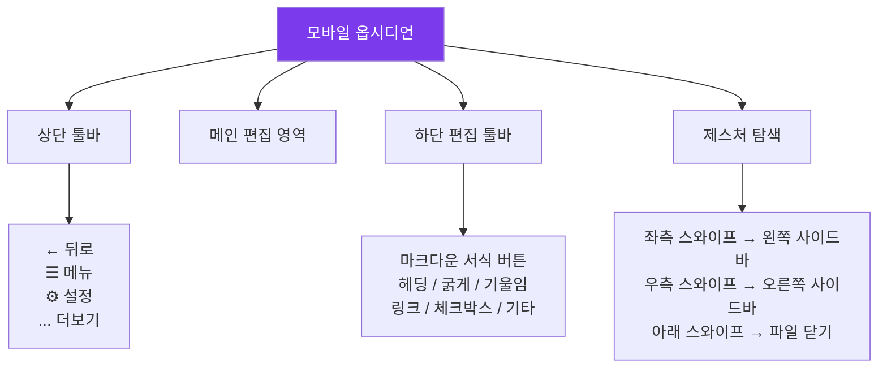

---
created:
  '{ date }': null
modified: 2026-01-01
publish: true
status: 진행중
tags: []
title: ch26-mobile
type: techbook
---

# Chapter 26. 모바일 최적화
> iPhone · Android · 제스처 · 빠른 캡처 · 모바일 전용 설정

---

## 0) 연결 고리 (Bridge)

Chapter 25에서 데스크탑 시각화를 완성했습니다.  
이 챕터에서는 스마트폰과 태블릿에서 옵시디언을 편리하게 사용하기 위한  
**모바일 전용 설정과 워크플로우**를 다룹니다.  
이동 중 아이디어를 캡처하고, 회의실에서 노트를 조회하는 모바일 경험을 최적화합니다.

---

## 1) 개념 정의 및 필요성

### 모바일 옵시디언의 특성

> **옵시디언 모바일 앱은 데스크탑과 동일한 마크다운 파일을 사용하지만, 터치 인터페이스에 최적화된 별도 레이아웃과 제스처를 제공합니다.**

**데스크탑 vs 모바일 주요 차이:**

| 항목 | 데스크탑 | 모바일 |
|---|---|---|
| 입력 | 키보드 중심 | 터치 + 가상 키보드 |
| 단축키 | Ctrl/Cmd + 키 | 제스처 + 툴바 버튼 |
| 화면 | 넓은 다중 패널 | 단일 화면 + 사이드바 |
| 플러그인 | 대부분 지원 | 일부 플러그인 미지원 |
| 주요 용도 | 심층 노트 작성·편집 | 빠른 캡처·조회·이동 중 편집 |

---

## 2) 핵심 원리 및 구조

### 모바일 인터페이스 구조



---

## 3) 실습 예제 및 실행 환경

### 실습 26-1. 모바일 앱 설치 및 초기 설정

**iPhone:**
```
① App Store → "Obsidian" 검색 → 설치
② 앱 실행 → 보관소 열기
   - 로컬 보관소: 기기 내 폴더
   - iCloud 보관소: iCloud Drive에서 열기 (Ch 17 참고)
   - Obsidian Sync: 계정 로그인 후 클라우드 보관소 연결
③ 동기화 방식에 따라 보관소 경로 선택
```

**Android:**
```
① Google Play → "Obsidian" 검색 → 설치
② 앱 실행 → 로컬 보관소 열기 → 폴더 선택
   (Google Drive 동기화 설정은 Ch 17 Dropsync 참고)
③ 파일 접근 권한 허용
```

---

### 실습 26-2. 모바일 전용 설정 최적화

**설정 → 외형(Appearance):**
```
모바일 전용 설정:
  - 인터페이스 폰트 크기: 16~18px (터치 타겟 확대)
  - 텍스트 폰트 크기: 16px
  - 줄 간격: 1.6 이상 (손가락으로 읽기 편하게)
  - 하단 편집 툴바: 켜기 (필수!)
```

**설정 → 편집기:**
```
  - 뷰포트 패딩: 최소 10% (화면 가장자리 여백)
  - 자동 쌍 괄호: 켜기 (빠른 마크다운 입력)
  - 스마트 들여쓰기: 켜기
  - Vim 모드: 끄기 (모바일에서는 비추천)
```

**설정 → 파일 & 링크:**
```
  - 기본 위치에 새 노트: 지정된 폴더 → 00-INBOX
  (모바일에서 만드는 노트는 자동으로 Inbox로)
```

---

### 실습 26-3. 제스처 마스터하기

**기본 제스처:**
```
화면 오른쪽 끝에서 좌측으로 스와이프
→ 왼쪽 사이드바 열기 (파일 탐색기, 검색 등)

화면 왼쪽 끝에서 우측으로 스와이프
→ 오른쪽 사이드바 열기 (태그, 백링크 등)

노트 탭 아래로 스와이프
→ 탭 닫기

툴바 버튼 길게 누르기
→ 버튼 옵션/설명 팝업
```

**유용한 모바일 편집 단축:**
```
텍스트 선택 → 팝업 메뉴:
  굵게 / 기울임 / 링크 / 복사 등

[[]] 링크 입력:
  하단 툴바의 링크(🔗) 버튼 탭
  → 노트 검색 팝업 자동 표시
```

---

### 실습 26-4. 하단 툴바 커스터마이즈

모바일 하단 툴바의 버튼을 자신의 워크플로우에 맞게 재배치합니다.

```
설정 → 모바일 → 툴바 항목 편집:
  현재 버튼 목록에서 드래그하여 순서 변경
  + 버튼으로 새 항목 추가
  - 버튼으로 불필요한 항목 제거

권장 툴바 구성 (빈번도 순):
  1. 체크박스 [ ]   ← 할일 기록 최우선
  2. 굵게 (**)
  3. 헤딩 (#)
  4. 링크 ([[]])
  5. 내부 링크 열기
  6. 명령 팔레트
  7. 실행 취소 ↩
```

---

### 실습 26-5. 빠른 캡처 설정 3종

**방법 A: 홈 화면 위젯 (iPhone)**
```
① 홈 화면에서 빈 공간 길게 누르기 → 편집 모드
② 왼쪽 상단 [+] → "Obsidian" 검색
③ "Quick Capture" 위젯 추가
④ 위젯 탭 → 텍스트 입력 → 자동으로 지정 노트에 저장
```

**방법 B: iOS 단축어(Shortcuts) 자동화**
```
단축어 앱 → 새 단축어 만들기:

① [텍스트 입력] 액션 추가
   프롬프트: "빠른 메모:"
   
② [파일에 추가] 액션 추가
   파일: iCloud Drive/Obsidian/00-INBOX/quick-notes.md
   구분자: 새 줄
   텍스트: "- [ ] [입력한 텍스트] ← 날짜/시간"

③ Siri 이름 설정: "메모 추가"

→ 잠금 화면에서 Siri: "메모 추가" → 즉시 옵시디언 Inbox에 저장
```

**방법 C: 잠금 화면 단축키 (iPhone 14 이상)**
```
설정 → 잠금 화면 편집 → 하단 제어 영역
→ 옵시디언 퀵 캡처 또는 단축어 추가
→ 잠금 화면에서 한 번 탭으로 즉시 메모
```

---

### 실습 26-6. 모바일에서 자주 쓰는 검색 활용

```
모바일에서 검색 열기:
  왼쪽 사이드바 → 🔍 검색 탭

북마크된 검색 활용:
  데스크탑에서 북마크한 검색이 모바일에서도 동기화
  → 진행 중 태그, 오늘의 할일 검색을 즉시 실행

퀵 스위처:
  모바일 상단 툴바 → ... → 퀵 스위처
  → 파일명 입력으로 즉시 이동
```

---

### 실습 26-7. 태블릿 최적화 (iPad / Android 태블릿)

```
설정 → 외형 → 패널 설정:
  태블릿 너비 기준: 768px 이상이면 데스크탑 레이아웃 사용 가능

분할 화면 활용:
  옵시디언 + Safari/Chrome 분할 → 리서치하며 노트 작성
  옵시디언 + Files 앱 분할 → 파일 드래그 앤 드롭

Apple Pencil (iPad):
  Scribble 기능으로 손으로 쓴 텍스트 자동 변환
  Excalidraw에서 드로잉에 최적
```

---

## 4) 실무 시나리오 (Best Practice)

### 모바일 사용 패턴 3가지

**이동 중 캡처 패턴:**
```
상황: 출퇴근, 이동 중
목표: 생각이 떠오를 때 즉시 기록
도구: 빠른 캡처 위젯 또는 Siri 단축어
원칙: 완벽하게 쓰려 하지 말고 키워드만 기록
```

**회의실 참고 패턴:**
```
상황: 회의 중 노트 조회
목표: 빠르게 원하는 노트 찾기
도구: 북마크된 검색, 퀵 스위처
원칙: 읽기 모드 사용, 편집은 최소화
```

**독서 중 메모 패턴:**
```
상황: 책 읽으며 메모
목표: 인상적인 구절 + 생각 빠르게 기록
도구: 독서 노트 템플릿 + 모바일 툴바
원칙: 독서 노트는 모바일에서 초안, 데스크탑에서 정리
```

### 안티 패턴

- **모바일에서 긴 노트 작성 시도:** 가상 키보드는 긴 문장 입력에 비효율적입니다. 모바일은 **캡처와 조회** 중심으로 사용하고 심층 작성은 데스크탑에서 하세요
- **모바일 전용 플러그인 설치 남발:** 데스크탑과 다른 플러그인 세트는 동기화 충돌을 유발합니다. 모바일에서는 기본 플러그인만 활성화하는 것을 권장합니다
- **동기화 완료 전 편집:** 두 기기에서 동시 편집은 충돌의 주요 원인입니다. 기기 전환 전 동기화 완료(구름 아이콘 확인)를 습관화하세요

---

## 5) 트러블슈팅 & 주의사항

### Q1. 모바일에서 일부 플러그인이 작동하지 않습니다

모바일 앱은 Node.js API가 없어 일부 플러그인이 작동하지 않습니다. 대표적으로 Obsidian Git의 자동 커밋·푸시 기능은 iOS에서 불완전합니다. 모바일 지원 여부는 각 플러그인의 README에서 확인하세요.

### Q2. 모바일에서 수식이나 Mermaid 다이어그램이 표시되지 않습니다

옵시디언 모바일은 LaTeX 수식과 Mermaid 다이어그램을 지원합니다. 단, MathJax 렌더링이 느릴 수 있습니다. 렌더링 설정이 꺼져 있는 경우 `설정 → 편집기 → 수식 렌더링` 을 확인하세요.

### Q3. 하단 툴바가 표시되지 않습니다

`설정 → 편집기 → 모바일 툴바` 또는 `설정 → 모바일` 에서 툴바 표시가 켜져 있는지 확인하세요. 또한 읽기 모드에서는 툴바가 숨겨집니다. 하단의 모드 전환 버튼으로 편집 모드로 전환하면 툴바가 나타납니다.

---

## 6) 한 줄 요약

> 💡 **Key Takeaway:**  
> 모바일 옵시디언은 "심층 작성"이 아닌 "빠른 캡처와 즉각 조회"에 최적화하라.  
> **잠금 화면 단축키로 3초 이내 Inbox 캡처, 북마크 검색으로 원하는 노트 5초 이내 접근, 이 두 가지가 모바일 생산성의 핵심이다.**

---

## 🔖 이 챕터의 체크리스트

- [ ] 모바일 앱에서 보관소를 열었다
- [ ] 하단 툴바를 커스터마이즈했다
- [ ] 빠른 캡처 방법을 하나 이상 설정했다
- [ ] 제스처로 사이드바를 열고 닫았다
- [ ] 모바일에서 검색으로 원하는 노트를 찾았다

---

*이전 챕터: [Chapter 25 — CSS 스니펫](./ch25-css-snippets.md)*  
*다음 챕터: [Chapter 27 — Obsidian Publish](./ch27-publish.md)*