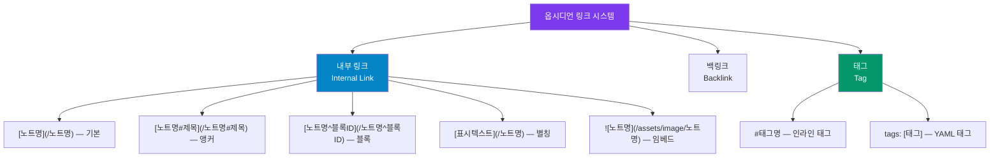

---
created:
  "{ date }":
status: 진행중
publish: true
---
# Chapter 07. 옵시디언 전용 링크 시스템
> 내부 링크 · 백링크 · 블록 링크 · 태그 · 앵커 · 별칭

---

## 0) 연결 고리 (Bridge)

Chapter 05~06에서 마크다운으로 노트의 내용을 풍부하게 만들었습니다.  
이제 노트와 노트를 **연결**할 차례입니다. 이것이 옵시디언을 단순한 노트 앱과 구별 짓는 핵심입니다.  
링크 시스템을 익히면 여러분의 보관소는 고립된 섬들의 집합이 아닌, **서로 연결된 지식 그물망**으로 진화합니다.

---

## 1) 개념 정의 및 필요성

### 링크가 왜 중요한가

> **지식의 가치는 연결의 수에 비례한다.**

기존 노트 앱에서 노트는 폴더 안에 저장되는 파일에 불과합니다. 하지만 옵시디언에서 노트는 다른 노트와 연결될 수 있는 **지식의 노드(Node)** 입니다. 연결이 많아질수록 노트는 새로운 인사이트의 원천이 됩니다.

**링크의 두 가지 방향:**

| 방향 | 이름 | 의미 |
|---|---|---|
| A → B | 아웃링크(Outgoing Link) | A 노트가 B 노트를 참조함 |
| B ← A | 백링크(Backlink) | B 노트가 A로부터 참조받음 |

백링크는 **내가 따로 만들지 않아도 자동으로 생성됩니다.** A에서 B를 링크하는 순간, B의 백링크 패널에 A가 자동으로 나타납니다.

---

## 2) 핵심 원리 및 구조

### 링크 유형 체계



---

## 3) 실습 예제 및 실행 환경

> **환경:** Chapter 04에서 만든 스타터 보관소 기준  
> **실습 파일:** `10-notes/링크 연습.md` 생성 후 진행

---

### 3.1 기본 내부 링크 `[[]]`

내부 링크는 `[` 를 입력하는 순간 보관소 내 모든 노트 목록이 자동 완성으로 표시됩니다.

```markdown
<!-- 기본 내부 링크 -->
[[나의 첫 번째 노트](/` 를 입력하는 순간 보관소 내 모든 노트 목록이 자동 완성으로 표시됩니다.

```markdown
<!-- 기본 내부 링크 -->
[[나의 첫 번째 노트)

<!-- 보관소 내 존재하지 않는 노트도 링크 가능 — 클릭 시 자동 생성 -->
[아직 만들지 않은 노트](/아직 만들지 않은 노트)

<!-- 존재하지 않는 링크는 텍스트 색이 다르게 표시됨 (기본: 회색) -->
```

**실습:**
```
① Ctrl/Cmd+N → 새 노트 "링크 연습" 생성
② 본문에 [나의 첫 번째 노트](/나의 첫 번째 노트) 입력
   → 자동 완성 목록에서 선택하거나 직접 입력
③ 링크를 Ctrl+클릭 (Windows) / Cmd+클릭 (Mac)
   → "나의 첫 번째 노트" 노트로 이동
④ 우측 사이드바 백링크 패널 확인
   → "링크 연습" 노트가 백링크로 표시되는지 확인
```

> 💡 **TIP:** `[` 입력 후 한글을 타이핑하면 모음·자음 분리 없이 전체 노트 이름으로 검색됩니다. 찾는 노트가 길면 이름의 일부만 입력해도 자동 완성이 됩니다.

---

### 3.2 앵커 링크 `[[노트명#제목](/` 입력 후 한글을 타이핑하면 모음·자음 분리 없이 전체 노트 이름으로 검색됩니다. 찾는 노트가 길면 이름의 일부만 입력해도 자동 완성이 됩니다.

---

### 3.2 앵커 링크 `[[노트명#제목)`

특정 제목(Heading) 위치로 바로 이동하는 링크입니다.

```markdown
<!-- Ch 05 노트의 특정 섹션으로 이동 -->
[ch05-markdown-basic#3.3 리스트](/ch05-markdown-basic#3.3 리스트)

<!-- 현재 노트 내 제목으로 이동 (# 만 사용) -->
[#실습 예제](/#실습 예제)
```

**실습:**
```
① "나의 첫 번째 노트"에 제목을 2개 이상 추가:
   ## 오늘 배운 것
   ## 다음 할 것

② "링크 연습" 노트에서 [나의 첫 번째 노트#오늘 배운 것](/나의 첫 번째 노트#오늘 배운 것) 입력
③ 링크 클릭 → 해당 제목 위치로 스크롤되는지 확인
```

---

### 3.3 블록 링크 `[노트명^블록ID](/노트명^블록ID)`

특정 단락(블록) 수준으로 연결하는 링크입니다. 제목이 없는 특정 문장을 참조할 때 유용합니다.

```markdown
<!-- 방법 1: 자동 블록 ID 생성 -->
<!-- 본문 작성 후 해당 문단에서 [^](/^) 입력 → 자동 완성으로 블록 선택 -->

<!-- 방법 2: 수동 블록 ID 지정 -->
<!-- 참조하고 싶은 단락 끝에 ^블록ID 를 추가 -->
이것은 중요한 단락입니다. ^important-para

<!-- 다른 노트에서 참조 -->
[나의 첫 번째 노트^important-para](/나의 첫 번째 노트^important-para)
```

> 📌 **NOTE:** 블록 링크는 제목이 없는 단락을 정확하게 참조할 때 가장 유용합니다. 제텔카스텐 방법론에서 특정 아이디어를 다른 노트에서 정밀하게 인용할 때 활용합니다.

---

### 3.4 별칭(Alias) `[표시텍스트](/노트명)`

링크의 표시 텍스트를 노트 이름과 다르게 지정합니다.

```markdown
<!-- 파일명은 길지만 본문에서는 짧게 표시 -->
[5장](/ch05-markdown-basic)
[첫 노트](/나의 첫 번째 노트)

<!-- 문장 흐름에 자연스럽게 삽입 -->
이 내용은 [제텔카스텐](/제텔카스텐 원리)에서 비롯됩니다.
자세한 설명은 [이 챕터](/ch07-links)를 참고하세요.
```

**YAML에서 영구 별칭 설정:**
```yaml
---
aliases:
  - 7장
  - 링크챕터
  - links
---
```
YAML aliases에 등록된 이름으로도 `[링크챕터](/링크챕터)` 처럼 이 노트를 참조할 수 있습니다.

---

### 3.5 태그 (Tag)

태그는 노트를 주제·유형·상태로 분류하는 또 다른 연결 방식입니다. 폴더와 달리 하나의 노트에 여러 태그를 동시에 붙일 수 있습니다.

**인라인 태그:**
```markdown
이 내용은 #마크다운 관련 노트입니다. #실습 #ch05
#태그명/하위태그  ← 계층 태그도 지원
```

**YAML 프론트매터 태그 (권장):**
```yaml
---
tags:
  - 마크다운
  - 실습
  - part2
  - status/진행중
---
```

> 💡 **TIP:** 태그는 두 가지 방식 모두 유효하지만, **YAML 방식이 더 명확하게 관리**됩니다. 인라인 태그는 본문 흐름에 자연스럽게 섞어 쓸 때 사용합니다.

**태그 탐색:**
- 좌측 사이드바 → 태그(Tags) 패널에서 전체 태그 목록 확인
- 검색창에 `#태그명` 입력 → 해당 태그를 가진 노트 전체 검색
- `tag:#태그명` 연산자로 정밀 검색 가능

**계층 태그 설계 예시:**
```
#status/inbox       ← 분류 전
#status/진행중
#status/완료
#type/독서노트
#type/회의록
#type/아이디어
#project/가이드북
#project/업무A
```

---

### 3.6 백링크(Backlink) & 아웃링크(Outgoing Link) 활용

백링크는 "이 노트를 참조하는 모든 노트"를 자동으로 보여줍니다.

```
백링크 패널 열기:
  Ctrl/Cmd + P → "backlink" → [백링크 패널 열기]
  또는 우측 사이드바 → 백링크(Backlinks) 탭

아웃링크 패널 열기:
  Ctrl/Cmd + P → "outgoing" → [아웃링크 패널 열기]
```

**백링크의 두 가지 섹션:**
- **링크된 멘션(Linked Mentions):** `[직접 링크](/직접 링크)` 로 연결된 노트
- **언링크된 멘션(Unlinked Mentions):** 링크 없이 텍스트로만 언급된 노트 → 클릭으로 즉시 링크 추가 가능

> 💡 **TIP:** 언링크된 멘션을 주기적으로 확인하면, 내가 모르고 있던 노트 간 연결을 발견할 수 있습니다. 제텔카스텐에서 "연결 찾기"의 핵심 기능입니다.

---

### 3.7 종합 실습 — 링크 네트워크 만들기

아래 5개 노트를 만들고 서로 연결해보세요.

```
노트 구조:
┌─────────────┐    [[]]    ┌─────────────┐
│  마크다운   │ ─────────► │  옵시디언   │
│  기초       │            │  소개       │
└─────────────┘            └──────┬──────┘
       ▲                          │ [[]]
       │ [[]]                     ▼
┌──────┴──────┐    [[]]    ┌─────────────┐
│  링크       │ ─────────► │  보관소     │
│  시스템     │            │  구조       │
└─────────────┘            └─────────────┘
       │ [[]]
       ▼
┌─────────────┐
│  내가 만든  │
│  허브 노트  │
└─────────────┘
```

**실습 단계:**
```
① 위 5개 노트를 10-notes 폴더에 생성
② 각 노트에 다른 노트로의 [링크](/링크) 추가
③ 그래프 뷰(Ctrl/Cmd+G)에서 연결 확인
④ 각 노트의 백링크 패널에서 참조 노트 확인
⑤ 언링크된 멘션을 링크로 전환해보기
```

---

## 4) 실무 시나리오 (Best Practice)

### 링크 전략 — 언제 무엇을 연결할까

**항상 링크해야 하는 것:**
- 같은 개념을 다루는 다른 노트
- 이 노트의 근거가 되는 출처 노트
- 이 노트에서 확장된 아이디어의 노트

**링크하지 않아도 되는 것:**
- 너무 일반적인 개념 (예: "노트", "텍스트" 같은 단어)
- 내용상 관련이 없는 단순 단어 일치

**실무 링크 패턴:**
```markdown
# 프로젝트 A 기획서

## 배경
이 프로젝트는 [고객 요구사항 정리](/고객 요구사항 정리)에서 출발했습니다.
기술 스택은 [기술 검토 메모#최종 결정](/기술 검토 메모#최종 결정)을 참고하세요.

## 관련 노트
- [경쟁사 분석 2024](/경쟁사 분석 2024)
- [예산 계획서^승인된-예산](/예산 계획서^승인된-예산) ← 특정 단락 직접 참조
```

### 안티 패턴

- **모든 명사에 링크:** 링크가 너무 많으면 중요한 연결이 묻힙니다. "이 연결이 나중에 가치 있을까?"를 기준으로 선택적으로 링크하세요
- **태그와 폴더 중복 사용:** 폴더로 분류한 것을 태그로도 중복 분류하면 관리가 복잡해집니다. 폴더는 큰 범주, 태그는 세부 속성으로 역할을 나누세요

---

## 5) 트러블슈팅 & 주의사항

### Q1. `[링크](/링크)` 가 클릭이 안 됩니다

편집 모드(Source Mode)에서는 `Ctrl/Cmd+클릭`으로 이동합니다. 라이브 미리보기 모드에서는 일반 클릭으로 이동됩니다.

### Q2. 노트 이름을 바꿨더니 링크가 `[원래 이름](/원래 이름)` 으로 유지됩니다

`설정 → 파일 및 링크 → 이동 시 링크 자동 업데이트`가 켜져 있으면 이름 변경 시 모든 링크가 자동 업데이트됩니다. 이 설정이 꺼져 있었다면 수동으로 링크를 수정해야 합니다.

### Q3. 태그가 검색이 안 됩니다

YAML의 `tags:`는 반드시 리스트 형식이어야 합니다.

```yaml
# 올바른 형식
tags:
  - 마크다운
  - 실습

# 이것도 가능
tags: [마크다운, 실습]

# 잘못된 형식 (인식 안 됨)
tags: 마크다운, 실습
```

### Q4. 블록 링크 `[^](/^)` 자동 완성이 안 나옵니다

블록에 `^블록ID` 가 지정되어 있어야 자동 완성이 됩니다. 또는 `[노트명^` 까지 입력하면 해당 노트의 블록 목록이 표시됩니다.

---

## 6) 한 줄 요약

> 💡 **Key Takeaway:**  
> `[[내부 링크](/노트명^` 까지 입력하면 해당 노트의 블록 목록이 표시됩니다.

---

## 6) 한 줄 요약

> 💡 **Key Takeaway:**  
> `[[내부 링크)` 는 옵시디언을 단순 노트 앱에서 지식 그물망으로 바꾸는 핵심 기능이다.  
> **노트를 쓸 때마다 "이 내용과 연결되는 다른 노트는 무엇인가?"를 묻는 습관이 지식 관리 시스템을 성장시킨다.**

---

## 🔖 이 챕터의 체크리스트

- [ ] 기본 내부 링크 `[노트명](/노트명)` 을 만들고 이동해봤다
- [ ] 앵커 링크 `[노트명#제목](/노트명#제목)` 을 사용해봤다
- [ ] 별칭 `[표시텍스트](/노트명)` 를 사용했다
- [ ] 태그를 YAML과 인라인 두 가지 방식으로 추가했다
- [ ] 백링크 패널에서 내 노트를 참조하는 노트를 확인했다
- [ ] 종합 실습에서 5개 노트 링크 네트워크를 완성했다

---

*이전 챕터: [Chapter 06 — 고급 마크다운](./ch06-markdown-advanced.md)*  
*다음 챕터: [Chapter 08 — 이미지·파일 첨부 관리](./ch08-attachments.md)*
