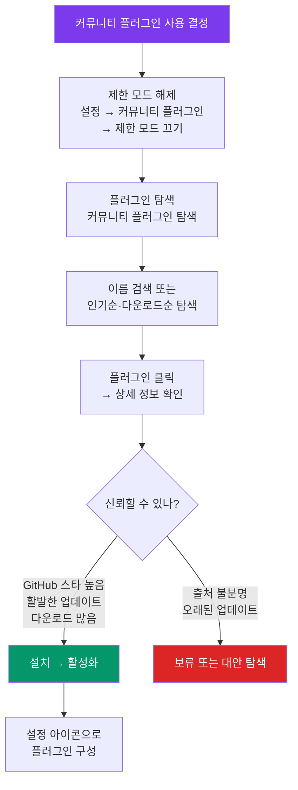

---
created:
  "{ date }":
status: 진행중
publish: true
---
# Chapter 12. 커뮤니티 플러그인 입문
> 설치 원칙 · 보안 · 필수 7종 완전 설정 가이드

---

## 0) 연결 고리 (Bridge)

Chapter 11에서 코어 플러그인으로 옵시디언의 기본 기능을 확장했습니다.  
이 챕터에서는 **커뮤니티 개발자들이 만든 서드파티 플러그인** 생태계로 진입합니다.  
1,000개가 넘는 플러그인 중 이 챕터에서 다루는 **7가지 필수 플러그인**은 대부분의 사용자에게 즉각적인 생산성 향상을 가져다줍니다.

---

## 1) 개념 정의 및 필요성

### 커뮤니티 플러그인이란?

> **커뮤니티 플러그인(Community Plugin)은 전 세계 개발자들이 자발적으로 개발·공개한 옵시디언 확장 기능입니다.**

코어 플러그인과 달리 옵시디언 개발팀의 공식 검토를 거치지 않습니다. 단, 옵시디언 공식 플러그인 디렉토리에 등록되려면 기본적인 검토 과정을 통과해야 합니다.

**커뮤니티 플러그인 사용 전 이해해야 할 것:**

| 항목 | 내용 |
|---|---|
| 장점 | 코어에 없는 기능 추가, 다양한 커스터마이즈 |
| 단점 | 개발자 개인 유지보수에 의존, 업데이트 지연 가능 |
| 보안 | 디렉토리 등록 플러그인은 코드가 공개됨 (오픈소스) |
| 유료 | 일부 플러그인은 라이선스 구매 필요 (예: Obsidian Sync 대체 서비스) |

---

## 2) 핵심 원리 및 구조

### 플러그인 설치 흐름



### 플러그인 신뢰도 판단 기준

```
✅ 신뢰할 수 있는 플러그인:
  - GitHub 스타 500개 이상
  - 최근 3개월 이내 업데이트
  - 다운로드 수 10만 이상
  - 활발한 이슈·PR 관리

⚠️ 주의가 필요한 플러그인:
  - 마지막 업데이트가 1년 이상 경과
  - GitHub 스타 50개 미만
  - 이슈에 대한 응답 없음

❌ 설치하지 말 것:
  - 디렉토리 외부 URL에서 직접 설치 (BRAT 사용 시 주의)
  - 출처 불명의 .js 파일 직접 삽입
```

> ⚠️ **WARNING:** 커뮤니티 플러그인은 JavaScript로 실행됩니다. 신뢰할 수 없는 플러그인은 파일 시스템 접근이나 네트워크 통신이 가능하므로, 반드시 검증된 플러그인만 설치하세요.

---

## 3) 실습 예제 — 필수 7종 설치 및 설정

> **환경 준비:**  
> `설정 → 커뮤니티 플러그인 → 제한 모드 끄기` → [커뮤니티 플러그인 탐색]

---

### Plugin 1. Templater — 강력한 템플릿 자동화

**기능:** 날짜·시간·파일명·JavaScript 실행 등 동적 변수를 지원하는 고급 템플릿 시스템. 코어 템플릿의 완전한 대체재.

**설치:**
```
커뮤니티 플러그인 탐색 → "Templater" 검색 → 설치 → 활성화
다운로드: 400만+ / GitHub ⭐: 8,000+
```

**기본 설정:**
```
설정 → Templater:
  템플릿 폴더: templates/
  → 이 폴더에 있는 .md 파일을 템플릿으로 인식
  
  트리거 파일 생성 시 실행: 켜기
  → 새 파일 생성 시 자동으로 템플릿 적용
```

**Templater 핵심 문법:**
```markdown
<% tp.date.now("YYYY-MM-DD") %>          ← 오늘 날짜
<% tp.date.now("HH:mm") %>              ← 현재 시각
<% tp.file.title %>                      ← 현재 파일명
<% tp.file.creation_date("YYYY-MM-DD") %> ← 파일 생성일
<% tp.system.prompt("제목 입력:") %>     ← 입력 다이얼로그
<% tp.date.now("YYYY-MM-DD", -1) %>     ← 어제 날짜
<% tp.date.now("YYYY-MM-DD", 1) %>      ← 내일 날짜
```

**실전 Templater 템플릿 — 회의록:**
```markdown
---
tags:
  - 회의록
  - <% tp.date.now("YYYY-MM") %>
date: <% tp.date.now("YYYY-MM-DD") %>
project: <% tp.system.prompt("프로젝트명:") %>
---

# 회의록 — <% tp.date.now("YYYY-MM-DD") %>

## 참석자
- 

## 안건
1. 

## 논의 내용

## 결정 사항
- [ ] 

## 다음 회의: 

---
작성: <% tp.date.now("YYYY-MM-DD HH:mm") %>
```

> 💡 **TIP:** Templater는 단순 변수 치환 외에 `<%* ... %>` 블록 안에서 JavaScript를 실행할 수 있습니다. 조건문, 반복문, 외부 API 호출까지 가능해 사실상 완전한 스크립팅 환경입니다. Chapter 14에서 심화 활용을 다룹니다.

---

### Plugin 2. Dataview — 쿼리 기반 대시보드

**기능:** SQL과 유사한 쿼리 언어로 보관소의 노트를 데이터처럼 조회·정렬·집계합니다.

**설치:**
```
"Dataview" 검색 → 설치 → 활성화
다운로드: 700만+ / GitHub ⭐: 9,000+
```

**기본 쿼리 예시 (코드 블록 안에 `dataview` 지정):**
````markdown
```dataview
TABLE file.ctime AS "생성일", tags AS "태그"
FROM #실습
SORT file.ctime DESC
LIMIT 10
```
````

````markdown
```dataview
TASK
FROM #status/진행중
WHERE !completed
```
````

> 📌 **NOTE:** Dataview는 Chapter 22에서 전체 챕터로 깊이 다룹니다. 지금은 설치와 기본 동작 확인만 해두세요.

---

### Plugin 3. Advanced Tables — 마크다운 표 편집기

**기능:** Tab 키로 셀 이동, 자동 정렬, 수식 지원 등 마크다운 표 작성을 획기적으로 편리하게 만듭니다.

**설치:**
```
"Advanced Tables" 검색 → 설치 → 활성화
다운로드: 200만+ / GitHub ⭐: 3,000+
```

**사용법:**
```
① 표 시작: | 입력 후 열 제목 작성
② Tab 키: 다음 셀로 이동 (자동으로 | 추가)
③ Enter 키: 새 행 추가
④ Tab (마지막 셀에서): 새 행 자동 생성
⑤ 헤더 행 아래서 Tab: 자동으로 --- 구분선 생성
```

**리본에 추가되는 테이블 도구모음:**
```
정렬(▲▼), 행/열 추가·삭제, 행/열 이동, CSV 변환
```

> 💡 **TIP:** Advanced Tables에서 `@sum` 같은 수식을 셀에 입력하면 해당 열의 합계를 자동 계산합니다. 간단한 스프레드시트 기능을 노트 안에서 바로 사용할 수 있습니다.

---

### Plugin 4. Calendar — 시각적 달력 & 데일리 노트 탐색기

**기능:** 사이드바에 달력을 표시하고, 날짜 클릭으로 데일리 노트를 열거나 생성합니다.

**설치:**
```
"Calendar" 검색 → 설치 → 활성화
다운로드: 200만+ / GitHub ⭐: 3,000+
```

**사용법:**
```
좌측 또는 우측 사이드바 → 달력(Calendar) 탭
  - 날짜 클릭: 해당 날짜 데일리 노트 열기/생성
  - 주(Week) 번호 클릭: 해당 주 주간 노트 생성
  - 점(dot) 표시: 해당 날짜에 노트가 있음을 표시
```

**주간 노트(Weekly Note) 설정:**
```
설정 → Calendar:
  주간 노트 활성화: 켜기
  주간 날짜 형식: YYYY-[W]ww  (예: 2024-W03)
  주간 노트 폴더: 00-inbox/weekly/
  주간 노트 템플릿: (별도 주간 템플릿 경로)
```

---

### Plugin 5. Excalidraw — 다이어그램 & 드로잉

**기능:** 옵시디언 노트 안에서 Excalidraw 기반의 손 그림 스타일 다이어그램을 직접 작성합니다.

**설치:**
```
"Excalidraw" 검색 → 설치 → 활성화
다운로드: 200만+ / GitHub ⭐: 4,000+
```

**사용법:**
```
새 Excalidraw 파일 생성:
  리본 → ✏️ (Excalidraw) 아이콘
  또는 명령 팔레트 → "excalidraw" → [새 Excalidraw 그리기]

노트에 Excalidraw 임베드:
  
    ← 너비 지정
```

> 📌 **NOTE:** Excalidraw는 Chapter 16에서 전체 챕터로 다룹니다. 지금은 설치 후 도형 몇 개를 그려보며 기본 조작에 익숙해지세요.

---

### Plugin 6. Obsidian Git — Git 자동 백업 & 동기화

**기능:** 보관소를 Git 리포지토리로 관리하고, 설정한 간격마다 자동으로 커밋·푸시합니다.

**설치:**
```
"Obsidian Git" 검색 → 설치 → 활성화
다운로드: 100만+ / GitHub ⭐: 4,000+
```

> ⚠️ **WARNING:** Obsidian Git은 **Git이 컴퓨터에 먼저 설치되어 있어야** 합니다. Git 설치 및 GitHub 연동 설정은 Chapter 17에서 완전히 다룹니다. 지금은 설치만 해두세요.

---

### Plugin 7. Linter — 노트 품질 자동 관리

**기능:** 저장 시 마크다운 문법 오류 수정, YAML 자동 정렬, 공백 정리, 제목 서식 통일을 자동으로 수행합니다.

**설치:**
```
"Linter" 검색 → 설치 → 활성화
다운로드: 80만+ / GitHub ⭐: 2,000+
```

**주요 설정:**
```
설정 → Linter:
  파일 저장 시 실행: 켜기 (Ctrl+S 시 자동 적용)
  
  YAML:
    YAML 타임스탬프 추가: 켜기
    → 저장 시 modified: 날짜 자동 업데이트
  
  제목:
    파일명을 H1로 삽입: 켜기 (선택)
    
  공백:
    줄 끝 공백 제거: 켜기
    여러 빈 줄 단일 빈 줄로: 켜기
```

> 💡 **TIP:** Linter의 `YAML 타임스탬프` 기능은 노트가 언제 마지막으로 수정됐는지 자동으로 기록합니다. Dataview와 결합하면 "최근 7일 수정된 노트 목록"을 쿼리할 수 있습니다.

---

## 4) 실무 시나리오 (Best Practice)

### 플러그인 선택 원칙

**적을수록 좋다(Less is More) 원칙:**
```
① 문제를 먼저 정의하고, 그 문제를 해결하는 플러그인만 설치
② "있으면 좋을 것 같아서" 설치는 금물 — 성능 저하, 충돌 위험
③ 설치한 플러그인은 정기적으로 검토 (3개월마다)
④ 더 이상 사용하지 않는 플러그인은 비활성화 또는 삭제
```

**충돌 디버깅 절차:**
```
① 플러그인 설치 후 오류 발생 시:
   설정 → 커뮤니티 플러그인 → 모든 플러그인 비활성화
② 플러그인을 하나씩 활성화하며 오류 재현
③ 충돌 원인 플러그인 발견 → 비활성화 또는 대안 탐색
```

### 보안 강화 설정

```
설정 → 커뮤니티 플러그인:
  제한 모드: 평소엔 끔 (필요 시)
  
새 플러그인 설치 전 체크리스트:
  ☐ GitHub 리포지토리 존재 여부 확인
  ☐ 마지막 커밋 날짜 확인 (6개월 이내 권장)
  ☐ 설치 수·스타 수 확인
  ☐ README에 기능 설명이 명확한지 확인
  ☐ issues/PR에 활발한 커뮤니티가 있는지 확인
```

---

## 5) 트러블슈팅 & 주의사항

### Q1. 커뮤니티 플러그인 탐색 버튼이 비활성화되어 있습니다

`설정 → 커뮤니티 플러그인 → 제한 모드 끄기`를 먼저 실행해야 합니다. 제한 모드가 켜진 상태에서는 보안을 위해 커뮤니티 플러그인 설치가 차단됩니다.

### Q2. Templater 문법이 치환되지 않고 그대로 표시됩니다

템플릿 파일은 반드시 Templater 설정에서 지정한 **템플릿 폴더** 안에 있어야 합니다. 또한 `<% ... %>` 문법은 Templater 명령으로 생성할 때만 치환됩니다. 파일을 직접 열면 치환되지 않습니다.

### Q3. Dataview 쿼리 결과가 빈 테이블로 나옵니다

쿼리의 `FROM` 조건(태그, 폴더)이 실제 노트와 일치하는지 확인하세요. 태그는 `#태그명` (샵 포함), 폴더는 `"폴더명"` (따옴표 포함) 형식입니다. 또한 Dataview 설정에서 `인라인 쿼리 활성화`가 켜져 있는지 확인하세요.

### Q4. 플러그인 업데이트는 어떻게 하나요?

`설정 → 커뮤니티 플러그인` → 목록 하단 [업데이트 확인] 버튼. 업데이트 가능한 플러그인이 있으면 [모두 업데이트] 버튼이 나타납니다. **메이저 업데이트(1.x → 2.x)는 변경 내용을 먼저 확인한 후 업데이트하는 것을 권장**합니다.

---

## 6) 한 줄 요약

> 💡 **Key Takeaway:**  
> 커뮤니티 플러그인은 옵시디언의 가능성을 무한대로 확장하지만, 신중하게 선택해야 한다.  
> **7종 필수 플러그인(Templater·Dataview·Advanced Tables·Calendar·Excalidraw·Git·Linter)을 먼저 안정적으로 설정하고, 추가 플러그인은 명확한 필요가 생겼을 때 하나씩 도입하라.**

---

## 🔖 이 챕터의 체크리스트

- [ ] 제한 모드를 해제하고 커뮤니티 플러그인 탐색 화면을 열었다
- [ ] 필수 7종 플러그인을 모두 설치하고 활성화했다
- [ ] Templater를 설정하고 회의록 템플릿을 만들었다
- [ ] Dataview 기본 쿼리를 작성하고 결과를 확인했다
- [ ] Advanced Tables로 표를 Tab 키로 작성해봤다
- [ ] Calendar를 사이드바에 열고 날짜 클릭으로 노트를 생성했다
- [ ] Linter를 설정하고 노트 저장 시 자동 정리를 확인했다

---

*이전 챕터: [Chapter 11 — 코어 플러그인 심층 해부](./ch11-core-plugins.md)*  
*다음 챕터: [Chapter 13 — 속성(Property)과 YAML 프론트매터](./ch13-properties.md)*
