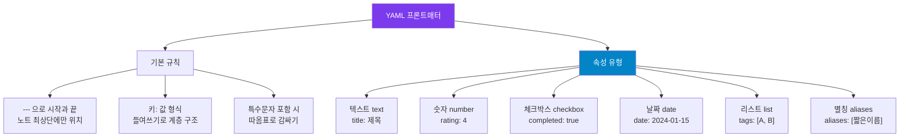

---
created:
  "{ date }":
status: 진행중
publish: true
---
# Chapter 13. 속성(Property)과 YAML 프론트매터 완전 정복
> 메타데이터 설계 · 속성 유형 · Dataview 연동 · 독서 노트 20종 속성

---

## 0) 연결 고리 (Bridge)

Part 3에서 검색·그래프·플러그인으로 옵시디언의 핵심 도구를 익혔습니다.  
이제 Part 4 — 중급 단계에 진입합니다. 그 첫 번째 주제는 **속성(Property)** 입니다.  
속성은 노트에 구조화된 메타데이터를 부여해, 단순 텍스트였던 노트를 **쿼리 가능한 데이터**로 바꾸는 핵심 개념입니다.

---

## 1) 개념 정의 및 필요성

### 속성(Property)이란?

> **속성(Property)은 노트 최상단의 YAML 블록에 기록하는 구조화된 메타데이터입니다.**  
> 노트의 "제목·본문" 외에 **날짜·상태·태그·저자·평점** 같은 정형 데이터를 체계적으로 기록합니다.

**YAML 프론트매터(Front Matter)의 기본 형태:**
```yaml
---
title: 나의 노트 제목
tags:
  - 독서노트
  - 철학
date: 2024-01-15
status: 완료
rating: 4
---
```

**왜 속성이 필요한가:**

| 속성 없을 때 | 속성 있을 때 |
|---|---|
| 노트 본문을 일일이 열어봐야 정보 파악 | Dataview로 속성값을 표로 조회 |
| "읽은 책 목록"을 수동으로 관리 | `status: 완료` 로 필터링해 자동 생성 |
| 노트의 맥락(날짜·저자·출처)이 없음 | 속성에 구조화 → 검색·정렬·필터 가능 |
| 서로 다른 형식의 노트 | 통일된 속성 체계로 일관성 확보 |

---

## 2) 핵심 원리 및 구조

### YAML 문법 규칙



### YAML 문법 주의사항

```yaml
# ✅ 올바른 형식
---
title: 총균쇠          # 일반 텍스트
rating: 4              # 숫자 (따옴표 없음)
completed: true        # 불리언
date: 2024-01-15       # 날짜 (따옴표 없음 권장)
tags:
  - 독서노트           # 리스트: 들여쓰기 + 하이픈
  - 역사
author: "재레드 다이아몬드"  # 특수문자·긴 이름은 따옴표
---

# ❌ 잘못된 형식
---
tags: 독서노트, 역사    # 쉼표로 구분 (인식 안 됨)
date: 2024/01/15       # 슬래시 형식 (날짜로 인식 안 됨)
rating: "4"            # 숫자를 따옴표로 감싸면 문자열로 인식
---
```

---

## 3) 실습 예제 및 실행 환경

### 실습 13-1. 속성 패널로 시각적 편집

옵시디언 v1.4 이후 속성 패널을 통해 YAML을 직접 작성하지 않고 UI로 편집할 수 있습니다.

```
속성 패널 열기:
  우측 사이드바 → 속성(Properties) 탭
  또는 명령 팔레트 → "properties" → [속성 패널 열기]

속성 추가:
  속성 패널 하단 [속성 추가] 클릭
  → 속성 이름 입력 → 유형 선택 → 값 입력

속성 유형 변경:
  속성 이름 옆 아이콘 클릭
  → Text / Number / Checkbox / Date / List / Aliases 선택
```

> 💡 **TIP:** 속성 패널에서 입력한 내용은 자동으로 YAML 형식으로 변환되어 파일에 저장됩니다. 소스 모드(`Ctrl/Cmd+P` → "source mode")로 전환하면 생성된 YAML을 직접 확인할 수 있습니다.

---

### 실습 13-2. 독서 노트 속성 20종 설계

독서 노트는 속성 시스템을 가장 잘 활용할 수 있는 노트 유형입니다.  
아래 20가지 속성으로 완전한 독서 데이터베이스를 구축하세요.

```yaml
---
# ── 기본 도서 정보 ──────────────────
title: "총균쇠"                        # 책 제목
subtitle: "무기·병균·쇠쇠의 시대"      # 부제 (선택)
author: "재레드 다이아몬드"             # 저자
translator: "김진준"                   # 역자 (번역서의 경우)
publisher: "문학사상"                  # 출판사
published: 1997                        # 원서 출판 연도
isbn: "9788970126777"                  # ISBN

# ── 독서 기록 ────────────────────────
status: "완료"                         # inbox / 읽는중 / 완료 / 중단
started: 2024-01-01                    # 독서 시작일
finished: 2024-01-20                   # 독서 완료일
pages: 752                             # 총 페이지
progress: 100                          # 읽은 비율 (%)

# ── 평가 ─────────────────────────────
rating: 5                              # 평점 (1~5)
difficulty: 3                          # 난이도 (1쉬움 ~ 5어려움)
recommend: true                        # 추천 여부

# ── 분류 ─────────────────────────────
tags:
  - 독서노트
  - 역사
  - 과학
  - 인류학
genre: "논픽션"                        # 장르
language: "한국어"                     # 읽은 언어

# ── 연결 ─────────────────────────────
related:
  - "[사피엔스](/사피엔스)"                     # 관련 책
  - "[지리와 문명 — 내 메모](/지리와 문명 — 내 메모)"        # 관련 노트
source: "도서관"                       # 구입/대출 출처
---
```

**Dataview로 독서 데이터베이스 조회:**
````markdown
```dataview
TABLE author AS "저자", rating AS "⭐", finished AS "완독일", genre AS "장르"
FROM #독서노트
WHERE status = "완료"
SORT rating DESC
```
````

---

### 실습 13-3. 속성 유형별 활용 패턴

**텍스트(Text) — 자유 형식 값:**
```yaml
status: "진행중"
location: "서울 강남구"
source: "Medium 블로그"
```

**숫자(Number) — 정렬·계산 가능:**
```yaml
rating: 4
priority: 1
word_count: 2500
duration: 90          # 분 단위
```

**날짜(Date) — 시간순 정렬:**
```yaml
date: 2024-01-15
deadline: 2024-02-01
reviewed: 2024-01-22
```

**체크박스(Checkbox) — 불리언 값:**
```yaml
completed: false
published: true
reviewed: false
archived: false
```

**리스트(List) — 여러 값:**
```yaml
tags:
  - 프로젝트A
  - 우선순위높음
related:
  - "[관련노트1](/관련노트1)"
  - "[관련노트2](/관련노트2)"
contributors:
  - 홍길동
  - 김철수
```

---

### 실습 13-4. 프로젝트 관리용 속성 템플릿

```yaml
---
# 프로젝트 노트 속성
type: project
title: "프로젝트 이름"
status: "진행중"              # 기획 / 진행중 / 완료 / 보류
priority: 2                   # 1높음 ~ 3낮음
start_date: 2024-01-15
due_date: 2024-02-28
owner: "홍길동"
stakeholders:
  - "김철수"
  - "이영희"
tags:
  - project
  - status/진행중
progress: 30                  # 진행률 %
budget: 5000000               # 예산 (원)
---
```

**Dataview 프로젝트 대시보드:**
````markdown
```dataview
TABLE status AS "상태", priority AS "우선순위", due_date AS "마감", progress AS "진행률%"
FROM #project
WHERE status != "완료"
SORT priority ASC, due_date ASC
```
````

---

### 실습 13-5. 속성 전역 뷰 활용

```
좌측 사이드바 → 속성 뷰(All Properties) 탭
  → 보관소 전체에서 사용된 속성 이름 목록 표시
  → 속성 이름 클릭 → 해당 속성이 있는 노트 검색
```

> 💡 **TIP:** 속성 전역 뷰에서 동일한 개념에 여러 속성 이름이 혼재하는 것을 발견할 수 있습니다. (예: `date`, `created`, `creation_date` 혼용) 이런 경우 속성 이름을 통일하는 정규화 작업을 해주면 Dataview 쿼리의 정확도가 높아집니다.

---

## 4) 실무 시나리오 (Best Practice)

### 속성 설계 5원칙

**원칙 1 — 일관성:** 같은 개념은 항상 같은 속성 이름으로. `status` vs `state` vs `진행상태` 혼용 금지

**원칙 2 — 필요 최소화:** 모든 노트에 20개 속성이 필요하지 않습니다. 노트 유형별로 꼭 필요한 속성만 정의하세요

**원칙 3 — 유형 명확화:** 날짜는 Date, 수치는 Number, 참/거짓은 Checkbox로 명확하게 지정

**원칙 4 — 템플릿으로 관리:** 속성은 Templater 템플릿에 미리 정의해두면 매번 타이핑하지 않아도 됩니다

**원칙 5 — Dataview 호환성:** 나중에 Dataview로 조회할 것을 염두에 두고 속성 이름을 영문 소문자·하이픈 형식으로 통일 권장 (예: `start_date`, `word_count`)

### 안티 패턴

- **한국어 속성 이름 사용:** `완료일: 2024-01-15` 처럼 한글 속성 이름은 Dataview에서 쿼리 시 오류를 일으킬 수 있습니다. 영문 키를 사용하고 표시는 Dataview의 `AS "완료일"` 로 처리하세요
- **모든 노트에 동일한 20개 속성 강제 적용:** 노트 유형별로 다른 속성 세트를 사용하는 것이 더 실용적입니다

---

## 5) 트러블슈팅 & 주의사항

### Q1. YAML을 작성했는데 "Invalid YAML" 오류가 납니다

가장 흔한 원인: 콜론(`:`) 뒤에 공백이 없거나, 들여쓰기가 탭으로 되어 있는 경우입니다. YAML은 **공백 2칸** 들여쓰기를 사용해야 하며, 탭은 허용되지 않습니다. 또한 값에 콜론이 포함된 경우 반드시 따옴표로 감싸야 합니다.

```yaml
# ❌ 오류
title:총균쇠         # 콜론 뒤 공백 없음
subtitle: 무기: 병균  # 값 안에 콜론 (따옴표 없음)

# ✅ 올바름
title: 총균쇠
subtitle: "무기: 병균·쇠의 시대"
```

### Q2. 날짜 속성이 Date 유형으로 인식되지 않습니다

날짜는 반드시 `YYYY-MM-DD` 형식이어야 합니다. `2024/01/15`, `24-01-15`, `2024.01.15` 는 Date로 인식되지 않습니다. 옵시디언 속성 패널에서 유형을 `Date`로 명시적으로 지정하면 입력 시 달력 UI가 제공됩니다.

### Q3. 태그가 `tags:` 와 `#태그` 두 곳에 따로 있어요

두 방식 모두 유효하지만, 옵시디언은 `tags:` YAML 속성과 본문 `#태그` 를 모두 인식합니다. 관리 일관성을 위해 **YAML의 `tags:`만 사용**하거나 **본문 `#태그`만 사용**하는 방식 중 하나로 통일하는 것을 권장합니다.

---

## 6) 한 줄 요약

> 💡 **Key Takeaway:**  
> YAML 속성은 노트를 쿼리 가능한 데이터로 바꾸는 열쇠다.  
> **독서 노트 20종 속성 체계를 기준으로 자신의 노트 유형에 맞게 속성 세트를 설계하고, 항상 Templater 템플릿에 미리 정의해두어라.**

---

## 🔖 이 챕터의 체크리스트

- [ ] 속성 패널(UI)로 속성을 추가하고 유형을 지정했다
- [ ] 독서 노트 속성 20종을 직접 작성해봤다
- [ ] 날짜·숫자·체크박스 유형을 각각 하나씩 만들었다
- [ ] Dataview로 속성을 기반으로 한 기본 쿼리를 작성했다
- [ ] 전역 속성 뷰에서 내 보관소의 전체 속성 목록을 확인했다

---

*이전 챕터: [Chapter 12 — 커뮤니티 플러그인 입문](./ch12-community-plugins.md)*  
*다음 챕터: [Chapter 14 — 템플릿 시스템](ch14-templates.md)*
