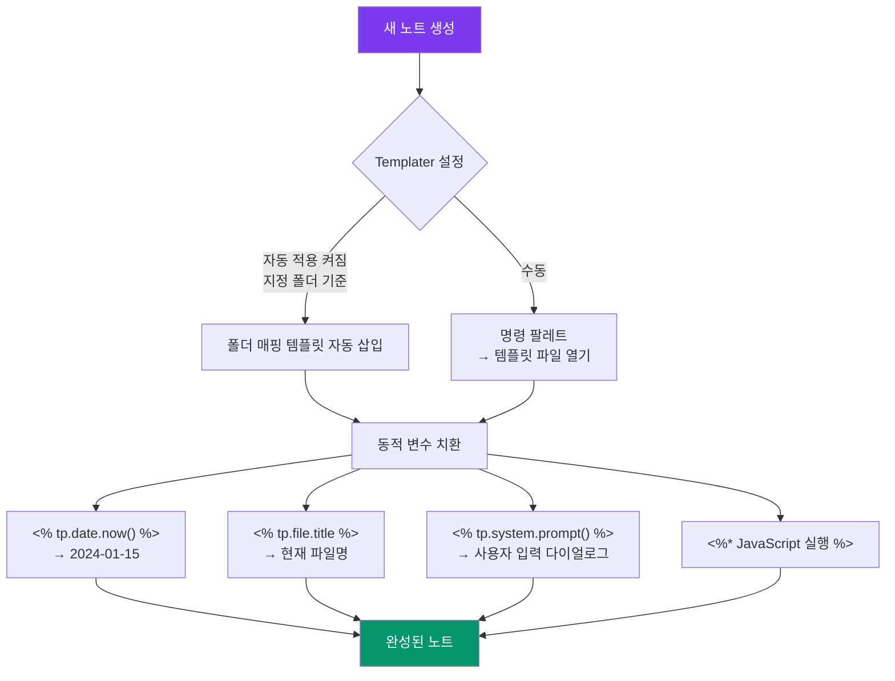

---
created:
  "{ date }":
status: 진행중
publish: true
---
# Chapter 14. 템플릿 시스템
> 코어 템플릿 · Templater 자동화 · 실전 템플릿 5종

---

## 0) 연결 고리 (Bridge)

Chapter 13에서 YAML 속성으로 노트에 구조화된 메타데이터를 부여했습니다.  
그런데 매번 새 노트를 만들 때마다 같은 YAML과 섹션 구조를 손으로 입력하는 것은 비효율적입니다.  
이 챕터에서는 **템플릿**으로 반복 작업을 제거하고, Templater의 동적 변수로 **노트 생성을 자동화**하는 방법을 완전히 익힙니다.

---

## 1) 개념 정의 및 필요성

### 코어 템플릿 vs Templater

옵시디언에는 두 가지 템플릿 시스템이 공존합니다.

| 구분 | 코어 템플릿 | Templater (커뮤니티) |
|---|---|---|
| 설치 | 코어 플러그인, 기본 내장 | 별도 설치 필요 |
| 날짜 변수 | `{{date}}`, `{{time}}` | `<% tp.date.now("YYYY-MM-DD") %>` |
| 동적 실행 | 불가 | JavaScript 실행 가능 |
| 사용자 입력 | 불가 | `tp.system.prompt()` 다이얼로그 |
| 파일명 참조 | 불가 | `tp.file.title` |
| 자동 적용 | 새 노트 시 지정 폴더 | 새 파일 생성 시 자동 적용 |
| 권장 용도 | 단순 날짜·시간 삽입 | 복잡한 자동화 전반 |

> 📌 **NOTE:** 코어 템플릿은 Templater를 설치하면 사실상 대체됩니다. 그러나 Templater가 낯선 초보자라면 코어 템플릿으로 먼저 개념을 잡고 Templater로 넘어가는 것이 자연스럽습니다.

---

## 2) 핵심 원리 및 구조

### 템플릿 동작 흐름



---

## 3) 실습 예제 — Templater 핵심 문법 완전 정복

### 3.1 Templater 변수 레퍼런스

**날짜·시간 변수:**
```javascript
<% tp.date.now("YYYY-MM-DD") %>           // 2024-01-15
<% tp.date.now("YYYY년 MM월 DD일") %>     // 2024년 01월 15일
<% tp.date.now("HH:mm") %>               // 09:30
<% tp.date.now("ddd") %>                 // Mon (요일 약자)
<% tp.date.now("dddd", 0, "ko") %>       // 월요일 (한국어 요일)
<% tp.date.now("YYYY-MM-DD", -1) %>      // 어제
<% tp.date.now("YYYY-MM-DD", 1) %>       // 내일
<% tp.date.now("YYYY-[W]ww") %>          // 2024-W03 (주 번호)
```

**파일 정보 변수:**
```javascript
<% tp.file.title %>                       // 현재 파일명 (확장자 제외)
<% tp.file.folder() %>                    // 현재 파일의 폴더 경로
<% tp.file.path() %>                      // 파일 전체 경로
<% tp.file.creation_date("YYYY-MM-DD") %> // 파일 생성일
<% tp.file.last_modified_date("YYYY-MM-DD") %> // 마지막 수정일
```

**사용자 입력 변수:**
```javascript
<% tp.system.prompt("제목을 입력하세요:") %>          // 텍스트 입력
<% tp.system.prompt("우선순위 (1~3):", "2") %>        // 기본값 있는 입력
<% tp.system.suggester(["높음", "중간", "낮음"], ["high", "mid", "low"]) %>
// 선택지 드롭다운 → 선택값 반환
```

**조건문·반복문 (JavaScript 블록):**
```javascript
<%*
// JavaScript 실행 블록
const dayOfWeek = tp.date.now("d"); // 0=일, 1=월 ... 6=토
if (dayOfWeek === 1) {
    tR += "📅 이번 주 첫 날입니다!";
} else if (dayOfWeek === 5) {
    tR += "🎉 금요일입니다!";
}
%>
```

> 💡 **TIP:** `tR +=` 는 Templater JavaScript 블록에서 출력 문자열에 텍스트를 추가하는 문법입니다. `tR`(template Result)이 최종 삽입될 텍스트입니다.

---

### 3.2 실전 템플릿 5종 완전 구현

**준비:** `templates/` 폴더가 없으면 생성하고 Templater 설정에서 경로를 지정하세요.

---

#### 템플릿 1. 회의록 자동화 템플릿

```markdown
<%*
const project = await tp.system.prompt("프로젝트명:");
const meetingType = await tp.system.suggester(
    ["주간 스탠드업", "기획 회의", "리뷰 회의", "기타"],
    ["standup", "planning", "review", "other"]
);
-%>
---
tags:
  - 회의록
  - <% tp.date.now("YYYY-MM") %>
date: <% tp.date.now("YYYY-MM-DD") %>
project: "<% project %>"
meeting_type: "<% meetingType %>"
status: "완료"
created: <% tp.date.now("YYYY-MM-DD HH:mm") %>
---

# 회의록 — <% tp.date.now("YYYY-MM-DD") %> (<% project %>)

## 📋 기본 정보
- **날짜:** <% tp.date.now("YYYY년 MM월 DD일 (ddd)") %>
- **유형:** <% meetingType %>
- **참석자:** 
- **장소·방식:** 

## 📌 안건
1. 
2. 
3. 

## 💬 논의 내용

## ✅ 결정 사항 & 액션 아이템
- [ ] (담당:  / 기한: )
- [ ] (담당:  / 기한: )

## 📅 다음 회의
- 일시: 
- 예정 안건: 

---
*이전 회의: [[<% tp.date.now("YYYY-MM-DD", -7) %>]]*
```

---

#### 템플릿 2. 독서 노트 자동화 템플릿

```markdown
<%*
const bookTitle = await tp.system.prompt("책 제목:");
const author = await tp.system.prompt("저자:");
const genre = await tp.system.suggester(
    ["소설", "논픽션", "자기계발", "기술서", "에세이", "기타"],
    ["fiction", "nonfiction", "self-help", "tech", "essay", "other"]
);
-%>
---
title: "<% bookTitle %>"
author: "<% author %>"
genre: "<% genre %>"
status: "읽는중"
started: <% tp.date.now("YYYY-MM-DD") %>
finished: 
pages: 
rating: 
recommend: 
tags:
  - 독서노트
  - <% genre %>
---

# 📚 <% bookTitle %>

> **저자:** <% author %> | **장르:** <% genre %>

## 핵심 주장

## 인상 깊은 구절

> 

## 나의 생각

## 연결 노트
- 

## 적용할 것
- [ ] 
```

---

#### 템플릿 3. 데일리 노트 고급 자동화 템플릿

```markdown
<%*
const dayOfWeek = parseInt(tp.date.now("d"));
const isMonday = dayOfWeek === 1;
const isFriday = dayOfWeek === 5;
const yesterday = tp.date.now("YYYY-MM-DD", -1);
const tomorrow = tp.date.now("YYYY-MM-DD", 1);
-%>
---
tags:
  - 데일리노트
  - <% tp.date.now("YYYY") %>
date: <% tp.date.now("YYYY-MM-DD") %>
week: <% tp.date.now("YYYY-[W]ww") %>
---

# <% tp.date.now("YYYY년 MM월 DD일") %> (<% tp.date.now("dddd", 0, "ko") %>)

<%* if (isMonday) { -%>
> 💪 **새로운 한 주가 시작됩니다!** 이번 주 목표를 설정해보세요.
<%* } else if (isFriday) { -%>
> 🎉 **금요일!** 이번 주를 되돌아볼 시간입니다.
<%* } -%>

## 🎯 오늘의 목표
- [ ] 
- [ ] 
- [ ] 

## 📋 오늘의 일정

## 📝 오늘 배운 것 / 메모

## ✅ 완료한 것

## 💭 내일 할 것
- [ ] 

## 🌟 감사한 것

---
← [[<% yesterday %>|어제]] | [[<% tomorrow %>|내일]] →
```

---

#### 템플릿 4. 아이디어·프로젝트 기획 템플릿

```markdown
<%*
const ideaTitle = await tp.system.prompt("아이디어/프로젝트명:");
const priority = await tp.system.suggester(
    ["🔴 높음", "🟡 중간", "🟢 낮음"],
    [1, 2, 3]
);
-%>
---
title: "<% ideaTitle %>"
type: idea
status: "inbox"
priority: <% priority %>
created: <% tp.date.now("YYYY-MM-DD") %>
tags:
  - 아이디어
  - status/inbox
---

# 💡 <% ideaTitle %>

## 한 줄 요약

## 배경 & 문제 정의

## 핵심 아이디어

## 실행 가능성 검토
- **장점:**
- **장벽:**
- **필요 자원:**

## 다음 액션
- [ ] 

## 관련 자료
- 

---
*생성: <% tp.date.now("YYYY-MM-DD HH:mm") %>*
```

---

#### 템플릿 5. 주간 리뷰 템플릿

```markdown
<%*
const weekNum = tp.date.now("YYYY-[W]ww");
const weekStart = tp.date.now("YYYY-MM-DD", -(parseInt(tp.date.now("d")) - 1));
const weekEnd = tp.date.now("YYYY-MM-DD", 7 - parseInt(tp.date.now("d")));
-%>
---
tags:
  - 주간리뷰
  - <% tp.date.now("YYYY") %>
week: "<% weekNum %>"
date: <% tp.date.now("YYYY-MM-DD") %>
---

# 주간 리뷰 — <% weekNum %>

> **기간:** <% weekStart %> ~ <% weekEnd %>

## 🏆 이번 주 성과 (3가지)
1. 
2. 
3. 

## 😤 어려웠던 것 & 배운 교훈

## 📊 목표 달성 점검

```dataview
TASK
FROM #데일리노트
WHERE week = "<% weekNum %>"
WHERE completed
```

## 🔭 다음 주 목표
- [ ] 
- [ ] 
- [ ] 

## 💡 이번 주 핵심 인사이트

## 📚 이번 주 읽은 것 / 본 것

---
*이전 주: [[<% tp.date.now("YYYY-[W]ww", -7) %>]]*
```

---

### 3.3 폴더별 자동 템플릿 적용

Templater의 **폴더 템플릿 매핑** 기능을 사용하면 특정 폴더에 파일을 만들 때 자동으로 템플릿이 적용됩니다.

```
설정 → Templater → 폴더 템플릿:
  [폴더 추가]
  
  폴더: 20-projects/
  템플릿: templates/프로젝트-template.md
  
  폴더: 00-inbox/daily/
  템플릿: templates/데일리노트-template.md
  
  폴더: 30-resources/books/
  템플릿: templates/독서노트-template.md
```

> 💡 **TIP:** 폴더 매핑을 설정한 후 해당 폴더에서 `Ctrl/Cmd+N` 으로 새 노트를 만들면 자동으로 템플릿이 삽입됩니다. 파일 이름을 입력하는 순간 Templater가 동적 변수를 치환해 완성된 노트를 제공합니다.

---

## 4) 실무 시나리오 (Best Practice)

### 템플릿 설계 4원칙

**원칙 1 — 마찰 최소화(Friction-Free):**  
템플릿은 노트 작성을 돕는 도구이지, 채워야 할 의무가 되어서는 안 됩니다. 필수 필드는 최소화하고, 선택 섹션은 빈 상태로 두어도 괜찮습니다.

**원칙 2 — 점진적 복잡성:**  
처음에는 날짜·태그만 자동화하는 단순 템플릿으로 시작하세요. 사용하면서 "이것도 자동화하면 좋겠다"는 필요가 생겼을 때 기능을 추가합니다.

**원칙 3 — Dataview 친화적 설계:**  
나중에 Dataview로 조회할 속성은 일관된 이름과 형식을 사용해 처음부터 설계합니다. (Chapter 22에서 심화)

**원칙 4 — 템플릿도 노트다:**  
`templates/` 폴더의 템플릿 파일도 일반 노트처럼 언제든 수정할 수 있습니다. 불편한 부분이 있으면 바로 개선하세요.

### 안티 패턴

- **20개 필드짜리 템플릿 강제 적용:** 빈 필드가 가득한 노트는 심리적 부담을 줍니다. 7개 이하의 핵심 속성으로 시작하세요
- **템플릿 없이 즉흥적으로 노트 작성:** 자주 만드는 노트 유형(회의록, 독서 노트 등)은 반드시 템플릿을 만들어 일관성을 확보하세요
- **코어 템플릿과 Templater 혼용:** 두 시스템의 문법이 달라 혼용 시 치환이 안 되는 경우가 생깁니다. Templater 설치 후에는 Templater 문법으로 통일하세요

---

## 5) 트러블슈팅 & 주의사항

### Q1. `<% tp.date.now() %>` 가 치환되지 않고 그대로 표시됩니다

두 가지 원인이 가장 흔합니다.

**원인 A:** 템플릿 파일이 Templater 설정의 **템플릿 폴더** 밖에 있음.  
→ 해결: `설정 → Templater → 템플릿 폴더` 경로 확인.

**원인 B:** 파일을 직접 열었고, Templater 명령으로 삽입하지 않음.  
→ 해결: 명령 팔레트 → "Templater: 템플릿 파일 열기" 로 삽입.

### Q2. `tp.system.prompt()` 다이얼로그가 나타나지 않습니다

`await` 키워드가 빠진 경우 비동기 실행이 제대로 되지 않습니다.  
`<%* const value = await tp.system.prompt("입력:"); %>` 형식을 반드시 지켜주세요.

### Q3. 폴더 템플릿 자동 적용이 안 됩니다

`설정 → Templater → 트리거: 새 파일 생성 시 활성화` 가 켜져 있어야 합니다. 또한 폴더 경로가 정확한지 확인하세요 (슬래시 포함 여부, 대소문자 일치).

### Q4. 데일리 노트 템플릿에서 요일이 영어로 표시됩니다

`tp.date.now("dddd")` 는 로케일에 따라 달라집니다. 한국어 요일을 원하면 `tp.date.now("dddd", 0, "ko")` 처럼 세 번째 인자로 로케일을 지정하거나, JavaScript 블록에서 직접 변환합니다.

```javascript
<%*
const days = ["일", "월", "화", "수", "목", "금", "토"];
const dayKo = days[parseInt(tp.date.now("d"))];
tR += dayKo + "요일";
%>
```

---

## 6) 한 줄 요약

> 💡 **Key Takeaway:**  
> 템플릿은 반복 노트 작성의 마찰을 제거하는 가장 강력한 도구다.  
> **회의록·독서노트·데일리노트·아이디어·주간리뷰 5가지 Templater 템플릿만 갖춰져도 일상 지식 관리의 80%가 자동화된다.**

---

## 🔖 이 챕터의 체크리스트

- [ ] `templates/` 폴더를 만들고 Templater에 경로를 지정했다
- [ ] 실전 템플릿 5종을 모두 파일로 작성했다
- [ ] 회의록 템플릿을 실행하고 프롬프트 다이얼로그를 확인했다
- [ ] 데일리 노트 템플릿에서 요일 조건문이 작동함을 확인했다
- [ ] 폴더 템플릿 매핑을 2개 이상 설정했다

---

*이전 챕터: [Chapter 13 — 속성(Property)과 YAML](./ch13-properties.md)*  
*다음 챕터: [Chapter 15 — 캔버스(Canvas)](./ch15-canvas.md)*
