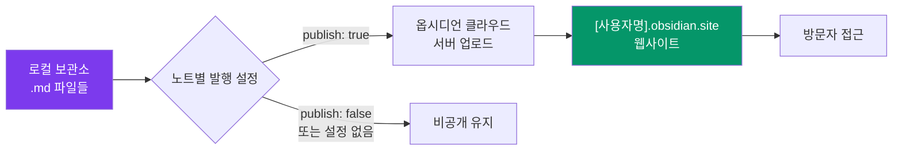

---
created:
  "{ date }":
status: 진행중
publish: true
---
# Chapter 27. Obsidian Publish — 보관소를 웹사이트로
> 발행 설정 · 공개/비공개 선택 · 커스텀 도메인 · 대안 도구

---

## 0) 연결 고리 (Bridge)

Chapter 26에서 모바일에서도 어디서나 노트에 접근하는 방법을 익혔습니다.  
이 챕터에서는 한 단계 더 나아가 **보관소의 일부를 누구나 볼 수 있는 웹사이트로 발행**하는 방법을 다룹니다.  
Obsidian Publish는 내부 링크·그래프·검색이 모두 살아있는 인터랙티브 지식 정원(Digital Garden)을 만들어줍니다.

---

## 1) 개념 정의 및 필요성

### Obsidian Publish란?

> **Obsidian Publish는 옵시디언 보관소의 노트를 `[사용자명].obsidian.site` 주소로 웹에 발행하는 공식 유료 서비스입니다.**

| 특징 | 설명 |
|---|---|
| 선택적 발행 | 노트별로 발행 여부 선택 |
| 인터랙티브 그래프 | 웹에서도 그래프 뷰 탐색 가능 |
| 내부 링크 유지 | `[링크](/링크)` 가 실제 하이퍼링크로 변환 |
| 검색 | 웹에서 보관소 내용 검색 |
| 커스텀 CSS | 발행 사이트 스타일 커스터마이즈 |
| 비밀번호 보호 | 특정 노트 또는 전체 사이트 보호 |
| 가격 | $20/월 (2024년 기준) |

**Obsidian Publish 사용 사례:**
- 개인 지식 정원(Digital Garden) 공개
- 기술 문서 사이트
- 강의·튜토리얼 공개 노트
- 팀 내부 위키 (비밀번호 보호)
- 연구 노트 공개

---

## 2) 핵심 원리 및 구조

### 발행 흐름



### 발행 노트 선택 방법

**방법 1: YAML 속성 사용 (권장):**
```yaml
---
publish: true     # 이 노트를 발행
---
```

**방법 2: 발행 패널에서 개별 선택:**
```
명령 팔레트 → "publish" → [발행 변경사항 게시]
→ 패널에서 각 노트의 발행 여부 토글
```

---

## 3) 실습 예제 및 실행 환경

> ⚠️ **Obsidian Publish는 유료 서비스($20/월)입니다.**  
> 이 챕터는 서비스 개요와 설정 방법을 안내합니다. 구독 없이도 무료 대안 도구로 동일한 결과를 얻을 수 있습니다.

### 실습 27-1. Obsidian Publish 구독 및 사이트 설정

```
① obsidian.md 계정 생성 및 Publish 구독
② 설정 → 발행
③ [새 사이트 만들기] → 사이트 ID 설정
   예: yourname.obsidian.site
④ 사이트 이름, 설명, 홈 페이지 노트 설정
```

**사이트 설정 옵션:**
```
설정 → 발행 → 사이트 설정:
  사이트 이름: "나의 지식 정원"
  홈 페이지: "index" (또는 원하는 노트명)
  테마: Light / Dark / Adaptive (방문자 기기 따라)
  
  표시 옵션:
    그래프 보기: 켜기
    목차 보기: 켜기
    백링크: 켜기
    검색: 켜기
```

---

### 실습 27-2. 노트 선택 발행

```
발행할 노트 준비:
  1) YAML에 publish: true 추가
  2) 또는 명령 팔레트 → "게시 변경사항" → 노트 선택

명령 팔레트 → "게시 변경사항":
  새 발행: 신규 노트 목록
  변경됨: 수정된 발행 노트
  삭제됨: 로컬에서 삭제된 발행 노트
  
[모두 게시] 또는 개별 노트 선택 후 [게시]
```

**발행 규칙 설정:**
```yaml
---
publish: true
description: "검색 결과와 소셜 미리보기에 표시될 설명"
image: "assets/thumbnail.png"
---
```

---

### 실습 27-3. 커스텀 CSS로 발행 사이트 꾸미기

`.obsidian/publish.css` 파일을 만들면 발행 사이트에만 적용됩니다.

```css
/* publish.css — 발행 사이트 전용 스타일 */

/* 사이트 최대 너비 */
.site-body {
  max-width: 900px;
  margin: 0 auto;
}

/* 헤딩 색상 */
h1 { color: #7C3AED; }
h2 { color: #0284C7; }

/* 표 스타일 */
table { border-collapse: collapse; width: 100%; }
th { background: #7C3AED; color: white; padding: 8px; }
td { padding: 6px; border-bottom: 1px solid #e5e7eb; }

/* 링크 스타일 */
a { color: #7C3AED; text-decoration: none; }
a:hover { text-decoration: underline; }
```

---

### 실습 27-4. 커스텀 도메인 연결

```
① 도메인 구매 (예: notes.yourdomain.com)
② DNS 설정:
   유형: CNAME
   호스트: notes (서브도메인)
   값: publish-01.obsidian.md

③ 설정 → 발행 → 커스텀 도메인:
   도메인 입력: notes.yourdomain.com
   [저장]
   
④ SSL 인증서: 자동 발급 (수 분 소요)
```

---

### 실습 27-5. 무료 대안 도구 3가지

Obsidian Publish 없이도 보관소를 웹으로 발행할 수 있습니다.

**대안 A: Quartz (무료, 자체 호스팅)**
```
GitHub: https://github.com/jackyzha0/quartz

특징:
  - 완전 무료 오픈소스
  - GitHub Pages로 무료 호스팅
  - 높은 커스터마이즈 자유도
  - 그래프 뷰, 검색 지원

설정 단계:
  ① Git, Node.js 설치 필요
  ② quartz 리포지토리 포크
  ③ 보관소 content/ 폴더에 복사
  ④ GitHub Actions로 자동 배포
  
  예: yourusername.github.io/quartz/
```

**대안 B: Obsidian Digital Garden 플러그인 (무료)**
```
커뮤니티 플러그인: "Digital Garden"

특징:
  - Netlify 또는 Vercel로 무료 호스팅
  - 플러그인에서 직접 배포
  - 설정이 상대적으로 쉬움

설정:
  ① Digital Garden 플러그인 설치
  ② GitHub 리포지토리 연결
  ③ Netlify 연결 및 자동 배포 설정
  ④ 노트에 dg-publish: true 속성 추가
```

**대안 C: MkDocs + GitHub Pages (무료, 기술 문서에 적합)**
```
특징:
  - 마크다운 → 깔끔한 기술 문서 사이트
  - Material for MkDocs 테마 무료 사용
  - 버전 관리, 검색, 멀티 언어 지원

설정:
  pip install mkdocs-material
  mkdocs new my-docs
  mkdocs gh-deploy  ← GitHub Pages에 자동 배포
```

---

## 4) 실무 시나리오 (Best Practice)

### 발행 전략: 무엇을 공개하고 무엇을 비공개로?

**공개 적합:**
```
✅ 기술 글·튜토리얼
✅ 독서 노트 (저작권 주의)
✅ 학습 정리 노트
✅ 프로젝트 문서 (공개 프로젝트)
✅ 개인 철학·에세이
```

**비공개 유지:**
```
❌ 업무 기밀·사내 정보
❌ 개인 일기·감정 기록
❌ 타인 정보 포함 내용
❌ 미완성 초안
❌ 비밀번호·API 키
```

**권장 발행 구조:**
```
index.md          ← 홈 페이지 (소개)
about.md          ← 나에 대해
notes/            ← 공개 학습 노트
writing/          ← 에세이·글
projects/         ← 공개 프로젝트 문서
```

---

## 5) 트러블슈팅 & 주의사항

### Q1. 발행했는데 웹사이트에 이미지가 안 보입니다

이미지 파일도 함께 발행해야 합니다. 발행 패널에서 이미지 파일이 "새 발행" 목록에 있는지 확인하고 함께 게시하세요. 또한 이미지 경로가 상대 경로(`assets/image.png`)인지 확인하세요.

### Q2. 내부 링크가 클릭이 안 됩니다

링크된 노트도 발행되어 있어야 합니다. `[링크된 노트](/링크된 노트)` 가 발행되지 않은 노트를 가리키면 클릭해도 이동하지 않습니다.

### Q3. 커스텀 도메인 설정 후 SSL 오류가 납니다

DNS 변경이 전파되는 데 최대 48시간이 걸릴 수 있습니다. `dig notes.yourdomain.com` 명령으로 CNAME이 올바르게 설정됐는지 확인하고, SSL 인증서가 발급될 때까지 기다리세요.

---

## 6) 한 줄 요약

> 💡 **Key Takeaway:**  
> Obsidian Publish는 내부 링크와 그래프가 살아있는 지식 정원을 가장 쉽게 만드는 방법이다.  
> **비용이 부담된다면 Quartz + GitHub Pages로 무료로 동일한 경험을 구현할 수 있다. 중요한 것은 발행하는 습관이다.**

---

## 🔖 이 챕터의 체크리스트

- [ ] Obsidian Publish 또는 대안 도구(Quartz/Digital Garden) 중 선택했다
- [ ] 발행할 노트 5개 이상에 `publish: true` 속성을 추가했다
- [ ] 사이트 홈 페이지용 `index.md` 를 작성했다
- [ ] 웹사이트에서 내부 링크가 작동함을 확인했다
- [ ] 그래프 뷰가 웹에서도 보임을 확인했다

---

*이전 챕터: [Chapter 26 — 모바일 최적화](./ch26-mobile.md)*  
*다음 챕터: [Chapter 28 — 30일 챌린지](./ch28-30day-challenge.md)*
